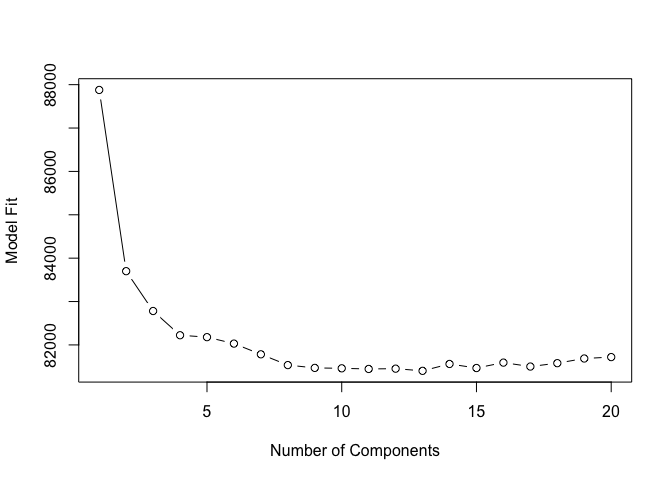
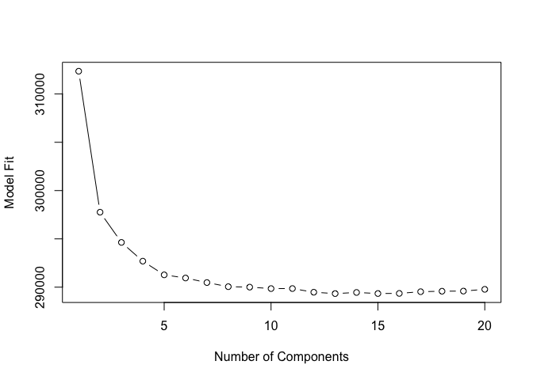
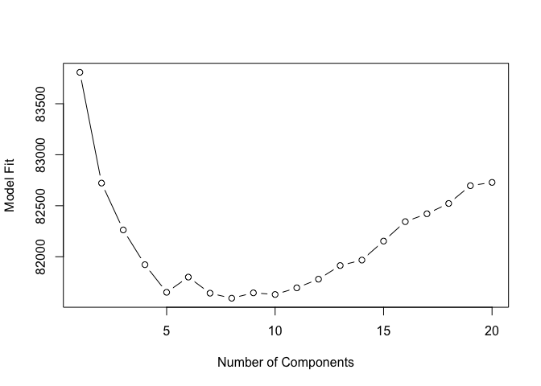
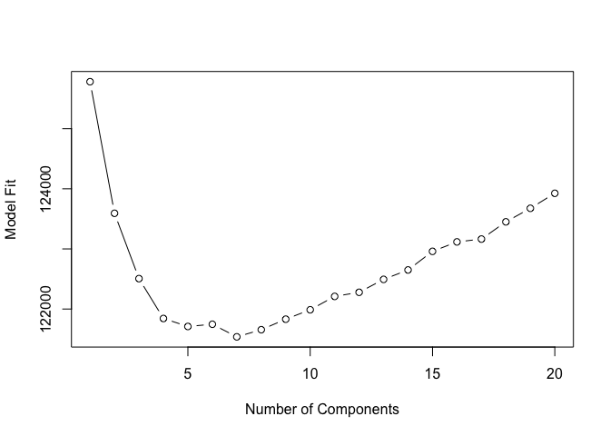

CST and IST
================

# DMM - Make CSTs and ISTs

Fits DMM models for rectal and nasal microbiota and tphe and ics immune
data. Selects optimal number of components and writes the relevant
results.

``` r
#Start time
start.time <- Sys.time()

#Load packages
library(DirichletMultinomial)
```

    ## Loading required package: S4Vectors

    ## Loading required package: stats4

    ## Loading required package: BiocGenerics

    ## Loading required package: parallel

    ## 
    ## Attaching package: 'BiocGenerics'

    ## The following objects are masked from 'package:parallel':
    ## 
    ##     clusterApply, clusterApplyLB, clusterCall, clusterEvalQ,
    ##     clusterExport, clusterMap, parApply, parCapply, parLapply,
    ##     parLapplyLB, parRapply, parSapply, parSapplyLB

    ## The following objects are masked from 'package:stats':
    ## 
    ##     IQR, mad, sd, var, xtabs

    ## The following objects are masked from 'package:base':
    ## 
    ##     anyDuplicated, append, as.data.frame, basename, cbind,
    ##     colMeans, colnames, colSums, dirname, do.call, duplicated,
    ##     eval, evalq, Filter, Find, get, grep, grepl, intersect,
    ##     is.unsorted, lapply, lengths, Map, mapply, match, mget, order,
    ##     paste, pmax, pmax.int, pmin, pmin.int, Position, rank, rbind,
    ##     Reduce, rowMeans, rownames, rowSums, sapply, setdiff, sort,
    ##     table, tapply, union, unique, unsplit, which, which.max,
    ##     which.min

    ## 
    ## Attaching package: 'S4Vectors'

    ## The following object is masked from 'package:base':
    ## 
    ##     expand.grid

    ## Loading required package: IRanges

``` r
library(lattice)
library(xtable)
library(parallel)

sites <- c("nas", "rec", "ics", "tphe")
maxClust <- 20 #Maximum number of clusters to try

for (site in sites) {

  #Read table with normalized, filtered, L7, counts of sample composition
  count <- t(as.matrix(read.csv(file.path(private, sprintf("%s_dmm_input.csv", site)), row.names=1)))
  
  
  #Fit the DMM with 1 through maxClust components
  fit <- mclapply(1:maxClust, dmn, count=count, verbose=TRUE, seed=100)
  
  #Get the Laplace measure of fit for each number of clusters
  lplc <- sapply(fit, laplace)
  
  #Determine the best number of clusters
  best_num_clusts <- which.min(lplc)
  
  #Pull out the fit for the best number of clusters
  best_model <- fit[[best_num_clusts]]
  
  #Write mixture weights, plot fit over number of clusters, and save the fitted model
  if(!(dir.exists(pth <- file.path(refined, 'dmn'))))
    dir.create(pth)
  write.csv(mixture(best_model), file = file.path(pth, sprintf("%s_mix_weights.csv", site)))
  plot(lplc, type="b", xlab="Number of Components", ylab="Model Fit")
  save(fit, file = file.path(pth, sprintf("%s_fit.rda", site)))
  
  #Print total runtime
  cat("Site runtime:")
  cat(difftime(Sys.time(), start.time, units = "hours"))
  cat("\n\n\n")

}
```

<!-- -->

    ## Site runtime:0.6256308

<!-- -->

    ## Site runtime:10.22255

<!-- -->

    ## Site runtime:10.37576

<!-- -->

    ## Site runtime:10.77281

``` r
#Print total runtime
cat("Total runtime:")
```

    ## Total runtime:

``` r
cat(difftime(Sys.time(), start.time, units = "hours"))
```

    ## 10.77281
