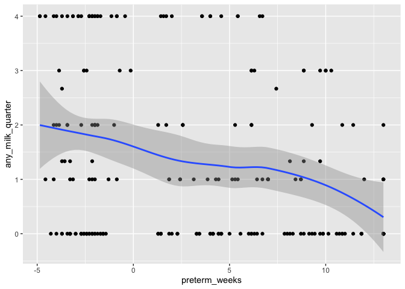

Demographics for table 1
================
Andrew McDavid
2020-06-29

## Load data

``` r
subject = read_csv('data/subject_covariates.csv') %>% mutate(ispreterm = preterm_weeks >= 0)
```

    ## Parsed with column specification:
    ## cols(
    ##   Gender = col_character(),
    ##   Race = col_character(),
    ##   `Birth Season` = col_character(),
    ##   preterm_weeks = col_double(),
    ##   auc14 = col_double(),
    ##   PRD = col_character(),
    ##   preg_antibiotics = col_character(),
    ##   mode_delivery = col_character(),
    ##   cchorio = col_character(),
    ##   preg_membrane_18hr = col_character(),
    ##   birth_wt_gms = col_double(),
    ##   `cmv test` = col_character(),
    ##   Subject = col_character()
    ## )

``` r
hospital_humilk = read_csv('data/milk_hospital.csv') %>% left_join(subject)
```

    ## Parsed with column specification:
    ## cols(
    ##   Subject = col_character(),
    ##   `Any Human Milk Perinatal` = col_logical()
    ## )

    ## Joining, by = "Subject"

``` r
nabx_polish = read_csv('data/antibiotic_exposure.csv')
```

    ## Parsed with column specification:
    ## cols(
    ##   Subject = col_character(),
    ##   discharge = col_logical(),
    ##   group = col_character(),
    ##   `Number of systemic antibiotic` = col_double()
    ## )

``` r
# calculate summary statistics by term
calc_stat = function(tab, var, value){
  tab = tab %>% group_by(ispreterm)
  varq = var
  # continuous, mean SD
  if(missing(value)) res = tab %>% dplyr::summarize(mean = mean(!!varq), sd = sd(!!varq))
  # binary number / proportion
  else res = tab %>% dplyr::summarize(n = sum(!!varq == value), prop = mean(!!varq==value))
  res
}
```

## Any Milk (in hospital)

``` r
calc_stat(hospital_humilk, quo(`Any Human Milk Perinatal`), TRUE)
```

    ## # A tibble: 2 x 3
    ##   ispreterm     n  prop
    ##   <lgl>     <int> <dbl>
    ## 1 FALSE        88 0.746
    ## 2 TRUE        135 0.906

## Milk after discharge

``` r
milk = read_csv('data/milk_survey.csv')
```

    ## Parsed with column specification:
    ## cols(
    ##   Subject = col_character(),
    ##   `Sequence Num` = col_double(),
    ##   `Did baby receive breast milk since last visit` = col_character(),
    ##   `For how many months did baby receive breast milk for more than half of feedings` = col_character(),
    ##   DOL = col_double(),
    ##   cga = col_double()
    ## )

``` r
milk = milk %>% rename(milk_months = `For how many months did baby receive breast milk for more than half of feedings`) 
milk = milk %>% mutate(milk_months = case_when(is.na(milk_months)~ '0', milk_months == 'Less than 1' ~ '0.5', TRUE ~ milk_months), milk_months = as.numeric(milk_months))

milk_sum = milk %>% group_by(Subject) %>% dplyr::summarize(months_surveyed = n()*3, milk_months = mean(milk_months/3, na.rm = TRUE)*12, any_milk_quarter = mean(`Did baby receive breast milk since last visit`=='Yes', na.rm = TRUE)*4)

write_csv(milk_sum, path = 'intermediates/milk_subject.csv')
```

These values were reported to the study by the infants’ caregiver in a
quarterly survey

### Months of \> 50% human milk

``` r
milk_sub = left_join(milk_sum, subject)
```

    ## Joining, by = "Subject"

``` r
calc_stat(milk_sub, quo(milk_months))
```

    ## # A tibble: 2 x 3
    ##   ispreterm  mean    sd
    ##   <lgl>     <dbl> <dbl>
    ## 1 FALSE      5.35  4.53
    ## 2 TRUE       3.02  3.50

Months that the child recieved \> 50% human milk (normalized to one year
of follow up)

### Quarters of milk

``` r
calc_stat(milk_sub, quo(any_milk_quarter))
```

    ## # A tibble: 2 x 3
    ##   ispreterm  mean    sd
    ##   <lgl>     <dbl> <dbl>
    ## 1 FALSE      1.86  1.68
    ## 2 TRUE       1.04  1.36

Number of 90-day periods in which any milk was
recieved.

``` r
#latex(summary( ispreterm ~ milk_months + any_milk_quarter, data = milk_sum, method = 'reverse', test = TRUE, prmsd = TRUE, continuous = 3))

ggplot(milk_sub, aes(x = preterm_weeks, y = milk_months)) + geom_point() + geom_smooth()
```

    ## `geom_smooth()` using method = 'loess' and formula 'y ~ x'

<!-- -->

``` r
ggplot(milk_sub, aes(x = preterm_weeks, y = any_milk_quarter)) + geom_point() + geom_smooth()
```

    ## `geom_smooth()` using method = 'loess' and formula 'y ~ x'

<!-- -->

Dose-response between milk received and gestational
age.

## Antibiotics

``` r
nabx_polish = left_join(nabx_polish, subject)
```

    ## Joining, by = "Subject"

``` r
calc_stat(filter(nabx_polish, !discharge), quo(`Number of systemic antibiotic`)) 
```

    ## # A tibble: 2 x 3
    ##   ispreterm  mean    sd
    ##   <lgl>     <dbl> <dbl>
    ## 1 FALSE       0     0  
    ## 2 TRUE       12.9  16.5

Days of antibiotics (IV, in
patient)

``` r
calc_stat(filter(nabx_polish, discharge), quo(`Number of systemic antibiotic`)) 
```

    ## # A tibble: 2 x 3
    ##   ispreterm  mean    sd
    ##   <lgl>     <dbl> <dbl>
    ## 1 FALSE     0.559  1.06
    ## 2 TRUE      1.06   2.23

Courses of antibiotics reported by care giver (likely oral).
