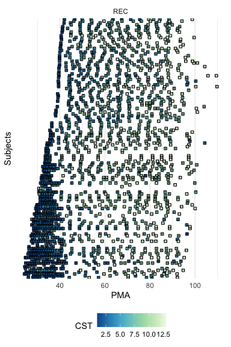

IST/CST Results
================

``` r
#Figure 3 IST Composition Heatmaps

library("readr")
library("tidyverse")
library("RColorBrewer")
library("pheatmap")
library("viridis")
library("ggplot2")
library("igraph")
library("slam")
library("scales")

#Name of IST/cluster column in metadata
tphe.cc <- "TPHE.IST"
ics.cc <- "ICS.IST"

#Read in sample metadata
pth = file.path(refined, 'dmn')
tphe.md <- read_delim(file.path(pth, "tphe_md.txt"), "\t", escape_double = FALSE, trim_ws = TRUE, guess_max = 3600)
```

    ## Parsed with column specification:
    ## cols(
    ##   SampleID = col_character(),
    ##   `TPHE IST` = col_character()
    ## )

``` r
ics.md <- read_delim(file.path(pth, "ics_md.txt"), "\t", escape_double = FALSE, trim_ws = TRUE, guess_max = 3600)
```

    ## Parsed with column specification:
    ## cols(
    ##   SampleID = col_character(),
    ##   `ICS IST` = col_character()
    ## )

``` r
rns <- tphe.md[[1]]
tphe.md <- tphe.md[ , 2:ncol(tphe.md)]
rownames(tphe.md) <- rns
```

    ## Warning: Setting row names on a tibble is deprecated.

``` r
rns <- ics.md[[1]]
ics.md <- ics.md[ , 2:ncol(ics.md)]
rownames(ics.md) <- rns
```

    ## Warning: Setting row names on a tibble is deprecated.

``` r
#Read in sample composition tables
tphe.cd4 <- read_delim(file.path(pth, "tphe_cd4_comp.txt"), "\t", escape_double = FALSE, trim_ws = TRUE, guess_max = 3600)
```

    ## Parsed with column specification:
    ## cols(
    ##   .default = col_double(),
    ##   Metacluster = col_character()
    ## )

    ## See spec(...) for full column specifications.

``` r
tphe.cd8 <- read_delim(file.path(pth, "tphe_cd8_comp.txt"), "\t", escape_double = FALSE, trim_ws = TRUE, guess_max = 3600)
```

    ## Parsed with column specification:
    ## cols(
    ##   .default = col_double(),
    ##   Metacluster = col_character()
    ## )
    ## See spec(...) for full column specifications.

``` r
ics.cd4 <- read_delim(file.path(pth, "ics_cd4_comp.txt"), "\t", escape_double = FALSE, trim_ws = TRUE, guess_max = 3600)
```

    ## Parsed with column specification:
    ## cols(
    ##   .default = col_double(),
    ##   Metacluster = col_character()
    ## )
    ## See spec(...) for full column specifications.

``` r
ics.cd8 <- read_delim(file.path(pth, "ics_cd8_comp.txt"), "\t", escape_double = FALSE, trim_ws = TRUE, guess_max = 3600)
```

    ## Parsed with column specification:
    ## cols(
    ##   .default = col_double(),
    ##   Metacluster = col_character()
    ## )
    ## See spec(...) for full column specifications.

``` r
rns <- tphe.cd4[[1]]
tphe.cd4 <- tphe.cd4[ , 2:ncol(tphe.cd4)]
rownames(tphe.cd4) <- rns
```

    ## Warning: Setting row names on a tibble is deprecated.

``` r
rns <- tphe.cd8[[1]]
tphe.cd8 <- tphe.cd8[ , 2:ncol(tphe.cd8)]
rownames(tphe.cd8) <- rns
```

    ## Warning: Setting row names on a tibble is deprecated.

``` r
rns <- ics.cd4[[1]]
ics.cd4 <- ics.cd4[ , 2:ncol(ics.cd4)]
rownames(ics.cd4) <- rns
```

    ## Warning: Setting row names on a tibble is deprecated.

``` r
rns <- ics.cd8[[1]]
ics.cd8 <- ics.cd8[ , 2:ncol(ics.cd8)]
rownames(ics.cd8) <- rns
```

    ## Warning: Setting row names on a tibble is deprecated.

``` r
#Match metadata and composition data
tphe.md <- data.frame(tphe.md)
ics.md <- data.frame(ics.md)
tphe.cd4 <- data.matrix(tphe.cd4)
tphe.cd8 <- data.matrix(tphe.cd8)
ics.cd4 <- data.matrix(ics.cd4)
ics.cd8 <- data.matrix(ics.cd8)
tphe.cd4 <- tphe.cd4[ , (colnames(tphe.cd4) %in% rownames(tphe.md))]
tphe.cd8 <- tphe.cd8[ , (colnames(tphe.cd8) %in% rownames(tphe.md))]
ics.cd4 <- ics.cd4[ , (colnames(ics.cd4) %in% rownames(ics.md))]
ics.cd8 <- ics.cd8[ , (colnames(ics.cd8) %in% rownames(ics.md))]

#Construct properly formatted annotations, color scheme, and composition matrices for use in pheatmap
tphe.cd4.anno <- tphe.md[colnames(tphe.cd4), tphe.cc, drop=FALSE]
tphe.cd8.anno <- tphe.md[colnames(tphe.cd8), tphe.cc, drop=FALSE]
ics.cd4.anno <- ics.md[colnames(ics.cd4), ics.cc, drop=FALSE]
ics.cd8.anno <- ics.md[colnames(ics.cd8), ics.cc, drop=FALSE]
tphe.cd4.anno[[tphe.cc]] <- factor(tphe.cd4.anno[[tphe.cc]])
tphe.cd8.anno[[tphe.cc]] <- factor(tphe.cd8.anno[[tphe.cc]])
ics.cd4.anno[[ics.cc]] <- factor(ics.cd4.anno[[ics.cc]])
ics.cd8.anno[[ics.cc]] <- factor(ics.cd8.anno[[ics.cc]])
tphe.cd4.anno <- tphe.cd4.anno[order(tphe.cd4.anno[[tphe.cc]]), , drop=FALSE]
tphe.cd8.anno <- tphe.cd8.anno[order(tphe.cd8.anno[[tphe.cc]]), , drop=FALSE]
ics.cd4.anno <- ics.cd4.anno[order(ics.cd4.anno[[ics.cc]]), , drop=FALSE]
ics.cd8.anno <- ics.cd8.anno[order(ics.cd8.anno[[ics.cc]]), , drop=FALSE]
colors <- colorRampPalette(rev(RColorBrewer::brewer.pal(n=7, name="RdYlBu")), bias=3)(100)
tphe.cd4.mat <- tphe.cd4[, rownames(tphe.cd4.anno), drop=FALSE]
tphe.cd8.mat <- tphe.cd8[, rownames(tphe.cd8.anno), drop=FALSE]
ics.cd4.mat <- ics.cd4[, rownames(ics.cd4.anno), drop=FALSE]
ics.cd8.mat <- ics.cd8[, rownames(ics.cd8.anno), drop=FALSE]
tphe.cd4.mat <- t(apply(tphe.cd4.mat, 1L, scales::rescale))
tphe.cd8.mat <- t(apply(tphe.cd8.mat, 1L, scales::rescale))
ics.cd4.mat <- t(apply(ics.cd4.mat, 1L, scales::rescale))
ics.cd8.mat <- t(apply(ics.cd8.mat, 1L, scales::rescale))

#Make the heatmaps
pheatmap(mat = tphe.cd4.mat, color = colors, annotation_col = tphe.cd4.anno, cluster_rows = FALSE, cluster_cols = FALSE, show_colnames = FALSE, gaps_col = cumsum(unname(table(tphe.cd4.anno[[tphe.cc]]))))
```

<!-- -->

``` r
pheatmap(mat = ics.cd4.mat, color = colors, annotation_col = ics.cd4.anno, cluster_rows = FALSE, cluster_cols = FALSE, show_colnames = FALSE, gaps_col = cumsum(unname(table(ics.cd4.anno[[ics.cc]]))))
```

<!-- -->

``` r
pheatmap(mat = tphe.cd8.mat, color = colors, annotation_col = tphe.cd8.anno, cluster_rows = FALSE, cluster_cols = FALSE, show_colnames = FALSE, gaps_col = cumsum(unname(table(tphe.cd8.anno[[tphe.cc]]))))
```

<!-- -->

``` r
pheatmap(mat = ics.cd8.mat, color = colors, annotation_col = ics.cd8.anno, cluster_rows = FALSE, cluster_cols = FALSE, show_colnames = FALSE, gaps_col = cumsum(unname(table(ics.cd8.anno[[ics.cc]]))))
```

<!-- -->

``` r
#Figure 3 IST Occurence Over PMA

library(readr)
library(ggplot2)
library(tidyverse)
library(ggbeeswarm)


# To get CGA at timepoints
timeline = read_csv(file.path('data', 'subject_timeline.csv')) %>% mutate(SampleID = str_c(Subject, '_',  `Sequence Num`))
```

    ## Parsed with column specification:
    ## cols(
    ##   `Sequence Num` = col_double(),
    ##   DOL = col_double(),
    ##   cga = col_double(),
    ##   Subject = col_character()
    ## )

``` r
subject = read_csv(file.path('data', 'subject_covariates.csv')) %>% mutate(GAB = 37 - preterm_weeks, BirthCohort = ifelse(preterm_weeks > 0, 'Pre-term', 'Full-term'))
```

    ## Parsed with column specification:
    ## cols(
    ##   Gender = col_character(),
    ##   Race = col_character(),
    ##   `Birth Season` = col_character(),
    ##   preterm_weeks = col_double(),
    ##   auc14 = col_double(),
    ##   PRD = col_character(),
    ##   preg_antibiotics = col_character(),
    ##   mode_delivery = col_character(),
    ##   cchorio = col_character(),
    ##   preg_membrane_18hr = col_character(),
    ##   birth_wt_gms = col_double(),
    ##   `cmv test` = col_character(),
    ##   Subject = col_character()
    ## )

``` r
timeline = left_join(timeline, subject)
```

    ## Joining, by = "Subject"

``` r
# recode by mean CGA
recode_ist = function(tab){
  s = tab %>% group_by(IST) %>% summarize(mcga = mean(CGA)) %>% arrange(mcga)
  s = s %>% mutate(oIST = fct_reorder(factor(str_c('oIST_', seq_len(nrow(.)))), mcga), oIST_num = as.numeric(oIST))
  left_join(tab, s)
}

# ICS by Subject and timepoint
pth = file.path(refined, 'dmn')
tphe <- read_delim(file.path(pth, "tphe_md.txt"), "\t", escape_double = FALSE, trim_ws = TRUE, guess_max = 3600) %>% 
  mutate(IST = gsub('TPHE IST ([0-9])', 'TPHE_\\1', `TPHE IST`)) %>% left_join(timeline)%>% select(Subject, CGA = cga, IST, GAB, Visit = `Sequence Num`, BirthCohort) %>% recode_ist
```

    ## Parsed with column specification:
    ## cols(
    ##   SampleID = col_character(),
    ##   `TPHE IST` = col_character()
    ## )

    ## Joining, by = "SampleID"

    ## Joining, by = "IST"

``` r
ics <- read_delim(file.path(pth, "ics_md.txt"), "\t", escape_double = FALSE, trim_ws = TRUE, guess_max = 3600)%>% 
  mutate(IST = gsub('ICS IST ([0-9])', 'ICS_\\1', `ICS IST`)) %>% left_join(timeline) %>% select(Subject, CGA = cga, IST, GAB,Visit = `Sequence Num`, BirthCohort) %>% recode_ist
```

    ## Parsed with column specification:
    ## cols(
    ##   SampleID = col_character(),
    ##   `ICS IST` = col_character()
    ## )

    ## Joining, by = "SampleID"

    ## Joining, by = "IST"

``` r
# ics <- read_tsv(file.path(pth, "ics_basic.txt")) %>% recode_ist()
# tphe <- read_tsv(file.path(pth, "tphe_basic.txt")) %>% recode_ist()


ggplot(ics, aes(y=CGA, x=oIST, color=GAB )) + scale_color_gradient2(midpoint=37, low="red", mid="blue", high="darkblue", space ="Lab" ) + geom_quasirandom() + coord_flip()
```

<!-- -->

These were reordered by average PMA in the version of this figure in the
paper.

``` r
summary(lm(CGA ~ IST, data = ics))
```

    ## 
    ## Call:
    ## lm(formula = CGA ~ IST, data = ics)
    ## 
    ## Residuals:
    ##     Min      1Q  Median      3Q     Max 
    ## -53.997  -7.202  -0.354   2.285  58.074 
    ## 
    ## Coefficients:
    ##             Estimate Std. Error t value Pr(>|t|)    
    ## (Intercept)   34.022      2.133  15.948  < 2e-16 ***
    ## ISTICS_2       2.684      2.901   0.925   0.3554    
    ## ISTICS_3       5.264      3.001   1.754   0.0801 .  
    ## ISTICS_4       5.332      2.901   1.838   0.0668 .  
    ## ISTICS_5      12.821      3.090   4.150 4.08e-05 ***
    ## ISTICS_6      14.015      2.767   5.066 6.25e-07 ***
    ## ISTICS_7      28.148      3.525   7.984 1.55e-14 ***
    ## ISTICS_8      60.115      2.705  22.221  < 2e-16 ***
    ## ---
    ## Signif. codes:  0 '***' 0.001 '**' 0.01 '*' 0.05 '.' 0.1 ' ' 1
    ## 
    ## Residual standard error: 14.31 on 396 degrees of freedom
    ## Multiple R-squared:  0.6883, Adjusted R-squared:  0.6828 
    ## F-statistic: 124.9 on 7 and 396 DF,  p-value: < 2.2e-16

``` r
ggplot(tphe, aes(y=CGA, x=oIST, color=GAB )) + scale_color_gradient2(midpoint=37, low="red", mid="blue", high="darkblue", space ="Lab" ) + geom_quasirandom() + coord_flip()
```

<!-- -->

``` r
summary(lm(CGA ~ IST, data = tphe))
```

    ## 
    ## Call:
    ## lm(formula = CGA ~ IST, data = tphe)
    ## 
    ## Residuals:
    ##     Min      1Q  Median      3Q     Max 
    ## -42.376  -3.280   0.068   1.880  49.829 
    ## 
    ## Coefficients:
    ##             Estimate Std. Error t value Pr(>|t|)    
    ## (Intercept)   33.411      1.150  29.047  < 2e-16 ***
    ## ISTTPHE_2      4.872      1.611   3.024 0.002654 ** 
    ## ISTTPHE_3      6.075      1.701   3.571 0.000398 ***
    ## ISTTPHE_4      6.096      1.928   3.162 0.001686 ** 
    ## ISTTPHE_5     13.184      1.861   7.085 6.16e-12 ***
    ## ISTTPHE_6     45.535      2.247  20.268  < 2e-16 ***
    ## ISTTPHE_7     61.853      1.611  38.389  < 2e-16 ***
    ## ---
    ## Signif. codes:  0 '***' 0.001 '**' 0.01 '*' 0.05 '.' 0.1 ' ' 1
    ## 
    ## Residual standard error: 10.03 on 407 degrees of freedom
    ## Multiple R-squared:  0.847,  Adjusted R-squared:  0.8447 
    ## F-statistic: 375.5 on 6 and 407 DF,  p-value: < 2.2e-16

## Co-occurance of t cell measures

``` r
ics_tphe = bind_rows(ICS = ics, TPHE = tphe, .id = 'assay')
```

    ## Warning in bind_rows_(x, .id): Unequal factor levels: coercing to character

    ## Warning in bind_rows_(x, .id): binding character and factor vector, coercing into character
    ## vector

    ## Warning in bind_rows_(x, .id): binding character and factor vector, coercing into character
    ## vector

``` r
assays_avail = ics_tphe %>% group_by(Subject, Visit, BirthCohort) %>% summarize(assays = str_c(assay, collapse = '_')) %>% mutate(assays = factor(assays, levels = c('ICS', 'TPHE', 'ICS_TPHE')))

counts_by_subj = assays_avail %>% group_by(Subject, assays, BirthCohort) %>% summarize(n = n()) %>% ungroup() %>% arrange(Subject, desc(n))
# Take modal scenario if a subject had different assays available at different time points (uncommon)
counts_by_subj = counts_by_subj[!duplicated(counts_by_subj$Subject),]
assays_by_term = with(counts_by_subj, table(n, BirthCohort, assays))
ftab = ftable(assays_by_term, row.vars = c('n', 'BirthCohort'))
ftab
```

    ##               assays ICS TPHE ICS_TPHE
    ## n BirthCohort                         
    ## 1 Full-term            0    2        5
    ##   Pre-term             1    2       10
    ## 2 Full-term            5    0       36
    ##   Pre-term             2    4       47
    ## 3 Full-term            0    2       37
    ##   Pre-term             1    1       30

``` r
write.ftable(ftab, file.path(refined, 'assay_consort_alternative.txt'))
```

Number of subjects with 1, 2 or 3 samples of the various assays,
stratified by Term.

``` r
ics_tphe = ics_tphe %>% mutate(Subjectf = fct_reorder(factor(Subject), GAB))
traj_plot = ggplot(ics_tphe, aes(y = Subjectf, x = CGA, fill = oIST_num)) + 
  geom_point(pch = 22) + scale_fill_distiller('IST', palette = 'GnBu') + facet_wrap(~assay) + 
  theme_minimal() + scale_y_discrete(breaks = NULL) + ylab("Subjects") + xlab('PMA') + geom_text(aes(label = oIST_num), size = 1.5) + theme(legend.position = 'bottom')
trajs = ics_tphe %>% group_by(assay) %>% do(plot = {
 out = traj_plot %+% .
  print(out)
  out
})
```

<!-- --><!-- -->

``` r
#Figure 4 CST Composition Heatmap

library("readr")
library("tidyverse")
library("RColorBrewer")
library("pheatmap")
library("viridis")
library("ggplot2")
library("igraph")
library("slam")
library("scales")

CLUSTER_COLUMN <- "Renamed_CST"

md.rec <- read_delim(file.path(pth, "rec_basic.txt"), "\t", escape_double = FALSE, trim_ws = TRUE, guess_max = 3600)
```

    ## Parsed with column specification:
    ## cols(
    ##   SampleID = col_character(),
    ##   ID = col_character(),
    ##   Subject = col_character(),
    ##   MOD = col_character(),
    ##   Sex = col_character(),
    ##   DOL = col_double(),
    ##   gaBirth = col_double(),
    ##   CGA = col_double(),
    ##   Reads = col_double(),
    ##   CST = col_character(),
    ##   Renamed_CST = col_character(),
    ##   PreviousCST = col_character(),
    ##   PostInitialDischarge = col_character(),
    ##   IllnessVisit = col_character()
    ## )

``` r
rns <- md.rec[[1]]
md.rec <- md.rec[ , 2:ncol(md.rec)]
rownames(md.rec) <- rns
```

    ## Warning: Setting row names on a tibble is deprecated.

``` r
md.nas <- read_delim(file.path(pth, "nas_basic.txt"), "\t", escape_double = FALSE, trim_ws = TRUE, guess_max = 3600)
```

    ## Parsed with column specification:
    ## cols(
    ##   SampleID = col_character(),
    ##   ID = col_character(),
    ##   Subject = col_character(),
    ##   DOL = col_double(),
    ##   MOD = col_character(),
    ##   Sex = col_character(),
    ##   gaBirth = col_double(),
    ##   CGA = col_double(),
    ##   Reads = col_double(),
    ##   CST = col_character(),
    ##   Renamed_CST = col_character(),
    ##   PreviousCST = col_character(),
    ##   PostInitialDischarge = col_character(),
    ##   IllnessVisit = col_character()
    ## )

``` r
rns <- md.nas[[1]]
md.nas <- md.nas[ , 2:ncol(md.nas)]
rownames(md.nas) <- rns
```

    ## Warning: Setting row names on a tibble is deprecated.

``` r
genera.rec <- read_delim(file.path(refined, "REC_top_taxa.txt"), "\t", escape_double = FALSE, trim_ws = TRUE, guess_max = 3600)
```

    ## Parsed with column specification:
    ## cols(
    ##   .default = col_double(),
    ##   Taxon = col_character()
    ## )

    ## See spec(...) for full column specifications.

``` r
rns <- genera.rec[[1]]
genera.rec <- genera.rec[ , 2:ncol(genera.rec)]
rownames(genera.rec) <- rns
```

    ## Warning: Setting row names on a tibble is deprecated.

``` r
genera.nas <- read_delim(file.path(refined, "NAS_top_taxa.txt"), "\t", escape_double = FALSE, trim_ws = TRUE, guess_max = 3600)
```

    ## Parsed with column specification:
    ## cols(
    ##   .default = col_double(),
    ##   Taxon = col_character()
    ## )
    ## See spec(...) for full column specifications.

``` r
rns <- genera.nas[[1]]
genera.nas <- genera.nas[ , 2:ncol(genera.nas)]
rownames(genera.nas) <- rns
```

    ## Warning: Setting row names on a tibble is deprecated.

``` r
md.rec <- data.frame(md.rec)
md.nas <- data.frame(md.nas)

genera.rec <- data.matrix(genera.rec)
genera.nas <- data.matrix(genera.nas)

genera.rec <- genera.rec[ , (colnames(genera.rec) %in% rownames(md.rec))]
genera.nas <- genera.nas[ , (colnames(genera.nas) %in% rownames(md.nas))]

anno.rec <- md.rec[colnames(genera.rec), CLUSTER_COLUMN, drop=FALSE]
anno.nas <- md.nas[colnames(genera.nas), CLUSTER_COLUMN, drop=FALSE]

cga.rec <- md.rec[colnames(genera.rec), c(CLUSTER_COLUMN, "CGA"), drop=FALSE]
cga.nas <- md.nas[colnames(genera.nas), c(CLUSTER_COLUMN, "CGA"), drop=FALSE]

anno.rec[[CLUSTER_COLUMN]] <- fct_reorder(cga.rec[[CLUSTER_COLUMN]], cga.rec$CGA, mean)
anno.nas[[CLUSTER_COLUMN]] <- fct_reorder(cga.nas[[CLUSTER_COLUMN]], cga.nas$CGA, mean)

anno.rec <- anno.rec[order(anno.rec[[CLUSTER_COLUMN]]), , drop=FALSE]
anno.nas <- anno.nas[order(anno.nas[[CLUSTER_COLUMN]]), , drop=FALSE]

top25.rec <- head(names(rev(sort(rowSums(genera.rec)))), 25)
top25.nas <- head(names(rev(sort(rowSums(genera.nas)))), 25)

colors <- colorRampPalette(rev(RColorBrewer::brewer.pal(n=7, name="RdYlBu")), bias=3)(100)

mat.rec <- genera.rec[top25.rec, rownames(anno.rec), drop=FALSE]
mat.nas <- genera.nas[top25.nas, rownames(anno.nas), drop=FALSE]

mat.rec <- t(apply(mat.rec, 1L, scales::rescale))
mat.nas <- t(apply(mat.nas, 1L, scales::rescale))

pheatmap(mat = mat.rec, color = colors, annotation_col = anno.rec, cluster_rows = TRUE, cluster_cols = FALSE, show_colnames = FALSE, gaps_col = cumsum(unname(table(anno.rec[[CLUSTER_COLUMN]]))))
```

<!-- -->

``` r
pheatmap(mat = mat.nas, color = colors, annotation_col = anno.nas, cluster_rows = TRUE, cluster_cols = FALSE, show_colnames = FALSE, gaps_col = cumsum(unname(table(anno.nas[[CLUSTER_COLUMN]]))))
```

<!-- -->

``` r
#Figure 4 CST Occurence Over PMA

library(readr)
library(ggplot2)
library(tidyverse)
library(ggbeeswarm)


recode_cst = function(tab){
  s = tab %>% group_by(CST) %>% summarize(mcga = mean(CGA)) %>% arrange(mcga)
  s = s %>% mutate(oCST = fct_reorder(factor(str_c('oCST_', seq_len(nrow(.)))), mcga), oCST_num = as.numeric(oCST))
  left_join(tab, s)
}

rec <- read_tsv(file.path(pth, "rec_basic.txt")) %>% recode_cst
```

    ## Parsed with column specification:
    ## cols(
    ##   SampleID = col_character(),
    ##   ID = col_character(),
    ##   Subject = col_character(),
    ##   MOD = col_character(),
    ##   Sex = col_character(),
    ##   DOL = col_double(),
    ##   gaBirth = col_double(),
    ##   CGA = col_double(),
    ##   Reads = col_double(),
    ##   CST = col_character(),
    ##   Renamed_CST = col_character(),
    ##   PreviousCST = col_character(),
    ##   PostInitialDischarge = col_character(),
    ##   IllnessVisit = col_character()
    ## )

    ## Joining, by = "CST"

``` r
nas <- read_tsv(file.path(pth, "nas_basic.txt")) %>% recode_cst
```

    ## Parsed with column specification:
    ## cols(
    ##   SampleID = col_character(),
    ##   ID = col_character(),
    ##   Subject = col_character(),
    ##   DOL = col_double(),
    ##   MOD = col_character(),
    ##   Sex = col_character(),
    ##   gaBirth = col_double(),
    ##   CGA = col_double(),
    ##   Reads = col_double(),
    ##   CST = col_character(),
    ##   Renamed_CST = col_character(),
    ##   PreviousCST = col_character(),
    ##   PostInitialDischarge = col_character(),
    ##   IllnessVisit = col_character()
    ## )
    ## Joining, by = "CST"

``` r
ggplot(rec, aes(y=CGA, x=Renamed_CST, color=gaBirth)) + scale_color_gradient2(midpoint=37, low="red", mid="blue", high="darkblue", space ="Lab" ) + geom_quasirandom() + coord_flip()
```

<!-- -->

``` r
ggplot(nas, aes(y=CGA, x=Renamed_CST, color=gaBirth)) + scale_color_gradient2(midpoint=37, low="red", mid="blue", high="darkblue", space ="Lab" ) + geom_quasirandom() + coord_flip()
```

<!-- -->

``` r
communities = bind_rows(
  list(ics = ics, tphe = tphe), .id = 'community'
) %>% rename(Renamed_CST = IST) %>%
  bind_rows(bind_rows(list(nas = nas, rec = rec), .id = 'community')) %>% 
  mutate(Subject = factor(Subject), Renamed_CST = factor(Renamed_CST))
```

    ## Warning in bind_rows_(x, .id): Unequal factor levels: coercing to character

    ## Warning in bind_rows_(x, .id): binding character and factor vector, coercing into character
    ## vector

    ## Warning in bind_rows_(x, .id): binding character and factor vector, coercing into character
    ## vector

``` r
hospital_humilk = read_csv('data/milk_hospital.csv') %>% rename(perinatal_milk = `Any Human Milk Perinatal`)
```

    ## Parsed with column specification:
    ## cols(
    ##   Subject = col_character(),
    ##   `Any Human Milk Perinatal` = col_logical()
    ## )

``` r
nabx_polish = read_csv('data/antibiotic_exposure.csv')
```

    ## Parsed with column specification:
    ## cols(
    ##   Subject = col_character(),
    ##   discharge = col_logical(),
    ##   group = col_character(),
    ##   `Number of systemic antibiotic` = col_double()
    ## )

``` r
covariates = read_csv("data/subject_covariates.csv")
```

    ## Parsed with column specification:
    ## cols(
    ##   Gender = col_character(),
    ##   Race = col_character(),
    ##   `Birth Season` = col_character(),
    ##   preterm_weeks = col_double(),
    ##   auc14 = col_double(),
    ##   PRD = col_character(),
    ##   preg_antibiotics = col_character(),
    ##   mode_delivery = col_character(),
    ##   cchorio = col_character(),
    ##   preg_membrane_18hr = col_character(),
    ##   birth_wt_gms = col_double(),
    ##   `cmv test` = col_character(),
    ##   Subject = col_character()
    ## )

``` r
timeline = read_csv("data/subject_timeline.csv") %>% filter()
```

    ## Parsed with column specification:
    ## cols(
    ##   `Sequence Num` = col_double(),
    ##   DOL = col_double(),
    ##   cga = col_double(),
    ##   Subject = col_character()
    ## )

``` r
nabx_time = nabx_polish %>% select(-group) %>% rename(n_antibiotics = `Number of systemic antibiotic`) %>% spread(discharge, n_antibiotics) %>% rename(n_antibiotics_discharge = 'TRUE', n_antibiotics_pre = 'FALSE')

discharge_humilk = read_csv( 'intermediates/milk_subject.csv')
```

    ## Parsed with column specification:
    ## cols(
    ##   Subject = col_character(),
    ##   months_surveyed = col_double(),
    ##   milk_months = col_double(),
    ##   any_milk_quarter = col_double()
    ## )

``` r
covariates =  purrr::reduce(list(covariates, hospital_humilk, nabx_time, discharge_humilk), left_join)
```

    ## Joining, by = "Subject"

    ## Joining, by = "Subject"
    ## Joining, by = "Subject"

``` r
covariates$n_antibiotics_pre = ifelse(covariates$preterm_weeks <=0, NA, covariates$n_antibiotics_pre)

has_any_cst = communities %>%
  group_by(Subject, Renamed_CST, .drop = FALSE) %>%
  summarize(has_cst = n()>0) %>% ungroup()

was_sampled = communities %>% group_by(community, Subject, .drop = FALSE) %>% 
  summarize(was_sampled = n() > 0) %>% 
  filter(was_sampled) %>% 
  ungroup()  %>%
  inner_join(communities %>% group_by(community, Renamed_CST) %>% summarize())
```

    ## Joining, by = "community"

``` r
has_cst = communities %>% left_join(was_sampled, by = c('community', 'Subject'), suffix = c('', '_test')) %>%
  group_by(Subject, Renamed_CST_test, .drop = FALSE) %>%
  mutate(is_Renamed_CST = Renamed_CST_test == Renamed_CST) %>% ungroup()


nrow(has_any_cst)
```

    ## [1] 7585

``` r
has_any_cst = has_any_cst %>% semi_join(was_sampled)
```

    ## Joining, by = c("Subject", "Renamed_CST")

``` r
nrow(has_any_cst)
```

    ## [1] 6444

``` r
has_cst = has_cst %>% left_join(covariates, by = 'Subject') %>% 
  mutate(mode_delivery = fct_recode(mode_delivery, vaginal = c('Vaginal Vertex'), other = 'Vaginal Breech', other= 'Caesarean Section'),
         n_antibiotics_pre = ifelse(preterm_weeks<=0, 0, n_antibiotics_pre))%>% mutate_at(.vars = vars(CGA, milk_months, n_antibiotics_pre, n_antibiotics_discharge), .fun = scale)
```

    ## Warning: Column `Subject` joining factor and character vector, coercing into character vector

``` r
cst_assoc = has_cst %>% group_by(Renamed_CST_test) %>% do({
    data = .
    full = lme4::glmer(is_Renamed_CST ~ preterm_weeks + mode_delivery +  preg_antibiotics + milk_months + perinatal_milk + n_antibiotics_pre + n_antibiotics_discharge + (1|Subject), family = 'binomial', data = data, nAGQ = 0L)
    tibble(full = list(full))
})

cst_assoc = pivot_longer(cst_assoc, -Renamed_CST_test, values_to = 'model') %>% 
  rowwise() %>% mutate(result = list(suppressWarnings(broom::tidy(model))))
cst_coef = unnest(cst_assoc %>% select(-model), cols = c(result))

knitr::kable(cst_coef %>% filter(term == "preterm_weeks") %>% arrange(p.value)) %>% head(n=20)
```

    ##  [1] "Renamed_CST_test   name   term               estimate   std.error    statistic     p.value  group "
    ##  [2] "-----------------  -----  --------------  -----------  ----------  -----------  ----------  ------"
    ##  [3] "NAS_1              full   preterm_weeks     0.2105972   0.0199713   10.5449867   0.0000000  fixed "
    ##  [4] "REC_3              full   preterm_weeks     0.1809408   0.0332158    5.4474380   0.0000001  fixed "
    ##  [5] "NAS_12             full   preterm_weeks    -0.2223493   0.0417002   -5.3320943   0.0000001  fixed "
    ##  [6] "REC_1              full   preterm_weeks     0.1098286   0.0228678    4.8027691   0.0000016  fixed "
    ##  [7] "NAS_2              full   preterm_weeks     0.1626260   0.0424566    3.8304085   0.0001279  fixed "
    ##  [8] "NAS_11             full   preterm_weeks    -0.1199607   0.0340538   -3.5226794   0.0004272  fixed "
    ##  [9] "REC_2              full   preterm_weeks     0.0934577   0.0273740    3.4141066   0.0006399  fixed "
    ## [10] "NAS_7              full   preterm_weeks    -0.1016867   0.0327140   -3.1083493   0.0018814  fixed "
    ## [11] "ICS_3              full   preterm_weeks    -0.3370686   0.1128648   -2.9864816   0.0028221  fixed "
    ## [12] "TPHE_1             full   preterm_weeks     0.1125248   0.0394637    2.8513507   0.0043534  fixed "
    ## [13] "REC_4              full   preterm_weeks    -0.1178048   0.0420417   -2.8020951   0.0050772  fixed "
    ## [14] "ICS_7              full   preterm_weeks     0.1524132   0.0778247    1.9584150   0.0501813  fixed "
    ## [15] "REC_5              full   preterm_weeks    -0.0941903   0.0497873   -1.8918562   0.0585101  fixed "
    ## [16] "ICS_1              full   preterm_weeks     0.0909074   0.0533774    1.7031057   0.0885483  fixed "
    ## [17] "ICS_2              full   preterm_weeks     0.0711126   0.0440720    1.6135570   0.1066236  fixed "
    ## [18] "NAS_10             full   preterm_weeks    -0.0818797   0.0530909   -1.5422555   0.1230115  fixed "
    ## [19] "REC_8              full   preterm_weeks    -0.0767218   0.0539831   -1.4212176   0.1552535  fixed "
    ## [20] "ICS_4              full   preterm_weeks    -0.1122317   0.0792152   -1.4167939   0.1565432  fixed "

``` r
write_csv(cst_coef, 'intermediates/cst_assoc.csv')
```

Mixed model adjusting for preterm\_weeks + mode\_delivery +
preg\_antibiotics + milk\_months + perinatal\_milk + n\_antibiotics\_pre
+ n\_antibiotics\_discharge + (1 \| Subject)

Top 20 associations listed above, others [are
here](intermediates/cst_assoc.csv).

# Trajectories

``` r
rec_nas = bind_rows(REC = rec, NAS = nas, .id = 'assay') %>% rename(GAB = gaBirth)
rec_nas = rec_nas %>% mutate(Subjectf = fct_reorder(factor(Subject), GAB))
traj_plot = ggplot(rec_nas, aes(y = Subjectf, x = CGA, fill = oCST_num)) + 
  geom_point(pch = 22) + scale_fill_distiller('CST', palette = 'GnBu') + facet_wrap(~assay) + 
  theme_minimal() + scale_y_discrete(breaks = NULL) + ylab("Subjects") + xlab('PMA') + geom_text(aes(label = oCST_num), size = 1.5) + 
  theme(legend.position = 'bottom')
trajs2 = rec_nas %>% group_by(assay) %>% do(plot = {
  out = traj_plot %+% .
  print(out)
  out
})
```

<!-- --><!-- -->

``` r
cowplot::plot_grid(plotlist = trajs$plot, ncol = 2)
```

<!-- -->

``` r
cowplot::plot_grid(plotlist = trajs2$plot, ncol = 2)
```

<!-- -->

\#Supplementary Figure 3 PCoA Plots

Runs in qiime.

``` sh


qiime diversity core-metrics-phylogenetic --i-phylogeny nas_rooted_tree.qza --i-table nas_table.qza --p-sampling-depth 1200 --m-metadata-file nas_basic.txt  --output-dir nas_cda --p-n-jobs 24

qiime diversity core-metrics-phylogenetic --i-phylogeny rec_rooted_tree.qza --i-table rec_table.qza --p-sampling-depth 2250 --m-metadata-file rec_basic.txt  --output-dir rec_cda --p-n-jobs 24
```

``` r
#Supplementary Figure 3 Axis Density by Term

library(readr)
library(ggplot2)

rec <- read_tsv(file.path(pth, "rec_basic.txt"))
```

    ## Parsed with column specification:
    ## cols(
    ##   SampleID = col_character(),
    ##   ID = col_character(),
    ##   Subject = col_character(),
    ##   MOD = col_character(),
    ##   Sex = col_character(),
    ##   DOL = col_double(),
    ##   gaBirth = col_double(),
    ##   CGA = col_double(),
    ##   Reads = col_double(),
    ##   CST = col_character(),
    ##   Renamed_CST = col_character(),
    ##   PreviousCST = col_character(),
    ##   PostInitialDischarge = col_character(),
    ##   IllnessVisit = col_character()
    ## )

``` r
rec$BirthCohort <- ifelse(rec$gaBirth >= 37, "Full term", "Preterm")

pc1 <- read_tsv(file.path('intermediates', "rec_pc1.txt"))
```

    ## Parsed with column specification:
    ## cols(
    ##   SampleID = col_character(),
    ##   PC1 = col_double()
    ## )

``` r
df <- merge(rec, pc1, by = "SampleID")

ggplot(data = df, aes(x = PC1, group = BirthCohort, fill = BirthCohort)) + geom_density(adjust=1.5, position="fill")
```

<!-- -->

``` r
nas <- read_tsv(file.path(pth, "nas_basic.txt"))
```

    ## Parsed with column specification:
    ## cols(
    ##   SampleID = col_character(),
    ##   ID = col_character(),
    ##   Subject = col_character(),
    ##   DOL = col_double(),
    ##   MOD = col_character(),
    ##   Sex = col_character(),
    ##   gaBirth = col_double(),
    ##   CGA = col_double(),
    ##   Reads = col_double(),
    ##   CST = col_character(),
    ##   Renamed_CST = col_character(),
    ##   PreviousCST = col_character(),
    ##   PostInitialDischarge = col_character(),
    ##   IllnessVisit = col_character()
    ## )

``` r
nas$BirthCohort <- ifelse(nas$gaBirth >= 37, "Full term", "Preterm")

pc1 <- read_tsv(file.path('intermediates', "nas_pc1.txt"))
```

    ## Parsed with column specification:
    ## cols(
    ##   SampleID = col_character(),
    ##   PC1 = col_double()
    ## )

``` r
df <- merge(nas, pc1, by = "SampleID")

ggplot(data = df, aes(x = PC1, group = BirthCohort, fill = BirthCohort)) + geom_density(adjust=1.5, position="fill")
```

<!-- -->
