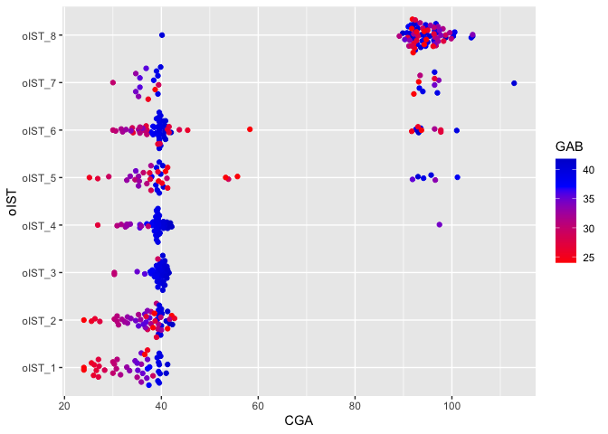

IST/CST Results
================

``` r
#Figure 3 IST Composition Heatmaps

library("readr")
library("tidyverse")
```

    ## Warning: package 'tidyverse' was built under R version 3.5.2

    ## ── Attaching packages ────────────────────────────────────────────────────────────────────────────── tidyverse 1.3.0 ──

    ## ✓ ggplot2 3.3.0     ✓ dplyr   0.8.5
    ## ✓ tibble  2.1.3     ✓ stringr 1.4.0
    ## ✓ tidyr   1.0.2     ✓ forcats 0.5.0
    ## ✓ purrr   0.3.3

    ## Warning: package 'ggplot2' was built under R version 3.5.2

    ## Warning: package 'tibble' was built under R version 3.5.2

    ## Warning: package 'tidyr' was built under R version 3.5.2

    ## Warning: package 'purrr' was built under R version 3.5.2

    ## Warning: package 'dplyr' was built under R version 3.5.2

    ## Warning: package 'stringr' was built under R version 3.5.2

    ## Warning: package 'forcats' was built under R version 3.5.2

    ## ── Conflicts ───────────────────────────────────────────────────────────────────────────────── tidyverse_conflicts() ──
    ## x dplyr::filter() masks stats::filter()
    ## x dplyr::lag()    masks stats::lag()

``` r
library("RColorBrewer")
library("pheatmap")
```

    ## Warning: package 'pheatmap' was built under R version 3.5.2

``` r
library("viridis")
```

    ## Loading required package: viridisLite

``` r
library("ggplot2")
library("igraph")
```

    ## Warning: package 'igraph' was built under R version 3.5.2

    ## 
    ## Attaching package: 'igraph'

    ## The following objects are masked from 'package:dplyr':
    ## 
    ##     as_data_frame, groups, union

    ## The following objects are masked from 'package:purrr':
    ## 
    ##     compose, simplify

    ## The following object is masked from 'package:tidyr':
    ## 
    ##     crossing

    ## The following object is masked from 'package:tibble':
    ## 
    ##     as_data_frame

    ## The following objects are masked from 'package:stats':
    ## 
    ##     decompose, spectrum

    ## The following object is masked from 'package:base':
    ## 
    ##     union

``` r
library("slam")
```

    ## Warning: package 'slam' was built under R version 3.5.2

``` r
library("scales")
```

    ## Warning: package 'scales' was built under R version 3.5.2

    ## 
    ## Attaching package: 'scales'

    ## The following object is masked from 'package:viridis':
    ## 
    ##     viridis_pal

    ## The following object is masked from 'package:purrr':
    ## 
    ##     discard

    ## The following object is masked from 'package:readr':
    ## 
    ##     col_factor

``` r
#Name of IST/cluster column in metadata
tphe.cc <- "TPHE.IST"
ics.cc <- "ICS.IST"

#Read in sample metadata
pth = file.path(refined, 'dmn')
tphe.md <- read_delim(file.path(pth, "tphe_md.txt"), "\t", escape_double = FALSE, trim_ws = TRUE, guess_max = 3600)
```

    ## Parsed with column specification:
    ## cols(
    ##   SampleID = col_character(),
    ##   `TPHE IST` = col_character()
    ## )

``` r
ics.md <- read_delim(file.path(pth, "ics_md.txt"), "\t", escape_double = FALSE, trim_ws = TRUE, guess_max = 3600)
```

    ## Parsed with column specification:
    ## cols(
    ##   SampleID = col_character(),
    ##   `ICS IST` = col_character()
    ## )

``` r
rns <- tphe.md[[1]]
tphe.md <- tphe.md[ , 2:ncol(tphe.md)]
rownames(tphe.md) <- rns
```

    ## Warning: Setting row names on a tibble is deprecated.

``` r
rns <- ics.md[[1]]
ics.md <- ics.md[ , 2:ncol(ics.md)]
rownames(ics.md) <- rns
```

    ## Warning: Setting row names on a tibble is deprecated.

``` r
#Read in sample composition tables
tphe.cd4 <- read_delim(file.path(pth, "tphe_cd4_comp.txt"), "\t", escape_double = FALSE, trim_ws = TRUE, guess_max = 3600)
```

    ## Parsed with column specification:
    ## cols(
    ##   .default = col_double(),
    ##   Metacluster = col_character()
    ## )

    ## See spec(...) for full column specifications.

``` r
tphe.cd8 <- read_delim(file.path(pth, "tphe_cd8_comp.txt"), "\t", escape_double = FALSE, trim_ws = TRUE, guess_max = 3600)
```

    ## Parsed with column specification:
    ## cols(
    ##   .default = col_double(),
    ##   Metacluster = col_character()
    ## )
    ## See spec(...) for full column specifications.

``` r
ics.cd4 <- read_delim(file.path(pth, "ics_cd4_comp.txt"), "\t", escape_double = FALSE, trim_ws = TRUE, guess_max = 3600)
```

    ## Parsed with column specification:
    ## cols(
    ##   .default = col_double(),
    ##   Metacluster = col_character()
    ## )
    ## See spec(...) for full column specifications.

``` r
ics.cd8 <- read_delim(file.path(pth, "ics_cd8_comp.txt"), "\t", escape_double = FALSE, trim_ws = TRUE, guess_max = 3600)
```

    ## Parsed with column specification:
    ## cols(
    ##   .default = col_double(),
    ##   Metacluster = col_character()
    ## )
    ## See spec(...) for full column specifications.

``` r
rns <- tphe.cd4[[1]]
tphe.cd4 <- tphe.cd4[ , 2:ncol(tphe.cd4)]
rownames(tphe.cd4) <- rns
```

    ## Warning: Setting row names on a tibble is deprecated.

``` r
rns <- tphe.cd8[[1]]
tphe.cd8 <- tphe.cd8[ , 2:ncol(tphe.cd8)]
rownames(tphe.cd8) <- rns
```

    ## Warning: Setting row names on a tibble is deprecated.

``` r
rns <- ics.cd4[[1]]
ics.cd4 <- ics.cd4[ , 2:ncol(ics.cd4)]
rownames(ics.cd4) <- rns
```

    ## Warning: Setting row names on a tibble is deprecated.

``` r
rns <- ics.cd8[[1]]
ics.cd8 <- ics.cd8[ , 2:ncol(ics.cd8)]
rownames(ics.cd8) <- rns
```

    ## Warning: Setting row names on a tibble is deprecated.

``` r
#Match metadata and composition data
tphe.md <- data.frame(tphe.md)
ics.md <- data.frame(ics.md)
tphe.cd4 <- data.matrix(tphe.cd4)
tphe.cd8 <- data.matrix(tphe.cd8)
ics.cd4 <- data.matrix(ics.cd4)
ics.cd8 <- data.matrix(ics.cd8)
tphe.cd4 <- tphe.cd4[ , (colnames(tphe.cd4) %in% rownames(tphe.md))]
tphe.cd8 <- tphe.cd8[ , (colnames(tphe.cd8) %in% rownames(tphe.md))]
ics.cd4 <- ics.cd4[ , (colnames(ics.cd4) %in% rownames(ics.md))]
ics.cd8 <- ics.cd8[ , (colnames(ics.cd8) %in% rownames(ics.md))]

#Construct properly formatted annotations, color scheme, and composition matrices for use in pheatmap
tphe.cd4.anno <- tphe.md[colnames(tphe.cd4), tphe.cc, drop=FALSE]
tphe.cd8.anno <- tphe.md[colnames(tphe.cd8), tphe.cc, drop=FALSE]
ics.cd4.anno <- ics.md[colnames(ics.cd4), ics.cc, drop=FALSE]
ics.cd8.anno <- ics.md[colnames(ics.cd8), ics.cc, drop=FALSE]
tphe.cd4.anno[[tphe.cc]] <- factor(tphe.cd4.anno[[tphe.cc]])
tphe.cd8.anno[[tphe.cc]] <- factor(tphe.cd8.anno[[tphe.cc]])
ics.cd4.anno[[ics.cc]] <- factor(ics.cd4.anno[[ics.cc]])
ics.cd8.anno[[ics.cc]] <- factor(ics.cd8.anno[[ics.cc]])
tphe.cd4.anno <- tphe.cd4.anno[order(tphe.cd4.anno[[tphe.cc]]), , drop=FALSE]
tphe.cd8.anno <- tphe.cd8.anno[order(tphe.cd8.anno[[tphe.cc]]), , drop=FALSE]
ics.cd4.anno <- ics.cd4.anno[order(ics.cd4.anno[[ics.cc]]), , drop=FALSE]
ics.cd8.anno <- ics.cd8.anno[order(ics.cd8.anno[[ics.cc]]), , drop=FALSE]
colors <- colorRampPalette(rev(RColorBrewer::brewer.pal(n=7, name="RdYlBu")), bias=3)(100)
tphe.cd4.mat <- tphe.cd4[, rownames(tphe.cd4.anno), drop=FALSE]
tphe.cd8.mat <- tphe.cd8[, rownames(tphe.cd8.anno), drop=FALSE]
ics.cd4.mat <- ics.cd4[, rownames(ics.cd4.anno), drop=FALSE]
ics.cd8.mat <- ics.cd8[, rownames(ics.cd8.anno), drop=FALSE]
tphe.cd4.mat <- t(apply(tphe.cd4.mat, 1L, scales::rescale))
tphe.cd8.mat <- t(apply(tphe.cd8.mat, 1L, scales::rescale))
ics.cd4.mat <- t(apply(ics.cd4.mat, 1L, scales::rescale))
ics.cd8.mat <- t(apply(ics.cd8.mat, 1L, scales::rescale))

#Make the heatmaps
pheatmap(mat = tphe.cd4.mat, color = colors, annotation_col = tphe.cd4.anno, cluster_rows = FALSE, cluster_cols = FALSE, show_colnames = FALSE, gaps_col = cumsum(unname(table(tphe.cd4.anno[[tphe.cc]]))))
```

<!-- -->

``` r
pheatmap(mat = ics.cd4.mat, color = colors, annotation_col = ics.cd4.anno, cluster_rows = FALSE, cluster_cols = FALSE, show_colnames = FALSE, gaps_col = cumsum(unname(table(ics.cd4.anno[[ics.cc]]))))
```

<!-- -->

``` r
pheatmap(mat = tphe.cd8.mat, color = colors, annotation_col = tphe.cd8.anno, cluster_rows = FALSE, cluster_cols = FALSE, show_colnames = FALSE, gaps_col = cumsum(unname(table(tphe.cd8.anno[[tphe.cc]]))))
```

<!-- -->

``` r
pheatmap(mat = ics.cd8.mat, color = colors, annotation_col = ics.cd8.anno, cluster_rows = FALSE, cluster_cols = FALSE, show_colnames = FALSE, gaps_col = cumsum(unname(table(ics.cd8.anno[[ics.cc]]))))
```

<!-- -->

``` r
#Figure 3 IST Occurence Over PMA

library(readr)
library(ggplot2)
library(tidyverse)
library(ggbeeswarm)


# To get CGA at timepoints
timeline = read_csv(file.path('data', 'subject_timeline.csv')) %>% mutate(SampleID = str_c(Subject, '_',  `Sequence Num`))
```

    ## Parsed with column specification:
    ## cols(
    ##   `Sequence Num` = col_double(),
    ##   DOL = col_double(),
    ##   cga = col_double(),
    ##   Subject = col_character()
    ## )

``` r
subject = read_csv(file.path('data', 'subject_covariates.csv')) %>% mutate(GAB = 37 - preterm_weeks, BirthCohort = ifelse(preterm_weeks > 0, 'Pre-term', 'Full-term'))
```

    ## Parsed with column specification:
    ## cols(
    ##   Gender = col_character(),
    ##   Race = col_character(),
    ##   `Birth Season` = col_character(),
    ##   preterm_weeks = col_double(),
    ##   auc14 = col_double(),
    ##   PRD = col_character(),
    ##   preg_antibiotics = col_character(),
    ##   mode_delivery = col_character(),
    ##   cchorio = col_character(),
    ##   preg_membrane_18hr = col_character(),
    ##   birth_wt_gms = col_double(),
    ##   `cmv test` = col_character(),
    ##   Subject = col_character()
    ## )

``` r
timeline = left_join(timeline, subject)
```

    ## Joining, by = "Subject"

``` r
# recode by mean CGA
recode_ist = function(tab){
  s = tab %>% group_by(IST) %>% summarize(mcga = mean(CGA)) %>% arrange(mcga)
  s = s %>% mutate(oIST = fct_reorder(factor(str_c('oIST_', seq_len(nrow(.)))), mcga), oIST_num = as.numeric(oIST))
  left_join(tab, s)
}

# ICS by Subject and timepoint
pth = file.path(refined, 'dmn')
tphe <- read_delim(file.path(pth, "tphe_md.txt"), "\t", escape_double = FALSE, trim_ws = TRUE, guess_max = 3600) %>% 
  mutate(IST = gsub('TPHE IST ([0-9])', 'TPHE_\\1', `TPHE IST`)) %>% left_join(timeline)%>% select(Subject, CGA = cga, IST, GAB, Visit = `Sequence Num`, BirthCohort) %>% recode_ist
```

    ## Parsed with column specification:
    ## cols(
    ##   SampleID = col_character(),
    ##   `TPHE IST` = col_character()
    ## )

    ## Joining, by = "SampleID"

    ## Joining, by = "IST"

``` r
ics <- read_delim(file.path(pth, "ics_md.txt"), "\t", escape_double = FALSE, trim_ws = TRUE, guess_max = 3600)%>% 
  mutate(IST = gsub('ICS IST ([0-9])', 'ICS_\\1', `ICS IST`)) %>% left_join(timeline) %>% select(Subject, CGA = cga, IST, GAB,Visit = `Sequence Num`, BirthCohort) %>% recode_ist
```

    ## Parsed with column specification:
    ## cols(
    ##   SampleID = col_character(),
    ##   `ICS IST` = col_character()
    ## )

    ## Joining, by = "SampleID"

    ## Joining, by = "IST"

``` r
# ics <- read_tsv(file.path(pth, "ics_basic.txt")) %>% recode_ist()
# tphe <- read_tsv(file.path(pth, "tphe_basic.txt")) %>% recode_ist()


ggplot(ics, aes(y=CGA, x=oIST, color=GAB )) + scale_color_gradient2(midpoint=37, low="red", mid="blue", high="darkblue", space ="Lab" ) + geom_quasirandom() + coord_flip()
```

<!-- -->

These were reordered by average PMA in the version of this figure in the
paper.

``` r
summary(lm(CGA ~ IST, data = ics))
```

    ## 
    ## Call:
    ## lm(formula = CGA ~ IST, data = ics)
    ## 
    ## Residuals:
    ##     Min      1Q  Median      3Q     Max 
    ## -53.997  -7.202  -0.354   2.285  58.074 
    ## 
    ## Coefficients:
    ##             Estimate Std. Error t value Pr(>|t|)    
    ## (Intercept)   34.022      2.133  15.948  < 2e-16 ***
    ## ISTICS_2       2.684      2.901   0.925   0.3554    
    ## ISTICS_3       5.264      3.001   1.754   0.0801 .  
    ## ISTICS_4       5.332      2.901   1.838   0.0668 .  
    ## ISTICS_5      12.821      3.090   4.150 4.08e-05 ***
    ## ISTICS_6      14.015      2.767   5.066 6.25e-07 ***
    ## ISTICS_7      28.148      3.525   7.984 1.55e-14 ***
    ## ISTICS_8      60.115      2.705  22.221  < 2e-16 ***
    ## ---
    ## Signif. codes:  0 '***' 0.001 '**' 0.01 '*' 0.05 '.' 0.1 ' ' 1
    ## 
    ## Residual standard error: 14.31 on 396 degrees of freedom
    ## Multiple R-squared:  0.6883, Adjusted R-squared:  0.6828 
    ## F-statistic: 124.9 on 7 and 396 DF,  p-value: < 2.2e-16

``` r
ggplot(tphe, aes(y=CGA, x=oIST, color=GAB )) + scale_color_gradient2(midpoint=37, low="red", mid="blue", high="darkblue", space ="Lab" ) + geom_quasirandom() + coord_flip()
```

<!-- -->

``` r
summary(lm(CGA ~ IST, data = tphe))
```

    ## 
    ## Call:
    ## lm(formula = CGA ~ IST, data = tphe)
    ## 
    ## Residuals:
    ##     Min      1Q  Median      3Q     Max 
    ## -42.376  -3.280   0.068   1.880  49.829 
    ## 
    ## Coefficients:
    ##             Estimate Std. Error t value Pr(>|t|)    
    ## (Intercept)   33.411      1.150  29.047  < 2e-16 ***
    ## ISTTPHE_2      4.872      1.611   3.024 0.002654 ** 
    ## ISTTPHE_3      6.075      1.701   3.571 0.000398 ***
    ## ISTTPHE_4      6.096      1.928   3.162 0.001686 ** 
    ## ISTTPHE_5     13.184      1.861   7.085 6.16e-12 ***
    ## ISTTPHE_6     45.535      2.247  20.268  < 2e-16 ***
    ## ISTTPHE_7     61.853      1.611  38.389  < 2e-16 ***
    ## ---
    ## Signif. codes:  0 '***' 0.001 '**' 0.01 '*' 0.05 '.' 0.1 ' ' 1
    ## 
    ## Residual standard error: 10.03 on 407 degrees of freedom
    ## Multiple R-squared:  0.847,  Adjusted R-squared:  0.8447 
    ## F-statistic: 375.5 on 6 and 407 DF,  p-value: < 2.2e-16

## Co-occurance of t cell measures

``` r
ics_tphe = bind_rows(ICS = ics, TPHE = tphe, .id = 'assay')
```

    ## Warning in bind_rows_(x, .id): Unequal factor levels: coercing to character

    ## Warning in bind_rows_(x, .id): binding character and factor vector, coercing into character vector

    ## Warning in bind_rows_(x, .id): binding character and factor vector, coercing into character vector

``` r
assays_avail = ics_tphe %>% group_by(Subject, Visit, BirthCohort) %>% summarize(assays = str_c(assay, collapse = '_')) %>% mutate(assays = factor(assays, levels = c('ICS', 'TPHE', 'ICS_TPHE')))

counts_by_subj = assays_avail %>% group_by(Subject, assays, BirthCohort) %>% summarize(n = n()) %>% ungroup() %>% arrange(Subject, desc(n))
# Take modal scenario if a subject had different assays available at different time points (uncommon)
counts_by_subj = counts_by_subj[!duplicated(counts_by_subj$Subject),]
assays_by_term = with(counts_by_subj, table(n, BirthCohort, assays))
ftab = ftable(assays_by_term, row.vars = c('n', 'BirthCohort'))
ftab
```

    ##               assays ICS TPHE ICS_TPHE
    ## n BirthCohort                         
    ## 1 Full-term            0    2        5
    ##   Pre-term             1    2       10
    ## 2 Full-term            5    0       36
    ##   Pre-term             2    4       47
    ## 3 Full-term            0    2       37
    ##   Pre-term             1    1       30

``` r
write.ftable(ftab, file.path(refined, 'assay_consort_alternative.txt'))
```

Number of subjects with 1, 2 or 3 samples of the various assays,
stratified by Term.

``` r
ics_tphe = ics_tphe %>% mutate(Subjectf = fct_reorder(factor(Subject), GAB))
traj_plot = ggplot(ics_tphe, aes(y = Subjectf, x = CGA, fill = oIST_num)) + 
  geom_point(pch = 22) + scale_fill_distiller('IST', palette = 'GnBu') + facet_wrap(~assay) + 
  theme_minimal() + scale_y_discrete(breaks = NULL) + ylab("Subjects") + xlab('PMA') + geom_text(aes(label = oIST_num), size = 1.5) + theme(legend.position = 'bottom')
trajs = ics_tphe %>% group_by(assay) %>% do(plot = {
 out = traj_plot %+% .
  print(out)
  out
})
```

<!-- --><!-- -->

``` r
#Figure 4 CST Composition Heatmap

library("readr")
library("tidyverse")
library("RColorBrewer")
library("pheatmap")
library("viridis")
library("ggplot2")
library("igraph")
library("slam")
library("scales")

CLUSTER_COLUMN <- "Renamed_CST"

md.rec <- read_delim(file.path(pth, "rec_basic.txt"), "\t", escape_double = FALSE, trim_ws = TRUE, guess_max = 3600)
```

    ## Parsed with column specification:
    ## cols(
    ##   SampleID = col_character(),
    ##   ID = col_character(),
    ##   Subject = col_character(),
    ##   MOD = col_character(),
    ##   Sex = col_character(),
    ##   DOL = col_double(),
    ##   gaBirth = col_double(),
    ##   CGA = col_double(),
    ##   Reads = col_double(),
    ##   CST = col_character(),
    ##   Renamed_CST = col_character(),
    ##   PreviousCST = col_character(),
    ##   PostInitialDischarge = col_character(),
    ##   IllnessVisit = col_character()
    ## )

``` r
rns <- md.rec[[1]]
md.rec <- md.rec[ , 2:ncol(md.rec)]
rownames(md.rec) <- rns
```

    ## Warning: Setting row names on a tibble is deprecated.

``` r
md.nas <- read_delim(file.path(pth, "nas_basic.txt"), "\t", escape_double = FALSE, trim_ws = TRUE, guess_max = 3600)
```

    ## Parsed with column specification:
    ## cols(
    ##   SampleID = col_character(),
    ##   ID = col_character(),
    ##   Subject = col_character(),
    ##   DOL = col_double(),
    ##   MOD = col_character(),
    ##   Sex = col_character(),
    ##   gaBirth = col_double(),
    ##   CGA = col_double(),
    ##   Reads = col_double(),
    ##   CST = col_character(),
    ##   Renamed_CST = col_character(),
    ##   PreviousCST = col_character(),
    ##   PostInitialDischarge = col_character(),
    ##   IllnessVisit = col_character()
    ## )

``` r
rns <- md.nas[[1]]
md.nas <- md.nas[ , 2:ncol(md.nas)]
rownames(md.nas) <- rns
```

    ## Warning: Setting row names on a tibble is deprecated.

``` r
genera.rec <- read_delim(file.path(refined, "REC_top_taxa.txt"), "\t", escape_double = FALSE, trim_ws = TRUE, guess_max = 3600)
```

    ## Parsed with column specification:
    ## cols(
    ##   .default = col_double(),
    ##   Taxon = col_character()
    ## )

    ## See spec(...) for full column specifications.

``` r
rns <- genera.rec[[1]]
genera.rec <- genera.rec[ , 2:ncol(genera.rec)]
rownames(genera.rec) <- rns
```

    ## Warning: Setting row names on a tibble is deprecated.

``` r
genera.nas <- read_delim(file.path(refined, "NAS_top_taxa.txt"), "\t", escape_double = FALSE, trim_ws = TRUE, guess_max = 3600)
```

    ## Parsed with column specification:
    ## cols(
    ##   .default = col_double(),
    ##   Taxon = col_character()
    ## )
    ## See spec(...) for full column specifications.

``` r
rns <- genera.nas[[1]]
genera.nas <- genera.nas[ , 2:ncol(genera.nas)]
rownames(genera.nas) <- rns
```

    ## Warning: Setting row names on a tibble is deprecated.

``` r
md.rec <- data.frame(md.rec)
md.nas <- data.frame(md.nas)

genera.rec <- data.matrix(genera.rec)
genera.nas <- data.matrix(genera.nas)

genera.rec <- genera.rec[ , (colnames(genera.rec) %in% rownames(md.rec))]
genera.nas <- genera.nas[ , (colnames(genera.nas) %in% rownames(md.nas))]

anno.rec <- md.rec[colnames(genera.rec), CLUSTER_COLUMN, drop=FALSE]
anno.nas <- md.nas[colnames(genera.nas), CLUSTER_COLUMN, drop=FALSE]

cga.rec <- md.rec[colnames(genera.rec), c(CLUSTER_COLUMN, "CGA"), drop=FALSE]
cga.nas <- md.nas[colnames(genera.nas), c(CLUSTER_COLUMN, "CGA"), drop=FALSE]

anno.rec[[CLUSTER_COLUMN]] <- fct_reorder(cga.rec[[CLUSTER_COLUMN]], cga.rec$CGA, mean)
anno.nas[[CLUSTER_COLUMN]] <- fct_reorder(cga.nas[[CLUSTER_COLUMN]], cga.nas$CGA, mean)

anno.rec <- anno.rec[order(anno.rec[[CLUSTER_COLUMN]]), , drop=FALSE]
anno.nas <- anno.nas[order(anno.nas[[CLUSTER_COLUMN]]), , drop=FALSE]

top25.rec <- head(names(rev(sort(rowSums(genera.rec)))), 25)
top25.nas <- head(names(rev(sort(rowSums(genera.nas)))), 25)

colors <- colorRampPalette(rev(RColorBrewer::brewer.pal(n=7, name="RdYlBu")), bias=3)(100)

mat.rec <- genera.rec[top25.rec, rownames(anno.rec), drop=FALSE]
mat.nas <- genera.nas[top25.nas, rownames(anno.nas), drop=FALSE]

mat.rec <- t(apply(mat.rec, 1L, scales::rescale))
mat.nas <- t(apply(mat.nas, 1L, scales::rescale))

pheatmap(mat = mat.rec, color = colors, annotation_col = anno.rec, cluster_rows = TRUE, cluster_cols = FALSE, show_colnames = FALSE, gaps_col = cumsum(unname(table(anno.rec[[CLUSTER_COLUMN]]))))
```

<!-- -->

``` r
pheatmap(mat = mat.nas, color = colors, annotation_col = anno.nas, cluster_rows = TRUE, cluster_cols = FALSE, show_colnames = FALSE, gaps_col = cumsum(unname(table(anno.nas[[CLUSTER_COLUMN]]))))
```

<!-- -->

``` r
#Figure 4 CST Occurence Over PMA

library(readr)
library(ggplot2)
library(tidyverse)
library(ggbeeswarm)


recode_cst = function(tab){
  s = tab %>% group_by(CST) %>% summarize(mcga = mean(CGA)) %>% arrange(mcga)
  s = s %>% mutate(oCST = fct_reorder(factor(str_c('oCST_', seq_len(nrow(.)))), mcga), oCST_num = as.numeric(oCST))
  left_join(tab, s)
}

rec <- read_tsv(file.path(pth, "rec_basic.txt")) %>% recode_cst
```

    ## Parsed with column specification:
    ## cols(
    ##   SampleID = col_character(),
    ##   ID = col_character(),
    ##   Subject = col_character(),
    ##   MOD = col_character(),
    ##   Sex = col_character(),
    ##   DOL = col_double(),
    ##   gaBirth = col_double(),
    ##   CGA = col_double(),
    ##   Reads = col_double(),
    ##   CST = col_character(),
    ##   Renamed_CST = col_character(),
    ##   PreviousCST = col_character(),
    ##   PostInitialDischarge = col_character(),
    ##   IllnessVisit = col_character()
    ## )

    ## Joining, by = "CST"

``` r
nas <- read_tsv(file.path(pth, "nas_basic.txt")) %>% recode_cst
```

    ## Parsed with column specification:
    ## cols(
    ##   SampleID = col_character(),
    ##   ID = col_character(),
    ##   Subject = col_character(),
    ##   DOL = col_double(),
    ##   MOD = col_character(),
    ##   Sex = col_character(),
    ##   gaBirth = col_double(),
    ##   CGA = col_double(),
    ##   Reads = col_double(),
    ##   CST = col_character(),
    ##   Renamed_CST = col_character(),
    ##   PreviousCST = col_character(),
    ##   PostInitialDischarge = col_character(),
    ##   IllnessVisit = col_character()
    ## )
    ## Joining, by = "CST"

``` r
ggplot(rec, aes(y=CGA, x=Renamed_CST, color=gaBirth)) + scale_color_gradient2(midpoint=37, low="red", mid="blue", high="darkblue", space ="Lab" ) + geom_quasirandom() + coord_flip()
```

<!-- -->

``` r
ggplot(nas, aes(y=CGA, x=Renamed_CST, color=gaBirth)) + scale_color_gradient2(midpoint=37, low="red", mid="blue", high="darkblue", space ="Lab" ) + geom_quasirandom() + coord_flip()
```

<!-- -->

# Trajectories

``` r
rec_nas = bind_rows(REC = rec, NAS = nas, .id = 'assay') %>% rename(GAB = gaBirth)
rec_nas = rec_nas %>% mutate(Subjectf = fct_reorder(factor(Subject), GAB))
traj_plot = ggplot(rec_nas, aes(y = Subjectf, x = CGA, fill = oCST_num)) + 
  geom_point(pch = 22) + scale_fill_distiller('CST', palette = 'GnBu') + facet_wrap(~assay) + 
  theme_minimal() + scale_y_discrete(breaks = NULL) + ylab("Subjects") + xlab('PMA') + geom_text(aes(label = oCST_num), size = 1.5) + 
  theme(legend.position = 'bottom')
trajs2 = rec_nas %>% group_by(assay) %>% do(plot = {
  out = traj_plot %+% .
  print(out)
  out
})
```

<!-- --><!-- -->

``` r
cowplot::plot_grid(plotlist = trajs$plot, ncol = 2)
```

<!-- -->

``` r
cowplot::plot_grid(plotlist = trajs2$plot, ncol = 2)
```

<!-- -->

\#Supplementary Figure 3 PCoA Plots

Runs in qiime.

``` sh


qiime diversity core-metrics-phylogenetic --i-phylogeny nas_rooted_tree.qza --i-table nas_table.qza --p-sampling-depth 1200 --m-metadata-file nas_basic.txt  --output-dir nas_cda --p-n-jobs 24

qiime diversity core-metrics-phylogenetic --i-phylogeny rec_rooted_tree.qza --i-table rec_table.qza --p-sampling-depth 2250 --m-metadata-file rec_basic.txt  --output-dir rec_cda --p-n-jobs 24
```

``` r
#Supplementary Figure 3 Axis Density by Term

library(readr)
library(ggplot2)

rec <- read_tsv(file.path(pth, "rec_basic.txt"))
```

    ## Parsed with column specification:
    ## cols(
    ##   SampleID = col_character(),
    ##   ID = col_character(),
    ##   Subject = col_character(),
    ##   MOD = col_character(),
    ##   Sex = col_character(),
    ##   DOL = col_double(),
    ##   gaBirth = col_double(),
    ##   CGA = col_double(),
    ##   Reads = col_double(),
    ##   CST = col_character(),
    ##   Renamed_CST = col_character(),
    ##   PreviousCST = col_character(),
    ##   PostInitialDischarge = col_character(),
    ##   IllnessVisit = col_character()
    ## )

``` r
rec$BirthCohort <- ifelse(rec$gaBirth >= 37, "Full term", "Preterm")

pc1 <- read_tsv(file.path('intermediates', "rec_pc1.txt"))
```

    ## Parsed with column specification:
    ## cols(
    ##   SampleID = col_character(),
    ##   PC1 = col_double()
    ## )

``` r
df <- merge(rec, pc1, by = "SampleID")

ggplot(data = df, aes(x = PC1, group = BirthCohort, fill = BirthCohort)) + geom_density(adjust=1.5, position="fill")
```

<!-- -->

``` r
nas <- read_tsv(file.path(pth, "nas_basic.txt"))
```

    ## Parsed with column specification:
    ## cols(
    ##   SampleID = col_character(),
    ##   ID = col_character(),
    ##   Subject = col_character(),
    ##   DOL = col_double(),
    ##   MOD = col_character(),
    ##   Sex = col_character(),
    ##   gaBirth = col_double(),
    ##   CGA = col_double(),
    ##   Reads = col_double(),
    ##   CST = col_character(),
    ##   Renamed_CST = col_character(),
    ##   PreviousCST = col_character(),
    ##   PostInitialDischarge = col_character(),
    ##   IllnessVisit = col_character()
    ## )

``` r
nas$BirthCohort <- ifelse(nas$gaBirth >= 37, "Full term", "Preterm")

pc1 <- read_tsv(file.path('intermediates', "nas_pc1.txt"))
```

    ## Parsed with column specification:
    ## cols(
    ##   SampleID = col_character(),
    ##   PC1 = col_double()
    ## )

``` r
df <- merge(nas, pc1, by = "SampleID")

ggplot(data = df, aes(x = PC1, group = BirthCohort, fill = BirthCohort)) + geom_density(adjust=1.5, position="fill")
```

<!-- -->

\#Supplementary Figure 5 gCST 3 Time to Occurrence Based on Tphe IST at
Discharge

This works exactly the same as the survival analysis script in
`02_network_modeling`, except you can specify that it run for only a
subset of CSTs and immune variables, and for all of those that are
significant a plot is generated. Optionally, you can save the fitted
models and filtered input data for the chosen CST-immune subset.

See 02\_network\_modeling “time to occurrence”/survival analysis script
for additional comments and description.

``` r
#Start time
start.time <- Sys.time()

library(survival)
library(icenReg)
```

    ## Warning: package 'icenReg' was built under R version 3.5.2

    ## Loading required package: Rcpp

    ## Warning: package 'Rcpp' was built under R version 3.5.2

    ## Loading required package: coda

    ## Warning: package 'coda' was built under R version 3.5.2

``` r
library(survminer)
```

    ## Warning: package 'survminer' was built under R version 3.5.2

    ## Loading required package: ggpubr

    ## Warning: package 'ggpubr' was built under R version 3.5.2

    ## Loading required package: magrittr

    ## 
    ## Attaching package: 'magrittr'

    ## The following object is masked from 'package:purrr':
    ## 
    ##     set_names

    ## The following object is masked from 'package:tidyr':
    ## 
    ##     extract

``` r
library(dplyr)
library(data.table)
```

    ## Warning: package 'data.table' was built under R version 3.5.2

    ## data.table 1.12.8 using 4 threads (see ?getDTthreads).  Latest news: r-datatable.com

    ## 
    ## Attaching package: 'data.table'

    ## The following object is masked from 'package:slam':
    ## 
    ##     rollup

    ## The following objects are masked from 'package:dplyr':
    ## 
    ##     between, first, last

    ## The following object is masked from 'package:purrr':
    ## 
    ##     transpose

``` r
library(readr)

type <- "alt_surv"

sites = c("REC")

#Included for fig making
sigCSTs <- c("REC_3")

#Included for fig making
sigVars <- c("TPHE_IST_Disch")

#Included for fig making
fits.alt_surv <- list()

#Included for fig making
table.alt_surv <- list()

for (site in sites) {
  
  mapping <- read_tsv(file.path(refined, sprintf("%s_Surv_Mapping.txt", site)))
  
  raw_table <- read_tsv(file.path(refined, sprintf("%s_Surv_Input.txt", site)))
  
  mapping_length <- ncol(mapping)
  
  table_length <- ncol(raw_table)
  
  for (cst_i in 3:table_length) {
    
    tmp.time <- Sys.time()
    
    cst <- colnames(raw_table[,cst_i])
    
    #Included for fig making 
    if (!(cst %in% sigCSTs)) { next ; }
    
    #Included for fig making
    fits.alt_surv[[cst]] <- list()
    
    #Included for fig making
    table.alt_surv[[cst]] <- list()
    
    cst_in <- data.frame(raw_table[, 1:2], raw_table[, cst_i])
    
    cst_in <- cst_in[complete.cases(cst_in[,]),]
    
    var_names <- list()
    voi_names <- list()
    var_coeffs <- list()
    var_exp_coeffs <- list()
    variable_pvals <- list()
    k <- 1
    
    for (var_i in 4:mapping_length) {
      
      var <- colnames(mapping[,var_i])
      
      #Included for fig making  
      if (!(var %in% sigVars)) { next ; }
      
      mapping_in <- data.frame(mapping[, 1:3], mapping[, var_i])
      
      fac = FALSE
      
      working_table <- merge(mapping_in, cst_in, by = "Subject")
      
      working_table <- working_table[complete.cases(working_table[,]), ]
      
      if (typeof(working_table[[var]]) == "character") {
        
        fac = TRUE
        
        tmp_table <- as.data.frame(table(working_table[[var]]))
        
        rare_cats <- list()
        n <- 1
        
        for (cat_i in 1:nrow(tmp_table)) {
          
          if (tmp_table[[2]][cat_i] < 10) {
            
            rare_cats[[n]] <- levels(tmp_table[[1]])[cat_i]
            n <- n + 1
            
          }
          
        }
        
        working_table <- working_table[!(working_table[[var]] %in% rare_cats), ]
        
      }
      
      if ((nrow(working_table) < 20) || ((fac) && (nrow(table(working_table[[var]])) < 2))) {
        
        next
        
      }
      
      working_table$cst_obs <- working_table[[cst]]
      
      if (fac) {
        
        working_table$voi <- factor(working_table[[var]])
        
      } else {
        
        working_table$voi <- c(scale(working_table[[var]], center = TRUE, scale = TRUE))
        
      }
      
      working_table$GAB <- ((working_table$gaBirth)/37) - 1
      
      cst_surv <- Surv(working_table$PrevSampleDOL, working_table$cst_obs, type = "interval2")
      
      #Included for fig making
      fits.alt_surv[[cst]][[var]] <- ic_par(cst_surv ~ MOD + GAB + voi, data = working_table, model = "aft", dist = "loglogistic")
      
      #Included for fig making
      table.alt_surv[[cst]][[var]] <- working_table
      
      #Included for fig making
      next
      
      #Included for fig making
      if(!(dir.exists(fig_path <- file.path(figure, "cst_occurence_figs", type))))
      dir.create(fig_path)
      if (fac) {
        
        fac_lvls <- levels(as.data.frame(table(working_table[[var]]))[[1]])
        df.new <- data.frame(voi = fac_lvls, GAB = c(-.2, -.2), MOD = c("Caesarean_Section", "Caesarean_Section"))
        rownames(df.new) <- fac_lvls
      } else {
        df.new <- data.frame(voi = c(1, -1), GAB = c(-.2, -.2), MOD = c("Caesarean_Section", "Caesarean_Section"))
        rownames(df.new) <- c('High', 'Low')
      }
       pdf(file.path(fig_path, sprintf("%s_%s_plot.pdf", cst, var)))
        plot(fits.alt_surv[[cst]][[var]], df.new, xlab = "Day of Life")
        dev.off()
        
      
      #Included for fig making
      next
      
      fit <- ic_par(cst_surv ~ MOD + GAB + voi, data = working_table, model = "aft", dist = "loglogistic")
      
      fit_summary <- summary(fit)
      
      for (p in 5:nrow(fit_summary$summaryParameters)) {
        
        var_names[[k]] <- var
        voi_names[[k]] <- rownames(fit_summary$summaryParameters)[p]
        var_coeffs[[k]] <- fit_summary$summaryParameters[p, 1]
        var_exp_coeffs[[k]] <- fit_summary$summaryParameters[p, 2]
        variable_pvals[[k]] <- fit_summary$summaryParameters[p, 5]
        k <- k + 1
        
      }
      
      if(!(dir.exists(place <- file.path(refined, type))))
      dir.create(place)
      
      cat("Current Variable: ", file = file.path(place, sprintf("%s_results/%s_fit_log.txt", type, cst)), append = TRUE)
      cat(var, file = file.path(place, sprintf("%s_results/%s_fit_log.txt", type, cst)), append = TRUE)
      cat('\n', file = file.path(place, sprintf("%s_results/%s_fit_log.txt", type, cst)), append = TRUE)
      capture.output(summary(fit), file = file.path(place, sprintf("%s_results/%s_fit_log.txt", type, cst)), append = TRUE)
      cat('\n###\n###\n###\n\n', file = file.path(place, sprintf("%s_results/%s_fit_log.txt", type, cst)), append = TRUE)
        
    }
    
    #Included for fig making
    next
    
    adj_variable_pvals <- p.adjust(variable_pvals, method = "fdr")
    results <- cbind(var_names, voi_names, var_coeffs, var_exp_coeffs, variable_pvals, adj_variable_pvals)
    
    write.csv(results, file.path(place, sprintf("%s_results/%s_model_pvals.csv", type, cst)))
    
    cat("\nTime taken to complete last CST: ")
    cat(difftime(Sys.time(), tmp.time, units = "mins"))
    
  }
  
}
```

    ## Parsed with column specification:
    ## cols(
    ##   .default = col_double(),
    ##   Subject = col_character(),
    ##   MOD = col_character(),
    ##   TPHE_IST_Birth = col_character(),
    ##   TPHE_IST_Disch = col_character(),
    ##   TPHE_IST_1YR = col_character(),
    ##   ICS_IST_Birth = col_character(),
    ##   ICS_IST_Disch = col_character(),
    ##   ICS_IST_1YR = col_character()
    ## )

    ## See spec(...) for full column specifications.

    ## Parsed with column specification:
    ## cols(
    ##   Subject = col_character(),
    ##   PrevSampleDOL = col_double(),
    ##   REC_2 = col_double(),
    ##   REC_3 = col_double(),
    ##   REC_9 = col_double(),
    ##   REC_1 = col_double(),
    ##   REC_6 = col_double(),
    ##   REC_8 = col_double(),
    ##   REC_11 = col_double(),
    ##   REC_7 = col_double(),
    ##   REC_4 = col_double(),
    ##   REC_5 = col_double(),
    ##   REC_12 = col_double(),
    ##   REC_13 = col_double(),
    ##   REC_10 = col_double()
    ## )

``` r
#Included for fig making
#save(fits.alt_surv, file = "selected_fitted_alt_survival_models.rda")
#save(table.alt_surv, file = "selected_fitted_alt_surv_dfs.rda")

#Print total runtime
cat("\nTotal runtime:")
```

    ## 
    ## Total runtime:

``` r
cat(difftime(Sys.time(), start.time, units = "hours"))
```

    ## 0.0004568417

``` r
cat("\n\n\n")
```
