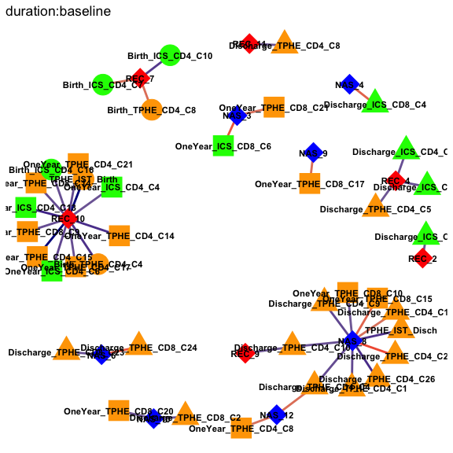

Network modeling
================

These analyses were used to generate the network plots in figure 6, as
well as

# Analysis of CST Occurrence vs Immunological Parameters - quasi-Poisson Duration

Iterates through every pairwise combination of CST and immunological
parameter (either IST or metacluster abundance at one of the three
timepoints) and tests for a significant associations between the immune
parameter in adjusted and unadjusted models.

``` r
to_fit = expand.grid(site = c('REC', 'NAS'), #microbiome sampling site
                     model_type = c('logit', 'duration', 'time_to_event'), #type of association. logit = odds of CST ever, duration = number of days in CST, time_to_event = rate of first entry to CST
                     specification = c('mod_only', 
                                       'baseline', # MOD, GAB
                                       'full'),# full = MOD, GAB, ABX, MILK
                     stringsAsFactors = FALSE
                     ) 

logit =  function(form_, data_) arm::bayesglm(form_, family = 'binomial', data = data_)
duration = function(form_, data_) arm::bayesglm(form_, family = 'quasipoisson', data = data_)
time_to_event = function(form_, data_){
  data_ = dplyr::filter(data_, !is.na(response))
  data_$response = Surv(data_$PrevSampleDOL, data_$response, type = "interval2")
  res = ic_par(form_, data = data_, model = "aft", dist = "loglogistic")
  res
}

knitr::kable(to_fit)
```

| site | model\_type     | specification |
|:-----|:----------------|:--------------|
| REC  | logit           | mod\_only     |
| NAS  | logit           | mod\_only     |
| REC  | duration        | mod\_only     |
| NAS  | duration        | mod\_only     |
| REC  | time\_to\_event | mod\_only     |
| NAS  | time\_to\_event | mod\_only     |
| REC  | logit           | baseline      |
| NAS  | logit           | baseline      |
| REC  | duration        | baseline      |
| NAS  | duration        | baseline      |
| REC  | time\_to\_event | baseline      |
| NAS  | time\_to\_event | baseline      |
| REC  | logit           | full          |
| NAS  | logit           | full          |
| REC  | duration        | full          |
| NAS  | duration        | full          |
| REC  | time\_to\_event | full          |
| NAS  | time\_to\_event | full          |

Scenarios to fit.

``` r
nabx_polish = read_csv('data/antibiotic_exposure.csv') %>% 
  tidyr::pivot_wider(Subject, names_from = 'discharge', values_from = 'Number of systemic antibiotic') %>% 
  rename(abx_hospital = 'FALSE', abx_discharge = 'TRUE') %>%
  mutate(abx_hospital = (abx_hospital - mean(abx_hospital))/sd(abx_hospital), abx_discharge = abx_discharge- mean(abx_discharge))
```

    ## Parsed with column specification:
    ## cols(
    ##   Subject = col_character(),
    ##   discharge = col_logical(),
    ##   group = col_character(),
    ##   `Number of systemic antibiotic` = col_double()
    ## )

``` r
milk_months = read_csv(file.path('intermediates', 'milk_subject.csv')) %>% select(Subject, milk_months)
```

    ## Parsed with column specification:
    ## cols(
    ##   Subject = col_character(),
    ##   months_surveyed = col_double(),
    ##   milk_months = col_double(),
    ##   any_milk_quarter = col_double()
    ## )

``` r
hospital_humilk = read_csv('data/milk_hospital.csv') %>% rename(milk_perinatal = `Any Human Milk Perinatal`)
```

    ## Parsed with column specification:
    ## cols(
    ##   Subject = col_character(),
    ##   `Any Human Milk Perinatal` = col_logical()
    ## )

``` r
milk = full_join(milk_months, hospital_humilk) %>% mutate(milk_months = milk_months - mean(milk_months, na.rm = TRUE))
```

    ## Joining, by = "Subject"

Set up confounders (Antibiotics and Milk). Both are centered. Hospital
antibiotics (days) are Z-scored so represent SD increases.

``` r
network_results_path = file.path(refined, 'network_results')
if(!dir.exists(network_results_path)) dir.create(network_results_path)

fit_scenario_result = list()
for(i in seq_len(nrow(to_fit))){
  this_fit = to_fit[i,]
  ist_extra_tbl <- read_tsv(file.path(refined, sprintf("%s_Surv_Mapping.txt", this_fit$site))) %>% mutate(gaBirth = gaBirth - 37)
  
  # Get response data and
  if(this_fit$model_type == 'logit'){ # Logistic
     microbe_tbl <- read_tsv(file.path(refined, sprintf("%s_Logit_Input.txt", this_fit$site))) %>%
       mutate_at(.vars = vars(-Subject, -Total), .funs = function(x) x=='Yes')
  } else if(this_fit$model_type == 'duration'){  # Duration
    microbe_tbl =  read_tsv(file.path(refined, sprintf("%s_Duration_Input.txt", this_fit$site)))
    
  } else if(this_fit$model_type == 'time_to_event'){ #Survival
    microbe_tbl = read_tsv(file.path(refined, sprintf("%s_Surv_Input.txt",  this_fit$site)))
  }
  
  joined_tbl = left_join(microbe_tbl, ist_extra_tbl, by = 'Subject')
  regr_fcn = get(this_fit$model_type)
  
  # mod_only
  this_formula = formula(response ~  MOD)
  if(this_fit$specification == 'full'){
    this_formula = update(this_formula, . ~ . +  milk_perinatal + milk_months + abx_hospital + abx_discharge + gaBirth)
  } else if(this_fit$specification == 'baseline'){
     this_formula = update(this_formula, . ~ . + gaBirth)
  }
  
  # Total used as offset
  if(this_fit$model_type %in% c('logit', 'duration')){
    this_formula = update(this_formula, . ~. + offset(log(Total)))
    
  } else{
    ist_extra_tbl = left_join(microbe_tbl[c('PrevSampleDOL', 'Subject')], ist_extra_tbl, by = 'Subject')
    microbe_tbl = select(microbe_tbl, -PrevSampleDOL)
  }
  
  ist_fields = ist_extra_tbl %>% select(contains('TPHE'), contains('CD4'), contains('CD8'), contains('ICS')) %>% names()
  microbe_fields = microbe_tbl  %>% select(contains('REC'), contains('NAS')) %>% names()
  joined_tbl2 = joined_tbl %>%
    left_join(milk) %>%
    left_join(nabx_polish)
  
  message("Fitting ", paste0(this_fit, collapse = "-"))
  fit_scenario_result[[i]] = pairwise_regression(joined_tbl2, ist_fields = ist_fields, microbe_fields = microbe_fields, null_formula = this_formula, regression_fcn = regr_fcn)
  result_file = stringr::str_c(do.call(paste, c(list(sep = '_'), this_fit)), "_results.csv")
   
  write_csv(fit_scenario_result[[i]], file.path(network_results_path, result_file))
 
}
```

    ## Parsed with column specification:
    ## cols(
    ##   .default = col_double(),
    ##   Subject = col_character(),
    ##   MOD = col_character(),
    ##   TPHE_IST_Birth = col_character(),
    ##   TPHE_IST_Disch = col_character(),
    ##   TPHE_IST_1YR = col_character(),
    ##   ICS_IST_Birth = col_character(),
    ##   ICS_IST_Disch = col_character(),
    ##   ICS_IST_1YR = col_character()
    ## )

    ## See spec(...) for full column specifications.

    ## Parsed with column specification:
    ## cols(
    ##   Subject = col_character(),
    ##   Total = col_double(),
    ##   REC_2 = col_character(),
    ##   REC_3 = col_character(),
    ##   REC_9 = col_character(),
    ##   REC_1 = col_character(),
    ##   REC_6 = col_character(),
    ##   REC_8 = col_character(),
    ##   REC_11 = col_character(),
    ##   REC_7 = col_character(),
    ##   REC_4 = col_character(),
    ##   REC_5 = col_character(),
    ##   REC_12 = col_character(),
    ##   REC_13 = col_character(),
    ##   REC_10 = col_character()
    ## )

    ## Joining, by = "Subject"
    ## Joining, by = "Subject"

    ## Fitting REC-logit-mod_only

    ## Parsed with column specification:
    ## cols(
    ##   .default = col_double(),
    ##   Subject = col_character(),
    ##   MOD = col_character(),
    ##   TPHE_IST_Birth = col_character(),
    ##   TPHE_IST_Disch = col_character(),
    ##   TPHE_IST_1YR = col_character(),
    ##   ICS_IST_Birth = col_character(),
    ##   ICS_IST_Disch = col_character(),
    ##   ICS_IST_1YR = col_character()
    ## )

    ## See spec(...) for full column specifications.

    ## Parsed with column specification:
    ## cols(
    ##   Subject = col_character(),
    ##   Total = col_double(),
    ##   NAS_1 = col_character(),
    ##   NAS_7 = col_character(),
    ##   NAS_4 = col_character(),
    ##   NAS_5 = col_character(),
    ##   NAS_11 = col_character(),
    ##   NAS_6 = col_character(),
    ##   NAS_9 = col_character(),
    ##   NAS_13 = col_character(),
    ##   NAS_2 = col_character(),
    ##   NAS_8 = col_character(),
    ##   NAS_12 = col_character(),
    ##   NAS_3 = col_character(),
    ##   NAS_10 = col_character()
    ## )

    ## Joining, by = "Subject"
    ## Joining, by = "Subject"

    ## Fitting NAS-logit-mod_only

    ## Parsed with column specification:
    ## cols(
    ##   .default = col_double(),
    ##   Subject = col_character(),
    ##   MOD = col_character(),
    ##   TPHE_IST_Birth = col_character(),
    ##   TPHE_IST_Disch = col_character(),
    ##   TPHE_IST_1YR = col_character(),
    ##   ICS_IST_Birth = col_character(),
    ##   ICS_IST_Disch = col_character(),
    ##   ICS_IST_1YR = col_character()
    ## )

    ## See spec(...) for full column specifications.

    ## Parsed with column specification:
    ## cols(
    ##   Subject = col_character(),
    ##   Total = col_double(),
    ##   REC_1 = col_double(),
    ##   REC_2 = col_double(),
    ##   REC_3 = col_double(),
    ##   REC_4 = col_double(),
    ##   REC_5 = col_double(),
    ##   REC_6 = col_double(),
    ##   REC_7 = col_double(),
    ##   REC_8 = col_double(),
    ##   REC_9 = col_double(),
    ##   REC_10 = col_double(),
    ##   REC_11 = col_double(),
    ##   REC_12 = col_double(),
    ##   REC_13 = col_double()
    ## )

    ## Joining, by = "Subject"
    ## Joining, by = "Subject"

    ## Fitting REC-duration-mod_only

    ## Parsed with column specification:
    ## cols(
    ##   .default = col_double(),
    ##   Subject = col_character(),
    ##   MOD = col_character(),
    ##   TPHE_IST_Birth = col_character(),
    ##   TPHE_IST_Disch = col_character(),
    ##   TPHE_IST_1YR = col_character(),
    ##   ICS_IST_Birth = col_character(),
    ##   ICS_IST_Disch = col_character(),
    ##   ICS_IST_1YR = col_character()
    ## )

    ## See spec(...) for full column specifications.

    ## Parsed with column specification:
    ## cols(
    ##   Subject = col_character(),
    ##   Total = col_double(),
    ##   NAS_1 = col_double(),
    ##   NAS_2 = col_double(),
    ##   NAS_3 = col_double(),
    ##   NAS_4 = col_double(),
    ##   NAS_5 = col_double(),
    ##   NAS_6 = col_double(),
    ##   NAS_7 = col_double(),
    ##   NAS_8 = col_double(),
    ##   NAS_9 = col_double(),
    ##   NAS_10 = col_double(),
    ##   NAS_11 = col_double(),
    ##   NAS_12 = col_double(),
    ##   NAS_13 = col_double()
    ## )

    ## Joining, by = "Subject"
    ## Joining, by = "Subject"

    ## Fitting NAS-duration-mod_only

    ## Parsed with column specification:
    ## cols(
    ##   .default = col_double(),
    ##   Subject = col_character(),
    ##   MOD = col_character(),
    ##   TPHE_IST_Birth = col_character(),
    ##   TPHE_IST_Disch = col_character(),
    ##   TPHE_IST_1YR = col_character(),
    ##   ICS_IST_Birth = col_character(),
    ##   ICS_IST_Disch = col_character(),
    ##   ICS_IST_1YR = col_character()
    ## )

    ## See spec(...) for full column specifications.

    ## Parsed with column specification:
    ## cols(
    ##   Subject = col_character(),
    ##   PrevSampleDOL = col_double(),
    ##   REC_2 = col_double(),
    ##   REC_3 = col_double(),
    ##   REC_9 = col_double(),
    ##   REC_1 = col_double(),
    ##   REC_6 = col_double(),
    ##   REC_8 = col_double(),
    ##   REC_11 = col_double(),
    ##   REC_7 = col_double(),
    ##   REC_4 = col_double(),
    ##   REC_5 = col_double(),
    ##   REC_12 = col_double(),
    ##   REC_13 = col_double(),
    ##   REC_10 = col_double()
    ## )

    ## Joining, by = "Subject"
    ## Joining, by = "Subject"

    ## Fitting REC-time_to_event-mod_only

    ## Warning in sqrt(diag(fit$var)): NaNs produced

    ## Warning in sqrt(diag(fit$var)): NaNs produced

    ## Warning in sqrt(diag(fit$var)): NaNs produced

    ## Warning in sqrt(diag(fit$var)): NaNs produced

    ## Warning in sqrt(diag(fit$var)): NaNs produced

    ## Warning in sqrt(diag(fit$var)): NaNs produced

    ## Warning in sqrt(diag(fit$var)): NaNs produced

    ## Warning in sqrt(diag(fit$var)): NaNs produced

    ## Warning in sqrt(diag(fit$var)): NaNs produced

    ## Warning in sqrt(diag(fit$var)): NaNs produced

    ## Warning in sqrt(diag(fit$var)): NaNs produced

    ## Warning in sqrt(diag(fit$var)): NaNs produced

    ## Warning in sqrt(diag(fit$var)): NaNs produced

    ## Warning in sqrt(diag(fit$var)): NaNs produced

    ## Warning in sqrt(diag(fit$var)): NaNs produced

    ## Warning in sqrt(diag(fit$var)): NaNs produced

    ## Warning in sqrt(diag(fit$var)): NaNs produced

    ## Error in solve.default(fit$hessian) : 
    ##   Lapack routine dgesv: system is exactly singular: U[1,1] = 0

    ## Warning in sqrt(diag(fit$var)): NaNs produced

    ## Warning in sqrt(diag(fit$var)): NaNs produced

    ## Warning in sqrt(diag(fit$var)): NaNs produced

    ## Warning in sqrt(diag(fit$var)): NaNs produced

    ## Warning in sqrt(diag(fit$var)): NaNs produced

    ## Warning in sqrt(diag(fit$var)): NaNs produced

    ## Warning in sqrt(diag(fit$var)): NaNs produced

    ## Warning in sqrt(diag(fit$var)): NaNs produced

    ## Warning in sqrt(diag(fit$var)): NaNs produced

    ## Warning in sqrt(diag(fit$var)): NaNs produced

    ## Error in solve.default(fit$hessian) : 
    ##   Lapack routine dgesv: system is exactly singular: U[4,4] = 0

    ## Warning in sqrt(diag(fit$var)): NaNs produced

    ## Warning in sqrt(diag(fit$var)): NaNs produced

    ## Warning in sqrt(diag(fit$var)): NaNs produced

    ## Error in solve.default(fit$hessian) : 
    ##   Lapack routine dgesv: system is exactly singular: U[1,1] = 0

    ## Warning in sqrt(diag(fit$var)): NaNs produced

    ## Error in ic_par(form_, data = data_, model = "aft", dist = "loglogistic") : 
    ##   covariate matrix is computationally singular! Make sure not to add intercept to model, also make sure every factor has observations at every level

    ## Warning in sqrt(diag(fit$var)): NaNs produced

    ## Warning in sqrt(diag(fit$var)): NaNs produced

    ## Parsed with column specification:
    ## cols(
    ##   .default = col_double(),
    ##   Subject = col_character(),
    ##   MOD = col_character(),
    ##   TPHE_IST_Birth = col_character(),
    ##   TPHE_IST_Disch = col_character(),
    ##   TPHE_IST_1YR = col_character(),
    ##   ICS_IST_Birth = col_character(),
    ##   ICS_IST_Disch = col_character(),
    ##   ICS_IST_1YR = col_character()
    ## )

    ## See spec(...) for full column specifications.

    ## Parsed with column specification:
    ## cols(
    ##   Subject = col_character(),
    ##   PrevSampleDOL = col_double(),
    ##   NAS_1 = col_double(),
    ##   NAS_7 = col_double(),
    ##   NAS_4 = col_double(),
    ##   NAS_5 = col_double(),
    ##   NAS_11 = col_double(),
    ##   NAS_6 = col_double(),
    ##   NAS_9 = col_double(),
    ##   NAS_13 = col_double(),
    ##   NAS_2 = col_double(),
    ##   NAS_8 = col_double(),
    ##   NAS_12 = col_double(),
    ##   NAS_3 = col_double(),
    ##   NAS_10 = col_double()
    ## )

    ## Joining, by = "Subject"
    ## Joining, by = "Subject"

    ## Fitting NAS-time_to_event-mod_only

    ## Parsed with column specification:
    ## cols(
    ##   .default = col_double(),
    ##   Subject = col_character(),
    ##   MOD = col_character(),
    ##   TPHE_IST_Birth = col_character(),
    ##   TPHE_IST_Disch = col_character(),
    ##   TPHE_IST_1YR = col_character(),
    ##   ICS_IST_Birth = col_character(),
    ##   ICS_IST_Disch = col_character(),
    ##   ICS_IST_1YR = col_character()
    ## )

    ## See spec(...) for full column specifications.

    ## Parsed with column specification:
    ## cols(
    ##   Subject = col_character(),
    ##   Total = col_double(),
    ##   REC_2 = col_character(),
    ##   REC_3 = col_character(),
    ##   REC_9 = col_character(),
    ##   REC_1 = col_character(),
    ##   REC_6 = col_character(),
    ##   REC_8 = col_character(),
    ##   REC_11 = col_character(),
    ##   REC_7 = col_character(),
    ##   REC_4 = col_character(),
    ##   REC_5 = col_character(),
    ##   REC_12 = col_character(),
    ##   REC_13 = col_character(),
    ##   REC_10 = col_character()
    ## )

    ## Joining, by = "Subject"
    ## Joining, by = "Subject"

    ## Fitting REC-logit-baseline

    ## Parsed with column specification:
    ## cols(
    ##   .default = col_double(),
    ##   Subject = col_character(),
    ##   MOD = col_character(),
    ##   TPHE_IST_Birth = col_character(),
    ##   TPHE_IST_Disch = col_character(),
    ##   TPHE_IST_1YR = col_character(),
    ##   ICS_IST_Birth = col_character(),
    ##   ICS_IST_Disch = col_character(),
    ##   ICS_IST_1YR = col_character()
    ## )

    ## See spec(...) for full column specifications.

    ## Parsed with column specification:
    ## cols(
    ##   Subject = col_character(),
    ##   Total = col_double(),
    ##   NAS_1 = col_character(),
    ##   NAS_7 = col_character(),
    ##   NAS_4 = col_character(),
    ##   NAS_5 = col_character(),
    ##   NAS_11 = col_character(),
    ##   NAS_6 = col_character(),
    ##   NAS_9 = col_character(),
    ##   NAS_13 = col_character(),
    ##   NAS_2 = col_character(),
    ##   NAS_8 = col_character(),
    ##   NAS_12 = col_character(),
    ##   NAS_3 = col_character(),
    ##   NAS_10 = col_character()
    ## )

    ## Joining, by = "Subject"
    ## Joining, by = "Subject"

    ## Fitting NAS-logit-baseline

    ## Parsed with column specification:
    ## cols(
    ##   .default = col_double(),
    ##   Subject = col_character(),
    ##   MOD = col_character(),
    ##   TPHE_IST_Birth = col_character(),
    ##   TPHE_IST_Disch = col_character(),
    ##   TPHE_IST_1YR = col_character(),
    ##   ICS_IST_Birth = col_character(),
    ##   ICS_IST_Disch = col_character(),
    ##   ICS_IST_1YR = col_character()
    ## )

    ## See spec(...) for full column specifications.

    ## Parsed with column specification:
    ## cols(
    ##   Subject = col_character(),
    ##   Total = col_double(),
    ##   REC_1 = col_double(),
    ##   REC_2 = col_double(),
    ##   REC_3 = col_double(),
    ##   REC_4 = col_double(),
    ##   REC_5 = col_double(),
    ##   REC_6 = col_double(),
    ##   REC_7 = col_double(),
    ##   REC_8 = col_double(),
    ##   REC_9 = col_double(),
    ##   REC_10 = col_double(),
    ##   REC_11 = col_double(),
    ##   REC_12 = col_double(),
    ##   REC_13 = col_double()
    ## )

    ## Joining, by = "Subject"
    ## Joining, by = "Subject"

    ## Fitting REC-duration-baseline

    ## Parsed with column specification:
    ## cols(
    ##   .default = col_double(),
    ##   Subject = col_character(),
    ##   MOD = col_character(),
    ##   TPHE_IST_Birth = col_character(),
    ##   TPHE_IST_Disch = col_character(),
    ##   TPHE_IST_1YR = col_character(),
    ##   ICS_IST_Birth = col_character(),
    ##   ICS_IST_Disch = col_character(),
    ##   ICS_IST_1YR = col_character()
    ## )

    ## See spec(...) for full column specifications.

    ## Parsed with column specification:
    ## cols(
    ##   Subject = col_character(),
    ##   Total = col_double(),
    ##   NAS_1 = col_double(),
    ##   NAS_2 = col_double(),
    ##   NAS_3 = col_double(),
    ##   NAS_4 = col_double(),
    ##   NAS_5 = col_double(),
    ##   NAS_6 = col_double(),
    ##   NAS_7 = col_double(),
    ##   NAS_8 = col_double(),
    ##   NAS_9 = col_double(),
    ##   NAS_10 = col_double(),
    ##   NAS_11 = col_double(),
    ##   NAS_12 = col_double(),
    ##   NAS_13 = col_double()
    ## )

    ## Joining, by = "Subject"
    ## Joining, by = "Subject"

    ## Fitting NAS-duration-baseline

    ## Parsed with column specification:
    ## cols(
    ##   .default = col_double(),
    ##   Subject = col_character(),
    ##   MOD = col_character(),
    ##   TPHE_IST_Birth = col_character(),
    ##   TPHE_IST_Disch = col_character(),
    ##   TPHE_IST_1YR = col_character(),
    ##   ICS_IST_Birth = col_character(),
    ##   ICS_IST_Disch = col_character(),
    ##   ICS_IST_1YR = col_character()
    ## )

    ## See spec(...) for full column specifications.

    ## Parsed with column specification:
    ## cols(
    ##   Subject = col_character(),
    ##   PrevSampleDOL = col_double(),
    ##   REC_2 = col_double(),
    ##   REC_3 = col_double(),
    ##   REC_9 = col_double(),
    ##   REC_1 = col_double(),
    ##   REC_6 = col_double(),
    ##   REC_8 = col_double(),
    ##   REC_11 = col_double(),
    ##   REC_7 = col_double(),
    ##   REC_4 = col_double(),
    ##   REC_5 = col_double(),
    ##   REC_12 = col_double(),
    ##   REC_13 = col_double(),
    ##   REC_10 = col_double()
    ## )

    ## Joining, by = "Subject"
    ## Joining, by = "Subject"

    ## Fitting REC-time_to_event-baseline

    ## Warning in sqrt(diag(fit$var)): NaNs produced

    ## Warning in sqrt(diag(fit$var)): NaNs produced

    ## Warning in sqrt(diag(fit$var)): NaNs produced

    ## Warning in sqrt(diag(fit$var)): NaNs produced

    ## Warning in sqrt(diag(fit$var)): NaNs produced

    ## Warning in sqrt(diag(fit$var)): NaNs produced

    ## Warning in sqrt(diag(fit$var)): NaNs produced

    ## Warning in sqrt(diag(fit$var)): NaNs produced

    ## Warning in sqrt(diag(fit$var)): NaNs produced

    ## Warning in sqrt(diag(fit$var)): NaNs produced

    ## Warning in sqrt(diag(fit$var)): NaNs produced

    ## Warning in sqrt(diag(fit$var)): NaNs produced

    ## Warning in sqrt(diag(fit$var)): NaNs produced

    ## Warning in sqrt(diag(fit$var)): NaNs produced

    ## Warning in sqrt(diag(fit$var)): NaNs produced

    ## Warning in sqrt(diag(fit$var)): NaNs produced

    ## Warning in sqrt(diag(fit$var)): NaNs produced

    ## Warning in sqrt(diag(fit$var)): NaNs produced

    ## Warning in sqrt(diag(fit$var)): NaNs produced

    ## Warning in sqrt(diag(fit$var)): NaNs produced

    ## Warning in sqrt(diag(fit$var)): NaNs produced

    ## Warning in sqrt(diag(fit$var)): NaNs produced

    ## Warning in sqrt(diag(fit$var)): NaNs produced

    ## Warning in sqrt(diag(fit$var)): NaNs produced

    ## Warning in sqrt(diag(fit$var)): NaNs produced

    ## Warning in sqrt(diag(fit$var)): NaNs produced

    ## Warning in sqrt(diag(fit$var)): NaNs produced

    ## Warning in sqrt(diag(fit$var)): NaNs produced

    ## Warning in sqrt(diag(fit$var)): NaNs produced

    ## Warning in sqrt(diag(fit$var)): NaNs produced

    ## Warning in sqrt(diag(fit$var)): NaNs produced

    ## Warning in sqrt(diag(fit$var)): NaNs produced

    ## Warning in sqrt(diag(fit$var)): NaNs produced

    ## Warning in sqrt(diag(fit$var)): NaNs produced

    ## Warning in sqrt(diag(fit$var)): NaNs produced

    ## Warning in sqrt(diag(fit$var)): NaNs produced

    ## Warning in sqrt(diag(fit$var)): NaNs produced

    ## Warning in sqrt(diag(fit$var)): NaNs produced

    ## Warning in sqrt(diag(fit$var)): NaNs produced

    ## Warning in sqrt(diag(fit$var)): NaNs produced

    ## Warning in sqrt(diag(fit$var)): NaNs produced

    ## Warning in sqrt(diag(fit$var)): NaNs produced

    ## Warning in sqrt(diag(fit$var)): NaNs produced

    ## Warning in sqrt(diag(fit$var)): NaNs produced

    ## Warning in sqrt(diag(fit$var)): NaNs produced

    ## Warning in sqrt(diag(fit$var)): NaNs produced

    ## Warning in sqrt(diag(fit$var)): NaNs produced

    ## Warning in sqrt(diag(fit$var)): NaNs produced

    ## Warning in sqrt(diag(fit$var)): NaNs produced

    ## Warning in sqrt(diag(fit$var)): NaNs produced

    ## Warning in sqrt(diag(fit$var)): NaNs produced

    ## Warning in sqrt(diag(fit$var)): NaNs produced

    ## Warning in sqrt(diag(fit$var)): NaNs produced

    ## Warning in sqrt(diag(fit$var)): NaNs produced

    ## Warning in sqrt(diag(fit$var)): NaNs produced

    ## Warning in sqrt(diag(fit$var)): NaNs produced

    ## Warning in sqrt(diag(fit$var)): NaNs produced

    ## Warning in sqrt(diag(fit$var)): NaNs produced

    ## Warning in sqrt(diag(fit$var)): NaNs produced

    ## Warning in sqrt(diag(fit$var)): NaNs produced

    ## Warning in sqrt(diag(fit$var)): NaNs produced

    ## Warning in sqrt(diag(fit$var)): NaNs produced

    ## Warning in sqrt(diag(fit$var)): NaNs produced

    ## Warning in sqrt(diag(fit$var)): NaNs produced

    ## Warning in sqrt(diag(fit$var)): NaNs produced

    ## Warning in sqrt(diag(fit$var)): NaNs produced

    ## Warning in sqrt(diag(fit$var)): NaNs produced

    ## Warning in sqrt(diag(fit$var)): NaNs produced

    ## Warning in sqrt(diag(fit$var)): NaNs produced

    ## Warning in sqrt(diag(fit$var)): NaNs produced

    ## Warning in sqrt(diag(fit$var)): NaNs produced

    ## Warning in sqrt(diag(fit$var)): NaNs produced

    ## Warning in sqrt(diag(fit$var)): NaNs produced

    ## Warning in sqrt(diag(fit$var)): NaNs produced

    ## Error in solve.default(fit$hessian) : 
    ##   Lapack routine dgesv: system is exactly singular: U[1,1] = 0

    ## Warning in sqrt(diag(fit$var)): NaNs produced

    ## Warning in sqrt(diag(fit$var)): NaNs produced

    ## Warning in sqrt(diag(fit$var)): NaNs produced

    ## Error in solve.default(fit$hessian) : 
    ##   Lapack routine dgesv: system is exactly singular: U[1,1] = 0

    ## Warning in sqrt(diag(fit$var)): NaNs produced

    ## Error in solve.default(fit$hessian) : 
    ##   Lapack routine dgesv: system is exactly singular: U[1,1] = 0

    ## Warning in sqrt(diag(fit$var)): NaNs produced

    ## Warning in sqrt(diag(fit$var)): NaNs produced

    ## Error in ic_par(form_, data = data_, model = "aft", dist = "loglogistic") : 
    ##   covariate matrix is computationally singular! Make sure not to add intercept to model, also make sure every factor has observations at every level
    ## Error in ic_par(form_, data = data_, model = "aft", dist = "loglogistic") : 
    ##   covariate matrix is computationally singular! Make sure not to add intercept to model, also make sure every factor has observations at every level

    ## Parsed with column specification:
    ## cols(
    ##   .default = col_double(),
    ##   Subject = col_character(),
    ##   MOD = col_character(),
    ##   TPHE_IST_Birth = col_character(),
    ##   TPHE_IST_Disch = col_character(),
    ##   TPHE_IST_1YR = col_character(),
    ##   ICS_IST_Birth = col_character(),
    ##   ICS_IST_Disch = col_character(),
    ##   ICS_IST_1YR = col_character()
    ## )

    ## See spec(...) for full column specifications.

    ## Parsed with column specification:
    ## cols(
    ##   Subject = col_character(),
    ##   PrevSampleDOL = col_double(),
    ##   NAS_1 = col_double(),
    ##   NAS_7 = col_double(),
    ##   NAS_4 = col_double(),
    ##   NAS_5 = col_double(),
    ##   NAS_11 = col_double(),
    ##   NAS_6 = col_double(),
    ##   NAS_9 = col_double(),
    ##   NAS_13 = col_double(),
    ##   NAS_2 = col_double(),
    ##   NAS_8 = col_double(),
    ##   NAS_12 = col_double(),
    ##   NAS_3 = col_double(),
    ##   NAS_10 = col_double()
    ## )

    ## Joining, by = "Subject"
    ## Joining, by = "Subject"

    ## Fitting NAS-time_to_event-baseline

    ## Parsed with column specification:
    ## cols(
    ##   .default = col_double(),
    ##   Subject = col_character(),
    ##   MOD = col_character(),
    ##   TPHE_IST_Birth = col_character(),
    ##   TPHE_IST_Disch = col_character(),
    ##   TPHE_IST_1YR = col_character(),
    ##   ICS_IST_Birth = col_character(),
    ##   ICS_IST_Disch = col_character(),
    ##   ICS_IST_1YR = col_character()
    ## )

    ## See spec(...) for full column specifications.

    ## Parsed with column specification:
    ## cols(
    ##   Subject = col_character(),
    ##   Total = col_double(),
    ##   REC_2 = col_character(),
    ##   REC_3 = col_character(),
    ##   REC_9 = col_character(),
    ##   REC_1 = col_character(),
    ##   REC_6 = col_character(),
    ##   REC_8 = col_character(),
    ##   REC_11 = col_character(),
    ##   REC_7 = col_character(),
    ##   REC_4 = col_character(),
    ##   REC_5 = col_character(),
    ##   REC_12 = col_character(),
    ##   REC_13 = col_character(),
    ##   REC_10 = col_character()
    ## )

    ## Joining, by = "Subject"
    ## Joining, by = "Subject"

    ## Fitting REC-logit-full

    ## Parsed with column specification:
    ## cols(
    ##   .default = col_double(),
    ##   Subject = col_character(),
    ##   MOD = col_character(),
    ##   TPHE_IST_Birth = col_character(),
    ##   TPHE_IST_Disch = col_character(),
    ##   TPHE_IST_1YR = col_character(),
    ##   ICS_IST_Birth = col_character(),
    ##   ICS_IST_Disch = col_character(),
    ##   ICS_IST_1YR = col_character()
    ## )

    ## See spec(...) for full column specifications.

    ## Parsed with column specification:
    ## cols(
    ##   Subject = col_character(),
    ##   Total = col_double(),
    ##   NAS_1 = col_character(),
    ##   NAS_7 = col_character(),
    ##   NAS_4 = col_character(),
    ##   NAS_5 = col_character(),
    ##   NAS_11 = col_character(),
    ##   NAS_6 = col_character(),
    ##   NAS_9 = col_character(),
    ##   NAS_13 = col_character(),
    ##   NAS_2 = col_character(),
    ##   NAS_8 = col_character(),
    ##   NAS_12 = col_character(),
    ##   NAS_3 = col_character(),
    ##   NAS_10 = col_character()
    ## )

    ## Joining, by = "Subject"
    ## Joining, by = "Subject"

    ## Fitting NAS-logit-full

    ## Parsed with column specification:
    ## cols(
    ##   .default = col_double(),
    ##   Subject = col_character(),
    ##   MOD = col_character(),
    ##   TPHE_IST_Birth = col_character(),
    ##   TPHE_IST_Disch = col_character(),
    ##   TPHE_IST_1YR = col_character(),
    ##   ICS_IST_Birth = col_character(),
    ##   ICS_IST_Disch = col_character(),
    ##   ICS_IST_1YR = col_character()
    ## )

    ## See spec(...) for full column specifications.

    ## Parsed with column specification:
    ## cols(
    ##   Subject = col_character(),
    ##   Total = col_double(),
    ##   REC_1 = col_double(),
    ##   REC_2 = col_double(),
    ##   REC_3 = col_double(),
    ##   REC_4 = col_double(),
    ##   REC_5 = col_double(),
    ##   REC_6 = col_double(),
    ##   REC_7 = col_double(),
    ##   REC_8 = col_double(),
    ##   REC_9 = col_double(),
    ##   REC_10 = col_double(),
    ##   REC_11 = col_double(),
    ##   REC_12 = col_double(),
    ##   REC_13 = col_double()
    ## )

    ## Joining, by = "Subject"
    ## Joining, by = "Subject"

    ## Fitting REC-duration-full

    ## Parsed with column specification:
    ## cols(
    ##   .default = col_double(),
    ##   Subject = col_character(),
    ##   MOD = col_character(),
    ##   TPHE_IST_Birth = col_character(),
    ##   TPHE_IST_Disch = col_character(),
    ##   TPHE_IST_1YR = col_character(),
    ##   ICS_IST_Birth = col_character(),
    ##   ICS_IST_Disch = col_character(),
    ##   ICS_IST_1YR = col_character()
    ## )

    ## See spec(...) for full column specifications.

    ## Parsed with column specification:
    ## cols(
    ##   Subject = col_character(),
    ##   Total = col_double(),
    ##   NAS_1 = col_double(),
    ##   NAS_2 = col_double(),
    ##   NAS_3 = col_double(),
    ##   NAS_4 = col_double(),
    ##   NAS_5 = col_double(),
    ##   NAS_6 = col_double(),
    ##   NAS_7 = col_double(),
    ##   NAS_8 = col_double(),
    ##   NAS_9 = col_double(),
    ##   NAS_10 = col_double(),
    ##   NAS_11 = col_double(),
    ##   NAS_12 = col_double(),
    ##   NAS_13 = col_double()
    ## )

    ## Joining, by = "Subject"
    ## Joining, by = "Subject"

    ## Fitting NAS-duration-full

    ## Parsed with column specification:
    ## cols(
    ##   .default = col_double(),
    ##   Subject = col_character(),
    ##   MOD = col_character(),
    ##   TPHE_IST_Birth = col_character(),
    ##   TPHE_IST_Disch = col_character(),
    ##   TPHE_IST_1YR = col_character(),
    ##   ICS_IST_Birth = col_character(),
    ##   ICS_IST_Disch = col_character(),
    ##   ICS_IST_1YR = col_character()
    ## )

    ## See spec(...) for full column specifications.

    ## Parsed with column specification:
    ## cols(
    ##   Subject = col_character(),
    ##   PrevSampleDOL = col_double(),
    ##   REC_2 = col_double(),
    ##   REC_3 = col_double(),
    ##   REC_9 = col_double(),
    ##   REC_1 = col_double(),
    ##   REC_6 = col_double(),
    ##   REC_8 = col_double(),
    ##   REC_11 = col_double(),
    ##   REC_7 = col_double(),
    ##   REC_4 = col_double(),
    ##   REC_5 = col_double(),
    ##   REC_12 = col_double(),
    ##   REC_13 = col_double(),
    ##   REC_10 = col_double()
    ## )

    ## Joining, by = "Subject"
    ## Joining, by = "Subject"

    ## Fitting REC-time_to_event-full

    ## Warning in sqrt(diag(fit$var)): NaNs produced

    ## Warning in sqrt(diag(fit$var)): NaNs produced

    ## Warning in sqrt(diag(fit$var)): NaNs produced

    ## Warning in sqrt(diag(fit$var)): NaNs produced

    ## Warning in sqrt(diag(fit$var)): NaNs produced

    ## Warning in sqrt(diag(fit$var)): NaNs produced

    ## Warning in sqrt(diag(fit$var)): NaNs produced

    ## Warning in sqrt(diag(fit$var)): NaNs produced

    ## Warning in sqrt(diag(fit$var)): NaNs produced

    ## Warning in sqrt(diag(fit$var)): NaNs produced

    ## Warning in sqrt(diag(fit$var)): NaNs produced

    ## Warning in sqrt(diag(fit$var)): NaNs produced

    ## Warning in sqrt(diag(fit$var)): NaNs produced

    ## Warning in sqrt(diag(fit$var)): NaNs produced

    ## Warning in sqrt(diag(fit$var)): NaNs produced

    ## Warning in sqrt(diag(fit$var)): NaNs produced

    ## Warning in sqrt(diag(fit$var)): NaNs produced

    ## Warning in sqrt(diag(fit$var)): NaNs produced

    ## Warning in sqrt(diag(fit$var)): NaNs produced

    ## Error in ic_par(form_, data = data_, model = "aft", dist = "loglogistic") : 
    ##   covariate matrix is computationally singular! Make sure not to add intercept to model, also make sure every factor has observations at every level
    ## Error in ic_par(form_, data = data_, model = "aft", dist = "loglogistic") : 
    ##   covariate matrix is computationally singular! Make sure not to add intercept to model, also make sure every factor has observations at every level
    ## Error in ic_par(form_, data = data_, model = "aft", dist = "loglogistic") : 
    ##   covariate matrix is computationally singular! Make sure not to add intercept to model, also make sure every factor has observations at every level
    ## Error in ic_par(form_, data = data_, model = "aft", dist = "loglogistic") : 
    ##   covariate matrix is computationally singular! Make sure not to add intercept to model, also make sure every factor has observations at every level
    ## Error in ic_par(form_, data = data_, model = "aft", dist = "loglogistic") : 
    ##   covariate matrix is computationally singular! Make sure not to add intercept to model, also make sure every factor has observations at every level
    ## Error in ic_par(form_, data = data_, model = "aft", dist = "loglogistic") : 
    ##   covariate matrix is computationally singular! Make sure not to add intercept to model, also make sure every factor has observations at every level
    ## Error in ic_par(form_, data = data_, model = "aft", dist = "loglogistic") : 
    ##   covariate matrix is computationally singular! Make sure not to add intercept to model, also make sure every factor has observations at every level
    ## Error in ic_par(form_, data = data_, model = "aft", dist = "loglogistic") : 
    ##   covariate matrix is computationally singular! Make sure not to add intercept to model, also make sure every factor has observations at every level
    ## Error in ic_par(form_, data = data_, model = "aft", dist = "loglogistic") : 
    ##   covariate matrix is computationally singular! Make sure not to add intercept to model, also make sure every factor has observations at every level
    ## Error in ic_par(form_, data = data_, model = "aft", dist = "loglogistic") : 
    ##   covariate matrix is computationally singular! Make sure not to add intercept to model, also make sure every factor has observations at every level
    ## Error in ic_par(form_, data = data_, model = "aft", dist = "loglogistic") : 
    ##   covariate matrix is computationally singular! Make sure not to add intercept to model, also make sure every factor has observations at every level
    ## Error in ic_par(form_, data = data_, model = "aft", dist = "loglogistic") : 
    ##   covariate matrix is computationally singular! Make sure not to add intercept to model, also make sure every factor has observations at every level
    ## Error in ic_par(form_, data = data_, model = "aft", dist = "loglogistic") : 
    ##   covariate matrix is computationally singular! Make sure not to add intercept to model, also make sure every factor has observations at every level
    ## Error in ic_par(form_, data = data_, model = "aft", dist = "loglogistic") : 
    ##   covariate matrix is computationally singular! Make sure not to add intercept to model, also make sure every factor has observations at every level
    ## Error in ic_par(form_, data = data_, model = "aft", dist = "loglogistic") : 
    ##   covariate matrix is computationally singular! Make sure not to add intercept to model, also make sure every factor has observations at every level
    ## Error in ic_par(form_, data = data_, model = "aft", dist = "loglogistic") : 
    ##   covariate matrix is computationally singular! Make sure not to add intercept to model, also make sure every factor has observations at every level
    ## Error in ic_par(form_, data = data_, model = "aft", dist = "loglogistic") : 
    ##   covariate matrix is computationally singular! Make sure not to add intercept to model, also make sure every factor has observations at every level
    ## Error in ic_par(form_, data = data_, model = "aft", dist = "loglogistic") : 
    ##   covariate matrix is computationally singular! Make sure not to add intercept to model, also make sure every factor has observations at every level
    ## Error in ic_par(form_, data = data_, model = "aft", dist = "loglogistic") : 
    ##   covariate matrix is computationally singular! Make sure not to add intercept to model, also make sure every factor has observations at every level
    ## Error in ic_par(form_, data = data_, model = "aft", dist = "loglogistic") : 
    ##   covariate matrix is computationally singular! Make sure not to add intercept to model, also make sure every factor has observations at every level
    ## Error in ic_par(form_, data = data_, model = "aft", dist = "loglogistic") : 
    ##   covariate matrix is computationally singular! Make sure not to add intercept to model, also make sure every factor has observations at every level
    ## Error in ic_par(form_, data = data_, model = "aft", dist = "loglogistic") : 
    ##   covariate matrix is computationally singular! Make sure not to add intercept to model, also make sure every factor has observations at every level
    ## Error in ic_par(form_, data = data_, model = "aft", dist = "loglogistic") : 
    ##   covariate matrix is computationally singular! Make sure not to add intercept to model, also make sure every factor has observations at every level
    ## Error in ic_par(form_, data = data_, model = "aft", dist = "loglogistic") : 
    ##   covariate matrix is computationally singular! Make sure not to add intercept to model, also make sure every factor has observations at every level
    ## Error in ic_par(form_, data = data_, model = "aft", dist = "loglogistic") : 
    ##   covariate matrix is computationally singular! Make sure not to add intercept to model, also make sure every factor has observations at every level
    ## Error in ic_par(form_, data = data_, model = "aft", dist = "loglogistic") : 
    ##   covariate matrix is computationally singular! Make sure not to add intercept to model, also make sure every factor has observations at every level
    ## Error in ic_par(form_, data = data_, model = "aft", dist = "loglogistic") : 
    ##   covariate matrix is computationally singular! Make sure not to add intercept to model, also make sure every factor has observations at every level
    ## Error in ic_par(form_, data = data_, model = "aft", dist = "loglogistic") : 
    ##   covariate matrix is computationally singular! Make sure not to add intercept to model, also make sure every factor has observations at every level
    ## Error in ic_par(form_, data = data_, model = "aft", dist = "loglogistic") : 
    ##   covariate matrix is computationally singular! Make sure not to add intercept to model, also make sure every factor has observations at every level
    ## Error in ic_par(form_, data = data_, model = "aft", dist = "loglogistic") : 
    ##   covariate matrix is computationally singular! Make sure not to add intercept to model, also make sure every factor has observations at every level
    ## Error in ic_par(form_, data = data_, model = "aft", dist = "loglogistic") : 
    ##   covariate matrix is computationally singular! Make sure not to add intercept to model, also make sure every factor has observations at every level
    ## Error in ic_par(form_, data = data_, model = "aft", dist = "loglogistic") : 
    ##   covariate matrix is computationally singular! Make sure not to add intercept to model, also make sure every factor has observations at every level
    ## Error in ic_par(form_, data = data_, model = "aft", dist = "loglogistic") : 
    ##   covariate matrix is computationally singular! Make sure not to add intercept to model, also make sure every factor has observations at every level
    ## Error in ic_par(form_, data = data_, model = "aft", dist = "loglogistic") : 
    ##   covariate matrix is computationally singular! Make sure not to add intercept to model, also make sure every factor has observations at every level
    ## Error in ic_par(form_, data = data_, model = "aft", dist = "loglogistic") : 
    ##   covariate matrix is computationally singular! Make sure not to add intercept to model, also make sure every factor has observations at every level
    ## Error in ic_par(form_, data = data_, model = "aft", dist = "loglogistic") : 
    ##   covariate matrix is computationally singular! Make sure not to add intercept to model, also make sure every factor has observations at every level
    ## Error in ic_par(form_, data = data_, model = "aft", dist = "loglogistic") : 
    ##   covariate matrix is computationally singular! Make sure not to add intercept to model, also make sure every factor has observations at every level
    ## Error in ic_par(form_, data = data_, model = "aft", dist = "loglogistic") : 
    ##   covariate matrix is computationally singular! Make sure not to add intercept to model, also make sure every factor has observations at every level
    ## Error in ic_par(form_, data = data_, model = "aft", dist = "loglogistic") : 
    ##   covariate matrix is computationally singular! Make sure not to add intercept to model, also make sure every factor has observations at every level
    ## Error in ic_par(form_, data = data_, model = "aft", dist = "loglogistic") : 
    ##   covariate matrix is computationally singular! Make sure not to add intercept to model, also make sure every factor has observations at every level
    ## Error in ic_par(form_, data = data_, model = "aft", dist = "loglogistic") : 
    ##   covariate matrix is computationally singular! Make sure not to add intercept to model, also make sure every factor has observations at every level
    ## Error in ic_par(form_, data = data_, model = "aft", dist = "loglogistic") : 
    ##   covariate matrix is computationally singular! Make sure not to add intercept to model, also make sure every factor has observations at every level
    ## Error in ic_par(form_, data = data_, model = "aft", dist = "loglogistic") : 
    ##   covariate matrix is computationally singular! Make sure not to add intercept to model, also make sure every factor has observations at every level
    ## Error in ic_par(form_, data = data_, model = "aft", dist = "loglogistic") : 
    ##   covariate matrix is computationally singular! Make sure not to add intercept to model, also make sure every factor has observations at every level
    ## Error in ic_par(form_, data = data_, model = "aft", dist = "loglogistic") : 
    ##   covariate matrix is computationally singular! Make sure not to add intercept to model, also make sure every factor has observations at every level
    ## Error in ic_par(form_, data = data_, model = "aft", dist = "loglogistic") : 
    ##   covariate matrix is computationally singular! Make sure not to add intercept to model, also make sure every factor has observations at every level
    ## Error in ic_par(form_, data = data_, model = "aft", dist = "loglogistic") : 
    ##   covariate matrix is computationally singular! Make sure not to add intercept to model, also make sure every factor has observations at every level
    ## Error in ic_par(form_, data = data_, model = "aft", dist = "loglogistic") : 
    ##   covariate matrix is computationally singular! Make sure not to add intercept to model, also make sure every factor has observations at every level
    ## Error in ic_par(form_, data = data_, model = "aft", dist = "loglogistic") : 
    ##   covariate matrix is computationally singular! Make sure not to add intercept to model, also make sure every factor has observations at every level
    ## Error in ic_par(form_, data = data_, model = "aft", dist = "loglogistic") : 
    ##   covariate matrix is computationally singular! Make sure not to add intercept to model, also make sure every factor has observations at every level
    ## Error in ic_par(form_, data = data_, model = "aft", dist = "loglogistic") : 
    ##   covariate matrix is computationally singular! Make sure not to add intercept to model, also make sure every factor has observations at every level
    ## Error in ic_par(form_, data = data_, model = "aft", dist = "loglogistic") : 
    ##   covariate matrix is computationally singular! Make sure not to add intercept to model, also make sure every factor has observations at every level
    ## Error in ic_par(form_, data = data_, model = "aft", dist = "loglogistic") : 
    ##   covariate matrix is computationally singular! Make sure not to add intercept to model, also make sure every factor has observations at every level
    ## Error in ic_par(form_, data = data_, model = "aft", dist = "loglogistic") : 
    ##   covariate matrix is computationally singular! Make sure not to add intercept to model, also make sure every factor has observations at every level
    ## Error in ic_par(form_, data = data_, model = "aft", dist = "loglogistic") : 
    ##   covariate matrix is computationally singular! Make sure not to add intercept to model, also make sure every factor has observations at every level
    ## Error in ic_par(form_, data = data_, model = "aft", dist = "loglogistic") : 
    ##   covariate matrix is computationally singular! Make sure not to add intercept to model, also make sure every factor has observations at every level
    ## Error in ic_par(form_, data = data_, model = "aft", dist = "loglogistic") : 
    ##   covariate matrix is computationally singular! Make sure not to add intercept to model, also make sure every factor has observations at every level
    ## Error in ic_par(form_, data = data_, model = "aft", dist = "loglogistic") : 
    ##   covariate matrix is computationally singular! Make sure not to add intercept to model, also make sure every factor has observations at every level
    ## Error in ic_par(form_, data = data_, model = "aft", dist = "loglogistic") : 
    ##   covariate matrix is computationally singular! Make sure not to add intercept to model, also make sure every factor has observations at every level
    ## Error in ic_par(form_, data = data_, model = "aft", dist = "loglogistic") : 
    ##   covariate matrix is computationally singular! Make sure not to add intercept to model, also make sure every factor has observations at every level
    ## Error in ic_par(form_, data = data_, model = "aft", dist = "loglogistic") : 
    ##   covariate matrix is computationally singular! Make sure not to add intercept to model, also make sure every factor has observations at every level
    ## Error in ic_par(form_, data = data_, model = "aft", dist = "loglogistic") : 
    ##   covariate matrix is computationally singular! Make sure not to add intercept to model, also make sure every factor has observations at every level
    ## Error in ic_par(form_, data = data_, model = "aft", dist = "loglogistic") : 
    ##   covariate matrix is computationally singular! Make sure not to add intercept to model, also make sure every factor has observations at every level
    ## Error in ic_par(form_, data = data_, model = "aft", dist = "loglogistic") : 
    ##   covariate matrix is computationally singular! Make sure not to add intercept to model, also make sure every factor has observations at every level
    ## Error in ic_par(form_, data = data_, model = "aft", dist = "loglogistic") : 
    ##   covariate matrix is computationally singular! Make sure not to add intercept to model, also make sure every factor has observations at every level
    ## Error in ic_par(form_, data = data_, model = "aft", dist = "loglogistic") : 
    ##   covariate matrix is computationally singular! Make sure not to add intercept to model, also make sure every factor has observations at every level
    ## Error in ic_par(form_, data = data_, model = "aft", dist = "loglogistic") : 
    ##   covariate matrix is computationally singular! Make sure not to add intercept to model, also make sure every factor has observations at every level
    ## Error in ic_par(form_, data = data_, model = "aft", dist = "loglogistic") : 
    ##   covariate matrix is computationally singular! Make sure not to add intercept to model, also make sure every factor has observations at every level
    ## Error in ic_par(form_, data = data_, model = "aft", dist = "loglogistic") : 
    ##   covariate matrix is computationally singular! Make sure not to add intercept to model, also make sure every factor has observations at every level
    ## Error in ic_par(form_, data = data_, model = "aft", dist = "loglogistic") : 
    ##   covariate matrix is computationally singular! Make sure not to add intercept to model, also make sure every factor has observations at every level
    ## Error in ic_par(form_, data = data_, model = "aft", dist = "loglogistic") : 
    ##   covariate matrix is computationally singular! Make sure not to add intercept to model, also make sure every factor has observations at every level
    ## Error in ic_par(form_, data = data_, model = "aft", dist = "loglogistic") : 
    ##   covariate matrix is computationally singular! Make sure not to add intercept to model, also make sure every factor has observations at every level
    ## Error in ic_par(form_, data = data_, model = "aft", dist = "loglogistic") : 
    ##   covariate matrix is computationally singular! Make sure not to add intercept to model, also make sure every factor has observations at every level
    ## Error in ic_par(form_, data = data_, model = "aft", dist = "loglogistic") : 
    ##   covariate matrix is computationally singular! Make sure not to add intercept to model, also make sure every factor has observations at every level
    ## Error in ic_par(form_, data = data_, model = "aft", dist = "loglogistic") : 
    ##   covariate matrix is computationally singular! Make sure not to add intercept to model, also make sure every factor has observations at every level
    ## Error in ic_par(form_, data = data_, model = "aft", dist = "loglogistic") : 
    ##   covariate matrix is computationally singular! Make sure not to add intercept to model, also make sure every factor has observations at every level
    ## Error in ic_par(form_, data = data_, model = "aft", dist = "loglogistic") : 
    ##   covariate matrix is computationally singular! Make sure not to add intercept to model, also make sure every factor has observations at every level
    ## Error in ic_par(form_, data = data_, model = "aft", dist = "loglogistic") : 
    ##   covariate matrix is computationally singular! Make sure not to add intercept to model, also make sure every factor has observations at every level
    ## Error in ic_par(form_, data = data_, model = "aft", dist = "loglogistic") : 
    ##   covariate matrix is computationally singular! Make sure not to add intercept to model, also make sure every factor has observations at every level
    ## Error in ic_par(form_, data = data_, model = "aft", dist = "loglogistic") : 
    ##   covariate matrix is computationally singular! Make sure not to add intercept to model, also make sure every factor has observations at every level
    ## Error in ic_par(form_, data = data_, model = "aft", dist = "loglogistic") : 
    ##   covariate matrix is computationally singular! Make sure not to add intercept to model, also make sure every factor has observations at every level
    ## Error in ic_par(form_, data = data_, model = "aft", dist = "loglogistic") : 
    ##   covariate matrix is computationally singular! Make sure not to add intercept to model, also make sure every factor has observations at every level
    ## Error in ic_par(form_, data = data_, model = "aft", dist = "loglogistic") : 
    ##   covariate matrix is computationally singular! Make sure not to add intercept to model, also make sure every factor has observations at every level
    ## Error in ic_par(form_, data = data_, model = "aft", dist = "loglogistic") : 
    ##   covariate matrix is computationally singular! Make sure not to add intercept to model, also make sure every factor has observations at every level
    ## Error in ic_par(form_, data = data_, model = "aft", dist = "loglogistic") : 
    ##   covariate matrix is computationally singular! Make sure not to add intercept to model, also make sure every factor has observations at every level
    ## Error in ic_par(form_, data = data_, model = "aft", dist = "loglogistic") : 
    ##   covariate matrix is computationally singular! Make sure not to add intercept to model, also make sure every factor has observations at every level
    ## Error in ic_par(form_, data = data_, model = "aft", dist = "loglogistic") : 
    ##   covariate matrix is computationally singular! Make sure not to add intercept to model, also make sure every factor has observations at every level
    ## Error in ic_par(form_, data = data_, model = "aft", dist = "loglogistic") : 
    ##   covariate matrix is computationally singular! Make sure not to add intercept to model, also make sure every factor has observations at every level
    ## Error in ic_par(form_, data = data_, model = "aft", dist = "loglogistic") : 
    ##   covariate matrix is computationally singular! Make sure not to add intercept to model, also make sure every factor has observations at every level
    ## Error in ic_par(form_, data = data_, model = "aft", dist = "loglogistic") : 
    ##   covariate matrix is computationally singular! Make sure not to add intercept to model, also make sure every factor has observations at every level
    ## Error in ic_par(form_, data = data_, model = "aft", dist = "loglogistic") : 
    ##   covariate matrix is computationally singular! Make sure not to add intercept to model, also make sure every factor has observations at every level
    ## Error in ic_par(form_, data = data_, model = "aft", dist = "loglogistic") : 
    ##   covariate matrix is computationally singular! Make sure not to add intercept to model, also make sure every factor has observations at every level
    ## Error in ic_par(form_, data = data_, model = "aft", dist = "loglogistic") : 
    ##   covariate matrix is computationally singular! Make sure not to add intercept to model, also make sure every factor has observations at every level
    ## Error in ic_par(form_, data = data_, model = "aft", dist = "loglogistic") : 
    ##   covariate matrix is computationally singular! Make sure not to add intercept to model, also make sure every factor has observations at every level
    ## Error in ic_par(form_, data = data_, model = "aft", dist = "loglogistic") : 
    ##   covariate matrix is computationally singular! Make sure not to add intercept to model, also make sure every factor has observations at every level
    ## Error in ic_par(form_, data = data_, model = "aft", dist = "loglogistic") : 
    ##   covariate matrix is computationally singular! Make sure not to add intercept to model, also make sure every factor has observations at every level
    ## Error in ic_par(form_, data = data_, model = "aft", dist = "loglogistic") : 
    ##   covariate matrix is computationally singular! Make sure not to add intercept to model, also make sure every factor has observations at every level
    ## Error in ic_par(form_, data = data_, model = "aft", dist = "loglogistic") : 
    ##   covariate matrix is computationally singular! Make sure not to add intercept to model, also make sure every factor has observations at every level
    ## Error in ic_par(form_, data = data_, model = "aft", dist = "loglogistic") : 
    ##   covariate matrix is computationally singular! Make sure not to add intercept to model, also make sure every factor has observations at every level
    ## Error in ic_par(form_, data = data_, model = "aft", dist = "loglogistic") : 
    ##   covariate matrix is computationally singular! Make sure not to add intercept to model, also make sure every factor has observations at every level
    ## Error in ic_par(form_, data = data_, model = "aft", dist = "loglogistic") : 
    ##   covariate matrix is computationally singular! Make sure not to add intercept to model, also make sure every factor has observations at every level
    ## Error in ic_par(form_, data = data_, model = "aft", dist = "loglogistic") : 
    ##   covariate matrix is computationally singular! Make sure not to add intercept to model, also make sure every factor has observations at every level
    ## Error in ic_par(form_, data = data_, model = "aft", dist = "loglogistic") : 
    ##   covariate matrix is computationally singular! Make sure not to add intercept to model, also make sure every factor has observations at every level
    ## Error in ic_par(form_, data = data_, model = "aft", dist = "loglogistic") : 
    ##   covariate matrix is computationally singular! Make sure not to add intercept to model, also make sure every factor has observations at every level
    ## Error in ic_par(form_, data = data_, model = "aft", dist = "loglogistic") : 
    ##   covariate matrix is computationally singular! Make sure not to add intercept to model, also make sure every factor has observations at every level
    ## Error in ic_par(form_, data = data_, model = "aft", dist = "loglogistic") : 
    ##   covariate matrix is computationally singular! Make sure not to add intercept to model, also make sure every factor has observations at every level
    ## Error in ic_par(form_, data = data_, model = "aft", dist = "loglogistic") : 
    ##   covariate matrix is computationally singular! Make sure not to add intercept to model, also make sure every factor has observations at every level
    ## Error in ic_par(form_, data = data_, model = "aft", dist = "loglogistic") : 
    ##   covariate matrix is computationally singular! Make sure not to add intercept to model, also make sure every factor has observations at every level
    ## Error in ic_par(form_, data = data_, model = "aft", dist = "loglogistic") : 
    ##   covariate matrix is computationally singular! Make sure not to add intercept to model, also make sure every factor has observations at every level
    ## Error in ic_par(form_, data = data_, model = "aft", dist = "loglogistic") : 
    ##   covariate matrix is computationally singular! Make sure not to add intercept to model, also make sure every factor has observations at every level
    ## Error in ic_par(form_, data = data_, model = "aft", dist = "loglogistic") : 
    ##   covariate matrix is computationally singular! Make sure not to add intercept to model, also make sure every factor has observations at every level
    ## Error in ic_par(form_, data = data_, model = "aft", dist = "loglogistic") : 
    ##   covariate matrix is computationally singular! Make sure not to add intercept to model, also make sure every factor has observations at every level
    ## Error in ic_par(form_, data = data_, model = "aft", dist = "loglogistic") : 
    ##   covariate matrix is computationally singular! Make sure not to add intercept to model, also make sure every factor has observations at every level
    ## Error in ic_par(form_, data = data_, model = "aft", dist = "loglogistic") : 
    ##   covariate matrix is computationally singular! Make sure not to add intercept to model, also make sure every factor has observations at every level
    ## Error in ic_par(form_, data = data_, model = "aft", dist = "loglogistic") : 
    ##   covariate matrix is computationally singular! Make sure not to add intercept to model, also make sure every factor has observations at every level
    ## Error in ic_par(form_, data = data_, model = "aft", dist = "loglogistic") : 
    ##   covariate matrix is computationally singular! Make sure not to add intercept to model, also make sure every factor has observations at every level
    ## Error in ic_par(form_, data = data_, model = "aft", dist = "loglogistic") : 
    ##   covariate matrix is computationally singular! Make sure not to add intercept to model, also make sure every factor has observations at every level
    ## Error in ic_par(form_, data = data_, model = "aft", dist = "loglogistic") : 
    ##   covariate matrix is computationally singular! Make sure not to add intercept to model, also make sure every factor has observations at every level
    ## Error in ic_par(form_, data = data_, model = "aft", dist = "loglogistic") : 
    ##   covariate matrix is computationally singular! Make sure not to add intercept to model, also make sure every factor has observations at every level
    ## Error in ic_par(form_, data = data_, model = "aft", dist = "loglogistic") : 
    ##   covariate matrix is computationally singular! Make sure not to add intercept to model, also make sure every factor has observations at every level
    ## Error in ic_par(form_, data = data_, model = "aft", dist = "loglogistic") : 
    ##   covariate matrix is computationally singular! Make sure not to add intercept to model, also make sure every factor has observations at every level
    ## Error in ic_par(form_, data = data_, model = "aft", dist = "loglogistic") : 
    ##   covariate matrix is computationally singular! Make sure not to add intercept to model, also make sure every factor has observations at every level
    ## Error in ic_par(form_, data = data_, model = "aft", dist = "loglogistic") : 
    ##   covariate matrix is computationally singular! Make sure not to add intercept to model, also make sure every factor has observations at every level
    ## Error in ic_par(form_, data = data_, model = "aft", dist = "loglogistic") : 
    ##   covariate matrix is computationally singular! Make sure not to add intercept to model, also make sure every factor has observations at every level
    ## Error in ic_par(form_, data = data_, model = "aft", dist = "loglogistic") : 
    ##   covariate matrix is computationally singular! Make sure not to add intercept to model, also make sure every factor has observations at every level
    ## Error in ic_par(form_, data = data_, model = "aft", dist = "loglogistic") : 
    ##   covariate matrix is computationally singular! Make sure not to add intercept to model, also make sure every factor has observations at every level
    ## Error in ic_par(form_, data = data_, model = "aft", dist = "loglogistic") : 
    ##   covariate matrix is computationally singular! Make sure not to add intercept to model, also make sure every factor has observations at every level
    ## Error in ic_par(form_, data = data_, model = "aft", dist = "loglogistic") : 
    ##   covariate matrix is computationally singular! Make sure not to add intercept to model, also make sure every factor has observations at every level
    ## Error in ic_par(form_, data = data_, model = "aft", dist = "loglogistic") : 
    ##   covariate matrix is computationally singular! Make sure not to add intercept to model, also make sure every factor has observations at every level
    ## Error in ic_par(form_, data = data_, model = "aft", dist = "loglogistic") : 
    ##   covariate matrix is computationally singular! Make sure not to add intercept to model, also make sure every factor has observations at every level
    ## Error in ic_par(form_, data = data_, model = "aft", dist = "loglogistic") : 
    ##   covariate matrix is computationally singular! Make sure not to add intercept to model, also make sure every factor has observations at every level
    ## Error in ic_par(form_, data = data_, model = "aft", dist = "loglogistic") : 
    ##   covariate matrix is computationally singular! Make sure not to add intercept to model, also make sure every factor has observations at every level
    ## Error in ic_par(form_, data = data_, model = "aft", dist = "loglogistic") : 
    ##   covariate matrix is computationally singular! Make sure not to add intercept to model, also make sure every factor has observations at every level
    ## Error in ic_par(form_, data = data_, model = "aft", dist = "loglogistic") : 
    ##   covariate matrix is computationally singular! Make sure not to add intercept to model, also make sure every factor has observations at every level
    ## Error in ic_par(form_, data = data_, model = "aft", dist = "loglogistic") : 
    ##   covariate matrix is computationally singular! Make sure not to add intercept to model, also make sure every factor has observations at every level
    ## Error in ic_par(form_, data = data_, model = "aft", dist = "loglogistic") : 
    ##   covariate matrix is computationally singular! Make sure not to add intercept to model, also make sure every factor has observations at every level
    ## Error in ic_par(form_, data = data_, model = "aft", dist = "loglogistic") : 
    ##   covariate matrix is computationally singular! Make sure not to add intercept to model, also make sure every factor has observations at every level
    ## Error in ic_par(form_, data = data_, model = "aft", dist = "loglogistic") : 
    ##   covariate matrix is computationally singular! Make sure not to add intercept to model, also make sure every factor has observations at every level
    ## Error in ic_par(form_, data = data_, model = "aft", dist = "loglogistic") : 
    ##   covariate matrix is computationally singular! Make sure not to add intercept to model, also make sure every factor has observations at every level
    ## Error in ic_par(form_, data = data_, model = "aft", dist = "loglogistic") : 
    ##   covariate matrix is computationally singular! Make sure not to add intercept to model, also make sure every factor has observations at every level
    ## Error in ic_par(form_, data = data_, model = "aft", dist = "loglogistic") : 
    ##   covariate matrix is computationally singular! Make sure not to add intercept to model, also make sure every factor has observations at every level
    ## Error in ic_par(form_, data = data_, model = "aft", dist = "loglogistic") : 
    ##   covariate matrix is computationally singular! Make sure not to add intercept to model, also make sure every factor has observations at every level
    ## Error in ic_par(form_, data = data_, model = "aft", dist = "loglogistic") : 
    ##   covariate matrix is computationally singular! Make sure not to add intercept to model, also make sure every factor has observations at every level
    ## Error in ic_par(form_, data = data_, model = "aft", dist = "loglogistic") : 
    ##   covariate matrix is computationally singular! Make sure not to add intercept to model, also make sure every factor has observations at every level
    ## Error in ic_par(form_, data = data_, model = "aft", dist = "loglogistic") : 
    ##   covariate matrix is computationally singular! Make sure not to add intercept to model, also make sure every factor has observations at every level
    ## Error in ic_par(form_, data = data_, model = "aft", dist = "loglogistic") : 
    ##   covariate matrix is computationally singular! Make sure not to add intercept to model, also make sure every factor has observations at every level
    ## Error in ic_par(form_, data = data_, model = "aft", dist = "loglogistic") : 
    ##   covariate matrix is computationally singular! Make sure not to add intercept to model, also make sure every factor has observations at every level
    ## Error in ic_par(form_, data = data_, model = "aft", dist = "loglogistic") : 
    ##   covariate matrix is computationally singular! Make sure not to add intercept to model, also make sure every factor has observations at every level
    ## Error in ic_par(form_, data = data_, model = "aft", dist = "loglogistic") : 
    ##   covariate matrix is computationally singular! Make sure not to add intercept to model, also make sure every factor has observations at every level
    ## Error in ic_par(form_, data = data_, model = "aft", dist = "loglogistic") : 
    ##   covariate matrix is computationally singular! Make sure not to add intercept to model, also make sure every factor has observations at every level
    ## Error in ic_par(form_, data = data_, model = "aft", dist = "loglogistic") : 
    ##   covariate matrix is computationally singular! Make sure not to add intercept to model, also make sure every factor has observations at every level
    ## Error in ic_par(form_, data = data_, model = "aft", dist = "loglogistic") : 
    ##   covariate matrix is computationally singular! Make sure not to add intercept to model, also make sure every factor has observations at every level
    ## Error in ic_par(form_, data = data_, model = "aft", dist = "loglogistic") : 
    ##   covariate matrix is computationally singular! Make sure not to add intercept to model, also make sure every factor has observations at every level
    ## Error in ic_par(form_, data = data_, model = "aft", dist = "loglogistic") : 
    ##   covariate matrix is computationally singular! Make sure not to add intercept to model, also make sure every factor has observations at every level
    ## Error in ic_par(form_, data = data_, model = "aft", dist = "loglogistic") : 
    ##   covariate matrix is computationally singular! Make sure not to add intercept to model, also make sure every factor has observations at every level
    ## Error in ic_par(form_, data = data_, model = "aft", dist = "loglogistic") : 
    ##   covariate matrix is computationally singular! Make sure not to add intercept to model, also make sure every factor has observations at every level
    ## Error in ic_par(form_, data = data_, model = "aft", dist = "loglogistic") : 
    ##   covariate matrix is computationally singular! Make sure not to add intercept to model, also make sure every factor has observations at every level
    ## Error in ic_par(form_, data = data_, model = "aft", dist = "loglogistic") : 
    ##   covariate matrix is computationally singular! Make sure not to add intercept to model, also make sure every factor has observations at every level
    ## Error in ic_par(form_, data = data_, model = "aft", dist = "loglogistic") : 
    ##   covariate matrix is computationally singular! Make sure not to add intercept to model, also make sure every factor has observations at every level
    ## Error in ic_par(form_, data = data_, model = "aft", dist = "loglogistic") : 
    ##   covariate matrix is computationally singular! Make sure not to add intercept to model, also make sure every factor has observations at every level
    ## Error in ic_par(form_, data = data_, model = "aft", dist = "loglogistic") : 
    ##   covariate matrix is computationally singular! Make sure not to add intercept to model, also make sure every factor has observations at every level
    ## Error in ic_par(form_, data = data_, model = "aft", dist = "loglogistic") : 
    ##   covariate matrix is computationally singular! Make sure not to add intercept to model, also make sure every factor has observations at every level
    ## Error in ic_par(form_, data = data_, model = "aft", dist = "loglogistic") : 
    ##   covariate matrix is computationally singular! Make sure not to add intercept to model, also make sure every factor has observations at every level
    ## Error in ic_par(form_, data = data_, model = "aft", dist = "loglogistic") : 
    ##   covariate matrix is computationally singular! Make sure not to add intercept to model, also make sure every factor has observations at every level
    ## Error in ic_par(form_, data = data_, model = "aft", dist = "loglogistic") : 
    ##   covariate matrix is computationally singular! Make sure not to add intercept to model, also make sure every factor has observations at every level
    ## Error in ic_par(form_, data = data_, model = "aft", dist = "loglogistic") : 
    ##   covariate matrix is computationally singular! Make sure not to add intercept to model, also make sure every factor has observations at every level
    ## Error in ic_par(form_, data = data_, model = "aft", dist = "loglogistic") : 
    ##   covariate matrix is computationally singular! Make sure not to add intercept to model, also make sure every factor has observations at every level
    ## Error in ic_par(form_, data = data_, model = "aft", dist = "loglogistic") : 
    ##   covariate matrix is computationally singular! Make sure not to add intercept to model, also make sure every factor has observations at every level
    ## Error in ic_par(form_, data = data_, model = "aft", dist = "loglogistic") : 
    ##   covariate matrix is computationally singular! Make sure not to add intercept to model, also make sure every factor has observations at every level
    ## Error in ic_par(form_, data = data_, model = "aft", dist = "loglogistic") : 
    ##   covariate matrix is computationally singular! Make sure not to add intercept to model, also make sure every factor has observations at every level
    ## Error in ic_par(form_, data = data_, model = "aft", dist = "loglogistic") : 
    ##   covariate matrix is computationally singular! Make sure not to add intercept to model, also make sure every factor has observations at every level
    ## Error in ic_par(form_, data = data_, model = "aft", dist = "loglogistic") : 
    ##   covariate matrix is computationally singular! Make sure not to add intercept to model, also make sure every factor has observations at every level
    ## Error in ic_par(form_, data = data_, model = "aft", dist = "loglogistic") : 
    ##   covariate matrix is computationally singular! Make sure not to add intercept to model, also make sure every factor has observations at every level
    ## Error in ic_par(form_, data = data_, model = "aft", dist = "loglogistic") : 
    ##   covariate matrix is computationally singular! Make sure not to add intercept to model, also make sure every factor has observations at every level
    ## Error in ic_par(form_, data = data_, model = "aft", dist = "loglogistic") : 
    ##   covariate matrix is computationally singular! Make sure not to add intercept to model, also make sure every factor has observations at every level
    ## Error in ic_par(form_, data = data_, model = "aft", dist = "loglogistic") : 
    ##   covariate matrix is computationally singular! Make sure not to add intercept to model, also make sure every factor has observations at every level

    ## Parsed with column specification:
    ## cols(
    ##   .default = col_double(),
    ##   Subject = col_character(),
    ##   MOD = col_character(),
    ##   TPHE_IST_Birth = col_character(),
    ##   TPHE_IST_Disch = col_character(),
    ##   TPHE_IST_1YR = col_character(),
    ##   ICS_IST_Birth = col_character(),
    ##   ICS_IST_Disch = col_character(),
    ##   ICS_IST_1YR = col_character()
    ## )

    ## See spec(...) for full column specifications.

    ## Parsed with column specification:
    ## cols(
    ##   Subject = col_character(),
    ##   PrevSampleDOL = col_double(),
    ##   NAS_1 = col_double(),
    ##   NAS_7 = col_double(),
    ##   NAS_4 = col_double(),
    ##   NAS_5 = col_double(),
    ##   NAS_11 = col_double(),
    ##   NAS_6 = col_double(),
    ##   NAS_9 = col_double(),
    ##   NAS_13 = col_double(),
    ##   NAS_2 = col_double(),
    ##   NAS_8 = col_double(),
    ##   NAS_12 = col_double(),
    ##   NAS_3 = col_double(),
    ##   NAS_10 = col_double()
    ## )

    ## Joining, by = "Subject"
    ## Joining, by = "Subject"

    ## Fitting NAS-time_to_event-full

    ## Warning in sqrt(diag(fit$var)): NaNs produced

Fit all the scenarios.

# Top interactions

``` r
clamp = function (x, modulus = 5) {
    x[x < -modulus] = -modulus
    x[x > modulus] = modulus
    x
}

sign_max = function(x) {
  sign(x[which.max(abs(x))])
}


library(ggplot2)
all_fits = bind_rows(fit_scenario_result, .id = 'scenario') %>% left_join(to_fit %>% mutate(scenario = as.character(seq_along(site))))
```

    ## Joining, by = "scenario"

``` r
all_fits  = all_fits %>% mutate(voi_full = str_replace(voi, 'TPHE_(C[1-9]+)', 'TPHE_CD4_\\1'),
                                voi_full = str_replace(voi_full, '(?<!TPHE)(_CD[48]_C[1-9]+)', '_ICS\\1'))

per_type_fdr = filter(all_fits, term == 'anova')  %>% group_by(model_type, specification)%>% mutate(fdr = p.adjust(p.value, 'fdr'))

per_type_sign = all_fits %>%  filter(stringr::str_detect(term, stringr::fixed('voi'))) %>% group_by(model_type, specification, voi, response) %>% summarize(sign_max = sign_max(estimate))

all_fits = all_fits %>%left_join(per_type_sign) %>% left_join(per_type_fdr[c('fdr', intersect(names(per_type_sign), names(per_type_fdr)))])
```

    ## Joining, by = c("response", "voi", "model_type", "specification")

    ## Joining, by = c("response", "voi", "model_type", "specification")

``` r
top = all_fits %>% filter(term == 'anova') %>% group_by(site, model_type) %>% arrange(p.value) %>% do(head(., n = 1))

top_coefs = semi_join(all_fits, top[c('scenario', 'voi', 'response')]) %>% anti_join(tibble(term = c('anova', '(Intercept)')))
```

    ## Joining, by = c("scenario", "response", "voi")

    ## Joining, by = "term"

``` r
ggplot(top_coefs, aes(x = term, y = estimate, ymin = estimate - std.error, ymax = estimate + std.error, color = clamp(-log10(p.value)))) + geom_pointrange() + facet_wrap(~model_type  + voi + response, scales = 'free') + coord_flip()
```

    ## Warning: Removed 1 rows containing missing values (geom_segment).

<!-- -->

``` r
of_interest = tibble(response = c("NAS_8", 'REC_10'), voi = c('TPHE_IST_Disch', 'ICS_IST_1YR'))

write_csv(semi_join(all_fits, of_interest), path = 'intermediates/selected_network_effects.csv')
```

    ## Joining, by = c("response", "voi")

[Coefficients / etc for NAS\_8 and
REC\_10](intermediates/selected_network_effects.csv)

[Full results](intermediates/network_results)

# Network plot figures

``` r
enmatrix = function(x, rownames_from){
  y = x[,setdiff(names(x), rownames_from)]
  y = as.matrix(y)
  rownames(y) = x[[rownames_from]]
  y[is.na(y)] = 0
  y
}

per_type_fdr = left_join(per_type_fdr, per_type_sign) %>% mutate(signed_pval = clamp(-log10(p.value), 8) * sign_max, zeroed_pval = signed_pval * (fdr< .1))
```

    ## Joining, by = c("response", "voi", "model_type", "specification")

``` r
per_type_nest = per_type_fdr %>% select(voi_full, response, zeroed_pval, model_type, specification) %>% tidyr::nest(data = c(zeroed_pval, voi_full, response))

per_type_nest$adj_matrix = purrr::map(per_type_nest$data, ~ tidyr::pivot_wider(.x, voi_full, names_from = response, values_from = zeroed_pval) %>% enmatrix('voi_full'))

per_type_nest %>% rowwise() %>% mutate(n_edges = sum(abs(adj_matrix)>0)) %>% select(model_type, specification, n_edges)
```

    ## Source: local data frame [9 x 3]
    ## Groups: <by row>
    ## 
    ## # A tibble: 9 x 3
    ##   model_type    specification n_edges
    ##   <chr>         <chr>           <int>
    ## 1 logit         mod_only          100
    ## 2 duration      mod_only          166
    ## 3 time_to_event mod_only           39
    ## 4 logit         baseline            0
    ## 5 duration      baseline           41
    ## 6 time_to_event baseline           44
    ## 7 logit         full                0
    ## 8 duration      full               49
    ## 9 time_to_event full               15

``` r
mc_suffix = dplyr::tibble(Family = c('TPHE4', 'TPHE8', 'ICS4', 'ICS8'), 
                   suffix = c('t4', 't8', 'i4', 'i8'),
                   voi3_prefix = c('TPHE_CD4', 'TPHE_CD8', 'ICS_CD4', 'ICS_CD8'))
# Descriptive names for T cell subpop
metacluster_rn = readr::read_csv('intermediates/Metacluster Identities.csv') %>% select(-X5) %>% mutate(Family = Family %>% toupper(), Family = str_replace_all(Family, ' ', '')) %>% left_join(mc_suffix) %>% mutate(marker = str_c('Meta.Cluster_', Cluster, '_', suffix), voi3 = str_c(voi3_prefix, '_C', Cluster), Identity = make.unique(Identity))
```

    ## Warning: Missing column names filled in: 'X5' [5]

    ## Parsed with column specification:
    ## cols(
    ##   Family = col_character(),
    ##   Cluster = col_double(),
    ##   Category = col_character(),
    ##   Identity = col_character(),
    ##   X5 = col_logical()
    ## )

    ## Joining, by = "Family"

``` r
#Bipartite Graph of CST vs Immunome Results

#Load packages (Probably don't even need half of them - I tried a lot of things before I settled on this relatively simple solution.)
library(ggplot2)
library(network)
library(GGally)
library(RColorBrewer)
library(tidyverse)

#Define constants

set.seed(11)

rec_csts = c("REC_4", "REC_1", "REC_2", "REC_9", "REC_10", "REC_5", "REC_8", "REC_6", "REC_3", "REC_13", "REC_7", "REC_11", "REC_12")
nas_csts = c("NAS_4", "NAS_1", "NAS_2", "NAS_9", "NAS_10", "NAS_5", "NAS_8", "NAS_6", "NAS_3", "NAS_13", "NAS_7", "NAS_11", "NAS_12")
#tests = c("logit", "surv", "binom", "alt_binom")
# tests = c("logit", "alt_surv")

to_plot = tibble(
  response = c('REC_10', 'NAS_3', 'NAS_8', 'NAS_9'),
  model_type = 'duration',
  specification = 'full')
  
to_plot_response = semi_join(per_type_nest, to_plot) %>%  select(-adj_matrix) %>% unnest(cols = c(data)) %>% ungroup() %>% 
  inner_join(to_plot) %>% filter(!is.na(zeroed_pval) & abs(zeroed_pval) > 0) 
```

    ## Joining, by = c("model_type", "specification")

    ## Joining, by = c("model_type", "specification", "response")

``` r
#Loop through the sites and make a figure for each as the target site (i.e. predicted by the CSTs of the other two sites)
for (test in seq_len(nrow(per_type_nest))){
  
  #Read in the site-specific adjacency matrix specifying associations between taxa and the CSTs of the other body sites
  adj.matrix = per_type_nest$adj_matrix[[test]]
    
  #Use that adjacency matrix to construct a network object that is bipartite
  net.obj <- network(adj.matrix, matrix.type = "bipartite", ignore.eval = FALSE, names.eval = "weights")
  
  #Color the CST vertices according to the body site they represent
  network::set.vertex.attribute(net.obj, "color", ifelse(net.obj %v% "vertex.names" %in% rec_csts, "red", ifelse(net.obj %v% "vertex.names" %in% nas_csts, "blue", ifelse(grepl("TPHE", net.obj %v% "vertex.names"), "orange", "green"))))
  
  #Shape the vertices according to the visit they represent
  network::set.vertex.attribute(net.obj, "shape", ifelse(grepl("Birth", net.obj %v% "vertex.names"), 19, ifelse(grepl("Disch", net.obj %v% "vertex.names"), 17, ifelse(grepl("OneYear", net.obj %v% "vertex.names"), 15, 18))))
  
  #Make non-significant associations invisible
  network::set.edge.attribute(net.obj, "alpha", ifelse(net.obj %e% "weight" == 0.0, 0, 1))
  
  if(sum(network::has.edges(net.obj)) == 0) next
  connected.net = network::get.inducedSubgraph(net.obj, which(network::has.edges(net.obj)))
  
  #Make a color gradient that will be used to color the edges
  rbPalFun0 <- colorRamp(c('darkblue', 'grey70',  'red'), space = 'Lab')
  
  #Map edge weights (signed log10 FDR adjusted p-vals) to colors in the gradient
  weights = network::get.edge.attribute(net.obj, "weights")
  rbPalFun = function(x){
    sx = x*.5/max(abs(x)) + .5
    #sx = (x-max(abs(weights))/(max(weights)-min(weights)))
    rgb(rbPalFun0(sx)/255)
  }
  ecols <- rbPalFun(weights)
  
  print(ggnet2(connected.net, color = "color", shape = "shape", edge.color = ecols, label = TRUE, label.size = 3, fontface = "bold", edge.size = 1,layout.par = list(niter = 1000))  + 
          ggtitle(paste0(per_type_nest[test,'model_type'], ':', per_type_nest[test,'specification'])))
  
  if(per_type_nest[test,'model_type'] == 'duration' && per_type_nest[test, 'specification'] == 'full'){
    to_plot_v = which((connected.net %v% "vertex.names") %in% to_plot$response)
    to_plot_neigh =  do.call(c, lapply(to_plot_v, network::get.neighborhood, x = connected.net))
    #subnet = network::get.inducedSubgraph(net.obj,  to_plot_v, alters = setdiff(seq_along(net.obj %v% "vertex.names"), to_plot_v))
    subnet = network::get.inducedSubgraph(connected.net,  union(to_plot_v, to_plot_neigh))
      ecols_sub <- rbPalFun(subnet %eattr% "weights")
  }

}
```

<!-- --><!-- --><!-- --><!-- --><!-- --><!-- --><!-- -->

``` r
#ggplot2.multiplot(nas_graph, rec_graph, thr_graph, cols = 2)

#ggsave(paste(workDir, sprintf("%s_graph.pdf", site), sep = "/"), width = 15, height = 15, units = "in")
```

``` r
 print(ggnet2(subnet, color = "color", shape = "shape", edge.color = ecols_sub, label = TRUE, label.size = 3, fontface = "bold", edge.size = 1,layout.par = list(niter = 1000))  + 
          ggtitle('duration:full (selected nodes)'))
```

<!-- -->

``` r
cleanup_coefs = . %>%
  filter(str_detect(term, 'voi')) %>%
  mutate(is_anova = !str_detect(term, '^voi$'),
    voi2 = ifelse(is_anova, str_replace(term, 'voi', ''), voi_full),
         tp = str_extract(voi, 'OneYear|Disch|Birth'),
         voi3 = str_replace(voi2, '_?(OneYear(_)?|Disch(arge)?(_)?|Birth(_)?)', ''),
         cut_fdr = cut(-log10(ifelse(is.na(fdr), 1, fdr)), breaks = c(0, 1, 2, Inf), include.lowest = TRUE)
         ) %>%
  left_join(metacluster_rn) %>% mutate(metacluster_nm = coalesce(Identity, voi3))

to_plot_coefse_all = semi_join(all_fits, to_plot_response, by = c('model_type', 'specification', 'response')) %>% semi_join(to_plot_response, by = 'voi_full') %>% cleanup_coefs
```

    ## Joining, by = "voi3"

``` r
to_plot_coefse_sub = semi_join(all_fits, to_plot_response) %>% cleanup_coefs %>% mutate(metacluster_nm = factor(metacluster_nm, levels = unique(metacluster_nm[order(voi3)])))
```

    ## Joining, by = c("response", "model_type", "specification", "voi_full")
    ## Joining, by = "voi3"

``` r
plt = ggplot(to_plot_coefse_all, aes(y = clamp(estimate, 2), ymin = estimate-1.96*std.error, ymax = estimate + std.error*1.96, x = voi3, color = tp))+ facet_grid(is_anova ~ response,  space = 'free_y', scales = 'free', ) + xlab('') + ylab('Log Fold Change') + geom_pointrange(position = position_dodge(width = .4)) + geom_hline(yintercept = 0, lty = 2) + theme_minimal()  + coord_flip(ylim = c(-2, 2)) + scale_color_discrete('Time point')

plt + aes(alpha = cut_fdr) + scale_alpha_manual(values = c('[0,1]'=.3, '(1,2]'=.7, '(2,Inf]'=1))
```

<!-- -->

``` r
plt %+% to_plot_coefse_sub
```

<!-- -->

``` r
(plt  %+% to_plot_coefse_sub) + aes(x = metacluster_nm)
```

<!-- -->

``` r
fsom_expr = readRDS('flowcytometry/intermediates/metacluster_mfi.rds')
descaled = bind_rows(fsom_expr$descaled, .id = 'population') %>% pivot_longer(cols = c(-cell_clustering, -population)) %>% filter(!is.na(value))
```

# Targeted analysis of Alloiococcus abundance, Tphe5, and acute illness

``` r
library(readr)
library(forcats)
library(lme4)
library(geepack)

#Read in mapping file with metadata including Alloiococcus abundance, Tphe5 at birth or discharge, and acute illness
md.nas <- read_delim(file.path(refined, "NAS_Focused_Mapping.txt"), "\t", escape_double = FALSE, trim_ws = TRUE, guess_max = 3600)
```

    ## Parsed with column specification:
    ## cols(
    ##   SampleID = col_character(),
    ##   Subject = col_character(),
    ##   DOL = col_double(),
    ##   MOD = col_character(),
    ##   gaBirth = col_double(),
    ##   Reads = col_double(),
    ##   PostInitialDischarge = col_character(),
    ##   IllnessVisit = col_character(),
    ##   TPHE_5 = col_character(),
    ##   Alloiococcus = col_double()
    ## )

``` r
rns <- md.nas[[1]]
md.nas <- md.nas[ , 2:ncol(md.nas)]
rownames(md.nas) <- rns
```

    ## Warning: Setting row names on a tibble is deprecated.

``` r
#Turn it into a dataframe
md.nas <- data.frame(md.nas)
#Extract only post-discharge samples
md.post <- md.nas[which(md.nas$PostInitialDischarge == "Yes"), ]

#Center and scale numerical variables and convert categorical variables to factors
md.post$Subject <- factor(md.post$Subject)
md.post$GAB <- c(scale(md.post$gaBirth, center = TRUE, scale = TRUE))
md.post$nDOL <- c(scale(md.post$DOL, center = TRUE, scale = TRUE))
md.post$MOD <- factor(md.post$MOD) %>% fct_collapse(not_vaginal_vertex = c("Vaginal_Breech", "Caesarean_Section"))
md.post$IllnessVisit <- factor(md.post$IllnessVisit)
md.post$TPHE_5 <- factor(md.post$TPHE_5) #This is a binary variable with an affirmative value if the subject exhibited TPHE 5 at either birth or discharge
md.post$allo_counts <- round(md.post$Reads*md.post$Alloiococcus) #Convert Alloiococcus relative abundance to counts
md.post = left_join(md.post, milk, by = 'Subject') %>%
  left_join(nabx_polish, by = 'Subject')
```

    ## Warning: Column `Subject` joining factor and character vector, coercing into character vector

``` r
md.post$Subject = factor(md.post$Subject)

#Test Alloiococcus and TPHE_5 as predictors of acute illness, both by themselves and jointly, controlling for confounders.
summary(glmer(IllnessVisit ~ Alloiococcus + nDOL + GAB + MOD + milk_months + milk_perinatal + abx_hospital + abx_discharge + (1|Subject), data = md.post, family = binomial))
```

    ## Warning in checkConv(attr(opt, "derivs"), opt$par, ctrl = control$checkConv, : Model failed to converge with max|grad| = 0.00244811 (tol = 0.001, component 1)

    ## Generalized linear mixed model fit by maximum likelihood (Laplace Approximation) ['glmerMod']
    ##  Family: binomial  ( logit )
    ## Formula: IllnessVisit ~ Alloiococcus + nDOL + GAB + MOD + milk_months +      milk_perinatal + abx_hospital + abx_discharge + (1 | Subject)
    ##    Data: md.post
    ## 
    ##      AIC      BIC   logLik deviance df.resid 
    ##    694.2    745.4   -337.1    674.2     1223 
    ## 
    ## Scaled residuals: 
    ##     Min      1Q  Median      3Q     Max 
    ## -1.0220 -0.3042 -0.2104 -0.1467  5.1711 
    ## 
    ## Random effects:
    ##  Groups  Name        Variance Std.Dev.
    ##  Subject (Intercept) 0.9373   0.9682  
    ## Number of obs: 1233, groups:  Subject, 138
    ## 
    ## Fixed effects:
    ##                      Estimate Std. Error z value Pr(>|z|)    
    ## (Intercept)        -2.6548181  0.4551645  -5.833 5.46e-09 ***
    ## Alloiococcus       -3.3873227  1.1290870  -3.000 0.002699 ** 
    ## nDOL                0.4072452  0.1171981   3.475 0.000511 ***
    ## GAB                 0.4028303  0.2314857   1.740 0.081825 .  
    ## MODVaginal_Vertex   0.0007378  0.3141353   0.002 0.998126    
    ## milk_months         0.0047055  0.0402688   0.117 0.906978    
    ## milk_perinatalTRUE -0.0005381  0.4474865  -0.001 0.999041    
    ## abx_hospital        0.0773155  0.2205256   0.351 0.725891    
    ## abx_discharge       0.1676529  0.0734215   2.283 0.022405 *  
    ## ---
    ## Signif. codes:  0 '***' 0.001 '**' 0.01 '*' 0.05 '.' 0.1 ' ' 1
    ## 
    ## Correlation of Fixed Effects:
    ##             (Intr) Allccc nDOL   GAB    MODV_V mlk_mn m_TRUE abx_hs
    ## Alloiococcs -0.147                                                 
    ## nDOL        -0.036 -0.051                                          
    ## GAB         -0.112 -0.006  0.149                                   
    ## MODVgnl_Vrt -0.410  0.012 -0.014 -0.248                            
    ## milk_months  0.373 -0.042 -0.003 -0.218 -0.114                     
    ## mlk_prnTRUE -0.829  0.066 -0.008  0.158  0.109 -0.441              
    ## abx_hospitl  0.181 -0.113 -0.003  0.621 -0.275  0.160 -0.109       
    ## abx_dischrg -0.114  0.076 -0.031 -0.081  0.021 -0.111 -0.024 -0.419
    ## convergence code: 0
    ## Model failed to converge with max|grad| = 0.00244811 (tol = 0.001, component 1)

``` r
summary(glmer(IllnessVisit ~ TPHE_5 + nDOL + GAB + MOD + (1|Subject), data = md.post, family = binomial))
```

    ## Generalized linear mixed model fit by maximum likelihood (Laplace Approximation) ['glmerMod']
    ##  Family: binomial  ( logit )
    ## Formula: IllnessVisit ~ TPHE_5 + nDOL + GAB + MOD + (1 | Subject)
    ##    Data: md.post
    ## 
    ##      AIC      BIC   logLik deviance df.resid 
    ##    707.7    738.4   -347.8    695.7     1230 
    ## 
    ## Scaled residuals: 
    ##     Min      1Q  Median      3Q     Max 
    ## -0.9920 -0.3029 -0.2199 -0.1691  5.1554 
    ## 
    ## Random effects:
    ##  Groups  Name        Variance Std.Dev.
    ##  Subject (Intercept) 0.9537   0.9766  
    ## Number of obs: 1236, groups:  Subject, 141
    ## 
    ## Fixed effects:
    ##                   Estimate Std. Error z value Pr(>|z|)    
    ## (Intercept)        -2.9961     0.2618 -11.446  < 2e-16 ***
    ## TPHE_5Yes           0.5382     0.3599   1.495 0.134822    
    ## nDOL                0.4127     0.1156   3.570 0.000357 ***
    ## GAB                 0.3208     0.1571   2.042 0.041112 *  
    ## MODVaginal_Vertex   0.1100     0.2980   0.369 0.712029    
    ## ---
    ## Signif. codes:  0 '***' 0.001 '**' 0.01 '*' 0.05 '.' 0.1 ' ' 1
    ## 
    ## Correlation of Fixed Effects:
    ##             (Intr) TPHE_5 nDOL   GAB   
    ## TPHE_5Yes   -0.350                     
    ## nDOL        -0.096  0.008              
    ## GAB         -0.002 -0.078  0.250       
    ## MODVgnl_Vrt -0.582  0.081 -0.017 -0.160

``` r
summary(glmer(IllnessVisit ~ Alloiococcus + TPHE_5 + nDOL + GAB + MOD + (1|Subject), data = md.post, family = binomial))
```

    ## Generalized linear mixed model fit by maximum likelihood (Laplace Approximation) ['glmerMod']
    ##  Family: binomial  ( logit )
    ## Formula: IllnessVisit ~ Alloiococcus + TPHE_5 + nDOL + GAB + MOD + (1 |      Subject)
    ##    Data: md.post
    ## 
    ##      AIC      BIC   logLik deviance df.resid 
    ##    695.2    731.1   -340.6    681.2     1229 
    ## 
    ## Scaled residuals: 
    ##     Min      1Q  Median      3Q     Max 
    ## -1.0082 -0.3037 -0.2179 -0.1563  6.1545 
    ## 
    ## Random effects:
    ##  Groups  Name        Variance Std.Dev.
    ##  Subject (Intercept) 0.9483   0.9738  
    ## Number of obs: 1236, groups:  Subject, 141
    ## 
    ## Fixed effects:
    ##                   Estimate Std. Error z value Pr(>|z|)    
    ## (Intercept)        -2.7285     0.2662 -10.251  < 2e-16 ***
    ## Alloiococcus       -3.4215     1.1152  -3.068 0.002155 ** 
    ## TPHE_5Yes           0.3503     0.3617   0.969 0.332768    
    ## nDOL                0.4209     0.1165   3.613 0.000302 ***
    ## GAB                 0.2532     0.1581   1.601 0.109345    
    ## MODVaginal_Vertex   0.1292     0.2992   0.432 0.665951    
    ## ---
    ## Signif. codes:  0 '***' 0.001 '**' 0.01 '*' 0.05 '.' 0.1 ' ' 1
    ## 
    ## Correlation of Fixed Effects:
    ##             (Intr) Allccc TPHE_5 nDOL   GAB   
    ## Alloiococcs -0.171                            
    ## TPHE_5Yes   -0.360  0.104                     
    ## nDOL        -0.073 -0.053  0.005              
    ## GAB         -0.011  0.063 -0.062  0.227       
    ## MODVgnl_Vrt -0.578 -0.012  0.080 -0.016 -0.160

``` r
#Test TPHE_5 and acute illness as predictors of Alloiococcus abundance, both by themselves and jointly, controlling for confounders.
summary(geeglm(allo_counts ~ DOL*gaBirth + MOD + TPHE_5, id = Subject, corstr = "exchangeable", family = poisson(link = 'log'), data = md.post, offset = log(Reads)))
```

    ## 
    ## Call:
    ## geeglm(formula = allo_counts ~ DOL * gaBirth + MOD + TPHE_5, 
    ##     family = poisson(link = "log"), data = md.post, offset = log(Reads), 
    ##     id = Subject, corstr = "exchangeable")
    ## 
    ##  Coefficients:
    ##                     Estimate    Std.err   Wald Pr(>|W|)    
    ## (Intercept)       -1.6244824  1.3974481  1.351    0.245    
    ## DOL                0.0057265  0.0039998  2.050    0.152    
    ## gaBirth           -0.0152834  0.0390769  0.153    0.696    
    ## MODVaginal_Vertex  0.0419077  0.2224136  0.036    0.851    
    ## TPHE_5Yes         -1.9010925  0.4187440 20.611 5.63e-06 ***
    ## DOL:gaBirth       -0.0001860  0.0001159  2.577    0.108    
    ## ---
    ## Signif. codes:  0 '***' 0.001 '**' 0.01 '*' 0.05 '.' 0.1 ' ' 1
    ## 
    ## Correlation structure = exchangeable 
    ## Estimated Scale Parameters:
    ## 
    ##             Estimate Std.err
    ## (Intercept)    16341    2495
    ##   Link = identity 
    ## 
    ## Estimated Correlation Parameters:
    ##       Estimate Std.err
    ## alpha   0.2476 0.04131
    ## Number of clusters:   141  Maximum cluster size: 16

``` r
summary(geeglm(allo_counts ~ DOL*gaBirth + MOD + IllnessVisit +  milk_perinatal + abx_hospital + abx_discharge, id = Subject, corstr = "exchangeable", family = poisson(link = 'log'), data = md.post, offset = log(Reads)))
```

    ## 
    ## Call:
    ## geeglm(formula = allo_counts ~ DOL * gaBirth + MOD + IllnessVisit + 
    ##     milk_perinatal + abx_hospital + abx_discharge, family = poisson(link = "log"), 
    ##     data = md.post, offset = log(Reads), id = Subject, corstr = "exchangeable")
    ## 
    ##  Coefficients:
    ##                     Estimate   Std.err  Wald Pr(>|W|)    
    ## (Intercept)        -1.040359  1.548886  0.45     0.50    
    ## DOL                 0.005195  0.003913  1.76     0.18    
    ## gaBirth            -0.038254  0.041928  0.83     0.36    
    ## MODVaginal_Vertex   0.212481  0.243345  0.76     0.38    
    ## IllnessVisitYes    -0.908978  0.217865 17.41    3e-05 ***
    ## milk_perinatalTRUE -0.068177  0.321642  0.04     0.83    
    ## abx_hospital       -0.028751  0.109879  0.07     0.79    
    ## abx_discharge      -0.072797  0.055285  1.73     0.19    
    ## DOL:gaBirth        -0.000163  0.000114  2.03     0.15    
    ## ---
    ## Signif. codes:  0 '***' 0.001 '**' 0.01 '*' 0.05 '.' 0.1 ' ' 1
    ## 
    ## Correlation structure = exchangeable 
    ## Estimated Scale Parameters:
    ## 
    ##             Estimate Std.err
    ## (Intercept)    16355    2446
    ##   Link = identity 
    ## 
    ## Estimated Correlation Parameters:
    ##       Estimate Std.err
    ## alpha    0.289  0.0476
    ## Number of clusters:   141  Maximum cluster size: 16

``` r
summary(geeglm(allo_counts ~ DOL*gaBirth + MOD + TPHE_5 + IllnessVisit, id = Subject, corstr = "exchangeable", family = poisson(link = 'log'), data = md.post, offset = log(Reads)))
```

    ## 
    ## Call:
    ## geeglm(formula = allo_counts ~ DOL * gaBirth + MOD + TPHE_5 + 
    ##     IllnessVisit, family = poisson(link = "log"), data = md.post, 
    ##     offset = log(Reads), id = Subject, corstr = "exchangeable")
    ## 
    ##  Coefficients:
    ##                    Estimate   Std.err  Wald Pr(>|W|)    
    ## (Intercept)       -1.574327  1.366381  1.33     0.25    
    ## DOL                0.005428  0.003871  1.97     0.16    
    ## gaBirth           -0.017638  0.038323  0.21     0.65    
    ## MODVaginal_Vertex  0.112059  0.224191  0.25     0.62    
    ## TPHE_5Yes         -1.856101  0.450134 17.00  3.7e-05 ***
    ## IllnessVisitYes   -0.906544  0.214226 17.91  2.3e-05 ***
    ## DOL:gaBirth       -0.000171  0.000113  2.32     0.13    
    ## ---
    ## Signif. codes:  0 '***' 0.001 '**' 0.01 '*' 0.05 '.' 0.1 ' ' 1
    ## 
    ## Correlation structure = exchangeable 
    ## Estimated Scale Parameters:
    ## 
    ##             Estimate Std.err
    ## (Intercept)    15732    2360
    ##   Link = identity 
    ## 
    ## Estimated Correlation Parameters:
    ##       Estimate Std.err
    ## alpha    0.254  0.0431
    ## Number of clusters:   141  Maximum cluster size: 16
