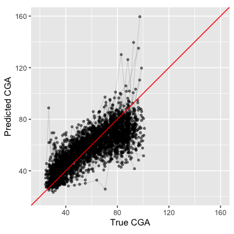
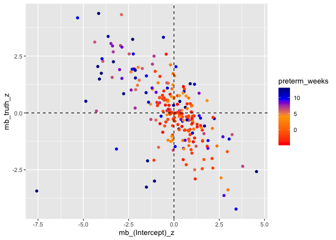
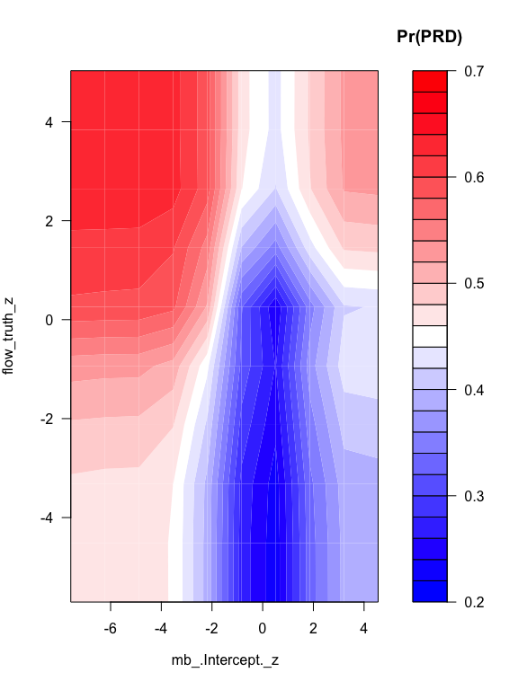
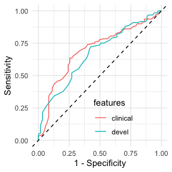

Developmental Indices
================
Andrew McDavid
04/24/2019

``` r
mangle_names = function(x){
    nx = names(x)
    names(x) = make.names(names(x))
    attr(x, 'original_names') = nx
    x
}

unmangle_names = function(x, y){
    if(missing(y)) y = x
    on =  attr(y, 'original_names')   
    if(is.null(on)){
        warning('No original names found')
        on = names(y)
    }
    names(x) = on
    x
}

scale_rows_unity = function(x) x/rowSums(x)

some_groups = function(x, group, size = 10){
    grquo = enquo(group)
    all_groups = x %>% group_by(!!grquo) %>% summarize(n())
    some = all_groups %>% sample_n(size)
    x %>% semi_join(some)
}

some_groupv = function(x, groups, size = 10){
    all_groups = x %>% group_by(!!!syms(groups)) %>% summarize(n())
    some = all_groups %>% sample_n(size)
    x %>% semi_join(some)
}
```

``` r
# Longitudinal record, join on Subject and `Sequence Num`.  DOL = day of life is not unique but sometimes used as a foreign key
timeline = read_csv('data/subject_timeline.csv')
# Subject-level covariates
subject = read_csv('data/subject_covariates.csv')
# T cell subpopulations
all_feats = read_csv('data/flow_metacluster_abundances.csv')

# Define GA birth timepoints
cohort_groups = c(12, 5, -2)
# And bin samples by timepoint midpoints
mid_points = c(-10, 1.5, 8.5, 20)

subject = mutate(subject,  cohort = cut(preterm_weeks, breaks = mid_points, labels = c('-2', "5", "12")))


mc_suffix = tibble(Family = c('TPHE4', 'TPHE8', 'ICS4', 'ICS8'), 
                   suffix = c('t4', 't8', 'i4', 'i8'))
# Descriptive names for T cell subpop
metacluster_rn = read_csv('intermediates/Metacluster Identities.csv') %>% select(-X5) %>% mutate(Family = Family %>% toupper(), Family = str_replace_all(Family, ' ', '')) %>% left_join(mc_suffix) %>% mutate(marker = str_c('Meta.Cluster_', Cluster, '_', suffix))
```

``` r
# IST posterior probs per subject/time point in long format
all_ist = read_csv('data/fitted_ist_longformat.csv') %>% rename(Subject = Alias)
```

# CGA predictions

``` r
all_feats = all_feats %>% left_join(timeline %>% select(Subject, cga, `Sequence Num`)) %>% mutate_if(is.character, as.factor) %>% mutate(cga = log2(cga))
all_feats_mgl = all_feats  %>% filter(`Sequence Num` < 100)  %>% select(-`Sequence Num`, -Subject) %>% mangle_names
```

``` r
write_csv(all_feats, path = 'intermediates/all_tcell_features.csv')

scale_cohort_color = function(...){
  scale_color_manual('Weeks premature', values = c('darkblue', 'purple', 'red'), ...)   
}
```

# GLMNET Tuning

``` r
tsk = makeRegrTask('flowsom', data = all_feats_mgl, target = 'cga', blocking = all_feats$Subject) %>% removeConstantFeatures(perc = .03, na.ignore = TRUE) %>% normalizeFeatures(on.constant = 'stop')

ppc_lrn = makeImputeWrapper(makeLearner('regr.glmnet', par.vals = list(standardize = FALSE)),  classes = list(numeric = imputeMean(), factor = imputeMode(), integer = imputeMean()))

lasso_ps = makeParamSet(
    makeNumericParam("lambda", lower = -3, upper = .5, trafo = function(x) 10^x),
    makeNumericParam("alpha", lower = 0, upper = 1)
)


tune_method = function(tsk_, odata, learn, ps, tune_maxit = 50){
    ctrl = makeTuneControlRandom(maxit = tune_maxit)
    res = tuneParams(learn, task = tsk_, resampling = cv5,
  par.set = lasso_ps, control = ctrl, measures = list(mse, setAggregation(mse, test.sd)))
    ggplot(generateHyperParsEffectData(res)$data, aes(x = s, y = alpha, color = mse.test.mean)) + geom_point() + scale_color_distiller(type = 'div')
    
    learn = setHyperPars(learn, par.vals = res$x)
    tt = train(learn, tsk_)

    # get coefficients from fitted model
    cv = crossval(learn, tsk_)
    
    oob_prob = cv$pred$data %>% arrange(id) %>% cbind(odata %>% select(Subject, `Sequence Num`)) %>% mutate(truth = 2^truth, response = 2^response)
    list(tuning = res, fitted = tt, cv_response = oob_prob)
}

get_lasso_coefs = function(tune_method_obj){
    coef(getLearnerModel(tune_method_obj$fitted)$learner.model, s = tune_method_obj$tuning$x$s)
}
```

``` r
flow_lasso = tune_method(tsk, all_feats, ppc_lrn, lasso_ps, tune_maxit = 50)
```

# Cross-validated predictions

## Lasso

``` r
plt = ggplot(flow_lasso$cv_response %>% select(truth, response, Subject, `Sequence Num`), aes(x = truth, y =response)) + geom_point(size = 1, aes(color = factor(`Sequence Num`))) + geom_line(aes(group = Subject), alpha = .4) + geom_abline(slope = 1, intercept = 0, color = 'red') + scale_color_discrete('Visit', labels = c('Cord', 'Discharge', '1 yr')) + coord_fixed()  + ylab('Predicted CGA') + xlab('True CGA')

plt + xlim(20, 45) + ylim(20, 75) 
```

<!-- -->

``` r
plt + xlim(80, NA) + ylim(50, NA)
```

<!-- -->

``` r
plt + xlim(20, 180) + ylim(20, 180) + theme(legend.position = c(.6, .3))
```

<!-- -->

``` r
# Prediction performance

flow_lasso$cv_response %>% group_by(`Sequence Num` < 19) %>% summarize(cor(truth, response))
```

    ## # A tibble: 2 x 2
    ##   `\`Sequence Num\` < 19` `cor(truth, response)`
    ##   <lgl>                                    <dbl>
    ## 1 FALSE                                    0.202
    ## 2 TRUE                                     0.527

``` r
flow_lasso$cv_response %>% summarize(cor(truth, response))
```

    ##   cor(truth, response)
    ## 1            0.8821763

Conditional predictive performances (cross validated). In short, very
good performance in separating one year from earlier samples, and still
some performance earlier on.

# Variable importance (Figure 2C)

``` r
mm = get_lasso_coefs(flow_lasso)

varimp = mm %>% as.matrix() %>% as.data.frame() %>% rownames_to_column('variable')

varimp = left_join(varimp %>% rename(marker = variable), metacluster_rn)%>% 
  mutate(marker = factor(marker) %>% fct_reorder(`s0`)) %>% filter( abs(`s0`)>0, marker != '(Intercept)')

ggplot(varimp, aes(y = marker, x = 2^`s0`)) + geom_point(aes(color = Category)) + xlab('Coefficient\n fold change \n per 1-SD') + theme(legend.position = 'none') + geom_text(aes(label = Identity, x = 2^`s0`+.001), size = 2, hjust = 0) + facet_grid(Category ~ ., scales = 'free_y', space = 'free_y') + geom_vline(xintercept = 1, lty = 2) + scale_y_discrete(labels = NULL, breaks = NULL) 
```

<!-- -->

# Developmental microbiome

``` r
library(zoo)

rec_microbiome = read_csv('data/rec_table_L7_join.csv', guess_max = 4000)
nas_microbiome = read_csv('data/nas_table_L7_join.csv', guess_max = 4000)

dim(rec_microbiome)
```

    ## [1] 2674  492

``` r
dim(nas_microbiome)
```

    ## [1] 2162  476

-----

``` r
drop_cols = function(x, suffix){
    y = x %>% select(-`Specimen ID`, -`Sequence Num`, -cDOL, -Reads, -cga)
    torename = ! (names(y) %in% c('DOL', 'Subject'))
    names(y)[torename] = str_c(names(y)[torename], suffix)
    y
}

nas_rec_thr = full_join(rec_microbiome %>% drop_cols('.rec'), nas_microbiome %>% drop_cols('.nas'), by = c('Subject', 'DOL'))

nas_rec_thr2 = nas_rec_thr %>% group_by(Subject) %>% arrange(DOL) %>% mutate_at(vars(starts_with('k__')), ~ na.locf(.x, na.rm = FALSE))
dim(nas_rec_thr)
```

    ## [1] 3032  956

``` r
dim(nas_rec_thr2)
```

    ## [1] 3032  956

# Microbiome subjects/samples

``` r
microbiome_samp_table = nas_rec_thr %>% transmute(rec = !is.na(`k__Bacteria;p__Actinobacteria;c__Actinobacteria;o__Actinomycetales;f__Actinomycetaceae;Other;Other.rec`), nas = !is.na(`k__Bacteria;p__Actinobacteria;c__Thermoleophilia;o__Solirubrobacterales;f__;g__;s__.nas`), Subject, both_nas_rec = rec & nas)

knitr::kable(microbiome_samp_table %>% group_by(both_nas_rec) %>% summarize(samples = n()))
```

| both\_nas\_rec | samples |
| :------------- | ------: |
| FALSE          |    1124 |
| TRUE           |    1908 |

``` r
mb_subj = microbiome_samp_table %>% group_by(Subject) %>% summarize(nas_samples = sum(nas), rec_samples = sum(rec)) %>% mutate(nas_six = nas_samples > 6, rec_six = rec_samples > 6, both_six = nas_six & rec_six)

mb_subj %>% group_by(both_six) %>% summarize(n())
```

    ## # A tibble: 2 x 2
    ##   both_six `n()`
    ##   <lgl>    <int>
    ## 1 FALSE       89
    ## 2 TRUE       148

``` r
interesting = nas_rec_thr2 %>% ungroup() %>% select(starts_with('k__')) %>% as.matrix() %>% colSums(., na.rm = TRUE) %>% sort(decreasing = TRUE)

plot_taxa = c(names(interesting)[1:9], "k__Bacteria;p__Firmicutes;c__Bacilli;o__Lactobacillales;f__Aerococcaceae;g__Alloiococcus;s__.nas")


 foo = nas_rec_thr2 %>% select(plot_taxa, DOL) %>% gather(key = 'k', value = 'v', starts_with('k__'))
 
 ggplot(some_groups(foo, Subject, size = 20), aes( x = DOL, y = v, group = Subject)) + geom_line() + facet_wrap(~k)
```

<!-- -->

-----

## Alloiococcus, in particular

``` r
alloiococcus = filter(foo, k == "k__Bacteria;p__Firmicutes;c__Bacilli;o__Lactobacillales;f__Aerococcaceae;g__Alloiococcus;s__.nas") %>% inner_join(inutero_exposure, by = 'Subject') %>% group_by(TPHE_5) %>% some_groups(Subject, 40)

traj_plot = ggplot(alloiococcus, aes( x = DOL, y = v, group = Subject)) + geom_line(alpha = .3) + facet_wrap(~TPHE_5, labeller = label_both)

traj_plot + ylab("Alloiococcus")

morexella = filter(foo, k == "k__Bacteria;p__Proteobacteria;c__Gammaproteobacteria;o__Pseudomonadales;f__Moraxellaceae;g__Moraxella;s__.nas") %>% inner_join(inutero_exposure, by = 'Subject') %>% group_by(TPHE_5) %>% some_groups(Subject, 40)

traj_plot %+% morexella + ylab("Moraxella")
```

-----

``` r
#timeline uniquely keyed by Subject and DOL
timeline_one = timeline %>% arrange(Subject, DOL, `Sequence Num`)
timeline_one = timeline_one[!duplicated(timeline_one[c('Subject', 'DOL')]),]

all_mb = nas_rec_thr2 %>% ungroup() %>% left_join(timeline_one %>% select(Subject, DOL, cga, `Sequence Num`)) %>% mutate(cga = log2(cga)) 

mads = all_mb %>% ungroup() %>% summarize_if(is.numeric, ~ mad(., na.rm = TRUE)) %>% gather(variable, mad, 1:ncol(.))

all_mb_mgl = all_mb %>% select(-Subject, -DOL, -`Sequence Num`) %>% mangle_names
```

``` r
write_csv(all_mb, path = 'intermediates/microbiome_joined.csv')
```

``` r
mb_tsk = makeRegrTask('mb', data = all_mb_mgl, target = 'cga', blocking = factor(nas_rec_thr2$Subject)) %>% removeConstantFeatures(perc = .03, na.ignore = TRUE) %>% normalizeFeatures(on.constant = 'stop')

mb_lasso = tune_method(mb_tsk, all_mb, ppc_lrn, lasso_ps, tune_maxit = 50)
```

``` r
mm = get_lasso_coefs(mb_lasso)

varimp = mm %>% as.matrix() %>% as.data.frame() %>% rownames_to_column('variable') %>% mutate(variable = str_replace(variable, 'k__.*?(?=f__)', '')) %>% mutate(variable = factor(variable) %>% fct_reorder(`s0`)) %>% filter( abs(`s0`)>0, variable != '(Intercept)') %>% mutate(rank = rank(-abs(s0)))

ggplot(filter(varimp, rank < 40), aes(y = variable, x = 2^`s0`, color = str_extract(variable, 'nas|rec'))) + geom_point() + xlab('Coefficient\n fold change \n per 1-SD') + theme(axis.text.y = element_text(size = 10), legend.position = 'none')
```

<!-- -->

``` r
# Prediction performance

mb_lasso$cv_response %>% group_by(cut(log2(truth), 4)) %>% summarize(cor(truth, response))
```

    ## # A tibble: 4 x 2
    ##   `cut(log2(truth), 4)` `cor(truth, response)`
    ##   <fct>                                  <dbl>
    ## 1 (4.6,5.12]                             0.115
    ## 2 (5.12,5.63]                            0.504
    ## 3 (5.63,6.14]                            0.382
    ## 4 (6.14,6.66]                            0.210

``` r
mb_lasso$cv_response %>% summarize(cor(truth, response))
```

    ##   cor(truth, response)
    ## 1            0.8101702

# Cross validated fitted vs truth

## Lasso

``` r
plt = ggplot(mb_lasso$cv_response %>% select(truth, response, Subject), aes(x = truth, y =response)) + geom_point(size = 1, alpha = .5) + geom_line(aes(group = Subject), alpha = .1) + geom_abline(slope = 1, intercept = 0, color = 'red')  + ylab('Predicted CGA') + xlab('True CGA')
plt + coord_fixed(xlim = c(20, 160), ylim = c(20, 160))
```

<!-- -->

``` r
plt + coord_fixed(xlim = c(20, 50))
```

<!-- -->

``` r
plt + coord_fixed(xlim = c(50, 100))
```

<!-- -->

# Residuals by Participant

``` r
resid_tests = mb_lasso$cv_response %>% group_by(Subject) %>% filter(n() > 3) %>% do(tidy(t.test(log2(.$truth), log2(.$response), paired = TRUE))) %>% ungroup() %>% mutate(fdr = p.adjust(p.value, method = 'fdr')) %>% left_join(subject)

ggplot(resid_tests, aes(y = -log10(fdr), x = estimate, color = preterm_weeks )) + geom_point() + scale_color_distiller(type = 'div')
```

<!-- -->

``` r
oob_prob_test = right_join(resid_tests, mb_lasso$cv_response) %>% mutate(pid = factor(Subject) %>% fct_reorder(statistic))

ggplot(oob_prob_test, aes( x = pid, y = truth - response)) + geom_boxplot(aes(color = cut(fdr, breaks = c(0,  .05, .1, 1)))) + geom_hline(yintercept = 0, lty = 2) + scale_color_discrete('FDR q') + scale_x_discrete('Participants', labels = NULL, breaks = NULL)
```

<!-- -->

# Deficits and atypical development (Figure 6A)

``` r
scale_my_gradient = function(...){
    scale_color_gradient2(..., low = scales::muted('blue'), mid = 'white', high = scales::muted('red'))
}

scale_fill_my_gradient = function(...){
     scale_fill_gradient2(..., low = scales::muted('blue'), mid = 'white', high = scales::muted('red'))
}

scale_gab_gradient = function(...){
    scale_color_gradientn(colors =  c('red', 'orange', 'blue', 'darkblue'), values = c(0, .5, .8, 1), ...)
}

calc_residual_stats = function(cv_response){
    lmer_mod = lmer( response ~ truth + ( truth | Subject), data =  cv_response %>% mutate(truth = log2(truth/37), response = log2(response/37)))
    tmod = tidy(lmer_mod, effects = 'ran_modes')
    tmed = tmod %>% group_by(term) %>% summarize(cohort_med = median(estimate))
    tmod %>% left_join(tmed) %>% group_by(term) %>% mutate(z = (estimate - cohort_med)/std.error, rank = rank(z))
}

flow_resid = calc_residual_stats(flow_lasso$cv_response) %>% mutate(assay = 'flow')
mb_resid = calc_residual_stats(mb_lasso$cv_response )%>% mutate(assay = 'mb')

develop_feats = bind_rows(flow_resid, mb_resid) %>% select(-std.error, -cohort_med, -group, Subject = level) %>% gather(key, value, estimate:rank) %>% ungroup() %>% mutate(key = str_c(assay, '_', term, '_', key)) %>% select(-term, -assay) %>% spread(key, value)


feat_plot = ggplot(flow_lasso$cv_response %>% left_join(develop_feats), aes(x = truth, y = response)) + geom_point() + geom_line(aes(group = Subject), alpha = .4) + coord_fixed() + ylab('Predicted CGA') + xlab('True CGA')

flow_feat_plot = feat_plot + xlim(20, 160) + ylim(20, 160) + theme(legend.position = c(.1, .8))

flow_feat_plot + aes(color = `flow_(Intercept)_z`) + scale_my_gradient('Immuno\nintercept')
```

<!-- -->

``` r
flow_feat_plot + aes(color = `flow_truth_z`) + scale_my_gradient('Immuno\nslope')
```

<!-- -->

``` r
mb_feat_plot = feat_plot + xlim(20, 120) + ylim(20, 120) + theme(legend.position = c(.1, .8))

mb_feat_plot %+% (mb_lasso$cv_response %>% left_join(develop_feats))  + aes(color = `mb_(Intercept)_z`) + scale_my_gradient('MB\nintercept')
```

<!-- -->

``` r
mb_feat_plot %+% (mb_lasso$cv_response %>% left_join(develop_feats))  + aes(color = `mb_truth_z`) + scale_my_gradient('MB\nslope')
```

<!-- -->

The statistics I got from the random effects model seem to capture the
qualitative behavior pretty
well.

``` r
write_csv(develop_feats, path = file.path('intermediates', 'di_results', 'development_index.csv'))
```

Write out development
index

-----

``` r
quad_plot = ggplot(develop_feats %>% left_join(subject), aes(x = `mb_(Intercept)_z`, y =  `mb_truth_z`)) + geom_point() + geom_hline(yintercept = 0, lty = 2) + geom_vline(xintercept = 0, lty = 2)

quad_plot + aes(color = preterm_weeks)  + scale_gab_gradient()
```

<!-- -->

``` r
quad_plot +  aes(x = `flow_(Intercept)_z`, y =  `flow_truth_z`) + aes(color = preterm_weeks)  + scale_gab_gradient()
```

<!-- -->

``` r
quad_plot+  aes(x = `flow_(Intercept)_z`, y =  `flow_truth_z`) 
```

<!-- -->

``` r
develop_feats = develop_feats %>% select(Subject, ends_with('_z'))    
```

# CST

``` r
nas_cst = read_csv('intermediates/dmn/nas_mix_weights.csv') %>% rename('Specimen ID' = X1)
names(nas_cst)[-1] = sprintf('oNAS_%d', seq_len(ncol(nas_cst) - 1))
nas_cst2  = inner_join(nas_cst, cw)

rec_cst = read_csv('rawdata/mi2_rec_mix_weights.csv') %>% rename('Specimen ID' = X1)
names(rec_cst)[-1] = sprintf('oREC_%d', seq_len(ncol(rec_cst) - 1))
rec_cst2 = inner_join(rec_cst, cw)

discharge_dol = filter(timeline, `Sequence Num` == 7) %>% transmute(Subject, dol_discharge = `Visit DOL (BLIS Calculated)`)

filtering = function(tbl){
    tbl2 = tbl %>% left_join(discharge_dol) %>% mutate(was_discharged = DOL > dol_discharge) %>% group_by(Subject, was_discharged) %>% summarize(nobs = n(), range = max(DOL) - min(DOL)) %>% ungroup()
    
    bad = filter(tbl2, !was_discharged, range >= 30, range/nobs > 30)
    bad2 = filter(tbl2, was_discharged, nobs < 6)
    dplyr::union(bad %>% select(Subject), bad2 %>% select(Subject))
}

bad_nas = filtering(nas_cst2)
bad_rec = filtering(rec_cst2)
```

``` r
dim(rec_cst)
dim(rec_cst2)
```

``` r
dim(nas_cst)
dim(nas_cst2)
```

We lose ~20 observations whose Specimen ID doesn’t map.

``` r
drop_cols2 = . %>% select(-Reads, -`Specimen ID`, -`Sequence Num`)


nas_rec_cst2 = full_join(nas_cst2 %>% drop_cols2, rec_cst2 %>% drop_cols2, by = c('Subject', 'DOL')) %>% mutate(cga = pmin(cga.x, cga.y, na.rm = TRUE)) %>% select(-cga.x, -cga.y)

nobs = nas_rec_cst2 %>% group_by(Subject) %>% summarize(nobs = n())
nobs_cst2 = left_join(nas_rec_cst2, nobs) %>% mutate(pidf = fct_reorder(factor( Subject), nobs), site = case_when(is.na(oNAS_1) ~ 'REC',  is.na(oREC_1) ~ 'NAS', !is.na(oNAS_1) & !is.na(oREC_1) ~ 'BOTH', TRUE ~ NA_character_))
```

``` r
ggplot(anti_join(nobs_cst2, dplyr::union(bad_nas, bad_rec)), aes(y = pidf, x = cga, color = site)) + geom_point() + ggtitle("Good samples")  + ylab('') + theme(axis.text.y = element_text(size = 6))
```

Samples we’ll
keep

``` r
ggplot(semi_join(nobs_cst2, dplyr::union(bad_nas, bad_rec)), aes(y = pidf, x = cga, color = site)) + geom_point() + ggtitle("Bad samples") + ylab('') + theme(axis.text.y = element_text(size = 6))
```

Sample’s we’ll drop. Note that 540059 was discharged at 223 days of
life, so that’s why they are
dropped.

``` r
nas_rec_cst_mean = nas_rec_cst2 %>% group_by(Subject) %>% summarize_at(vars(starts_with('o')), mean, na.rm = TRUE)


nas_rec_cga = (nas_rec_cst2 %>% select(starts_with('o'))) * (nas_rec_cst2$cga - 37)
names(nas_rec_cga) = str_c(names(nas_rec_cga), ':cga')
nas_rec_cga = cbind(nas_rec_cga, 'Subject' = nas_rec_cst2$Subject)  %>% group_by(Subject) %>% summarize_at(vars(starts_with('o')), mean, na.rm = TRUE)

nas_rec_cga_cst = full_join(nas_rec_cst_mean, nas_rec_cga)


ist_wide = all_ist %>% reshape2::dcast(Subject ~ IST + `Sequence Num`)

flow_feats_wide = all_feats %>% gather('param', 'value', starts_with('Meta.')) %>% reshape2::dcast(Subject ~ param + `Sequence Num`)

nan_to_na = function(x){
    x[!is.finite(x)] = NA_real_
    x
}

flow_cst_feats = full_join(nas_rec_cga_cst, flow_feats_wide, by = 'Subject') %>% full_join(ist_wide) %>% mutate_if(is.numeric, nan_to_na)
```

# Illness prediction

``` r
covariates = subject %>% select(Subject, auc14,  `Birth Season`, Gender, Race, preterm_weeks, birth_wt_gms, PRD) %>% mutate_if(is_character, as.factor) %>% mutate(Subject = as.character(Subject)) %>% as_tibble() 


targets_etc = covariates %>% left_join(develop_feats)%>% mutate(PRD = factor(PRD, levels = c('No', 'Yes')))
```

# Fit illness

``` r
rf_ps = makeParamSet(makeIntegerParam('mtry', lower = 2, upper = 50),
                     makeIntegerParam('nodesize', lower = 4, upper = 20),
                     makeIntegerParam('ntree', lower = 2000, upper = 3000))

tune_method = function(tsk_, odata, learn, ps, tune_maxit = 50, hyper_params, resample_instance, inv_trans = function(x) x ){
     measures = if(tsk_$type == 'regr') list(mse, rsq, setAggregation(mse, test.sd)) else list(logloss, auc)
    if(tune_maxit > 1){
        ctrl = makeTuneControlRandom(maxit = tune_maxit)
        res = tuneParams(learn, task = tsk_, resampling = cv5,
  par.set = ps, control = ctrl, measures = measures)
    }  else {
        res = hyper_params
    }
    
    learn = setHyperPars(learn, par.vals = res$x)
    tt = train(learn, tsk_)

    # get coefficients from fitted model
    if(missing(resample_instance)){
        resample_instance = makeResampleInstance(makeResampleDesc('CV', iters = 20, stratify = tsk_$type != 'regr'), tsk_)
    }
    cv = resample(learn, tsk_, resample_instance, measures = measures)
    
    oob_prob = cv$pred$data %>% arrange(id) %>% cbind(odata %>% select(Subject)) %>% mutate(truth = inv_trans(truth), response = inv_trans(response))
    list(tuning = res, fitted = tt, cv_response = oob_prob, cv = cv, resample_instance = resample_instance)
}
```

``` r
response_feats = expand.grid(response = 'PRD',
                             features = c('clinical', 'devel'),
                             alone = FALSE, stringsAsFactors = FALSE) %>%
    as_tibble()

#' Train learner on subsets of possibly permuted data, possibly also tuning
#'
#' @param response character naming a response from `illness` table
#' @param features character naming other tables containing variables that should be permuted (or dropped if is 'clinical')
#' @param alone should the features be used alone?
#' @param tuning an existing MLR `Tune result`
#' @param tune_maxit integer, number of random tuning points to explore
#' @param resample_instance an existing MLR `ResampleInstance` to be used for blocking
#'
#' @return list from `tune_method`
trainit = function(response, features, alone = FALSE, tuning, tune_maxit = 50, resample_instance, just_return_task = FALSE, targets_etc_ = targets_etc, response_etc_exclude = c('PRD', 'Subject')){
       targets_etc_clean = targets_etc_[,setdiff(names(targets_etc_), response_etc_exclude)] %>% cbind(targets_etc_[,response, drop = FALSE])
       response_vec = targets_etc_[,response, drop = TRUE]
       targets_etc_clean = targets_etc_clean[!is.na(response_vec),]
       targets_etc_ = targets_etc_[!is.na(response_vec),]
       permutable = c('flow_feats_wide')
       if(alone){
           tbl_id = switch(features, devel = 'develop_feats', `T immune` = 'ist_wide', microbiome = 'nas_rec_cga_cst', clinical = 'covariates')
           keep = names(get(tbl_id))
           keep = intersect(union(keep, response), names(targets_etc_clean))
            targets_etc_clean = targets_etc_clean[,keep, drop = FALSE]    
       } else {
       if(features == 'devel') permutable = c(permutable, 'ist_wide', 'nas_rec_cga_cst')
       if(features == 'T immune') permutable = c(permutable, 'ist_wide')
       if(features == 'clinical') permutable = c(permutable, 'develop_feats', 'ist_wide', 'nas_rec_cga_cst')
       for(tbl_id in permutable){
           # scramble = sample(1:nrow(targets_etc_clean))
           tbl_names = intersect(setdiff(names(get(tbl_id)), 'Subject'), names(targets_etc_clean))
           # if(features %in% c('flow_feats', 'all')) {
           #  targets_etc_clean[,tbl_names] =  targets_etc_clean[scramble,tbl_names]
           # } else{
            targets_etc_clean = targets_etc_clean[,setdiff(names(targets_etc_clean), tbl_names), drop = FALSE]    
          # }
       }
      }
       if(response == 'PRD'){
           tsk = makeClassifTask('illness', data = targets_etc_clean %>% mangle_names(), target = response) %>% removeConstantFeatures(perc = .03, na.ignore = TRUE)
           rf_lrn = makeLearner("classif.randomForestSRC", predict.type = 'prob')
       } else{
        tsk = makeRegrTask('illness', data = targets_etc_clean %>% mangle_names(), target = response) %>% removeConstantFeatures(perc = .03, na.ignore = TRUE)
        rf_lrn = makeLearner("regr.randomForestSRC")
       }
       
       if(just_return_task) return(tsk)
       
       if(!missing(tuning)){
            results = tune_method(tsk, targets_etc_, rf_lrn, ps = rf_ps, hyper_params = tuning, tune_maxit = 1, resample_instance = resample_instance)
       } else{
            results = tune_method(tsk, targets_etc_, rf_lrn, ps = rf_ps, tune_maxit = tune_maxit, resample_instance = resample_instance)
      }
      results
}

prd_tune_rds = file.path('intermediates', 'di_results', 'rf_prd.rds')


library(parallelMap)
parallelStartSocket(4)
TUNE_MAXIT = 50
```

1.  Loop over responses
2.  Loop over feature sets and tune model
3.  Get CV’d
accuracy

-----

``` r
prd_tunings = tibble(response = 'PRD', features = c('clinical', 'devel'), alone = TRUE) #%>% left_join(full %>% select(response, resample_instance))  %>% rowwise()

# Just run twice to get the resampling instance so that the folds are fixed for comparison down the line
base_prd = filter(prd_tunings, features == 'clinical') %>% mutate(results = list(trainit(response, features, alone, tune_maxit = 2)))


prd_tunings = prd_tunings %>% mutate(resample_instance = list(base_prd$results[[1]]$resample_instance))
                                         
prd_tunings = prd_tunings %>% rowwise() %>% mutate(results = list(trainit(response, features, alone, resample_instance = resample_instance, tune_maxit = TUNE_MAXIT)))

saveRDS(prd_tunings, prd_tune_rds)
```

# Figure 6b

``` r
prd_tunings = readRDS(prd_tune_rds)
all_illness = prd_tunings %>% ungroup() %>% mutate(cv_measures = map(.$results, c('cv', 'measures.test')))

all_cv = all_illness %>% unnest(cv_measures)


metric_plot = ggplot(filter(all_cv, is.na(logloss)), aes(x = features, y = mse)) + stat_summary(geom = 'crossbar', color = 'blue', width = .5, fill = 'grey80') + facet_wrap(~response, scales = 'free_y') + theme(axis.text.x = element_text(angle = 90))

#metric_plot + geom_hline(data = targets_var, mapping = aes(yintercept = var), lty = 2)  + geom_line(aes(group = iter))
```

Mean squared error. Each point show the MSE in a cross-validated fold,
which is connected to its performance in the competing models. We could
compared across models with a paired t-test, for
instance.

``` r
metric_plot %+% filter(all_cv, !is.na(logloss), alone, features %in% c('clinical', 'devel')) + aes(y = auc) + geom_hline(yintercept = .5, lty = 2)
```

<!-- -->

``` r
metric_plot %+% filter(all_cv, !is.na(logloss), alone) + aes(y = auc) + geom_hline(yintercept = .5, lty = 2)   + geom_line(aes(group = iter))
```

<!-- -->

``` r
metric_plot %+% filter(all_cv, !is.na(logloss), alone) + aes(y = logloss) + geom_line(aes(group = iter))
```

<!-- -->

Fits with each feature set used
“alone”

``` r
compare_auc_prd = lmer(auc ~ features + (1 | iter), data = filter(all_cv, !is.na(logloss), alone))

tidy(compare_auc_prd, conf.int = TRUE, effects = 'fixed') %>% mutate_at(vars(-term), .funs= ~ round(.x, 2)) %>% knitr::kable()
```

| term          | estimate | std.error | statistic | conf.low | conf.high |
| :------------ | -------: | --------: | --------: | -------: | --------: |
| (Intercept)   |     0.71 |      0.04 |     16.34 |     0.63 |      0.80 |
| featuresdevel |   \-0.05 |      0.04 |    \-1.20 |   \-0.14 |      0.03 |

# Variable importance (Figure S6)

``` r
vimp = filter(all_illness, response == 'PRD', alone)  %>% rowwise() %>% do({
    features = .$features[1]
  .$results  %>% .$fitted %>% getFeatureImportance()  %>% .$res %>% gather(variable, varimp) %>% mutate(features = features)
    })


varimp = vimp %>% mutate(variable = factor(variable) %>% fct_reorder(varimp))

ggplot(filter(varimp, features %in% c('clinical', 'devel')), aes(y = variable, x = varimp)) + geom_point() + theme(axis.text.y = element_text(size = 6)) + facet_wrap(~features, scales = 'free_y')
```

<!-- -->

Compare null to baseline to MB to flow to both.

# PRD / base partial effects

``` r
parallelMap::parallelStop()
fit.classif = filter(all_illness, response == 'PRD', alone, features == 'clinical') %>% pull(results) %>% .[[1]] %>% .$fitted

prd.task = trainit('PRD', 'clinical', alone = TRUE, just_return_task = TRUE)

pd = generatePartialDependenceData(fit.classif, prd.task, c("auc14", 'birth_wt_gms'), interaction = TRUE)

pd_dat = pd$data %>% mutate(`Pr(PRD)` = 1 - No)

feat_plot = function(data, x_var, color_var){
    x_var = enquo(x_var)
    color_var = enquo(color_var)
    color_quan = data %>% pull(!!color_var) %>% quantile(c(.1, .5, .9))
    EPS = (color_quan[3] - color_quan[1])/11
    
    #data = filter(data, abs(!!color_var - color_quan[1]) < EPS | abs(!!color_var - color_quan[2]) < EPS | abs(!!color_var - color_quan[3]) < EPS)
    
    ggplot(data, aes(x = !!x_var, color = !!color_var, group = !!color_var, y = `Pr(PRD)`))  + geom_line() + scale_my_gradient(midpoint = color_quan[2]*1.1) + theme(legend.position = 'bottom')
    
}

contour_plot = function(data, x_var, y_var){
    x_var = enquo(x_var)
    y_var = enquo(y_var)
    ggplot(data, aes(x = !!x_var, y = !!y_var, z = `Pr(PRD)`)) + stat_contour(geom="polygon", aes(fill=..level..), binwidth = .2) + scale_fill_my_gradient(midpoint = .4)   
}

filled_contour_plot = function(data, x_var, y_var){
     x_var = enquo(x_var)
     y_var = enquo(y_var)
     dmat = select(data, !!x_var, !!y_var, `Pr(PRD)`) %>% spread(key = !!x_var, value = `Pr(PRD)`)
       z = pmin(pmax(as.matrix(dmat[,-1]), .2), .7)
       x = dmat[,1]
       y = as.numeric(colnames(z))
       filled.contour(x = x, y = y, z = z, zlim = c(.2, .7), color.palette = gplots::bluered, xlab = y_var, ylab = x_var, key.title = title(main = 'Pr(PRD)'))
       recordPlot()
}
#feat_plot = ggplot(pd_dat, aes(x = birth_weight, y = `Pr(PRD)`, color = auc14, group = auc14)) + geom_line() + scale_my_gradient() + theme(legend.position = 'bottom')

zscore_trans = scales::trans_new('zscore', function(x) scale(x), function(y) y*attr(y, "scaled:scale") + attr(y, "scaled:center"))

plt1 = feat_plot(pd_dat, birth_wt_gms, auc14)
ctr1 = filled_contour_plot(pd_dat, birth_wt_gms, auc14)
```

<!-- -->

AUC14 / Birth weight
(gms)

``` r
pd = generatePartialDependenceData(fit.classif, prd.task, c("auc14", 'preterm_weeks'), interaction = TRUE)

pd_dat = pd$data %>% mutate(`Pr(PRD)` = 1 - No)

plt2 = feat_plot(pd_dat, preterm_weeks, auc14)
ctr2 = filled_contour_plot(pd_dat, preterm_weeks, auc14)
```

<!-- -->

``` r
ctr1
```

<!-- -->

``` r
ctr2
```

<!-- -->

AUC14 /
gaBirth

# PRD / Devel partial effects

``` r
fit.classif = filter(all_illness, response == 'PRD', alone, features == 'devel') %>% pull(results) %>% .[[1]] %>% .$fitted

prd.task = trainit('PRD', 'devel', alone = TRUE, just_return_task = TRUE)

pd = generatePartialDependenceData(fit.classif, prd.task, c("mb_truth_z", 'mb_.Intercept._z'), interaction = TRUE)

pd_dat = pd$data %>% mutate(`Pr(PRD)` = 1 - No)

plt1 = feat_plot(pd_dat, mb_.Intercept._z, mb_truth_z)

ctr1 = filled_contour_plot(pd_dat, mb_.Intercept._z, mb_truth_z)
```

<!-- -->

MB slope /
Intercept

``` r
pd = generatePartialDependenceData(fit.classif, prd.task, c("flow_truth_z", 'flow_.Intercept._z'), interaction = TRUE)

pd_dat = pd$data %>% mutate(`Pr(PRD)` = 1 - No)

plt2 = feat_plot(pd_dat,  flow_.Intercept._z, flow_truth_z)
ctr2 = filled_contour_plot(pd_dat,  flow_.Intercept._z, flow_truth_z)
```

<!-- -->

``` r
ctr1
```

<!-- -->

``` r
ctr2
```

<!-- -->

Flow slope /
intercept

``` r
pd = generatePartialDependenceData(fit.classif, prd.task, c("mb_truth_z", 'flow_truth_z'), interaction = TRUE)

pd_dat = pd$data %>% mutate(`Pr(PRD)` = 1 - No)

plt1 = feat_plot(pd_dat, flow_truth_z, mb_truth_z)
ctr1 = filled_contour_plot(pd_dat, flow_truth_z, mb_truth_z)
```

<!-- -->

Flow slope / mb
slope

## Figure 6c

``` r
pd = generatePartialDependenceData(fit.classif, prd.task, c("mb_.Intercept._z", 'flow_truth_z'), interaction = TRUE)

pd_dat = pd$data %>% mutate(`Pr(PRD)` = 1 - No)

plt2 = feat_plot(pd_dat, flow_truth_z, mb_.Intercept._z)
ctr2 = filled_contour_plot(pd_dat, flow_truth_z, mb_.Intercept._z)
```

<!-- -->

Flow slope / MB
intercept

``` r
pd = generatePartialDependenceData(fit.classif, prd.task, c("mb_.Intercept._z", 'flow_.Intercept._z'), interaction = TRUE)

pd_dat = pd$data %>% mutate(`Pr(PRD)` = 1 - No)

plt3 = feat_plot(pd_dat, flow_.Intercept._z, mb_.Intercept._z)
ctr3 = filled_contour_plot(pd_dat, flow_.Intercept._z, mb_.Intercept._z)
```

<!-- -->

Flow intercept / MB
intercept

``` r
pd = generatePartialDependenceData(fit.classif, prd.task, c("mb_truth_z", 'flow_.Intercept._z'), interaction = TRUE)

pd_dat = pd$data %>% mutate(`Pr(PRD)` = 1 - No)

plt4 = feat_plot(pd_dat, flow_.Intercept._z, mb_truth_z)
ctr4 = filled_contour_plot(pd_dat, flow_.Intercept._z, mb_truth_z)
```

<!-- -->

``` r
ctr1
```

<!-- -->

``` r
ctr3
```

<!-- -->

``` r
ctr2
```

<!-- -->

``` r
ctr4
```

<!-- -->

Flow intercept / MB slope

-----

## ROC

``` r
calc_roc = function(data, thres){
    tpr = with(data, mean((prob.Yes > thres)*(truth=='Yes'))/mean(truth == 'Yes'))
    fpr = with(data, mean((prob.Yes > thres)*(truth != 'Yes'))/mean(truth != 'Yes'))
    data_frame(thres = thres, tpr = tpr, fpr = fpr)
}

roc_all = prd_tunings %>% ungroup() %>% transmute(cv_response = map(.$results, 'cv_response'), response, features) %>% unnest() %>% group_by(response, features) %>% do({
    data = .
    map_dfr(seq(1, 0, by = -.01), ~ calc_roc(data, .x))
})

auc = roc_all %>% group_by(features) %>% summarize(auc = caTools::trapz(fpr, tpr))

ggplot(filter(roc_all, features %in% c('clinical', 'devel')), aes(x = fpr, y = tpr, color = features)) + geom_path() + geom_abline(slope = 1, intercept = 0, lty =2)
```

<!-- -->

``` r
knitr::kable(auc)
```

| features |       auc |
| :------- | --------: |
| clinical | 0.6191316 |
| devel    | 0.5894343 |

This is combining all of the cross-validated folds in calculating the
thresholds

``` r
roc_ish = prd_tunings %>% rowwise() %>% mutate(roc_ish = list(generateThreshVsPerfData(results[['cv']], measures = list(tpr, fpr), aggregate= FALSE)$data %>% group_by(threshold) %>% summarize(fpr = mean(fpr, na.rm = TRUE), tpr = mean(tpr, na.rm = TRUE))  )) # a hack to fix NAs in the fpr

ggplot(roc_ish %>% unnest(roc_ish), aes(x = fpr, y = tpr, color = features)) + geom_path() + geom_abline(slope = 1, intercept = 0, lty =2) + xlab("1 - Specificity") + ylab("Sensitivity") + theme_minimal() + theme(legend.pos = c(.6, .2))
```

<!-- -->

``` r
roc_ish %>% unnest(roc_ish) %>% group_by(features) %>% summarize(auc = caTools::trapz(fpr, tpr))
```

    ## # A tibble: 2 x 2
    ##   features    auc
    ##   <chr>     <dbl>
    ## 1 clinical -0.697
    ## 2 devel    -0.671

This is averaging the ROC curves
