Developmental Indices
================
Andrew McDavid
04/24/2019

``` r
mangle_names = function(x){
    nx = names(x)
    names(x) = make.names(names(x))
    attr(x, 'original_names') = nx
    x
}

unmangle_names = function(x, y){
    if(missing(y)) y = x
    on =  attr(y, 'original_names')   
    if(is.null(on)){
        warning('No original names found')
        on = names(y)
    }
    names(x) = on
    x
}

scale_rows_unity = function(x) x/rowSums(x)

some_groups = function(x, group, size = 10){
    grquo = enquo(group)
    all_groups = x %>% group_by(!!grquo) %>% summarize(n())
    some = all_groups %>% sample_n(size)
    x %>% semi_join(some)
}

some_groupv = function(x, groups, size = 10){
    all_groups = x %>% group_by(!!!syms(groups)) %>% summarize(n())
    some = all_groups %>% sample_n(size)
    x %>% semi_join(some)
}
```

``` r
# Longitudinal record, join on Subject and `Sequence Num`.  DOL = day of life is not unique but sometimes used as a foreign key
timeline = read_csv('data/subject_timeline.csv')
# Subject-level covariates
subject = read_csv('data/subject_covariates.csv')
# T cell subpopulations
all_feats = read_csv('data/flow_metacluster_abundances.csv')

# Define GA birth timepoints
cohort_groups = c(12, 5, -2)
# And bin samples by timepoint midpoints
mid_points = c(-10, 1.5, 8.5, 20)

subject = mutate(subject,  cohort = cut(preterm_weeks, breaks = mid_points, labels = c('-2', "5", "12")))


mc_suffix = tibble(Family = c('TPHE4', 'TPHE8', 'ICS4', 'ICS8'), 
                   suffix = c('t4', 't8', 'i4', 'i8'))
# Descriptive names for T cell subpop
metacluster_rn = read_csv('intermediates/Metacluster Identities.csv') %>% select(-X5) %>% mutate(Family = Family %>% toupper(), Family = str_replace_all(Family, ' ', '')) %>% left_join(mc_suffix) %>% mutate(marker = str_c('Meta.Cluster_', Cluster, '_', suffix))
```

``` r
# IST posterior probs per subject/time point in long format
all_ist = read_csv('data/fitted_ist_longformat.csv') %>% rename(Subject = Alias)
```

# CGA predictions

``` r
all_feats = all_feats %>% left_join(timeline %>% select(Subject, cga, `Sequence Num`)) %>% mutate_if(is.character, as.factor) %>% mutate(cga = log2(cga))
all_feats_mgl = all_feats  %>% filter(`Sequence Num` < 100)  %>% select(-`Sequence Num`, -Subject) %>% mangle_names
```

# ANOVA on some clusters

``` r
marker_interest = gather(all_feats, key = 'marker', value = 'proportion', starts_with('Meta.Cluster')) %>% left_join(subject) %>% 
    mutate(cga_term = 2^cga - 37, 
           log2_cga_term_ratio = cga-log2(37)) %>%
    left_join(metacluster_rn %>% mutate(Identity = ifelse(is.na(Identity), marker, Identity) %>% str_replace_all('(?<![,])[ ]+', '') %>% abbreviate(minlength = 59),
                                        Identitywrap = str_wrap(Identity, 30)))

scale_cohort_color = function(...){
  scale_color_manual('Weeks premature', values = c('darkblue', 'purple', 'red'), ...)   
}
```

# Linear/non-linear metaclusters

``` r
sin_sq = function(x) sin(x)^2
a_sqrt = function(x) asin(sqrt(x))

pred_values = expand.grid(preterm_weeks = cohort_groups, cga_term = seq(-12, 64, by = 4)) %>% filter(cga_term + preterm_weeks >= 0)

marker_nonlinear = marker_interest %>% group_by(marker, Identity, Category, Identitywrap) %>% do( output = 
    {
        model = lmer(a_sqrt(proportion) ~ (I( (cga_term<0)*cga_term ) + I( (cga_term>=0)*cga_term ))*preterm_weeks + (1|`Subject`), data = .)
        # Note I protects the indicator times cga_term, so these are not expanded.
        pre_contr = c(Intercept = 0, before = 1, after = 0, preterm = 0, prebefore = 10, preafter = 0)
        post_contr = c(Intercept = 0, before = 0, after = 1, preterm = 0, prebefore = 0, preafter = 10)
        pre10 = lht(model, pre_contr)[2,3]
        pre_est = fixef(model) %*% pre_contr
        post10 = lht(model, post_contr)[2,3]
        post_est = fixef(model) %*% post_contr
        diff_est = fixef(model) %*% (pre_contr - post_contr)
        diff10 = lht(model, pre_contr - post_contr)[2,3]
        monotone_tests = tibble(term = c('pre', 'post', 'diff'), estimate = c(pre_est, post_est, diff_est), p.value = c(pre10, post10, diff10))
        coefs = tidy(model, conf.int = TRUE)
        prediction = cbind(pred_values, .fitted = predict(model, newdata = pred_values, re.form = ~ 0 ))
        list(coefs = coefs, prediction = prediction, model = model, monotone_tests = monotone_tests)
             }) %>% rowwise() %>% mutate(model = list(output$model), coefs = list(output$coefs), prediction = list(output$prediction), monotone_tests = list(output$monotone_tests)) %>% select(-output)

nl_coefs = marker_nonlinear %>% unnest(coefs) %>% group_by(term) %>% mutate(p.value = pnorm(abs(statistic), lower.tail = FALSE)*2, p_adjust = p.adjust(p.value, method = 'bonferroni'))

nl_pred = marker_nonlinear %>% unnest(prediction)

traj_plot = ggplot(nl_pred %>% filter(marker == 'Meta.Cluster_10_i4'), aes(x = cga_term)) + geom_line(aes(color = factor(preterm_weeks), y = .fitted), lwd = 2) + scale_cohort_color() #+ geom_ribbon(aes(ymin = .fitted - .se.fit, ymax = .fitted + .se.fit), alpha = .3)
```

## Prematurity associated (Figure 2D)

``` r
preterm_markers = nl_coefs %>% filter(term == 'preterm_weeks', p_adjust < .05) %>% mutate(Identity = fct_reorder(factor(Identity), -estimate), rank = rank(p_adjust))

ggplot(preterm_markers, aes(x = Identity, y = -estimate, ymin = -conf.low, ymax = -conf.high)) + geom_pointrange(aes(color = Category)) + ylab('Change in population at 37 week PMA \n per week increase of gestational age at birth') + geom_hline(yintercept = 0, lty = 2)  + geom_text(aes(label = Identity, y = -estimate+.002), size = 2, hjust = 0) + theme(legend.position = 'none') +  coord_flip() + facet_grid(Category ~ ., scales = 'free_y', space = 'free_y') + scale_x_discrete(labels = NULL, breaks = NULL)
```

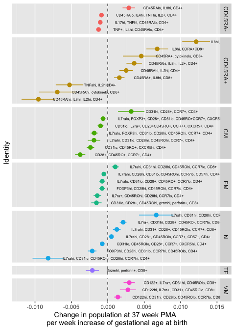<!-- -->

## Figure 2E

``` r
other_preterm_toplot = str_c('Meta.Cluster_', c('26_t4', '25_t4', '1_t8', '2_t8', '18_i4', '13_i4', '12_i8', '8_i8'))

traj_plot %+% (nl_pred %>% semi_join(filter(preterm_markers, rank < 6))) + facet_wrap(~Identitywrap, scales = 'free_y')  + geom_jitter(data = marker_interest %>% semi_join(filter(preterm_markers, rank < 6)), aes(y = a_sqrt(proportion), color = cohort), size = 1, alpha = .4) + theme(strip.text = element_text(size = 8))
```

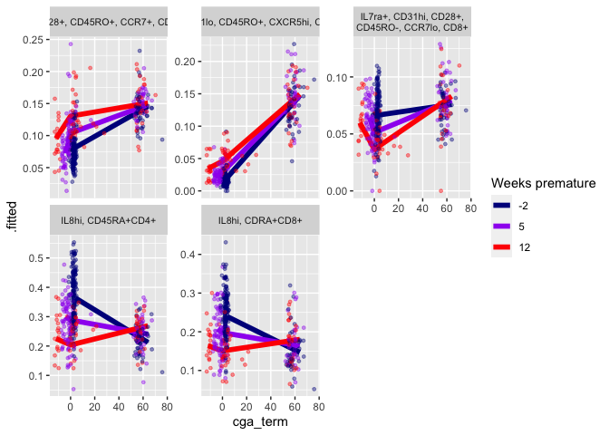<!-- -->

``` r
traj_plot %+% (nl_pred %>% semi_join(filter(preterm_markers, marker %in% other_preterm_toplot))) + facet_wrap(~Identitywrap, scales = 'free_y')  + geom_jitter(data = filter(marker_interest, marker %in% other_preterm_toplot), aes(y = a_sqrt(proportion), color = cohort), size = 1, alpha = .4) + theme(strip.text = element_text(size = 8))
```

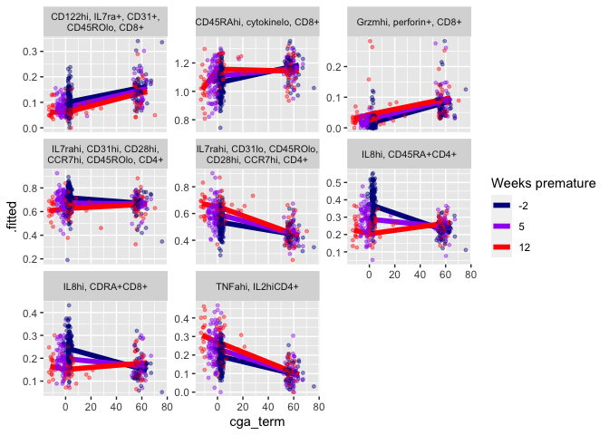<!-- -->

Trajectories for top 6 markers with GAB differences at 37 weeks PMA.

-----

## Non-monotone markers (Figure S1)

``` r
nl_monotone = unnest(marker_nonlinear, monotone_tests)
nonmono_candidates = nl_monotone %>% group_by(marker) %>% summarize(max_sig = max(p.value), n_sig = sum(p.value < .05))
nonmono_sign = nl_monotone %>% select(-p.value) %>% spread(term, estimate) %>% mutate(signchange = sign(post) != sign(pre))

nonmono_candidates = left_join(nonmono_candidates, nonmono_sign) %>% filter(signchange, n_sig ==3, p.adjust(max_sig/3, method = 'bonferroni')< .05) %>% mutate(rank = rank(max_sig)) %>% left_join(nl_monotone %>% select(-Identity:-Identitywrap), by = c('marker'))  %>% mutate(Identitywrap = fct_reorder(factor(Identitywrap), rank))

ggplot(nonmono_candidates  %>% filter(term != 'diff'), aes(x = Identitywrap, y = estimate, color = term)) + geom_point() + ylab('Trajectory difference at 37 week PMA for 25 week CGA') + geom_hline(yintercept = 0, lty = 2) +  coord_flip() 
```

<!-- -->

These markers have an inversion estimated for 25 week-GAB
babies.

``` r
traj_plot %+% (nl_pred %>% semi_join(filter(nonmono_candidates, rank < Inf))) + facet_wrap(~Identitywrap, scales = 'free_y')+ geom_jitter(data = marker_interest %>% semi_join(filter(nonmono_candidates, rank < Inf)), aes(y = a_sqrt(proportion), color = cohort), size = 1, alpha = .4) + theme(strip.text = element_text(size = 5))  + aes(x = cga_term + 37) + xlab("PMA (weeks)") + ylab("asin(sqrt(p))")
```

<!-- -->

Estimated trajectories and observed data for top 6 non-monotone
markers.

``` r
fig5_marker_toplot = tibble(marker = c('Meta.Cluster_13_i4', 'Meta.Cluster_18_i4', 'Meta.Cluster_8_i8', 'Meta.Cluster_12_i8',
                                  'Meta.Cluster_26_t4', 'Meta.Cluster_25_t4', 'Meta.Cluster_1_t8', 'Meta.Cluster_2_t8'))

strReverse = function(x) sapply(lapply(strsplit(x, NULL), rev), paste, 
collapse="")

#nl_fig5 = semi_join(nl_pred, fig5_marker_toplot) %>% mutate(Identity = factor(Identity, levels = sort(unique(strReverse(marker)))))

(traj_plot %+% semi_join(nl_pred, fig5_marker_toplot)) + facet_wrap(~Identitywrap, scales = 'free', nrow = 2)+ geom_jitter(data = semi_join(marker_interest, fig5_marker_toplot), aes(y = a_sqrt(proportion), color = cohort), size = 1, alpha = .4) + theme(strip.text = element_text(size = 5))  + aes(x = cga_term + 37) + xlab("PMA (weeks)") + ylab("asin(sqrt(p))")
```

<!-- -->

# Immune samples/timepoints

``` r
flow_subj_counts = all_feats %>% select(Subject, `Sequence Num`, tphe = Meta.Cluster_11_t8, ics=Meta.Cluster_11_i8) %>% mutate(both_tphe_ics = !is.na(ics) & !is.na(tphe))

knitr::kable(flow_subj_counts %>% group_by(`Sequence Num`, both_tphe_ics) %>% summarize(n()))
```

| Sequence Num | both\_tphe\_ics | n() |
| -----------: | :-------------- | --: |
|            1 | FALSE           |  12 |
|            1 | TRUE            | 141 |
|            7 | FALSE           |  18 |
|            7 | TRUE            | 150 |
|           19 | FALSE           |  18 |
|           19 | TRUE            |  94 |

# IST proportions

``` r
all_ist_cat = all_ist %>% group_by(Subject, `Sequence Num`, assay) %>% summarize(IST_prob = max(value), IST_modal = IST[which.max(value)])

all_ist_cat = left_join(all_ist_cat, subject, by = "Subject") %>% mutate(type = assay) %>% group_by(type, cohort) %>% mutate(total_obs = length(type))

tests_by_ist = map_dfr(unique(all_ist_cat$IST_modal), ~ {
    type = str_extract(.x, 'ICS|TPHE')
    dat = filter(all_ist_cat, type == type)
    model = glm(IST_modal ==  .x ~ preterm_weeks, family = 'binomial', data = dat)
    tidy(model, conf.int = TRUE) %>% mutate(ist = .x)
})

tests_by_ist = tests_by_ist %>% group_by(term) %>% mutate(p_adjust = p.adjust(p.value, method = 'bonferroni'))

ggplot(filter(tests_by_ist, term == 'preterm_weeks'), aes(x = ist, y = estimate, ymin = conf.low, ymax = conf.high, shape = p_adjust < .05)) + geom_pointrange() + ylab('Change in log odds per week pre-term') + geom_hline(yintercept = 0, lty = 2) +  coord_flip() + scale_shape_discrete('Bonferroni p < .05')
```

<!-- -->

# TPHE5 association (Figure S2)

``` r
library(mgcv)
ist_ever = filter(all_ist_cat, `Sequence Num` %in% c(1,7, 19))  %>% group_by(`Subject`) %>% 
  summarize(TPHE_6  = any(IST_modal == 'TPHE_6'),
            TPHE_5  = any(IST_modal == 'TPHE_5'),
            ICS_5 = any(IST_modal == 'ICS_5'),
            ICS_6 = any(IST_modal == 'ICS_6'),
            ICS_7 = any(IST_modal == 'ICS_7'))

ist_early = filter(all_ist_cat, `Sequence Num` < 19)  %>% group_by(`Subject`) %>% 
  summarize(TPHE_6_early  = any(IST_modal == 'TPHE_6'),
            TPHE_5_early  = any(IST_modal == 'TPHE_5'),
            ICS_5_early = any(IST_modal == 'ICS_5'),
            ICS_6_early = any(IST_modal == 'ICS_6'),
            ICS_7_early = any(IST_modal == 'ICS_7'))

ist_late = filter(all_ist_cat, `Sequence Num` == 19)  %>% group_by(`Subject`) %>% 
  summarize(TPHE_6_late  = any(IST_modal == 'TPHE_6'),
            TPHE_5_late  = any(IST_modal == 'TPHE_5'))

cmv_dat = subject %>% mutate(cmv_probable = str_detect(`cmv test`, fixed('+')) & !is.na(`cmv test`))

inutero_exposure = cmv_dat %>% inner_join(ist_ever) %>% 
  mutate(Race = fct_collapse(Race, other_unk = c('Other Race', 'Unknown or Not Reported', 'Asian')),
         preg_membrane_18hr  = fct_collapse(preg_membrane_18hr, No_Unknown = c('No', 'Unknown'))) %>% 
  left_join(ist_early) %>% left_join(ist_late)
```

### Antibiotics and TPHE5

``` r
tphe5_gam = gam(TPHE_5 ~ s(preterm_weeks) + preg_antibiotics + cchorio + mode_delivery + preg_membrane_18hr + Race + Gender + cmv_probable, data = inutero_exposure, family = 'binomial')

tphe5_early = update(tphe5_gam, TPHE_5_early ~ . )
summary(tphe5_early)
```

    ## 
    ## Family: binomial 
    ## Link function: logit 
    ## 
    ## Formula:
    ## TPHE_5_early ~ s(preterm_weeks) + preg_antibiotics + cchorio + 
    ##     mode_delivery + preg_membrane_18hr + Race + Gender + cmv_probable
    ## 
    ## Parametric coefficients:
    ##                             Estimate Std. Error z value Pr(>|z|)   
    ## (Intercept)                 -3.42592    1.11609  -3.070  0.00214 **
    ## preg_antibioticsYes          1.64721    0.59547   2.766  0.00567 **
    ## cchorioYes                   1.92113    1.04298   1.842  0.06548 . 
    ## mode_deliveryVaginal Breech  1.95716    1.19265   1.641  0.10079   
    ## mode_deliveryVaginal Vertex  0.08610    0.54318   0.159  0.87405   
    ## preg_membrane_18hrYes       -1.57523    1.25853  -1.252  0.21070   
    ## RaceBlack/AA                 0.10306    1.01712   0.101  0.91929   
    ## RaceMore than 1 race         0.01509    1.26609   0.012  0.99049   
    ## RaceWhite                    0.12513    0.92119   0.136  0.89195   
    ## GenderMale                  -0.08510    0.47342  -0.180  0.85734   
    ## cmv_probableTRUE             1.85048    0.64648   2.862  0.00420 **
    ## ---
    ## Signif. codes:  0 '***' 0.001 '**' 0.01 '*' 0.05 '.' 0.1 ' ' 1
    ## 
    ## Approximate significance of smooth terms:
    ##                    edf Ref.df Chi.sq p-value  
    ## s(preterm_weeks) 4.047   4.97  11.14  0.0496 *
    ## ---
    ## Signif. codes:  0 '***' 0.001 '**' 0.01 '*' 0.05 '.' 0.1 ' ' 1
    ## 
    ## R-sq.(adj) =   0.15   Deviance explained = 21.8%
    ## UBRE = -0.18155  Scale est. = 1         n = 183

``` r
plot(tphe5_gam)
```

<!-- -->

GA birth smooth (very noisy…)

``` r
cleanup_gam = function(gamfit){
  gamfit_ci = tidy(gamfit, parametric = TRUE) %>% mutate(conf.low = estimate - 1.96*std.error, conf.high = estimate + 1.96*std.error )
  fit_sub = filter(gamfit_ci, term != '(Intercept)', !str_detect(term, 'Race')) %>% mutate(p_adjust = p.adjust(p.value, 'bonferroni'), term = fct_reorder(term, p.value), pval = as.character(cut(p.value, breaks = c(0, .01, .05, 1), labels = c('**', '*', ''))))
  fit_sub
}

tphe5_tests_sub = cleanup_gam(tphe5_gam)


tphe5_plt = ggplot(tphe5_tests_sub, aes(x = term, y = estimate, ymin = conf.low, ymax = conf.high)) + geom_pointrange(position = position_dodge(width =.3)) + geom_text(aes(label = pval), size = 7, position = position_nudge(x = -.1, y = -.2)) + ylab('Log odds of ever TPHE5') + geom_hline(yintercept = 0, lty = 2) + theme(axis.text.x = element_text(angle = 90))

tphe5_plt
```

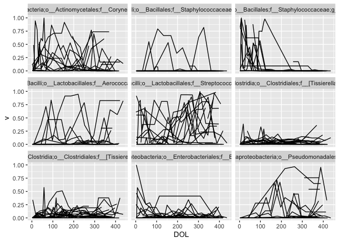<!-- -->

parametric effects

### Tphe6 CMV gam

``` r
tphe6_gam = update(tphe5_gam, TPHE_6 ~ .)
tphe6_early = update(tphe5_gam, TPHE_6_early ~ .)
tphe6_late = update(tphe5_gam, TPHE_6_late ~ .)
summary(tphe6_early)
```

    ## 
    ## Family: binomial 
    ## Link function: logit 
    ## 
    ## Formula:
    ## TPHE_6_early ~ s(preterm_weeks) + preg_antibiotics + cchorio + 
    ##     mode_delivery + preg_membrane_18hr + Race + Gender + cmv_probable
    ## 
    ## Parametric coefficients:
    ##                               Estimate Std. Error z value Pr(>|z|)   
    ## (Intercept)                 -4.720e+00  1.784e+00  -2.646  0.00814 **
    ## preg_antibioticsYes          5.680e-01  1.235e+00   0.460  0.64551   
    ## cchorioYes                   1.258e+00  1.552e+00   0.810  0.41769   
    ## mode_deliveryVaginal Breech -3.611e+01  3.001e+07   0.000  1.00000   
    ## mode_deliveryVaginal Vertex  7.553e-01  9.892e-01   0.763  0.44517   
    ## preg_membrane_18hrYes        8.409e-01  1.252e+00   0.672  0.50169   
    ## RaceBlack/AA                 4.949e-01  1.451e+00   0.341  0.73294   
    ## RaceMore than 1 race         7.558e-01  1.623e+00   0.466  0.64146   
    ## RaceWhite                   -1.669e+00  1.659e+00  -1.006  0.31439   
    ## GenderMale                   3.543e-01  9.846e-01   0.360  0.71898   
    ## cmv_probableTRUE             2.520e+00  9.942e-01   2.535  0.01124 * 
    ## ---
    ## Signif. codes:  0 '***' 0.001 '**' 0.01 '*' 0.05 '.' 0.1 ' ' 1
    ## 
    ## Approximate significance of smooth terms:
    ##                  edf Ref.df Chi.sq p-value
    ## s(preterm_weeks)   1  1.001  0.362   0.548
    ## 
    ## R-sq.(adj) =  0.167   Deviance explained = 26.2%
    ## UBRE = -0.62934  Scale est. = 1         n = 183

``` r
summary(tphe6_late)
```

    ## 
    ## Family: binomial 
    ## Link function: logit 
    ## 
    ## Formula:
    ## TPHE_6_late ~ s(preterm_weeks) + preg_antibiotics + cchorio + 
    ##     mode_delivery + preg_membrane_18hr + Race + Gender + cmv_probable
    ## 
    ## Parametric coefficients:
    ##                               Estimate Std. Error z value Pr(>|z|)  
    ## (Intercept)                 -8.886e-01  1.338e+00  -0.664   0.5066  
    ## preg_antibioticsYes          4.853e-01  7.833e-01   0.620   0.5355  
    ## cchorioYes                  -4.877e-02  1.470e+00  -0.033   0.9735  
    ## mode_deliveryVaginal Breech  2.159e-01  2.562e+00   0.084   0.9329  
    ## mode_deliveryVaginal Vertex -1.764e+00  8.542e-01  -2.065   0.0390 *
    ## preg_membrane_18hrYes        6.208e-01  1.504e+00   0.413   0.6798  
    ## RaceBlack/AA                 8.241e-01  1.270e+00   0.649   0.5163  
    ## RaceMore than 1 race        -2.635e+01  1.082e+05   0.000   0.9998  
    ## RaceWhite                   -2.719e+00  1.353e+00  -2.009   0.0445 *
    ## GenderMale                   6.225e-01  7.079e-01   0.879   0.3792  
    ## cmv_probableTRUE             2.055e+00  8.566e-01   2.399   0.0164 *
    ## ---
    ## Signif. codes:  0 '***' 0.001 '**' 0.01 '*' 0.05 '.' 0.1 ' ' 1
    ## 
    ## Approximate significance of smooth terms:
    ##                    edf Ref.df Chi.sq p-value
    ## s(preterm_weeks) 2.208   2.76  5.256   0.157
    ## 
    ## R-sq.(adj) =  0.309   Deviance explained = 40.1%
    ## UBRE = -0.21887  Scale est. = 1         n = 112

``` r
plot(tphe6_gam)
```

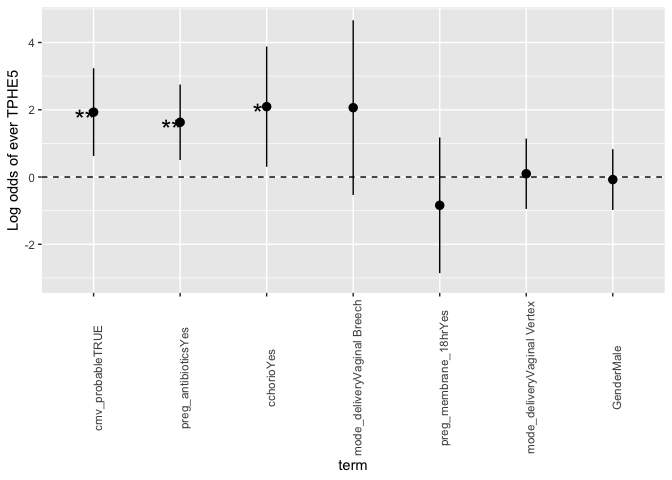<!-- -->

GA birth smooth

``` r
tphe6_tests_sub = cleanup_gam(tphe6_gam)

tphe5_6 = bind_rows(list(tphe5 = tphe5_tests_sub, tphe6 = tphe6_tests_sub), .id = 'IST')

tphe5_plt %+% tphe5_6 + aes(color = IST) + ylab('Log odds\nIST ever') 
```

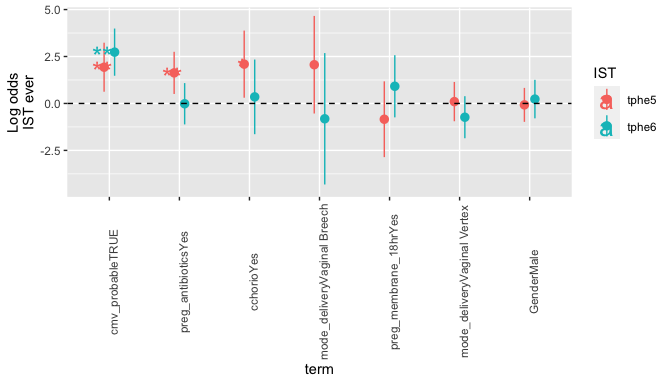<!-- -->

``` r
tphe6_plt = ggplot(tphe6_tests_sub, aes(x = term, y = estimate, ymin = conf.low, ymax = conf.high)) + geom_pointrange() + geom_text(aes(label = pval), size = 7, position = position_nudge(x = -.1, y = -.2)) + ylab('Log odds of ever TPHE6') + geom_hline(yintercept = 0, lty = 2) + theme(axis.text.x = element_text(angle = 90))
```

parametric
effects

## TPHE5 vs TPHE6 associations

``` r
fisher.test(table(inutero_exposure$TPHE_6_late, inutero_exposure$TPHE_5_early))
```

    ## 
    ##  Fisher's Exact Test for Count Data
    ## 
    ## data:  table(inutero_exposure$TPHE_6_late, inutero_exposure$TPHE_5_early)
    ## p-value = 0.001658
    ## alternative hypothesis: true odds ratio is not equal to 1
    ## 95 percent confidence interval:
    ##   1.74162 20.71802
    ## sample estimates:
    ## odds ratio 
    ##   5.939196

``` r
fisher.test(table(inutero_exposure$TPHE_6_early, inutero_exposure$TPHE_5))
```

    ## 
    ##  Fisher's Exact Test for Count Data
    ## 
    ## data:  table(inutero_exposure$TPHE_6_early, inutero_exposure$TPHE_5)
    ## p-value = 1
    ## alternative hypothesis: true odds ratio is not equal to 1
    ## 95 percent confidence interval:
    ##  0.01776216 7.38383325
    ## sample estimates:
    ## odds ratio 
    ##  0.8455665

## ICS5, ICS6, ICS7 associations

``` r
ics_gams = map_dfr(Hmisc::llist('ICS_5', 'ICS_6', 'ICS_7', 'ICS_5_early', 'ICS_6_early', 'ICS_7_early'), ~ cleanup_gam(update(tphe5_gam, as.formula(sprintf(' %s ~. ', .x)))), .id = 'IST')

knitr::kable(ics_gams %>% mutate_at(vars(estimate:p_adjust), signif, digits = 4), digits = 2)
```

| IST           | term                         | estimate | std.error | statistic | p.value |    conf.low | conf.high | p\_adjust | pval |
| :------------ | :--------------------------- | -------: | --------: | --------: | ------: | ----------: | --------: | --------: | :--- |
| ICS\_5        | preg\_antibioticsYes         |   \-0.60 |      0.44 |    \-1.36 |    0.18 |      \-1.47 |      0.27 |      1.00 |      |
| ICS\_5        | cchorioYes                   |   \-0.56 |      1.14 |    \-0.49 |    0.62 |      \-2.80 |      1.68 |      1.00 |      |
| ICS\_5        | mode\_deliveryVaginal Breech |   \-0.52 |      1.21 |    \-0.43 |    0.67 |      \-2.90 |      1.86 |      1.00 |      |
| ICS\_5        | mode\_deliveryVaginal Vertex |   \-0.61 |      0.45 |    \-1.37 |    0.17 |      \-1.49 |      0.26 |      1.00 |      |
| ICS\_5        | preg\_membrane\_18hrYes      |   \-0.43 |      0.87 |    \-0.49 |    0.62 |      \-2.14 |      1.28 |      1.00 |      |
| ICS\_5        | GenderMale                   |   \-0.09 |      0.41 |    \-0.22 |    0.83 |      \-0.89 |      0.71 |      1.00 |      |
| ICS\_5        | cmv\_probableTRUE            |     0.71 |      0.60 |      1.20 |    0.23 |      \-0.45 |      1.88 |      1.00 |      |
| ICS\_6        | preg\_antibioticsYes         |     0.05 |      0.37 |      0.13 |    0.90 |      \-0.68 |      0.78 |      1.00 |      |
| ICS\_6        | cchorioYes                   |  \-24.79 |  68550.00 |      0.00 |    1.00 | \-134400.00 | 134300.00 |      1.00 |      |
| ICS\_6        | mode\_deliveryVaginal Breech |   \-0.33 |      1.18 |    \-0.28 |    0.78 |      \-2.65 |      1.99 |      1.00 |      |
| ICS\_6        | mode\_deliveryVaginal Vertex |   \-0.05 |      0.37 |    \-0.14 |    0.89 |      \-0.78 |      0.68 |      1.00 |      |
| ICS\_6        | preg\_membrane\_18hrYes      |   \-0.58 |      0.74 |    \-0.78 |    0.43 |      \-2.03 |      0.87 |      1.00 |      |
| ICS\_6        | GenderMale                   |   \-0.18 |      0.34 |    \-0.54 |    0.59 |      \-0.85 |      0.48 |      1.00 |      |
| ICS\_6        | cmv\_probableTRUE            |   \-0.72 |      0.61 |    \-1.19 |    0.23 |      \-1.91 |      0.47 |      1.00 |      |
| ICS\_7        | preg\_antibioticsYes         |   \-0.79 |      0.61 |    \-1.29 |    0.20 |      \-1.99 |      0.41 |      1.00 |      |
| ICS\_7        | cchorioYes                   |     1.61 |      1.03 |      1.56 |    0.12 |      \-0.41 |      3.62 |      0.83 |      |
| ICS\_7        | mode\_deliveryVaginal Breech |     2.61 |      1.20 |      2.18 |    0.03 |        0.26 |      4.96 |      0.21 | \*   |
| ICS\_7        | mode\_deliveryVaginal Vertex |     0.94 |      0.57 |      1.66 |    0.10 |      \-0.17 |      2.05 |      0.68 |      |
| ICS\_7        | preg\_membrane\_18hrYes      |   \-1.23 |      1.30 |    \-0.95 |    0.34 |      \-3.79 |      1.32 |      1.00 |      |
| ICS\_7        | GenderMale                   |   \-0.79 |      0.51 |    \-1.55 |    0.12 |      \-1.80 |      0.21 |      0.84 |      |
| ICS\_7        | cmv\_probableTRUE            |     0.31 |      0.88 |      0.35 |    0.73 |      \-1.41 |      2.03 |      1.00 |      |
| ICS\_5\_early | preg\_antibioticsYes         |   \-0.36 |      0.46 |    \-0.78 |    0.44 |      \-1.25 |      0.54 |      1.00 |      |
| ICS\_5\_early | cchorioYes                   |   \-0.48 |      1.22 |    \-0.39 |    0.70 |      \-2.87 |      1.92 |      1.00 |      |
| ICS\_5\_early | mode\_deliveryVaginal Breech |   \-0.57 |      1.22 |    \-0.47 |    0.64 |      \-2.97 |      1.82 |      1.00 |      |
| ICS\_5\_early | mode\_deliveryVaginal Vertex |   \-0.75 |      0.48 |    \-1.55 |    0.12 |      \-1.69 |      0.20 |      0.85 |      |
| ICS\_5\_early | preg\_membrane\_18hrYes      |   \-0.22 |      0.93 |    \-0.23 |    0.82 |      \-2.04 |      1.61 |      1.00 |      |
| ICS\_5\_early | GenderMale                   |   \-0.16 |      0.43 |    \-0.37 |    0.71 |      \-1.00 |      0.68 |      1.00 |      |
| ICS\_5\_early | cmv\_probableTRUE            |     0.03 |      0.71 |      0.04 |    0.97 |      \-1.36 |      1.41 |      1.00 |      |
| ICS\_6\_early | preg\_antibioticsYes         |     0.00 |      0.38 |    \-0.01 |    0.99 |      \-0.76 |      0.75 |      1.00 |      |
| ICS\_6\_early | cchorioYes                   |  \-24.73 |  74060.00 |      0.00 |    1.00 | \-145200.00 | 145100.00 |      1.00 |      |
| ICS\_6\_early | mode\_deliveryVaginal Breech |   \-0.30 |      1.21 |    \-0.25 |    0.80 |      \-2.68 |      2.08 |      1.00 |      |
| ICS\_6\_early | mode\_deliveryVaginal Vertex |   \-0.12 |      0.39 |    \-0.32 |    0.75 |      \-0.88 |      0.64 |      1.00 |      |
| ICS\_6\_early | preg\_membrane\_18hrYes      |   \-0.30 |      0.76 |    \-0.40 |    0.69 |      \-1.78 |      1.18 |      1.00 |      |
| ICS\_6\_early | GenderMale                   |   \-0.21 |      0.35 |    \-0.61 |    0.54 |      \-0.90 |      0.47 |      1.00 |      |
| ICS\_6\_early | cmv\_probableTRUE            |   \-0.57 |      0.61 |    \-0.94 |    0.35 |      \-1.77 |      0.62 |      1.00 |      |
| ICS\_7\_early | preg\_antibioticsYes         |   \-0.19 |      0.74 |    \-0.25 |    0.80 |      \-1.64 |      1.27 |      1.00 |      |
| ICS\_7\_early | cchorioYes                   |     1.29 |      1.28 |      1.00 |    0.32 |      \-1.23 |      3.80 |      1.00 |      |
| ICS\_7\_early | mode\_deliveryVaginal Breech |     1.48 |      1.34 |      1.11 |    0.27 |      \-1.14 |      4.10 |      1.00 |      |
| ICS\_7\_early | mode\_deliveryVaginal Vertex |     0.89 |      0.69 |      1.30 |    0.19 |      \-0.45 |      2.24 |      1.00 |      |
| ICS\_7\_early | preg\_membrane\_18hrYes      |   \-0.42 |      1.33 |    \-0.31 |    0.75 |      \-3.02 |      2.19 |      1.00 |      |
| ICS\_7\_early | GenderMale                   |   \-0.98 |      0.64 |    \-1.54 |    0.12 |      \-2.23 |      0.27 |      0.87 |      |
| ICS\_7\_early | cmv\_probableTRUE            |     1.09 |      0.92 |      1.18 |    0.24 |      \-0.72 |      2.90 |      1.00 |      |

# GLMNET Tuning

``` r
tsk = makeRegrTask('flowsom', data = all_feats_mgl, target = 'cga', blocking = all_feats$Subject) %>% removeConstantFeatures(perc = .03, na.ignore = TRUE) %>% normalizeFeatures(on.constant = 'stop')

ppc_lrn = makeImputeWrapper(makeLearner('regr.glmnet', par.vals = list(standardize = FALSE)),  classes = list(numeric = imputeMean(), factor = imputeMode(), integer = imputeMean()))

lasso_ps = makeParamSet(
    makeNumericParam("lambda", lower = -3, upper = .5, trafo = function(x) 10^x),
    makeNumericParam("alpha", lower = 0, upper = 1)
)


tune_method = function(tsk_, odata, learn, ps, tune_maxit = 50){
    ctrl = makeTuneControlRandom(maxit = tune_maxit)
    res = tuneParams(learn, task = tsk_, resampling = cv5,
  par.set = lasso_ps, control = ctrl, measures = list(mse, setAggregation(mse, test.sd)))
    ggplot(generateHyperParsEffectData(res)$data, aes(x = s, y = alpha, color = mse.test.mean)) + geom_point() + scale_color_distiller(type = 'div')
    
    learn = setHyperPars(learn, par.vals = res$x)
    tt = train(learn, tsk_)

    # get coefficients from fitted model
    cv = crossval(learn, tsk_)
    
    oob_prob = cv$pred$data %>% arrange(id) %>% cbind(odata %>% select(Subject, `Sequence Num`)) %>% mutate(truth = 2^truth, response = 2^response)
    list(tuning = res, fitted = tt, cv_response = oob_prob)
}

get_lasso_coefs = function(tune_method_obj){
    coef(getLearnerModel(tune_method_obj$fitted)$learner.model, s = tune_method_obj$tuning$x$s)
}
```

``` r
flow_lasso = tune_method(tsk, all_feats, ppc_lrn, lasso_ps, tune_maxit = 50)
```

# Cross-validated predictions

## Lasso

``` r
plt = ggplot(flow_lasso$cv_response %>% select(truth, response, Subject, `Sequence Num`), aes(x = truth, y =response)) + geom_point(size = 1, aes(color = factor(`Sequence Num`))) + geom_line(aes(group = Subject), alpha = .4) + geom_abline(slope = 1, intercept = 0, color = 'red') + scale_color_discrete('Visit', labels = c('Cord', 'Discharge', '1 yr')) + coord_fixed()  + ylab('Predicted CGA') + xlab('True CGA')

plt + xlim(20, 45) + ylim(20, 75) 
```

<!-- -->

``` r
plt + xlim(80, NA) + ylim(50, NA)
```

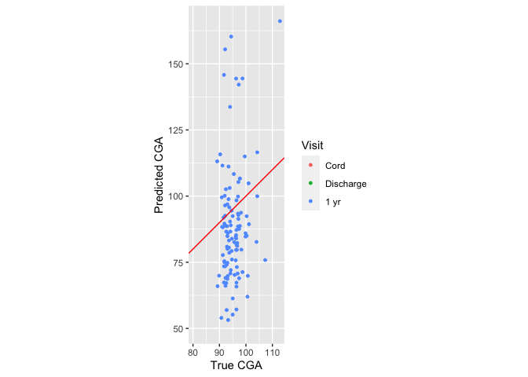<!-- -->

``` r
plt + xlim(20, 180) + ylim(20, 180) + theme(legend.position = c(.6, .3))
```

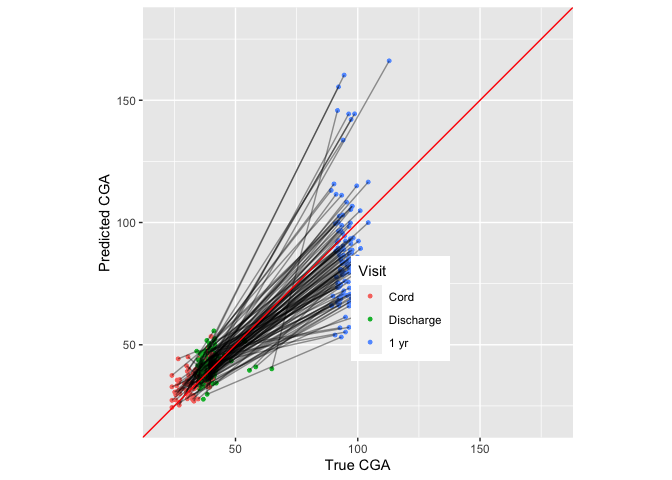<!-- -->

``` r
# Prediction performance

flow_lasso$cv_response %>% group_by(`Sequence Num` < 19) %>% summarize(cor(truth, response))
```

    ## # A tibble: 2 x 2
    ##   `\`Sequence Num\` < 19` `cor(truth, response)`
    ##   <lgl>                                    <dbl>
    ## 1 FALSE                                    0.185
    ## 2 TRUE                                     0.500

``` r
flow_lasso$cv_response %>% summarize(cor(truth, response))
```

    ##   cor(truth, response)
    ## 1            0.8915869

Conditional predictive performances (cross validated). In short, very
good performance in separating one year from earlier samples, and still
some performance earlier on.

# Variable importance (Figure 2C)

``` r
mm = get_lasso_coefs(flow_lasso)

varimp = mm %>% as.matrix() %>% as.data.frame() %>% rownames_to_column('variable')

varimp = left_join(varimp %>% rename(marker = variable), metacluster_rn)%>% 
  mutate(marker = factor(marker) %>% fct_reorder(`s0`)) %>% filter( abs(`s0`)>0, marker != '(Intercept)')

ggplot(varimp, aes(y = marker, x = 2^`s0`)) + geom_point(aes(color = Category)) + xlab('Coefficient\n fold change \n per 1-SD') + theme(legend.position = 'none') + geom_text(aes(label = Identity, x = 2^`s0`+.001), size = 2, hjust = 0) + facet_grid(Category ~ ., scales = 'free_y', space = 'free_y') + geom_vline(xintercept = 1, lty = 2) + scale_y_discrete(labels = NULL, breaks = NULL) 
```

<!-- -->

# Developmental microbiome

``` r
library(zoo)

rec_microbiome = read_csv('data/rec_table_L7_join.csv', guess_max = 4000)
nas_microbiome = read_csv('data/nas_table_L7_join.csv', guess_max = 4000)

dim(rec_microbiome)
```

    ## [1] 2674  492

``` r
dim(nas_microbiome)
```

    ## [1] 2162  476

-----

``` r
drop_cols = function(x, suffix){
    y = x %>% select(-`Specimen ID`, -`Sequence Num`, -cDOL, -Reads, -cga)
    torename = ! (names(y) %in% c('DOL', 'Subject'))
    names(y)[torename] = str_c(names(y)[torename], suffix)
    y
}

nas_rec_thr = full_join(rec_microbiome %>% drop_cols('.rec'), nas_microbiome %>% drop_cols('.nas'), by = c('Subject', 'DOL'))

nas_rec_thr2 = nas_rec_thr %>% group_by(Subject) %>% arrange(DOL) %>% mutate_at(vars(starts_with('k__')), ~ na.locf(.x, na.rm = FALSE))
dim(nas_rec_thr)
```

    ## [1] 3032  956

``` r
dim(nas_rec_thr2)
```

    ## [1] 3032  956

# Microbiome subjects/samples

``` r
microbiome_samp_table = nas_rec_thr %>% transmute(rec = !is.na(`k__Bacteria;p__Actinobacteria;c__Actinobacteria;o__Actinomycetales;f__Actinomycetaceae;Other;Other.rec`), nas = !is.na(`k__Bacteria;p__Actinobacteria;c__Thermoleophilia;o__Solirubrobacterales;f__;g__;s__.nas`), Subject, both_nas_rec = rec & nas)

knitr::kable(microbiome_samp_table %>% group_by(both_nas_rec) %>% summarize(samples = n()))
```

| both\_nas\_rec | samples |
| :------------- | ------: |
| FALSE          |    1124 |
| TRUE           |    1908 |

``` r
mb_subj = microbiome_samp_table %>% group_by(Subject) %>% summarize(nas_samples = sum(nas), rec_samples = sum(rec)) %>% mutate(nas_six = nas_samples > 6, rec_six = rec_samples > 6, both_six = nas_six & rec_six)

mb_subj %>% group_by(both_six) %>% summarize(n())
```

    ## # A tibble: 2 x 2
    ##   both_six `n()`
    ##   <lgl>    <int>
    ## 1 FALSE       89
    ## 2 TRUE       148

``` r
interesting = nas_rec_thr2 %>% ungroup() %>% select(starts_with('k__')) %>% as.matrix() %>% colSums(., na.rm = TRUE) %>% sort(decreasing = TRUE)

plot_taxa = c(names(interesting)[1:9], "k__Bacteria;p__Firmicutes;c__Bacilli;o__Lactobacillales;f__Aerococcaceae;g__Alloiococcus;s__.nas")


 foo = nas_rec_thr2 %>% select(plot_taxa, DOL) %>% gather(key = 'k', value = 'v', starts_with('k__'))
 
 ggplot(some_groups(foo, Subject, size = 20), aes( x = DOL, y = v, group = Subject)) + geom_line() + facet_wrap(~k)
```

<!-- -->

-----

## Alloiococcus, in particular

``` r
alloiococcus = filter(foo, k == "k__Bacteria;p__Firmicutes;c__Bacilli;o__Lactobacillales;f__Aerococcaceae;g__Alloiococcus;s__.nas") %>% inner_join(inutero_exposure, by = 'Subject') %>% group_by(TPHE_5) %>% some_groups(Subject, 40)

traj_plot = ggplot(alloiococcus, aes( x = DOL, y = v, group = Subject)) + geom_line(alpha = .3) + facet_wrap(~TPHE_5, labeller = label_both)

traj_plot + ylab("Alloiococcus")
```

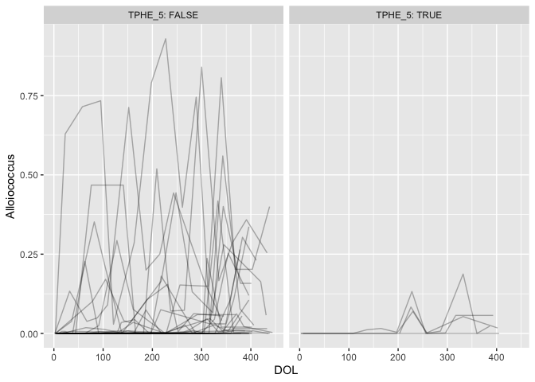<!-- -->

``` r
morexella = filter(foo, k == "k__Bacteria;p__Proteobacteria;c__Gammaproteobacteria;o__Pseudomonadales;f__Moraxellaceae;g__Moraxella;s__.nas") %>% inner_join(inutero_exposure, by = 'Subject') %>% group_by(TPHE_5) %>% some_groups(Subject, 40)

traj_plot %+% morexella + ylab("Moraxella")
```

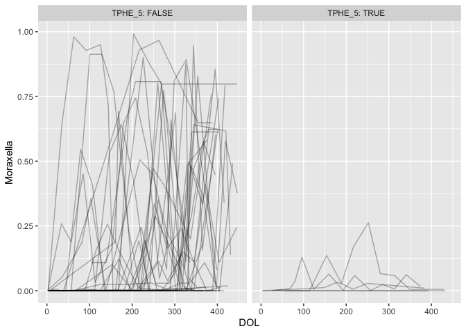<!-- -->

-----

``` r
#timeline uniquely keyed by Subject and DOL
timeline_one = timeline %>% arrange(Subject, DOL, `Sequence Num`)
timeline_one = timeline_one[!duplicated(timeline_one[c('Subject', 'DOL')]),]

all_mb = nas_rec_thr2 %>% ungroup() %>% left_join(timeline_one %>% select(Subject, DOL, cga, `Sequence Num`)) %>% mutate(cga = log2(cga)) 

mads = all_mb %>% ungroup() %>% summarize_if(is.numeric, ~ mad(., na.rm = TRUE)) %>% gather(variable, mad, 1:ncol(.))

all_mb_mgl = all_mb %>% select(-Subject, -DOL, -`Sequence Num`) %>% mangle_names
```

``` r
mb_tsk = makeRegrTask('mb', data = all_mb_mgl, target = 'cga', blocking = factor(nas_rec_thr2$Subject)) %>% removeConstantFeatures(perc = .03, na.ignore = TRUE) %>% normalizeFeatures(on.constant = 'stop')

mb_lasso = tune_method(mb_tsk, all_mb, ppc_lrn, lasso_ps, tune_maxit = 50)
```

``` r
mm = get_lasso_coefs(mb_lasso)

varimp = mm %>% as.matrix() %>% as.data.frame() %>% rownames_to_column('variable') %>% mutate(variable = str_replace(variable, 'k__.*?(?=f__)', '')) %>% mutate(variable = factor(variable) %>% fct_reorder(`s0`)) %>% filter( abs(`s0`)>0, variable != '(Intercept)') %>% mutate(rank = rank(-abs(s0)))

ggplot(filter(varimp, rank < 40), aes(y = variable, x = 2^`s0`, color = str_extract(variable, 'nas|rec'))) + geom_point() + xlab('Coefficient\n fold change \n per 1-SD') + theme(axis.text.y = element_text(size = 10), legend.position = 'none')
```

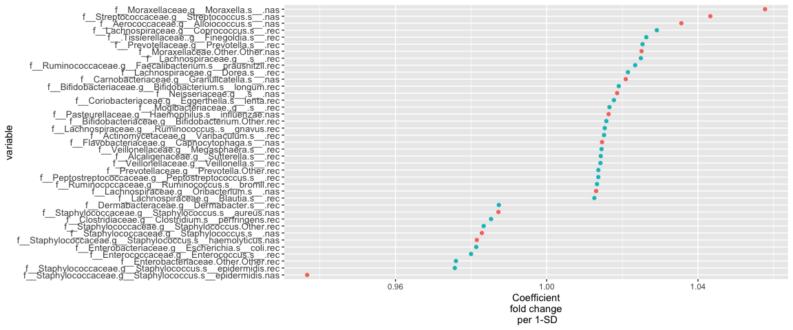<!-- -->

``` r
# Prediction performance

mb_lasso$cv_response %>% group_by(cut(log2(truth), 4)) %>% summarize(cor(truth, response))
```

    ## # A tibble: 4 x 2
    ##   `cut(log2(truth), 4)` `cor(truth, response)`
    ##   <fct>                                  <dbl>
    ## 1 (4.6,5.12]                             0.119
    ## 2 (5.12,5.63]                            0.490
    ## 3 (5.63,6.14]                            0.365
    ## 4 (6.14,6.66]                            0.200

``` r
mb_lasso$cv_response %>% summarize(cor(truth, response))
```

    ##   cor(truth, response)
    ## 1            0.7976964

# Cross validated fitted vs truth

## Lasso

``` r
plt = ggplot(mb_lasso$cv_response %>% select(truth, response, Subject), aes(x = truth, y =response)) + geom_point(size = 1, alpha = .5) + geom_line(aes(group = Subject), alpha = .1) + geom_abline(slope = 1, intercept = 0, color = 'red')  + ylab('Predicted CGA') + xlab('True CGA')
plt + coord_fixed(xlim = c(20, 160), ylim = c(20, 160))
```

<!-- -->

``` r
plt + coord_fixed(xlim = c(20, 50))
```

<!-- -->

``` r
plt + coord_fixed(xlim = c(50, 100))
```

<!-- -->

# Residuals by Participant

``` r
resid_tests = mb_lasso$cv_response %>% group_by(Subject) %>% filter(n() > 3) %>% do(tidy(t.test(log2(.$truth), log2(.$response), paired = TRUE))) %>% ungroup() %>% mutate(fdr = p.adjust(p.value, method = 'fdr')) %>% left_join(subject)

ggplot(resid_tests, aes(y = -log10(fdr), x = estimate, color = preterm_weeks )) + geom_point() + scale_color_distiller(type = 'div')
```

<!-- -->

``` r
oob_prob_test = right_join(resid_tests, mb_lasso$cv_response) %>% mutate(pid = factor(Subject) %>% fct_reorder(statistic))

ggplot(oob_prob_test, aes( x = pid, y = truth - response)) + geom_boxplot(aes(color = cut(fdr, breaks = c(0,  .05, .1, 1)))) + geom_hline(yintercept = 0, lty = 2) + scale_color_discrete('FDR q') + scale_x_discrete('Participants', labels = NULL, breaks = NULL)
```

<!-- -->

# Deficits and atypical development (Figure 6A)

``` r
scale_my_gradient = function(...){
    scale_color_gradient2(..., low = scales::muted('blue'), mid = 'white', high = scales::muted('red'))
}

scale_fill_my_gradient = function(...){
     scale_fill_gradient2(..., low = scales::muted('blue'), mid = 'white', high = scales::muted('red'))
}

scale_gab_gradient = function(...){
    scale_color_gradientn(colors =  c('red', 'orange', 'blue', 'darkblue'), values = c(0, .5, .8, 1), ...)
}

calc_residual_stats = function(cv_response){
    lmer_mod = lmer( response ~ truth + ( truth | Subject), data =  cv_response %>% mutate(truth = log2(truth/37), response = log2(response/37)))
    tmod = tidy(lmer_mod, effects = 'ran_modes')
    tmed = tmod %>% group_by(term) %>% summarize(cohort_med = median(estimate))
    tmod %>% left_join(tmed) %>% group_by(term) %>% mutate(z = (estimate - cohort_med)/std.error, rank = rank(z))
}

flow_resid = calc_residual_stats(flow_lasso$cv_response) %>% mutate(assay = 'flow')
mb_resid = calc_residual_stats(mb_lasso$cv_response )%>% mutate(assay = 'mb')

develop_feats = bind_rows(flow_resid, mb_resid) %>% select(-std.error, -cohort_med, -group, Subject = level) %>% gather(key, value, estimate:rank) %>% ungroup() %>% mutate(key = str_c(assay, '_', term, '_', key)) %>% select(-term, -assay) %>% spread(key, value)


feat_plot = ggplot(flow_lasso$cv_response %>% left_join(develop_feats), aes(x = truth, y = response)) + geom_point() + geom_line(aes(group = Subject), alpha = .4) + coord_fixed() + ylab('Predicted CGA') + xlab('True CGA')

flow_feat_plot = feat_plot + xlim(20, 160) + ylim(20, 160) + theme(legend.position = c(.1, .8))

flow_feat_plot + aes(color = `flow_(Intercept)_z`) + scale_my_gradient('Immuno\nintercept')
```

<!-- -->

``` r
flow_feat_plot + aes(color = `flow_truth_z`) + scale_my_gradient('Immuno\nslope')
```

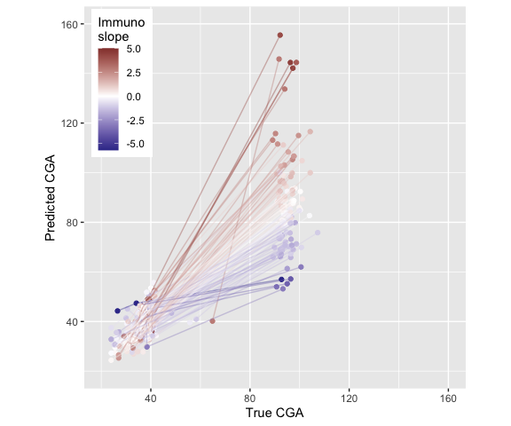<!-- -->

``` r
mb_feat_plot = feat_plot + xlim(20, 120) + ylim(20, 120) + theme(legend.position = c(.1, .8))

mb_feat_plot %+% (mb_lasso$cv_response %>% left_join(develop_feats))  + aes(color = `mb_(Intercept)_z`) + scale_my_gradient('MB\nintercept')
```

<!-- -->

``` r
mb_feat_plot %+% (mb_lasso$cv_response %>% left_join(develop_feats))  + aes(color = `mb_truth_z`) + scale_my_gradient('MB\nslope')
```

<!-- -->

The statistics I got from the random effects model seem to capture the
qualitative behavior pretty
well.

``` r
write_csv(develop_feats, path = file.path('intermediates', 'di_results', 'development_index.csv'))
```

Write out development
index

-----

``` r
quad_plot = ggplot(develop_feats %>% left_join(subject), aes(x = `mb_(Intercept)_z`, y =  `mb_truth_z`)) + geom_point() + geom_hline(yintercept = 0, lty = 2) + geom_vline(xintercept = 0, lty = 2)

quad_plot + aes(color = preterm_weeks)  + scale_gab_gradient()
```

<!-- -->

``` r
quad_plot +  aes(x = `flow_(Intercept)_z`, y =  `flow_truth_z`) + aes(color = preterm_weeks)  + scale_gab_gradient()
```

<!-- -->

``` r
quad_plot+  aes(x = `flow_(Intercept)_z`, y =  `flow_truth_z`) 
```

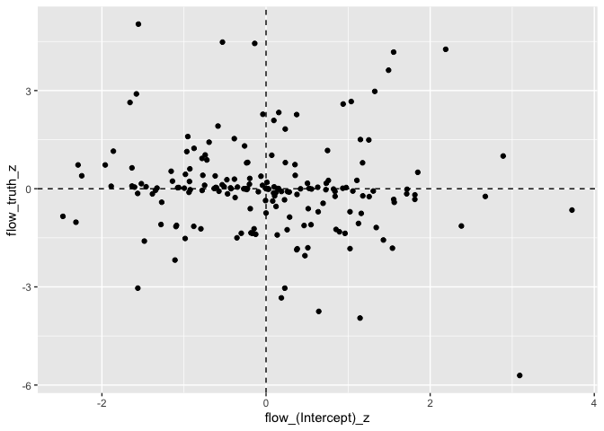<!-- -->

``` r
develop_feats = develop_feats %>% select(Subject, ends_with('_z'))    
```

# CST

``` r
nas_cst = read_csv('intermediates/dmn/nas_mix_weights.csv') %>% rename('Specimen ID' = X1)
names(nas_cst)[-1] = sprintf('oNAS_%d', seq_len(ncol(nas_cst) - 1))
nas_cst2  = inner_join(nas_cst, cw)

rec_cst = read_csv('rawdata/mi2_rec_mix_weights.csv') %>% rename('Specimen ID' = X1)
names(rec_cst)[-1] = sprintf('oREC_%d', seq_len(ncol(rec_cst) - 1))
rec_cst2 = inner_join(rec_cst, cw)

discharge_dol = filter(timeline, `Sequence Num` == 7) %>% transmute(Subject, dol_discharge = `Visit DOL (BLIS Calculated)`)

filtering = function(tbl){
    tbl2 = tbl %>% left_join(discharge_dol) %>% mutate(was_discharged = DOL > dol_discharge) %>% group_by(Subject, was_discharged) %>% summarize(nobs = n(), range = max(DOL) - min(DOL)) %>% ungroup()
    
    bad = filter(tbl2, !was_discharged, range >= 30, range/nobs > 30)
    bad2 = filter(tbl2, was_discharged, nobs < 6)
    dplyr::union(bad %>% select(Subject), bad2 %>% select(Subject))
}

bad_nas = filtering(nas_cst2)
bad_rec = filtering(rec_cst2)
```

``` r
dim(rec_cst)
dim(rec_cst2)
```

``` r
dim(nas_cst)
dim(nas_cst2)
```

We lose ~20 observations whose Specimen ID doesn’t map.

``` r
drop_cols2 = . %>% select(-Reads, -`Specimen ID`, -`Sequence Num`)


nas_rec_cst2 = full_join(nas_cst2 %>% drop_cols2, rec_cst2 %>% drop_cols2, by = c('Subject', 'DOL')) %>% mutate(cga = pmin(cga.x, cga.y, na.rm = TRUE)) %>% select(-cga.x, -cga.y)

nobs = nas_rec_cst2 %>% group_by(Subject) %>% summarize(nobs = n())
nobs_cst2 = left_join(nas_rec_cst2, nobs) %>% mutate(pidf = fct_reorder(factor( Subject), nobs), site = case_when(is.na(oNAS_1) ~ 'REC',  is.na(oREC_1) ~ 'NAS', !is.na(oNAS_1) & !is.na(oREC_1) ~ 'BOTH', TRUE ~ NA_character_))
```

``` r
ggplot(anti_join(nobs_cst2, dplyr::union(bad_nas, bad_rec)), aes(y = pidf, x = cga, color = site)) + geom_point() + ggtitle("Good samples")  + ylab('') + theme(axis.text.y = element_text(size = 6))
```

Samples we’ll
keep

``` r
ggplot(semi_join(nobs_cst2, dplyr::union(bad_nas, bad_rec)), aes(y = pidf, x = cga, color = site)) + geom_point() + ggtitle("Bad samples") + ylab('') + theme(axis.text.y = element_text(size = 6))
```

Sample’s we’ll drop. Note that 540059 was discharged at 223 days of
life, so that’s why they are
dropped.

``` r
nas_rec_cst_mean = nas_rec_cst2 %>% group_by(Subject) %>% summarize_at(vars(starts_with('o')), mean, na.rm = TRUE)


nas_rec_cga = (nas_rec_cst2 %>% select(starts_with('o'))) * (nas_rec_cst2$cga - 37)
names(nas_rec_cga) = str_c(names(nas_rec_cga), ':cga')
nas_rec_cga = cbind(nas_rec_cga, 'Subject' = nas_rec_cst2$Subject)  %>% group_by(Subject) %>% summarize_at(vars(starts_with('o')), mean, na.rm = TRUE)

nas_rec_cga_cst = full_join(nas_rec_cst_mean, nas_rec_cga)


ist_wide = all_ist %>% reshape2::dcast(Subject ~ IST + `Sequence Num`)

flow_feats_wide = all_feats %>% gather('param', 'value', starts_with('Meta.')) %>% reshape2::dcast(Subject ~ param + `Sequence Num`)

nan_to_na = function(x){
    x[!is.finite(x)] = NA_real_
    x
}

flow_cst_feats = full_join(nas_rec_cga_cst, flow_feats_wide, by = 'Subject') %>% full_join(ist_wide) %>% mutate_if(is.numeric, nan_to_na)
```

# Multivariate \(R^2\) associations (figure 1)

``` r
estimate_mlm_r2 = function(lhs_data, rhs_data, formula_, null_form = . ~ 1, response_label, predictor_label){
  # Drop NAs and constant columns
  lhs_data = as.matrix(lhs_data)
  colVar = apply(lhs_data, 2, var, na.rm = TRUE)
  lhs_data = lhs_data[,colVar > 1e-4,drop = FALSE]
  colVar = apply(rhs_data, 2, var, na.rm = TRUE)
  rhs_data = rhs_data[,colVar > 1e-4, drop = FALSE]
  good_right = rowSums(is.na(rhs_data)) == 0
  good_left = rowSums(is.na(lhs_data)) == 0
  good_good = good_right & good_left
  lhs_data = lhs_data[good_good,,drop = FALSE]
  rhs_data = rhs_data[good_good,,drop = FALSE]
  
  # Left hand side is compositional, take ILR
  lhs_data_comp = compositions::ilr(compositions::clo(lhs_data))
  environment(formula_) = environment()
  full = lm(formula_, data = rhs_data)
  null = update(full, null_form)
  adjr2 = 1 - (sum(full$residuals^2)/full$df.residual) /  (sum(null$residuals^2)/null$df.residual)
  anova_ = anova(full, null, test = 'Wilks', tol = 1e-6)
  stats = tibble(adjr2 = adjr2, pval = anova_[2,'Pr(>F)'], response_label = response_label, predictor_label = predictor_label, n = min(nrow(rhs_data), nrow(lhs_data)), p_rhs = ncol(rhs_data), p_lhs = ncol(lhs_data))
  stats
}

push = function(x, y){
  if(missing(y)){
    x = list(x)
    } else{
      if(!is.list(x)) stop('Not list')
      x[[length(x)+1]] = y
    }
  x
}

all_mb_dol = all_mb %>% mutate(log2DOL = log2(DOL + 1 ))
rec_mb = all_mb_dol %>% select(ends_with('.rec')) %>% as.matrix()


all_feats_dol = all_feats %>% left_join(timeline[c('Subject',  'Sequence Num', 'DOL')], by = c('Subject',  'Sequence Num')) %>% mutate(log2DOL = log2(`DOL` + 1))

r2_res = push(estimate_mlm_r2(rec_mb, all_mb_dol['cga'],  lhs_data_comp ~ cga, response_label = 'REC', predictor_label = 'PMA'))

r2_res = push(r2_res, estimate_mlm_r2(rec_mb, all_mb_dol['log2DOL'],  lhs_data_comp ~ log2DOL, response_label = 'REC', predictor_label = 'DOL'))


r2_res = push(r2_res, estimate_mlm_r2(all_mb_dol %>% select(ends_with('.nas')) %>% as.matrix(), all_mb_dol['cga'], lhs_data_comp ~ cga, response_label = 'NAS', predictor_label = 'PMA'))

r2_res = push(r2_res, estimate_mlm_r2(all_mb_dol %>% select(ends_with('.nas')) %>% as.matrix(), all_mb_dol['log2DOL'], lhs_data_comp ~ log2DOL, response_label = 'NAS', predictor_label = 'DOL'))

r2_res = push(r2_res, estimate_mlm_r2(all_mb_dol %>% select(ends_with('.nas')) %>% as.matrix(), all_mb_dol %>% select(ends_with('.rec')), lhs_data_comp ~ ., response_label = 'NAS', predictor_label = 'REC'))

r2_res = push(r2_res, estimate_mlm_r2(all_mb_dol %>% select(ends_with('.nas')) %>% as.matrix(), all_mb_dol %>% select(ends_with('.rec'), cga), lhs_data ~ . + cga, null_form = . ~ cga, response_label = 'NAS', predictor_label = 'REC (cga adjusted)'))

r2_res = push(r2_res, estimate_mlm_r2(all_mb_dol %>% select(ends_with('.rec')) %>% as.matrix(), all_mb_dol %>% select(ends_with('.nas')), lhs_data ~ ., response_label = 'REC', predictor_label = 'NAS'))

r2_res = push(r2_res, estimate_mlm_r2(all_mb_dol %>% select(ends_with('.rec')) %>% as.matrix(), all_mb_dol %>% select(ends_with('.nas'), cga), lhs_data ~ . + cga, null_form = . ~ cga, response_label = 'REC', predictor_label = 'NAS (cga adjusted)'))


r2_res = push(r2_res, estimate_mlm_r2(all_feats_dol %>% select(starts_with('Meta.Cluster')) %>% as.matrix(), all_feats_dol['cga'], lhs_data_comp ~ cga, response_label = 'T cell', predictor_label = 'PMA'))


r2_res = push(r2_res, estimate_mlm_r2(all_feats_dol %>% select(starts_with('Meta.Cluster')) %>% as.matrix(), all_feats_dol['log2DOL'], lhs_data_comp ~ log2DOL, response_label = 'T cell', predictor_label = 'DOL'))
```

## T cell on MB

Get Visits 1, 7, 19 from timeline, and their DOL

Merge onto MB
timelines

``` r
closest_1_7_19 = timeline %>% filter(`Sequence Num` %in% c(1, 7, 19)) %>% select(`Sequence Num`, `Subject`, DOL_t = DOL) %>%  left_join(all_mb %>% select(`Subject`, DOL_m = DOL), by = 'Subject') 

closest_visit = closest_1_7_19 %>% mutate(diff = DOL_m -DOL_t)%>% group_by(`Subject`, `Sequence Num`) %>% arrange(abs(diff)) %>% mutate(rank_diff = seq_along(diff)) %>% filter(rank_diff == 1, abs(diff) < 28)

closest_visit %>% group_by(`Subject`) %>% summarize(n())
```

    ## # A tibble: 215 x 2
    ##    Subject `n()`
    ##    <chr>   <int>
    ##  1 C01D8       3
    ##  2 C0427       2
    ##  3 C04D3       2
    ##  4 C04F0       3
    ##  5 C0522       3
    ##  6 C054B       3
    ##  7 C0796       3
    ##  8 C08F3       2
    ##  9 C09B7       3
    ## 10 C09C2       3
    ## # … with 205 more rows

``` r
all_mb_closest = inner_join(all_mb[!duplicated(all_mb[c('Subject', 'DOL')]),], 
                            closest_visit %>% select(`Sequence Num.T` = `Sequence Num`, `Subject`, DOL = DOL_m))

mb_tcell_closest = inner_join(all_feats %>% rename(`Sequence Num.T` = `Sequence Num`), select(all_mb_closest, -`Sequence Num`), by = c('Subject', 'Sequence Num.T'), suffix = c('.T', '.B'))

mb_tcell_closest %>% group_by(`Subject`) %>% summarize(n())
```

    ## # A tibble: 147 x 2
    ##    Subject `n()`
    ##    <chr>   <int>
    ##  1 C01D8       3
    ##  2 C0427       1
    ##  3 C04D3       2
    ##  4 C0522       3
    ##  5 C08F3       1
    ##  6 C09B7       3
    ##  7 C09C2       3
    ##  8 C0C1C       3
    ##  9 C0E4F       3
    ## 10 C1114       2
    ## # … with 137 more rows

``` r
r2_res = push(r2_res, estimate_mlm_r2(mb_tcell_closest %>% select(ends_with('.rec')) %>% as.matrix(), mb_tcell_closest %>% select(starts_with('Meta.Cluster')), lhs_data_comp ~ ., response_label = 'REC', predictor_label = 'T cell'))

r2_res = push(r2_res, estimate_mlm_r2(mb_tcell_closest %>% select(ends_with('.nas')) %>% as.matrix(), mb_tcell_closest %>% select(starts_with('Meta.Cluster')), lhs_data_comp ~ ., response_label = 'NAS', predictor_label = 'T cell'))

r2_res = push(r2_res, estimate_mlm_r2(mb_tcell_closest %>% select(starts_with('Meta.Cluster')) %>% as.matrix(), mb_tcell_closest %>% select(ends_with('.nas')), lhs_data_comp ~ ., response_label = 'T cell', predictor_label = 'NAS'))

r2_res = push(r2_res, estimate_mlm_r2(mb_tcell_closest %>% select(starts_with('Meta.Cluster')) %>% as.matrix(), mb_tcell_closest %>% select(ends_with('.rec')), lhs_data_comp ~ ., response_label = 'T cell', predictor_label = 'REC'))

# Adjusted 
r2_res = push(r2_res, estimate_mlm_r2(mb_tcell_closest %>% select(ends_with('.rec'))%>% as.matrix(), mb_tcell_closest %>% select(starts_with('Meta.Cluster'), cga.T), lhs_data_comp ~ ., null_form = ~ cga.T, response_label = 'REC', predictor_label = 'T cell (cga adjusted)'))

r2_res = push(r2_res, estimate_mlm_r2(mb_tcell_closest %>% select(ends_with('.nas'))%>% as.matrix(), mb_tcell_closest %>% select(starts_with('Meta.Cluster'), cga.T), lhs_data_comp ~ ., null_form = ~ cga.T, response_label = 'NAS', predictor_label = 'T cell (cga adjusted)'))

r2_res = push(r2_res, estimate_mlm_r2(mb_tcell_closest %>% select(starts_with('Meta.Cluster')) %>% as.matrix(), mb_tcell_closest %>% select(ends_with('.nas'), cga.B), lhs_data_comp ~ ., null_form = ~ cga.B, response_label = 'T cell', predictor_label = 'NAS (cga adjusted)'))

r2_res = push(r2_res, estimate_mlm_r2(mb_tcell_closest %>% select(starts_with('Meta.Cluster')) %>% as.matrix(), mb_tcell_closest %>% select(ends_with('.rec'), cga.B), lhs_data_comp ~ ., null_form = ~ cga.B, response_label = 'T cell', predictor_label = 'REC (cga adjusted)'))
```

``` r
r2_res = bind_rows(r2_res) 

r2_res = r2_res %>% 
  mutate(adjusted = str_detect(predictor_label, '(cga adjusted)'), 
         predictor_label2 = str_replace_all(predictor_label, fixed(' (cga adjusted)'), ''), 
         predictor_label2 = factor(predictor_label2, levels = rev(c('DOL', 'PMA', 'T cell', 'NAS', 'REC'))),
         response_label = factor(response_label, levels = c('T cell', 'NAS', 'REC')), 
         adjusted = factor(adjusted, levels = c('TRUE', 'FALSE')),
         pstar = case_when(pval < 1e-20 ~ '**',  pval < 1e-4 ~ '*', TRUE ~ ''))

#p_rhs = r2_res %>% arrange(predictor_label2, p_rhs) %>% split(f = .$predictor_label2) %>% map_dfr(~ .x[[1,]])

ggplot(r2_res, aes(x = response_label, y = predictor_label, fill = adjr2)) + geom_tile() + geom_text(aes(label = format(pval, digits = 1))) + scale_fill_distiller(palette = 3, limits = c(0, .2), direction = 1)
```

<!-- -->

``` r
ggplot(r2_res, aes(y = adjr2, x = predictor_label2, fill = adjusted)) + geom_col(position = 'dodge') + coord_flip() + facet_grid(~response_label)+ geom_text(aes(y = adjr2 + .01, label = pstar), position = position_dodge(width = 1), size = 6) + ylab('Adjusted R2') + xlab('Predictor(s)') + scale_y_continuous(limits = c(0, .22), breaks = c(0, .1, .2)) + theme(legend.position = 'bottom') + scale_fill_discrete('PMA Adjusted?', direction = 1)
```

<!-- -->

``` r
r2_res %>% dplyr::select(-predictor_label2) %>% dplyr::select(predictor_label, response_label, everything()) %>% mutate(adjr2 = round(adjr2, 3)) %>% write_csv(path = 'intermediates/di_results/r2_supp_table.csv')
```

# Illness prediction

``` r
covariates = subject %>% select(Subject, auc14,  `Birth Season`, Gender, Race, preterm_weeks, birth_wt_gms, PRD) %>% mutate_if(is_character, as.factor) %>% mutate(Subject = as.character(Subject)) %>% as_tibble() 


targets_etc = covariates %>% left_join(develop_feats)%>% mutate(PRD = factor(PRD, levels = c('No', 'Yes')))
```

# Fit illness

``` r
rf_ps = makeParamSet(makeIntegerParam('mtry', lower = 2, upper = 50),
                     makeIntegerParam('nodesize', lower = 4, upper = 20),
                     makeIntegerParam('ntree', lower = 2000, upper = 3000))

tune_method = function(tsk_, odata, learn, ps, tune_maxit = 50, hyper_params, resample_instance, inv_trans = function(x) x ){
     measures = if(tsk_$type == 'regr') list(mse, rsq, setAggregation(mse, test.sd)) else list(logloss, auc)
    if(tune_maxit > 1){
        ctrl = makeTuneControlRandom(maxit = tune_maxit)
        res = tuneParams(learn, task = tsk_, resampling = cv5,
  par.set = ps, control = ctrl, measures = measures)
    }  else {
        res = hyper_params
    }
    
    learn = setHyperPars(learn, par.vals = res$x)
    tt = train(learn, tsk_)

    # get coefficients from fitted model
    if(missing(resample_instance)){
        resample_instance = makeResampleInstance(makeResampleDesc('CV', iters = 20, stratify = tsk_$type != 'regr'), tsk_)
    }
    cv = resample(learn, tsk_, resample_instance, measures = measures)
    
    oob_prob = cv$pred$data %>% arrange(id) %>% cbind(odata %>% select(Subject)) %>% mutate(truth = inv_trans(truth), response = inv_trans(response))
    list(tuning = res, fitted = tt, cv_response = oob_prob, cv = cv, resample_instance = resample_instance)
}
```

``` r
response_feats = expand.grid(response = 'PRD',
                             features = c('clinical', 'devel'),
                             alone = FALSE, stringsAsFactors = FALSE) %>%
    as_tibble()

#' Train learner on subsets of possibly permuted data, possibly also tuning
#'
#' @param response character naming a response from `illness` table
#' @param features character naming other tables containing variables that should be permuted (or dropped if is 'clinical')
#' @param alone should the features be used alone?
#' @param tuning an existing MLR `Tune result`
#' @param tune_maxit integer, number of random tuning points to explore
#' @param resample_instance an existing MLR `ResampleInstance` to be used for blocking
#'
#' @return list from `tune_method`
trainit = function(response, features, alone = FALSE, tuning, tune_maxit = 50, resample_instance, just_return_task = FALSE, targets_etc_ = targets_etc, response_etc_exclude = c('PRD', 'Subject')){
       targets_etc_clean = targets_etc_[,setdiff(names(targets_etc_), response_etc_exclude)] %>% cbind(targets_etc_[,response, drop = FALSE])
       response_vec = targets_etc_[,response, drop = TRUE]
       targets_etc_clean = targets_etc_clean[!is.na(response_vec),]
       targets_etc_ = targets_etc_[!is.na(response_vec),]
       permutable = c('flow_feats_wide')
       if(alone){
           tbl_id = switch(features, devel = 'develop_feats', `T immune` = 'ist_wide', microbiome = 'nas_rec_cga_cst', clinical = 'covariates')
           keep = names(get(tbl_id))
           keep = intersect(union(keep, response), names(targets_etc_clean))
            targets_etc_clean = targets_etc_clean[,keep, drop = FALSE]    
       } else {
       if(features == 'devel') permutable = c(permutable, 'ist_wide', 'nas_rec_cga_cst')
       if(features == 'T immune') permutable = c(permutable, 'ist_wide')
       if(features == 'clinical') permutable = c(permutable, 'develop_feats', 'ist_wide', 'nas_rec_cga_cst')
       for(tbl_id in permutable){
           # scramble = sample(1:nrow(targets_etc_clean))
           tbl_names = intersect(setdiff(names(get(tbl_id)), 'Subject'), names(targets_etc_clean))
           # if(features %in% c('flow_feats', 'all')) {
           #  targets_etc_clean[,tbl_names] =  targets_etc_clean[scramble,tbl_names]
           # } else{
            targets_etc_clean = targets_etc_clean[,setdiff(names(targets_etc_clean), tbl_names), drop = FALSE]    
          # }
       }
      }
       if(response == 'PRD'){
           tsk = makeClassifTask('illness', data = targets_etc_clean %>% mangle_names(), target = response) %>% removeConstantFeatures(perc = .03, na.ignore = TRUE)
           rf_lrn = makeLearner("classif.randomForestSRC", predict.type = 'prob')
       } else{
        tsk = makeRegrTask('illness', data = targets_etc_clean %>% mangle_names(), target = response) %>% removeConstantFeatures(perc = .03, na.ignore = TRUE)
        rf_lrn = makeLearner("regr.randomForestSRC")
       }
       
       if(just_return_task) return(tsk)
       
       if(!missing(tuning)){
            results = tune_method(tsk, targets_etc_, rf_lrn, ps = rf_ps, hyper_params = tuning, tune_maxit = 1, resample_instance = resample_instance)
       } else{
            results = tune_method(tsk, targets_etc_, rf_lrn, ps = rf_ps, tune_maxit = tune_maxit, resample_instance = resample_instance)
      }
      results
}

prd_tune_rds = file.path('intermediates', 'di_results', 'rf_prd.rds')


library(parallelMap)
parallelStartSocket(4)
TUNE_MAXIT = 50
```

1.  Loop over responses
2.  Loop over feature sets and tune model
3.  Get CV’d
accuracy

-----

``` r
prd_tunings = tibble(response = 'PRD', features = c('clinical', 'devel'), alone = TRUE) #%>% left_join(full %>% select(response, resample_instance))  %>% rowwise()

# Just run twice to get the resampling instance so that the folds are fixed for comparison down the line
base_prd = filter(prd_tunings, features == 'clinical') %>% mutate(results = list(trainit(response, features, alone, tune_maxit = 2)))


prd_tunings = prd_tunings %>% mutate(resample_instance = list(base_prd$results[[1]]$resample_instance))
                                         
prd_tunings = prd_tunings %>% rowwise() %>% mutate(results = list(trainit(response, features, alone, resample_instance = resample_instance, tune_maxit = TUNE_MAXIT)))

saveRDS(prd_tunings, prd_tune_rds)
```

# Figure 6b

``` r
prd_tunings = readRDS(prd_tune_rds)
all_illness = prd_tunings %>% ungroup() %>% mutate(cv_measures = map(.$results, c('cv', 'measures.test')))

all_cv = all_illness %>% unnest(cv_measures)


metric_plot = ggplot(filter(all_cv, is.na(logloss)), aes(x = features, y = mse)) + stat_summary(geom = 'crossbar', color = 'blue', width = .5, fill = 'grey80') + facet_wrap(~response, scales = 'free_y') + theme(axis.text.x = element_text(angle = 90))

#metric_plot + geom_hline(data = targets_var, mapping = aes(yintercept = var), lty = 2)  + geom_line(aes(group = iter))
```

Mean squared error. Each point show the MSE in a cross-validated fold,
which is connected to its performance in the competing models. We could
compared across models with a paired t-test, for
instance.

``` r
metric_plot %+% filter(all_cv, !is.na(logloss), alone, features %in% c('clinical', 'devel')) + aes(y = auc) + geom_hline(yintercept = .5, lty = 2)
```

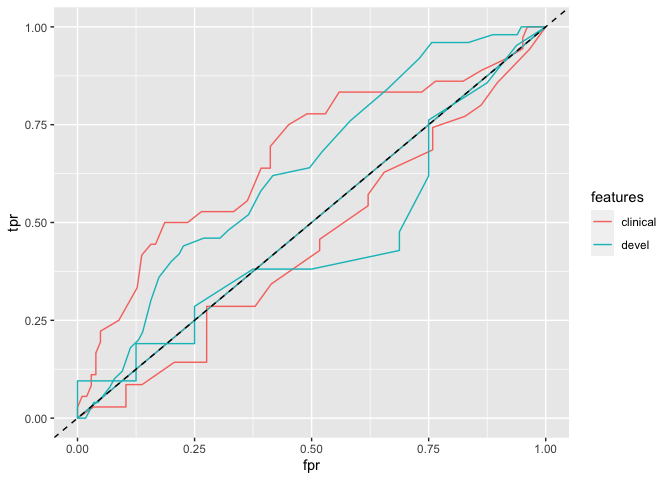<!-- -->

``` r
metric_plot %+% filter(all_cv, !is.na(logloss), alone) + aes(y = auc) + geom_hline(yintercept = .5, lty = 2)   + geom_line(aes(group = iter))
```

<!-- -->

``` r
metric_plot %+% filter(all_cv, !is.na(logloss), alone) + aes(y = logloss) + geom_line(aes(group = iter))
```

<!-- -->

Fits with each feature set used
“alone”

``` r
compare_auc_prd = lmer(auc ~ features + (1 | iter), data = filter(all_cv, !is.na(logloss), alone))

tidy(compare_auc_prd, conf.int = TRUE, effects = 'fixed') %>% mutate_at(vars(-term), .funs= ~ round(.x, 2)) %>% knitr::kable()
```

| term          | estimate | std.error | statistic | conf.low | conf.high |
| :------------ | -------: | --------: | --------: | -------: | --------: |
| (Intercept)   |     0.71 |      0.04 |     16.34 |     0.63 |      0.80 |
| featuresdevel |   \-0.05 |      0.04 |    \-1.20 |   \-0.14 |      0.03 |

# Variable importance (Figure S6)

``` r
vimp = filter(all_illness, response == 'PRD', alone)  %>% rowwise() %>% do({
    features = .$features[1]
  .$results  %>% .$fitted %>% getFeatureImportance()  %>% .$res %>% gather(variable, varimp) %>% mutate(features = features)
    })


varimp = vimp %>% mutate(variable = factor(variable) %>% fct_reorder(varimp))

ggplot(filter(varimp, features %in% c('clinical', 'devel')), aes(y = variable, x = varimp)) + geom_point() + theme(axis.text.y = element_text(size = 6)) + facet_wrap(~features, scales = 'free_y')
```

<!-- -->

Compare null to baseline to MB to flow to both.

# PRD / base partial effects

``` r
parallelMap::parallelStop()
fit.classif = filter(all_illness, response == 'PRD', alone, features == 'clinical') %>% pull(results) %>% .[[1]] %>% .$fitted

prd.task = trainit('PRD', 'clinical', alone = TRUE, just_return_task = TRUE)

pd = generatePartialDependenceData(fit.classif, prd.task, c("auc14", 'birth_wt_gms'), interaction = TRUE)

pd_dat = pd$data %>% mutate(`Pr(PRD)` = 1 - No)

feat_plot = function(data, x_var, color_var){
    x_var = enquo(x_var)
    color_var = enquo(color_var)
    color_quan = data %>% pull(!!color_var) %>% quantile(c(.1, .5, .9))
    EPS = (color_quan[3] - color_quan[1])/11
    
    #data = filter(data, abs(!!color_var - color_quan[1]) < EPS | abs(!!color_var - color_quan[2]) < EPS | abs(!!color_var - color_quan[3]) < EPS)
    
    ggplot(data, aes(x = !!x_var, color = !!color_var, group = !!color_var, y = `Pr(PRD)`))  + geom_line() + scale_my_gradient(midpoint = color_quan[2]*1.1) + theme(legend.position = 'bottom')
    
}

contour_plot = function(data, x_var, y_var){
    x_var = enquo(x_var)
    y_var = enquo(y_var)
    ggplot(data, aes(x = !!x_var, y = !!y_var, z = `Pr(PRD)`)) + stat_contour(geom="polygon", aes(fill=..level..), binwidth = .2) + scale_fill_my_gradient(midpoint = .4)   
}

filled_contour_plot = function(data, x_var, y_var){
     x_var = enquo(x_var)
     y_var = enquo(y_var)
     dmat = select(data, !!x_var, !!y_var, `Pr(PRD)`) %>% spread(key = !!x_var, value = `Pr(PRD)`)
       z = pmin(pmax(as.matrix(dmat[,-1]), .2), .7)
       x = dmat[,1]
       y = as.numeric(colnames(z))
       filled.contour(x = x, y = y, z = z, zlim = c(.2, .7), color.palette = gplots::bluered, xlab = y_var, ylab = x_var, key.title = title(main = 'Pr(PRD)'))
       recordPlot()
}
#feat_plot = ggplot(pd_dat, aes(x = birth_weight, y = `Pr(PRD)`, color = auc14, group = auc14)) + geom_line() + scale_my_gradient() + theme(legend.position = 'bottom')

zscore_trans = scales::trans_new('zscore', function(x) scale(x), function(y) y*attr(y, "scaled:scale") + attr(y, "scaled:center"))

plt1 = feat_plot(pd_dat, birth_wt_gms, auc14)
ctr1 = filled_contour_plot(pd_dat, birth_wt_gms, auc14)
```

<!-- -->

AUC14 / Birth weight
(gms)

``` r
pd = generatePartialDependenceData(fit.classif, prd.task, c("auc14", 'preterm_weeks'), interaction = TRUE)

pd_dat = pd$data %>% mutate(`Pr(PRD)` = 1 - No)

plt2 = feat_plot(pd_dat, preterm_weeks, auc14)
ctr2 = filled_contour_plot(pd_dat, preterm_weeks, auc14)
```

<!-- -->

``` r
cowplot::plot_grid(plt1, plt2)
```

<!-- -->

``` r
cowplot::plot_grid(ctr1, ctr2)
```

<!-- -->

AUC14 /
gaBirth

# PRD / Devel partial effects

``` r
fit.classif = filter(all_illness, response == 'PRD', alone, features == 'devel') %>% pull(results) %>% .[[1]] %>% .$fitted

prd.task = trainit('PRD', 'devel', alone = TRUE, just_return_task = TRUE)

pd = generatePartialDependenceData(fit.classif, prd.task, c("mb_truth_z", 'mb_.Intercept._z'), interaction = TRUE)

pd_dat = pd$data %>% mutate(`Pr(PRD)` = 1 - No)

plt1 = feat_plot(pd_dat, mb_.Intercept._z, mb_truth_z)

ctr1 = filled_contour_plot(pd_dat, mb_.Intercept._z, mb_truth_z)
```

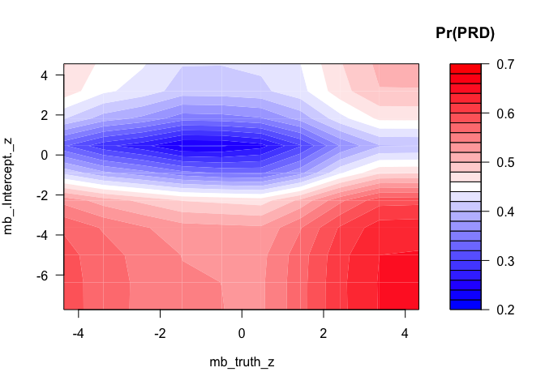<!-- -->

MB slope /
Intercept

``` r
pd = generatePartialDependenceData(fit.classif, prd.task, c("flow_truth_z", 'flow_.Intercept._z'), interaction = TRUE)

pd_dat = pd$data %>% mutate(`Pr(PRD)` = 1 - No)

plt2 = feat_plot(pd_dat,  flow_.Intercept._z, flow_truth_z)
ctr2 = filled_contour_plot(pd_dat,  flow_.Intercept._z, flow_truth_z)
```

<!-- -->

``` r
cowplot::plot_grid(plt1, plt2) 
```

<!-- -->

``` r
cowplot::plot_grid(ctr1, ctr2) 
```

<!-- -->

Flow slope /
intercept

``` r
pd = generatePartialDependenceData(fit.classif, prd.task, c("mb_truth_z", 'flow_truth_z'), interaction = TRUE)

pd_dat = pd$data %>% mutate(`Pr(PRD)` = 1 - No)

plt1 = feat_plot(pd_dat, flow_truth_z, mb_truth_z)
ctr1 = filled_contour_plot(pd_dat, flow_truth_z, mb_truth_z)
```

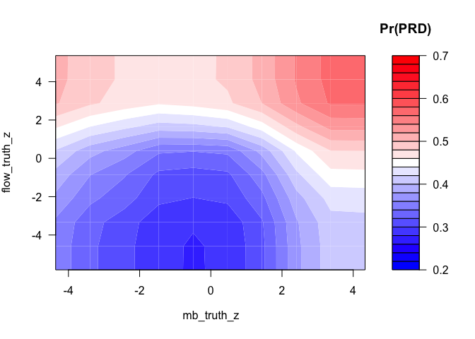<!-- -->

Flow slope / mb
slope

## Figure 6c

``` r
pd = generatePartialDependenceData(fit.classif, prd.task, c("mb_.Intercept._z", 'flow_truth_z'), interaction = TRUE)

pd_dat = pd$data %>% mutate(`Pr(PRD)` = 1 - No)

plt2 = feat_plot(pd_dat, flow_truth_z, mb_.Intercept._z)
ctr2 = filled_contour_plot(pd_dat, flow_truth_z, mb_.Intercept._z)
```

<!-- -->

Flow slope / MB
intercept

``` r
pd = generatePartialDependenceData(fit.classif, prd.task, c("mb_.Intercept._z", 'flow_.Intercept._z'), interaction = TRUE)

pd_dat = pd$data %>% mutate(`Pr(PRD)` = 1 - No)

plt3 = feat_plot(pd_dat, flow_.Intercept._z, mb_.Intercept._z)
ctr3 = filled_contour_plot(pd_dat, flow_.Intercept._z, mb_.Intercept._z)
```

<!-- -->

Flow intercept / MB
intercept

``` r
pd = generatePartialDependenceData(fit.classif, prd.task, c("mb_truth_z", 'flow_.Intercept._z'), interaction = TRUE)

pd_dat = pd$data %>% mutate(`Pr(PRD)` = 1 - No)

plt4 = feat_plot(pd_dat, flow_.Intercept._z, mb_truth_z)
ctr4 = filled_contour_plot(pd_dat, flow_.Intercept._z, mb_truth_z)
```

<!-- -->

``` r
cowplot::plot_grid(plt1, plt3, plt2, plt4)
```

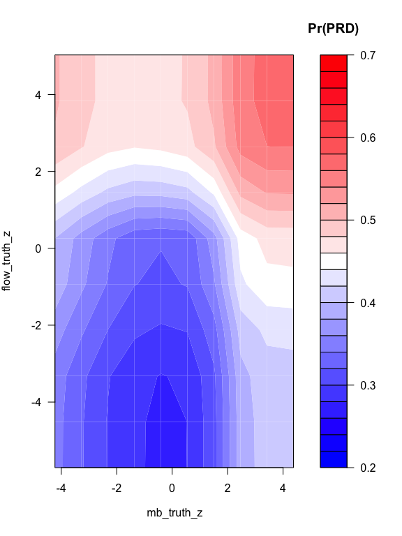<!-- -->

``` r
cowplot::plot_grid(ctr1, ctr3, ctr2,ctr4)
```

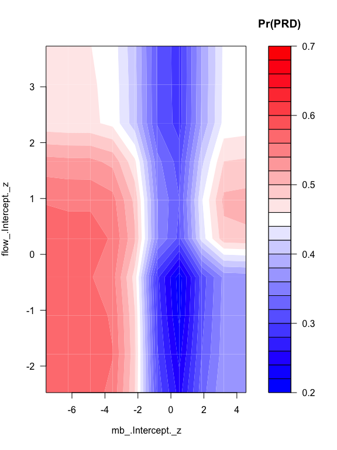<!-- -->

Flow intercept / MB slope

-----

## ROC

``` r
calc_roc = function(data, thres){
    tpr = with(data, mean((prob.Yes > thres)*(truth=='Yes'))/mean(truth == 'Yes'))
    fpr = with(data, mean((prob.Yes > thres)*(truth != 'Yes'))/mean(truth != 'Yes'))
    data_frame(thres = thres, tpr = tpr, fpr = fpr)
}

roc_all = prd_tunings %>% ungroup() %>% transmute(cv_response = map(.$results, 'cv_response'), response, features) %>% unnest() %>% group_by(response, features) %>% do({
    data = .
    map_dfr(seq(1, 0, by = -.01), ~ calc_roc(data, .x))
})

auc = roc_all %>% group_by(features) %>% summarize(auc = caTools::trapz(fpr, tpr))

ggplot(filter(roc_all, features %in% c('clinical', 'devel')), aes(x = fpr, y = tpr, color = features)) + geom_path() + geom_abline(slope = 1, intercept = 0, lty =2)
```

<!-- -->

``` r
knitr::kable(auc)
```

| features |       auc |
| :------- | --------: |
| clinical | 0.6978819 |
| devel    | 0.6689603 |

This is combining all of the cross-validated folds in calculating the
thresholds

``` r
roc_ish = prd_tunings %>% rowwise() %>% mutate(roc_ish = list(generateThreshVsPerfData(results[['cv']], measures = list(tpr, fpr), aggregate= FALSE)$data %>% group_by(threshold) %>% summarize(fpr = mean(fpr, na.rm = TRUE), tpr = mean(tpr, na.rm = TRUE))  )) # a hack to fix NAs in the fpr

ggplot(roc_ish %>% unnest(roc_ish), aes(x = fpr, y = tpr, color = features)) + geom_path() + geom_abline(slope = 1, intercept = 0, lty =2) + xlab("1 - Specificity") + ylab("Sensitivity") + theme_minimal() + theme(legend.pos = c(.6, .2))
```

<!-- -->

``` r
roc_ish %>% unnest(roc_ish) %>% group_by(features) %>% summarize(auc = caTools::trapz(fpr, tpr))
```

    ## # A tibble: 2 x 2
    ##   features    auc
    ##   <chr>     <dbl>
    ## 1 clinical -0.697
    ## 2 devel    -0.671

This is averaging the ROC curves
