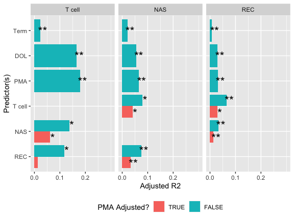

Multivariate \(R^2\) Calculations
================
Andrew McDavid
07/06/2020

``` r
knitr::opts_chunk$set(echo = TRUE, message = FALSE, warning = FALSE)
knitr::opts_chunk$set(cache = TRUE, autodep = TRUE)
knitr::opts_chunk$set(dev = c('png', 'pdf'))
library(broom)
```

    ## Warning: package 'broom' was built under R version 3.5.2

``` r
library(tidyverse)
```

    ## Warning: package 'tidyverse' was built under R version 3.5.2

    ## ── Attaching packages ────────────────────────────────────────────────────────────────────── tidyverse 1.3.0 ──

    ## ✓ ggplot2 3.3.0     ✓ purrr   0.3.3
    ## ✓ tibble  2.1.3     ✓ dplyr   0.8.5
    ## ✓ tidyr   1.0.2     ✓ stringr 1.4.0
    ## ✓ readr   1.3.1     ✓ forcats 0.5.0

    ## Warning: package 'ggplot2' was built under R version 3.5.2

    ## Warning: package 'tibble' was built under R version 3.5.2

    ## Warning: package 'tidyr' was built under R version 3.5.2

    ## Warning: package 'purrr' was built under R version 3.5.2

    ## Warning: package 'dplyr' was built under R version 3.5.2

    ## Warning: package 'stringr' was built under R version 3.5.2

    ## Warning: package 'forcats' was built under R version 3.5.2

    ## ── Conflicts ───────────────────────────────────────────────────────────────────────── tidyverse_conflicts() ──
    ## x dplyr::filter() masks stats::filter()
    ## x dplyr::lag()    masks stats::lag()

``` r
library(ggbeeswarm)
library(car)
```

    ## Warning: package 'car' was built under R version 3.5.2

    ## Loading required package: carData

    ## Warning: package 'carData' was built under R version 3.5.2

    ## 
    ## Attaching package: 'car'

    ## The following object is masked from 'package:dplyr':
    ## 
    ##     recode

    ## The following object is masked from 'package:purrr':
    ## 
    ##     some

``` r
subject = read_csv('data/subject_covariates.csv') %>% transmute(ispreterm = preterm_weeks >= 0, Subject)
```

    ## Parsed with column specification:
    ## cols(
    ##   Gender = col_character(),
    ##   Race = col_character(),
    ##   `Birth Season` = col_character(),
    ##   preterm_weeks = col_double(),
    ##   auc14 = col_double(),
    ##   PRD = col_character(),
    ##   preg_antibiotics = col_character(),
    ##   mode_delivery = col_character(),
    ##   cchorio = col_character(),
    ##   preg_membrane_18hr = col_character(),
    ##   birth_wt_gms = col_double(),
    ##   `cmv test` = col_character(),
    ##   Subject = col_character()
    ## )

``` r
all_feats = read_csv('intermediates/all_tcell_features.csv') %>% left_join(subject)
```

    ## Parsed with column specification:
    ## cols(
    ##   .default = col_double(),
    ##   Subject = col_character()
    ## )

    ## See spec(...) for full column specifications.

    ## Joining, by = "Subject"

``` r
all_mb = read_csv('intermediates/microbiome_joined.csv') %>% left_join(subject)
```

    ## Parsed with column specification:
    ## cols(
    ##   .default = col_double(),
    ##   Subject = col_character()
    ## )

    ## See spec(...) for full column specifications.

    ## Joining, by = "Subject"

``` r
timeline = read_csv('data/subject_timeline.csv')
```

    ## Parsed with column specification:
    ## cols(
    ##   `Sequence Num` = col_double(),
    ##   DOL = col_double(),
    ##   cga = col_double(),
    ##   Subject = col_character()
    ## )

# Multivariate \(R^2\) associations (figure 1)

``` r
aic_mlm = function(object){
   res = object$residuals
    p = object$rank
    N = length(res)
    w = 1
   val = 0.5 * (sum(log(w)) - N * (log(2 * pi) + 1 - log(N) + 
        log(sum(w * res^2))))
  -2*val + 2*p
}

as_char_form = function(x) paste0(as.character(x)[c(2, 1, 3:length(x))], collapse = ' ')

estimate_mlm_r2 = function(lhs_data, rhs_data, formula_, null_form = . ~ 1, response_label, predictor_label, adjusted = NA){
  # Drop NAs and constant columns
  lhs_data = as.matrix(lhs_data)
  #rhs_data = as.matrix(rhs_data)
  colVar = apply(lhs_data, 2, var, na.rm = TRUE)
  lhs_data = lhs_data[,colVar > 1e-4,drop = FALSE]
  colVar = apply(rhs_data, 2, var, na.rm = TRUE)
  rhs_data = rhs_data[,colVar > 1e-4, drop = FALSE]
  good_right = rowSums(is.na(rhs_data)) == 0
  good_left = rowSums(is.na(lhs_data)) == 0
  good_good = good_right & good_left
  lhs_data = lhs_data[good_good,,drop = FALSE]
  rhs_data = rhs_data[good_good,,drop = FALSE]
  
  # Left hand side is compositional, take ILR
  lhs_data_comp = compositions::ilr(compositions::clo(lhs_data))
  formula_ = as.formula(formula_)
  environment(formula_) = environment()
  full = lm(formula_, data = rhs_data)
  null = update(full, null_form)
  adjr2 = 1 - (sum(full$residuals^2)/full$df.residual) /  (sum(null$residuals^2)/null$df.residual)
  anova_ = anova(full, null, test = 'Wilks', tol = 1e-6)
  stats = tibble(adjr2 = adjr2, pval = anova_[2,'Pr(>F)'], response_label = response_label, predictor_label = predictor_label, n = min(nrow(rhs_data), nrow(lhs_data)), p_rhs = ncol(rhs_data), p_lhs = ncol(lhs_data), adjusted = adjusted, null_form = as_char_form(null_form), full_form = as_char_form(formula_), aic_full = aic_mlm(full))
  stats
}

push = function(x, y){
  if(missing(y)){
    x = list(x)
    } else{
      if(!is.list(x)) stop('Not list')
      x[[length(x)+1]] = y
    }
  x
}

all_mb_dol = all_mb %>% mutate(log2DOL = log2(DOL + 1 ))
rec_mb = all_mb_dol %>% select(ends_with('.rec')) %>% as.matrix()


all_feats_dol = all_feats %>% left_join(timeline[c('Subject',  'Sequence Num', 'DOL')], by = c('Subject',  'Sequence Num')) %>% mutate(log2DOL = log2(`DOL` + 1))
```

## Setup T cell with MB

Get Visits 1, 7, 19 from timeline, and their DOL

Merge onto MB
timelines

``` r
closest_1_7_19 = timeline %>% filter(`Sequence Num` %in% c(1, 7, 19)) %>% select(`Sequence Num`, `Subject`, DOL_t = DOL) %>%  left_join(all_mb %>% select(`Subject`, DOL_m = DOL), by = 'Subject') 

closest_visit = closest_1_7_19 %>% mutate(diff = DOL_m -DOL_t)%>% group_by(`Subject`, `Sequence Num`) %>% arrange(abs(diff)) %>% mutate(rank_diff = seq_along(diff)) %>% filter(rank_diff == 1, abs(diff) < 28)

closest_visit %>% group_by(`Subject`) %>% summarize(n())
```

    ## # A tibble: 215 x 2
    ##    Subject `n()`
    ##    <chr>   <int>
    ##  1 C01D8       3
    ##  2 C0427       2
    ##  3 C04D3       2
    ##  4 C04F0       3
    ##  5 C0522       3
    ##  6 C054B       3
    ##  7 C0796       3
    ##  8 C08F3       2
    ##  9 C09B7       3
    ## 10 C09C2       3
    ## # … with 205 more rows

``` r
all_mb_closest = inner_join(all_mb[!duplicated(all_mb[c('Subject', 'DOL')]),], 
                            closest_visit %>% select(`Sequence Num.T` = `Sequence Num`, `Subject`, DOL = DOL_m))

mb_tcell_closest = inner_join(all_feats %>% rename(`Sequence Num.T` = `Sequence Num`), select(all_mb_closest, -`Sequence Num`, -ispreterm, -cga), by = c('Subject', 'Sequence Num.T'), suffix = c('.T', '.B'))

mb_tcell_closest %>% group_by(`Subject`) %>% summarize(n())
```

    ## # A tibble: 147 x 2
    ##    Subject `n()`
    ##    <chr>   <int>
    ##  1 C01D8       3
    ##  2 C0427       1
    ##  3 C04D3       2
    ##  4 C0522       3
    ##  5 C08F3       1
    ##  6 C09B7       3
    ##  7 C09C2       3
    ##  8 C0C1C       3
    ##  9 C0E4F       3
    ## 10 C1114       2
    ## # … with 137 more rows

``` r
pred_table = tibble(covariates = c('Term', 'DOL', 'PMA', 'T cell', 'NAS', 'REC', 'T cell', 'NAS', 'REC'),
      adjusted = c(FALSE, FALSE, FALSE, FALSE, FALSE, FALSE, TRUE, TRUE, TRUE))

r2_res = list()
for(i in seq_len(nrow(pred_table))){
  for(resp in c('T cell', 'NAS', 'REC')){
    pred = pred_table[[i, 'covariates']]
    adjusted = pred_table[[i, 'adjusted']]
    if(pred == resp) next
    if( (pred  == 'T cell' && resp %in% c('NAS', 'REC')) || (resp == 'T cell' && pred %in% c('NAS', 'REC'))) {
      data = mb_tcell_closest
    } else if (resp == 'T cell') {
      data = all_feats_dol
    } else{
      data = all_mb_dol
    }
    
    null_form = . ~  ispreterm
    if(pred == 'Term'){
      form_ = "lhs_data_comp ~ 1"
      null_form = . ~ 1
      rhs_data = data['ispreterm']
    } else if(pred == 'DOL'){
      form_ = "lhs_data_comp ~ log2DOL"
      rhs_data = data[c('ispreterm', 'log2DOL')]
    } else if( pred == 'PMA'){
      form_ = "lhs_data_comp ~ cga"
      rhs_data = data[c('ispreterm', 'cga')]
    } else if (pred == 'T cell'){
      form_ = "lhs_data_comp ~ ."
      rhs_data = data %>% select(starts_with('Meta.Cluster'), ispreterm)
    } else if( pred == 'NAS'){
      form_ = "lhs_data_comp ~ ."
      rhs_data = data %>% select(ends_with('.nas'), ispreterm)
    } else if (pred == 'REC'){
      form_ = "lhs_data_comp ~ ."
      rhs_data = data %>% select(ends_with('.rec'), ispreterm)
    }
    
    # always adjust for preterm
    form_ = str_c(form_, ' + ispreterm')
    
    if(adjusted){
      form_ = str_c(form_, ' + cga')
      rhs_data = cbind(rhs_data, data['cga'])
      null_form = . ~ ispreterm + cga
    }
    
    if(resp == 'T cell'){
      lhs_data = data %>% select(starts_with('Meta.Cluster'))
    } else if(resp == 'NAS'){
      lhs_data = data %>% select(ends_with('.nas'))
    } else if( resp == 'REC'){
      lhs_data = data %>% select(ends_with('.rec'))
    }

    r2_res = push(r2_res, estimate_mlm_r2(lhs_data, rhs_data, form_, null_form, response_label = resp, predictor_label = pred, adjusted = adjusted))
  }
}
```

``` r
r2_res = bind_rows(r2_res) 

r2_res = r2_res %>% 
  mutate(predictor_label2 = factor(predictor_label, levels = rev(c('Term', 'DOL', 'PMA', 'T cell', 'NAS', 'REC'))),
         response_label = factor(response_label, levels = c('T cell', 'NAS', 'REC')), 
         adjusted = factor(adjusted, levels = c('TRUE', 'FALSE')),
         pstar = case_when(pval < 1e-20 ~ '**',  pval < 1e-4 ~ '*', TRUE ~ ''))

#p_rhs = r2_res %>% arrange(predictor_label2, p_rhs) %>% split(f = .$predictor_label2) %>% map_dfr(~ .x[[1,]])

ggplot(r2_res, aes(x = response_label, y = predictor_label, fill = adjr2)) + geom_tile() + geom_text(aes(label = format(pval, digits = 1))) + scale_fill_distiller(palette = 3, limits = c(0, .2), direction = 1)
```

<!-- -->

``` r
ggplot(r2_res, aes(y = adjr2, x = predictor_label2, fill = adjusted)) + geom_col(position = 'dodge') + coord_flip() + facet_grid(~response_label)+ geom_text(aes(y = adjr2 + .01, label = pstar), position = position_dodge(width = 1), size = 6) + ylab('Adjusted R2') + xlab('Predictor(s)') + scale_y_continuous(limits = c(0, .3), breaks = c(0, .1, .2)) + theme(legend.position = 'bottom') + scale_fill_discrete('PMA Adjusted?', direction = 1)
```

<!-- -->

``` r
r2_res %>% dplyr::select(-predictor_label2) %>% dplyr::select(predictor_label, response_label, everything()) %>% mutate(adjr2 = round(adjr2, 3)) %>% write_csv(path = 'intermediates/di_results/r2_supp_table.csv')
```

## AIC (Smaller is better)

``` r
dplyr::filter(r2_res, predictor_label %in% c('Term', 'DOL', 'PMA')) %>% select(predictor_label, response_label, aic_full) %>% tidyr::spread(predictor_label, aic_full) %>% knitr::kable()
```

| response\_label |       DOL |       PMA |     Term |
| :-------------- | --------: | --------: | -------: |
| T cell          |  27011.52 |  26853.06 |  28849.4 |
| NAS             | 291297.08 | 290113.10 | 297054.0 |
| REC             | 704856.55 | 704257.27 | 711911.2 |
