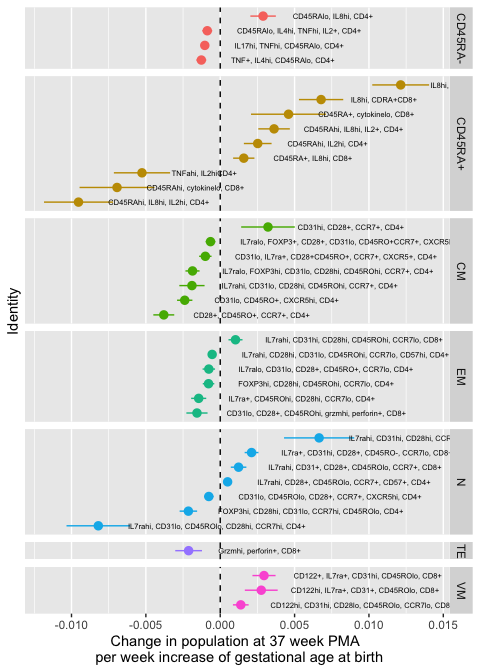
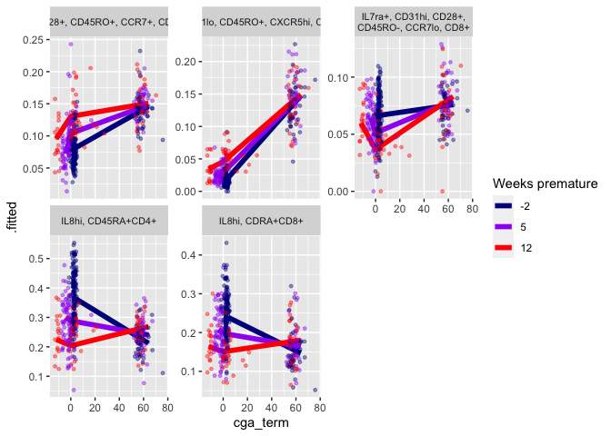
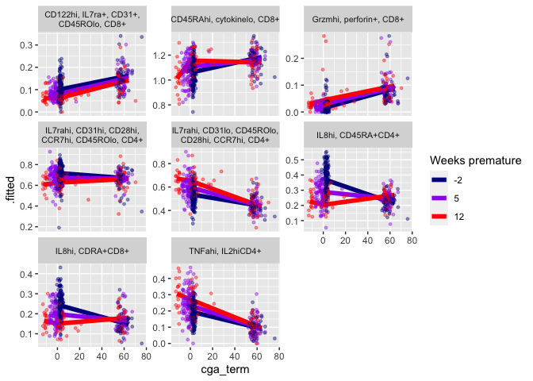
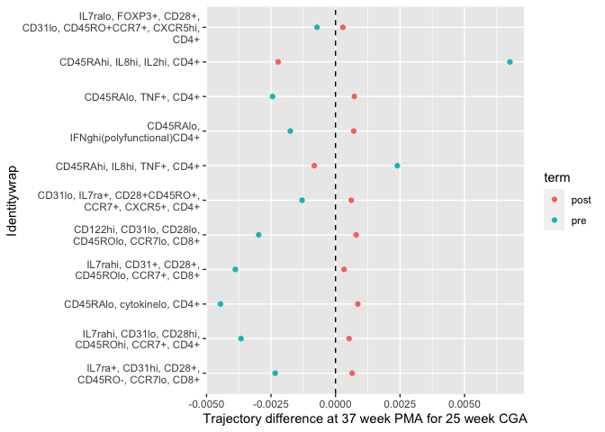
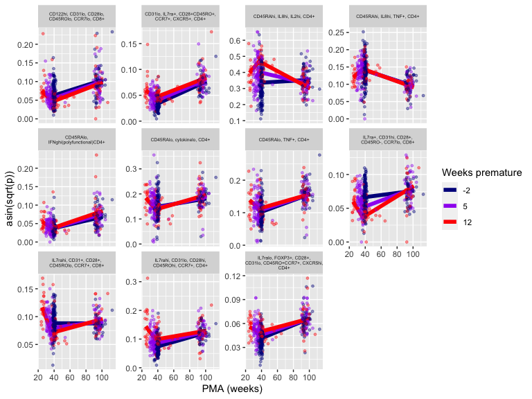
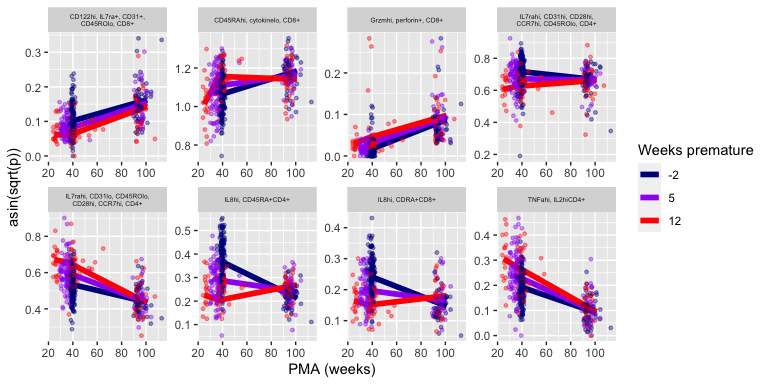
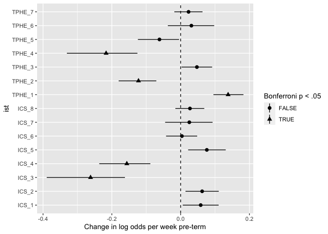
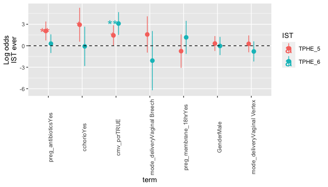

T cell / IST Associations
================
Andrew McDavid
2021-02-24

# ANOVA on some clusters

``` r
all_feats = read_csv('intermediates/all_tcell_features.csv')
subject = read_csv('data/subject_covariates.csv')

# Define GA birth timepoints
cohort_groups = c(12, 5, -2)
# And bin samples by timepoint midpoints
mid_points = c(-10, 1.5, 8.5, 20)

subject = mutate(subject,  cohort = cut(preterm_weeks, breaks = mid_points, labels = c('-2', "5", "12")))


mc_suffix = tibble(Family = c('TPHE4', 'TPHE8', 'ICS4', 'ICS8'), 
                   suffix = c('t4', 't8', 'i4', 'i8'))
# Descriptive names for T cell subpop
metacluster_rn = read_csv('intermediates/Metacluster Identities.csv') %>% select(-X5) %>% mutate(Family = Family %>% toupper(), Family = str_replace_all(Family, ' ', '')) %>% left_join(mc_suffix) %>% mutate(marker = str_c('Meta.Cluster_', Cluster, '_', suffix))
```

``` r
marker_interest = gather(all_feats, key = 'marker', value = 'proportion', starts_with('Meta.Cluster')) %>% left_join(subject) %>% 
    mutate(cga_term = 2^cga - 37, 
           log2_cga_term_ratio = cga-log2(37)) %>%
    left_join(metacluster_rn %>% mutate(Identity = ifelse(is.na(Identity), marker, Identity) %>% str_replace_all('(?<![,])[ ]+', '') %>% abbreviate(minlength = 59),
                                        Identitywrap = str_wrap(Identity, 30)))

scale_cohort_color = function(...){
  scale_color_manual('Weeks premature', values = c('darkblue', 'purple', 'red'), ...)   
}
```

# Linear/non-linear metaclusters

``` r
sin_sq = function(x) sin(x)^2
a_sqrt = function(x) asin(sqrt(x))

pred_values = expand.grid(preterm_weeks = cohort_groups, cga_term = seq(-12, 64, by = 4)) %>% filter(cga_term + preterm_weeks >= 0)

marker_nonlinear = marker_interest %>% group_by(marker, Identity, Category, Identitywrap) %>% do( output = 
    {
        model = lmer(a_sqrt(proportion) ~ (I( (cga_term<0)*cga_term ) + I( (cga_term>=0)*cga_term ))*preterm_weeks + (1|`Subject`), data = .)
        # Note I protects the indicator times cga_term, so these are not expanded.
        pre_contr = c(Intercept = 0, before = 1, after = 0, preterm = 0, prebefore = 10, preafter = 0)
        post_contr = c(Intercept = 0, before = 0, after = 1, preterm = 0, prebefore = 0, preafter = 10)
        pre10 = lht(model, pre_contr)[2,3]
        pre_est = fixef(model) %*% pre_contr
        post10 = lht(model, post_contr)[2,3]
        post_est = fixef(model) %*% post_contr
        diff_est = fixef(model) %*% (pre_contr - post_contr)
        diff10 = lht(model, pre_contr - post_contr)[2,3]
        monotone_tests = tibble(term = c('pre', 'post', 'diff'), estimate = c(pre_est, post_est, diff_est), p.value = c(pre10, post10, diff10))
        coefs = tidy(model, conf.int = TRUE)
        prediction = cbind(pred_values, .fitted = predict(model, newdata = pred_values, re.form = ~ 0 ))
        list(coefs = coefs, prediction = prediction, model = model, monotone_tests = monotone_tests)
             }) %>% rowwise() %>% mutate(model = list(output$model), coefs = list(output$coefs), prediction = list(output$prediction), monotone_tests = list(output$monotone_tests)) %>% select(-output)

nl_coefs = marker_nonlinear %>% unnest(coefs) %>% group_by(term) %>% mutate(p.value = pnorm(abs(statistic), lower.tail = FALSE)*2, p_adjust = p.adjust(p.value, method = 'bonferroni'))

nl_pred = marker_nonlinear %>% unnest(prediction)

traj_plot = ggplot(nl_pred %>% filter(marker == 'Meta.Cluster_10_i4'), aes(x = cga_term)) + geom_line(aes(color = factor(preterm_weeks), y = .fitted), lwd = 2) + scale_cohort_color() #+ geom_ribbon(aes(ymin = .fitted - .se.fit, ymax = .fitted + .se.fit), alpha = .3)
```

## Prematurity associated (Figure 2D)

``` r
preterm_markers = nl_coefs %>% filter(term == 'preterm_weeks', p_adjust < .05) %>% mutate(Identity = fct_reorder(factor(Identity), -estimate), rank = rank(p_adjust))

ggplot(preterm_markers, aes(x = Identity, y = -estimate, ymin = -conf.low, ymax = -conf.high)) + geom_pointrange(aes(color = Category)) + ylab('Change in population at 37 week PMA \n per week increase of gestational age at birth') + geom_hline(yintercept = 0, lty = 2)  + geom_text(aes(label = Identity, y = -estimate+.002), size = 2, hjust = 0) + theme(legend.position = 'none') +  coord_flip() + facet_grid(Category ~ ., scales = 'free_y', space = 'free_y') + scale_x_discrete(labels = NULL, breaks = NULL)
```

<!-- -->

## Figure 2E

``` r
other_preterm_toplot = str_c('Meta.Cluster_', c('26_t4', '25_t4', '1_t8', '2_t8', '18_i4', '13_i4', '12_i8', '8_i8'))

traj_plot %+% (nl_pred %>% semi_join(filter(preterm_markers, rank < 6), by = 'marker')) + facet_wrap(~Identitywrap, scales = 'free_y')  + geom_jitter(data = marker_interest %>% semi_join(filter(preterm_markers, rank < 6)), aes(y = a_sqrt(proportion), color = cohort), size = 1, alpha = .4) + theme(strip.text = element_text(size = 8))
```

<!-- -->

``` r
traj_plot %+% (nl_pred %>% semi_join(filter(preterm_markers, marker %in% other_preterm_toplot), by = 'marker')) + facet_wrap(~Identitywrap, scales = 'free_y')  + geom_jitter(data = filter(marker_interest, marker %in% other_preterm_toplot), aes(y = a_sqrt(proportion), color = cohort), size = 1, alpha = .4) + theme(strip.text = element_text(size = 8))
```

<!-- -->

Trajectories for top 6 markers with GAB differences at 37 weeks PMA.

-----

## Non-monotone markers (Figure S1)

``` r
nl_monotone = unnest(marker_nonlinear, monotone_tests)
nonmono_candidates = nl_monotone %>% group_by(marker) %>% summarize(max_sig = max(p.value), n_sig = sum(p.value < .05))
nonmono_sign = nl_monotone %>% select(-p.value) %>% spread(term, estimate) %>% mutate(signchange = sign(post) != sign(pre))

nonmono_candidates = left_join(nonmono_candidates, nonmono_sign) %>% filter(signchange, n_sig ==3, p.adjust(max_sig/3, method = 'bonferroni')< .05) %>% mutate(rank = rank(max_sig)) %>% left_join(nl_monotone %>% select(-Identity:-Identitywrap), by = c('marker'))  %>% mutate(Identitywrap = fct_reorder(factor(Identitywrap), rank))

ggplot(nonmono_candidates  %>% filter(term != 'diff'), aes(x = Identitywrap, y = estimate, color = term)) + geom_point() + ylab('Trajectory difference at 37 week PMA for 25 week CGA') + geom_hline(yintercept = 0, lty = 2) +  coord_flip() 
```

<!-- -->

These markers have an inversion estimated for 25 week-GAB
babies.

``` r
traj_plot %+% (nl_pred %>% semi_join(filter(nonmono_candidates, rank < Inf), by = 'marker')) + facet_wrap(~Identitywrap, scales = 'free_y')+ geom_jitter(data = marker_interest %>% semi_join(filter(nonmono_candidates, rank < Inf)), aes(y = a_sqrt(proportion), color = cohort), size = 1, alpha = .4) + theme(strip.text = element_text(size = 5))  + aes(x = cga_term + 37) + xlab("PMA (weeks)") + ylab("asin(sqrt(p))")
```

<!-- -->

Estimated trajectories and observed data for top 6 non-monotone
markers.

``` r
fig5_marker_toplot = tibble(marker = c('Meta.Cluster_13_i4', 'Meta.Cluster_18_i4', 'Meta.Cluster_8_i8', 'Meta.Cluster_12_i8',
                                  'Meta.Cluster_26_t4', 'Meta.Cluster_25_t4', 'Meta.Cluster_1_t8', 'Meta.Cluster_2_t8'))

strReverse = function(x) sapply(lapply(strsplit(x, NULL), rev), paste, 
collapse="")

#nl_fig5 = semi_join(nl_pred, fig5_marker_toplot) %>% mutate(Identity = factor(Identity, levels = sort(unique(strReverse(marker)))))

(traj_plot %+% semi_join(nl_pred, fig5_marker_toplot)) + facet_wrap(~Identitywrap, scales = 'free', nrow = 2)+ geom_jitter(data = semi_join(marker_interest, fig5_marker_toplot), aes(y = a_sqrt(proportion), color = cohort), size = 1, alpha = .4) + theme(strip.text = element_text(size = 5))  + aes(x = cga_term + 37) + xlab("PMA (weeks)") + ylab("asin(sqrt(p))")
```

<!-- -->

# Immune samples/timepoints

``` r
flow_subj_counts = all_feats %>% select(Subject, `Sequence Num`, tphe = Meta.Cluster_11_t8, ics=Meta.Cluster_11_i8) %>% mutate(both_tphe_ics = !is.na(ics) & !is.na(tphe))

knitr::kable(flow_subj_counts %>% group_by(`Sequence Num`, both_tphe_ics) %>% summarize(n()))
```

| Sequence Num | both\_tphe\_ics | n() |
| -----------: | :-------------- | --: |
|            1 | FALSE           |  12 |
|            1 | TRUE            | 141 |
|            7 | FALSE           |  18 |
|            7 | TRUE            | 150 |
|           19 | FALSE           |  18 |
|           19 | TRUE            |  94 |

# IST proportions

``` r
# IST posterior probs per subject/time point in long format
all_ist = read_csv('data/fitted_ist_longformat.csv') %>% rename(Subject = Alias)
```

``` r
all_ist_cat = all_ist %>% group_by(Subject, `Sequence Num`, assay) %>% summarize(IST_prob = max(value), IST_modal = IST[which.max(value)])

all_ist_cat = left_join(all_ist_cat, subject, by = "Subject") %>% mutate(type = assay) %>% group_by(type, cohort) %>% mutate(total_obs = length(type))

tests_by_ist = map_dfr(unique(all_ist_cat$IST_modal), ~ {
    type = str_extract(.x, 'ICS|TPHE')
    dat = filter(all_ist_cat, type == type)
    model = glm(IST_modal ==  .x ~ preterm_weeks, family = 'binomial', data = dat)
    tidy(model, conf.int = TRUE) %>% mutate(ist = .x)
})

tests_by_ist = tests_by_ist %>% group_by(term) %>% mutate(p_adjust = p.adjust(p.value, method = 'bonferroni'))

ggplot(filter(tests_by_ist, term == 'preterm_weeks'), aes(x = ist, y = estimate, ymin = conf.low, ymax = conf.high, shape = p_adjust < .05)) + geom_pointrange() + ylab('Change in log odds per week pre-term') + geom_hline(yintercept = 0, lty = 2) +  coord_flip() + scale_shape_discrete('Bonferroni p < .05')
```

<!-- -->

# IST-CMV-Antibiotic associations

### Setup covariates

``` r
# cmv+ : positive for 2 targets via PCR on saliva at one year
# lab+ : positive for serology on blood at one year
cmv_dat = subject %>% mutate(cmv_pcr = str_detect(`cmv test`, fixed('cmv+')))

hospital_humilk = read_csv('data/milk_hospital.csv') %>% rename(perinatal_milk = `Any Human Milk Perinatal`)
nabx_polish = read_csv('data/antibiotic_exposure.csv')
nabx_time = nabx_polish %>% select(-group) %>% rename(n_antibiotics = `Number of systemic antibiotic`) %>% spread(discharge, n_antibiotics) %>% rename(n_antibiotics_discharge = 'TRUE', n_antibiotics_pre = 'FALSE')

discharge_humilk = read_csv( 'intermediates/milk_subject.csv')

covariates =  purrr::reduce(list(cmv_dat, hospital_humilk, nabx_time, discharge_humilk), left_join) %>%
  mutate(Race = fct_collapse(Race, other_unk = c('Other Race', 'Unknown or Not Reported', 'Asian')),
         preg_membrane_18hr  = fct_collapse(preg_membrane_18hr, No_Unknown = c('No', 'Unknown')))
covariates$n_antibiotics_pre = ifelse(covariates$preterm_weeks <=0, NA, covariates$n_antibiotics_pre)
```

### Generate presence/absence tables of ists per early/late/ever epoch

``` r
get_ist_tables = function(x, label){
  ist_tab = x %>% ungroup(all_ist_cat) %>% 
  group_by(assay) %>% do({
    sub = factor(.$Subject)
  tab = table(Var1 = sub, .$IST_modal)
  as.data.frame(tab) %>% 
    dplyr::rename(Subject = Var1, IST = Var2) %>%
    mutate(present = Freq > 0, epoch = label)
}) %>% left_join(covariates)
}
 
ist_ever = filter(all_ist_cat, `Sequence Num` %in% c(1,7, 19)) %>% get_ist_tables(label = 'ever')
ist_late = filter(all_ist_cat, `Sequence Num` == 19) %>% get_ist_tables(label = 'early')
ist_early = filter(all_ist_cat, `Sequence Num` < 19)  %>% get_ist_tables(label = 'late')
```

### Antibiotics, CMV, Inflammation and TPHE5 (Figure S2)

``` r
library(mgcv)
combined_epochs = bind_rows(ist_ever, ist_late, ist_early)

cleanup_gam = function(gamfit){
  gamfit_ci = tidy(gamfit, parametric = TRUE) %>% mutate(conf.low = estimate - 1.96*std.error, conf.high = estimate + 1.96*std.error )
  fit_sub = filter(gamfit_ci, term != '(Intercept)', !str_detect(term, 'Race')) %>% mutate(p_adjust = p.adjust(p.value, 'bonferroni'), term = fct_reorder(term, p.value), pval = as.character(cut(p.value, breaks = c(0, .01, .05, 1), labels = c('**', '*', ''))), n_obs = nobs(gamfit))
  fit_sub
}


gamss = combined_epochs %>% group_by(IST, epoch) %>% do({
  stopifnot(nrow(.) <= 267)
  model_cmv_ = gam(present ~ s(preterm_weeks) + preg_antibiotics + cchorio + mode_delivery + preg_membrane_18hr + Race + Gender + cmv_pcr, data = ., family = 'binomial')
  model_milk_ = gam(present ~  s(preterm_weeks) +  perinatal_milk  + milk_months + mode_delivery + Race + Gender, data = ., family = 'binomial')
model_abx_pre_ = gam(present ~  s(preterm_weeks) + n_antibiotics_pre  + mode_delivery + Race + Gender, data = ., family = 'binomial')
  model_abx_post_ = gam(present ~  s(preterm_weeks) + n_antibiotics_discharge + mode_delivery + Race + Gender, data = ., family = 'binomial')
  tibble(cmv_df = list(cleanup_gam(model_cmv_)), model_cmv = list(model_cmv_), 
         model_abx_pre = list(model_abx_pre_),
         model_abx_post = list(model_abx_post_),
         model_milk= list(model_milk_),
         milk_df = list(cleanup_gam(model_milk_)),
         abx_pre_df = list(cleanup_gam(model_abx_pre_)),
         abx_post_df = list(cleanup_gam(model_abx_post_)))
         
})
```

``` r
tphe_tests_sub = filter(gamss, IST %in% c('TPHE_5', 'TPHE_6'), epoch == 'ever') %>% ungroup() %>% select(IST, cmv_df) %>% unnest(cols = c(cmv_df))


tphe5_plt = ggplot(tphe_tests_sub, aes(x = term, y = estimate, ymin = conf.low, ymax = conf.high)) + geom_pointrange(position = position_dodge(width =.3)) + geom_text(aes(label = pval), size = 7, position = position_nudge(x = -.1, y = -.2)) + ylab('Log odds of ever TPHE5') + geom_hline(yintercept = 0, lty = 2) + theme(axis.text.x = element_text(angle = 90))
```

``` r
tphe5_plt + aes(color = IST) + ylab('Log odds\nIST ever') 
```

<!-- -->

parametric
effects

## TPHE5 vs TPHE6 associations

``` r
early_late = filter(combined_epochs, epoch %in% c('early', 'late'), IST %in% c('TPHE_5', 'TPHE_6')) %>% ungroup()

early_late_crosstab = pivot_wider(early_late %>% select(Subject, IST, present, epoch), names_from = c(IST, epoch), values_from = present)

with(early_late_crosstab, fisher.test(TPHE_5_early, TPHE_6_late))
```

    ## 
    ##  Fisher's Exact Test for Count Data
    ## 
    ## data:  TPHE_5_early and TPHE_6_late
    ## p-value = 1
    ## alternative hypothesis: true odds ratio is not equal to 1
    ## 95 percent confidence interval:
    ##   0.0000 92.0689
    ## sample estimates:
    ## odds ratio 
    ##          0

``` r
with(early_late_crosstab, fisher.test(TPHE_6_early, TPHE_5_late))
```

    ## 
    ##  Fisher's Exact Test for Count Data
    ## 
    ## data:  TPHE_6_early and TPHE_5_late
    ## p-value = 0.001824
    ## alternative hypothesis: true odds ratio is not equal to 1
    ## 95 percent confidence interval:
    ##   1.717808 21.071347
    ## sample estimates:
    ## odds ratio 
    ##   5.937518

## Other inflam associations

``` r
all_assoc = gamss %>% ungroup() %>% select(IST, epoch, cmv_df) %>% unnest(cols = c(cmv_df)) %>%  group_by(term) %>% mutate(termwise_fdr = p.adjust(p.value)) %>% arrange(p.value) %>% select(-p_adjust, -pval)

knitr::kable(head(all_assoc, n= 10), digits = 3)
```

| IST     | epoch | term                         | estimate | std.error | statistic | p.value | conf.low | conf.high | n\_obs | termwise\_fdr |
| :------ | :---- | :--------------------------- | -------: | --------: | --------: | ------: | -------: | --------: | -----: | ------------: |
| TPHE\_6 | ever  | cmv\_pcrTRUE                 |    3.098 |     0.814 |     3.806 |   0.000 |    1.502 |     4.694 |    122 |         0.005 |
| TPHE\_5 | ever  | preg\_antibioticsYes         |    2.061 |     0.675 |     3.055 |   0.002 |    0.739 |     3.383 |    122 |         0.083 |
| TPHE\_2 | ever  | preg\_antibioticsYes         |  \-1.729 |     0.582 |   \-2.969 |   0.003 |  \-2.871 |   \-0.588 |    122 |         0.108 |
| TPHE\_5 | late  | preg\_antibioticsYes         |    2.043 |     0.689 |     2.965 |   0.003 |    0.693 |     3.393 |    121 |         0.108 |
| TPHE\_2 | late  | preg\_antibioticsYes         |  \-1.723 |     0.582 |   \-2.962 |   0.003 |  \-2.864 |   \-0.583 |    121 |         0.108 |
| TPHE\_7 | ever  | mode\_deliveryVaginal Vertex |    1.339 |     0.514 |     2.606 |   0.009 |    0.332 |     2.346 |    122 |         0.339 |
| TPHE\_6 | early | mode\_deliveryVaginal Vertex |  \-3.415 |     1.321 |   \-2.586 |   0.010 |  \-6.003 |   \-0.826 |     91 |         0.350 |
| TPHE\_5 | ever  | cchorioYes                   |    2.931 |     1.210 |     2.424 |   0.015 |    0.561 |     5.302 |    122 |         0.569 |
| TPHE\_7 | ever  | preg\_antibioticsYes         |  \-1.236 |     0.524 |   \-2.360 |   0.018 |  \-2.262 |   \-0.209 |    122 |         0.604 |
| TPHE\_7 | early | cmv\_pcrTRUE                 |  \-2.704 |     1.205 |   \-2.244 |   0.025 |  \-5.067 |   \-0.342 |     91 |         0.894 |

``` r
write_csv(all_assoc, 'intermediates/inflam_ics_assocs.csv')
```

Top 20 associations, full table under
[‘intermediates/inflam\_ics\_assocs.csv’](intermediates/inflam_ics_assocs.csv)

## Milk associations

``` r
milk_assoc = gamss %>% ungroup() %>% select(IST, epoch, milk_df) %>% unnest(cols = c(milk_df)) %>%  group_by(term) %>% mutate(termwise_fdr = p.adjust(p.value)) %>% arrange(p.value) %>% select(-p_adjust, -pval)

knitr::kable(head(milk_assoc, n= 10), digits = 3)
```

| IST     | epoch | term                         | estimate | std.error | statistic | p.value | conf.low | conf.high | n\_obs | termwise\_fdr |
| :------ | :---- | :--------------------------- | -------: | --------: | --------: | ------: | -------: | --------: | -----: | ------------: |
| TPHE\_4 | ever  | mode\_deliveryVaginal Vertex |    1.768 |     0.643 |     2.749 |   0.006 |    0.508 |     3.029 |    144 |         0.221 |
| TPHE\_4 | late  | mode\_deliveryVaginal Vertex |    1.762 |     0.643 |     2.739 |   0.006 |    0.501 |     3.023 |    143 |         0.222 |
| TPHE\_1 | late  | mode\_deliveryVaginal Vertex |  \-1.052 |     0.444 |   \-2.371 |   0.018 |  \-1.922 |   \-0.182 |    143 |         0.621 |
| TPHE\_1 | ever  | mode\_deliveryVaginal Vertex |  \-1.005 |     0.439 |   \-2.287 |   0.022 |  \-1.866 |   \-0.144 |    144 |         0.754 |
| ICS\_7  | ever  | mode\_deliveryVaginal Breech |    3.078 |     1.385 |     2.222 |   0.026 |    0.362 |     5.793 |    145 |         0.974 |
| TPHE\_7 | ever  | mode\_deliveryVaginal Vertex |    0.939 |     0.435 |     2.156 |   0.031 |    0.085 |     1.792 |    144 |         1.000 |
| TPHE\_4 | ever  | mode\_deliveryVaginal Breech |    3.127 |     1.469 |     2.128 |   0.033 |    0.247 |     6.007 |    144 |         1.000 |
| TPHE\_4 | late  | mode\_deliveryVaginal Breech |    3.114 |     1.471 |     2.118 |   0.034 |    0.232 |     5.996 |    143 |         1.000 |
| TPHE\_6 | early | mode\_deliveryVaginal Vertex |  \-1.631 |     0.775 |   \-2.104 |   0.035 |  \-3.150 |   \-0.112 |    104 |         1.000 |
| TPHE\_4 | ever  | GenderMale                   |  \-1.176 |     0.583 |   \-2.017 |   0.044 |  \-2.320 |   \-0.033 |    144 |         1.000 |

``` r
write_csv(milk_assoc, 'intermediates/milk_ics_assocs.csv')
```

Top 20 associations, full table under
[‘intermediates/milk\_ics\_assocs.csv’](intermediates/milk_ics_assocs.csv)

## Antibiotic associations (hospital)

``` r
abx_assoc = gamss %>% ungroup() %>% select(IST, epoch, abx_pre_df) %>% unnest(cols = c(abx_pre_df)) %>%  group_by(term) %>% mutate(termwise_fdr = p.adjust(p.value)) %>% arrange(p.value) %>% select(-p_adjust, -pval)

knitr::kable(head(abx_assoc, n= 10), digits = 3)
```

| IST     | epoch | term                         | estimate | std.error | statistic | p.value | conf.low | conf.high | n\_obs | termwise\_fdr |
| :------ | :---- | :--------------------------- | -------: | --------: | --------: | ------: | -------: | --------: | -----: | ------------: |
| TPHE\_1 | late  | mode\_deliveryVaginal Vertex |  \-1.774 |     0.618 |   \-2.873 |   0.004 |  \-2.985 |   \-0.564 |     93 |         0.151 |
| TPHE\_1 | ever  | mode\_deliveryVaginal Vertex |  \-1.661 |     0.608 |   \-2.730 |   0.006 |  \-2.853 |   \-0.469 |     94 |         0.228 |
| TPHE\_1 | late  | GenderMale                   |    1.404 |     0.565 |     2.487 |   0.013 |    0.298 |     2.511 |     93 |         0.477 |
| ICS\_7  | ever  | mode\_deliveryVaginal Breech |    3.276 |     1.410 |     2.323 |   0.020 |    0.512 |     6.040 |     92 |         0.746 |
| TPHE\_1 | ever  | GenderMale                   |    1.275 |     0.551 |     2.316 |   0.021 |    0.196 |     2.355 |     94 |         0.740 |
| ICS\_7  | ever  | GenderMale                   |  \-1.728 |     0.767 |   \-2.253 |   0.024 |  \-3.232 |   \-0.225 |     92 |         0.849 |
| ICS\_7  | late  | GenderMale                   |  \-2.085 |     0.980 |   \-2.127 |   0.033 |  \-4.005 |   \-0.164 |     90 |         1.000 |
| TPHE\_5 | ever  | mode\_deliveryVaginal Breech |    2.771 |     1.371 |     2.021 |   0.043 |    0.083 |     5.458 |     94 |         1.000 |
| TPHE\_5 | late  | mode\_deliveryVaginal Breech |    2.695 |     1.350 |     1.997 |   0.046 |    0.050 |     5.341 |     93 |         1.000 |
| ICS\_5  | ever  | n\_antibiotics\_pre          |    0.034 |     0.018 |     1.887 |   0.059 |  \-0.001 |     0.070 |     92 |         1.000 |

``` r
write_csv(abx_assoc, 'intermediates/abx_pre_df_ics_assocs.csv')
```

Top 20 associations, full table under
[‘intermediates/abx\_pre\_df\_ics\_assocs.csv’](intermediates/abx_pre_df_ics_assocs.csv)

## Antibiotic associations (discharge)

``` r
abx_post_assoc = gamss %>% ungroup() %>% select(IST, epoch, abx_post_df) %>% unnest(cols = c(abx_post_df)) %>%  group_by(term) %>% mutate(termwise_fdr = p.adjust(p.value)) %>% arrange(p.value) %>% select(-p_adjust, -pval)

knitr::kable(head(abx_post_assoc, n = 10), digits = 3)
```

| IST     | epoch | term                         | estimate | std.error | statistic | p.value | conf.low | conf.high | n\_obs | termwise\_fdr |
| :------ | :---- | :--------------------------- | -------: | --------: | --------: | ------: | -------: | --------: | -----: | ------------: |
| ICS\_7  | late  | n\_antibiotics\_discharge    |    0.467 |     0.166 |     2.805 |   0.005 |    0.141 |     0.793 |    175 |         0.186 |
| TPHE\_4 | ever  | GenderMale                   |  \-1.356 |     0.501 |   \-2.710 |   0.007 |  \-2.337 |   \-0.375 |    176 |         0.249 |
| TPHE\_4 | late  | GenderMale                   |  \-1.353 |     0.501 |   \-2.701 |   0.007 |  \-2.334 |   \-0.371 |    175 |         0.249 |
| TPHE\_1 | late  | GenderMale                   |    1.158 |     0.435 |     2.662 |   0.008 |    0.305 |     2.011 |    175 |         0.272 |
| TPHE\_4 | ever  | mode\_deliveryVaginal Vertex |    1.362 |     0.519 |     2.623 |   0.009 |    0.344 |     2.380 |    176 |         0.323 |
| TPHE\_4 | late  | mode\_deliveryVaginal Vertex |    1.359 |     0.519 |     2.617 |   0.009 |    0.341 |     2.377 |    175 |         0.323 |
| TPHE\_5 | late  | n\_antibiotics\_discharge    |    0.297 |     0.115 |     2.587 |   0.010 |    0.072 |     0.523 |    175 |         0.349 |
| TPHE\_1 | ever  | GenderMale                   |    1.077 |     0.428 |     2.519 |   0.012 |    0.239 |     1.915 |    176 |         0.400 |
| TPHE\_6 | early | mode\_deliveryVaginal Vertex |  \-1.957 |     0.828 |   \-2.362 |   0.018 |  \-3.580 |   \-0.333 |    104 |         0.636 |
| ICS\_7  | late  | GenderMale                   |  \-1.932 |     0.824 |   \-2.345 |   0.019 |  \-3.546 |   \-0.317 |    175 |         0.628 |

``` r
write_csv(abx_post_assoc, 'intermediates/abx_post_df_ics_assocs.csv')
```

Top 20 associations, full table under
[‘intermediates/abx\_post\_df\_ics\_assocs.csv’](intermediates/abx_post_df_ics_assocs.csv)
