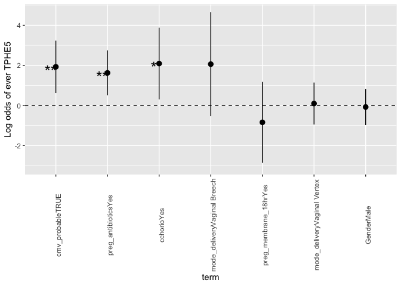

T cell / IST Associations
================
Andrew McDavid
07/06/2020

# ANOVA on some clusters

``` r
all_feats = read_csv('intermediates/all_tcell_features.csv')
subject = read_csv('data/subject_covariates.csv')

# Define GA birth timepoints
cohort_groups = c(12, 5, -2)
# And bin samples by timepoint midpoints
mid_points = c(-10, 1.5, 8.5, 20)

subject = mutate(subject,  cohort = cut(preterm_weeks, breaks = mid_points, labels = c('-2', "5", "12")))


mc_suffix = tibble(Family = c('TPHE4', 'TPHE8', 'ICS4', 'ICS8'), 
                   suffix = c('t4', 't8', 'i4', 'i8'))
# Descriptive names for T cell subpop
metacluster_rn = read_csv('intermediates/Metacluster Identities.csv') %>% select(-X5) %>% mutate(Family = Family %>% toupper(), Family = str_replace_all(Family, ' ', '')) %>% left_join(mc_suffix) %>% mutate(marker = str_c('Meta.Cluster_', Cluster, '_', suffix))
```

``` r
marker_interest = gather(all_feats, key = 'marker', value = 'proportion', starts_with('Meta.Cluster')) %>% left_join(subject) %>% 
    mutate(cga_term = 2^cga - 37, 
           log2_cga_term_ratio = cga-log2(37)) %>%
    left_join(metacluster_rn %>% mutate(Identity = ifelse(is.na(Identity), marker, Identity) %>% str_replace_all('(?<![,])[ ]+', '') %>% abbreviate(minlength = 59),
                                        Identitywrap = str_wrap(Identity, 30)))

scale_cohort_color = function(...){
  scale_color_manual('Weeks premature', values = c('darkblue', 'purple', 'red'), ...)   
}
```

# Linear/non-linear metaclusters

``` r
sin_sq = function(x) sin(x)^2
a_sqrt = function(x) asin(sqrt(x))

pred_values = expand.grid(preterm_weeks = cohort_groups, cga_term = seq(-12, 64, by = 4)) %>% filter(cga_term + preterm_weeks >= 0)

marker_nonlinear = marker_interest %>% group_by(marker, Identity, Category, Identitywrap) %>% do( output = 
    {
        model = lmer(a_sqrt(proportion) ~ (I( (cga_term<0)*cga_term ) + I( (cga_term>=0)*cga_term ))*preterm_weeks + (1|`Subject`), data = .)
        # Note I protects the indicator times cga_term, so these are not expanded.
        pre_contr = c(Intercept = 0, before = 1, after = 0, preterm = 0, prebefore = 10, preafter = 0)
        post_contr = c(Intercept = 0, before = 0, after = 1, preterm = 0, prebefore = 0, preafter = 10)
        pre10 = lht(model, pre_contr)[2,3]
        pre_est = fixef(model) %*% pre_contr
        post10 = lht(model, post_contr)[2,3]
        post_est = fixef(model) %*% post_contr
        diff_est = fixef(model) %*% (pre_contr - post_contr)
        diff10 = lht(model, pre_contr - post_contr)[2,3]
        monotone_tests = tibble(term = c('pre', 'post', 'diff'), estimate = c(pre_est, post_est, diff_est), p.value = c(pre10, post10, diff10))
        coefs = tidy(model, conf.int = TRUE)
        prediction = cbind(pred_values, .fitted = predict(model, newdata = pred_values, re.form = ~ 0 ))
        list(coefs = coefs, prediction = prediction, model = model, monotone_tests = monotone_tests)
             }) %>% rowwise() %>% mutate(model = list(output$model), coefs = list(output$coefs), prediction = list(output$prediction), monotone_tests = list(output$monotone_tests)) %>% select(-output)

nl_coefs = marker_nonlinear %>% unnest(coefs) %>% group_by(term) %>% mutate(p.value = pnorm(abs(statistic), lower.tail = FALSE)*2, p_adjust = p.adjust(p.value, method = 'bonferroni'))

nl_pred = marker_nonlinear %>% unnest(prediction)

traj_plot = ggplot(nl_pred %>% filter(marker == 'Meta.Cluster_10_i4'), aes(x = cga_term)) + geom_line(aes(color = factor(preterm_weeks), y = .fitted), lwd = 2) + scale_cohort_color() #+ geom_ribbon(aes(ymin = .fitted - .se.fit, ymax = .fitted + .se.fit), alpha = .3)
```

## Prematurity associated (Figure 2D)

``` r
preterm_markers = nl_coefs %>% filter(term == 'preterm_weeks', p_adjust < .05) %>% mutate(Identity = fct_reorder(factor(Identity), -estimate), rank = rank(p_adjust))

ggplot(preterm_markers, aes(x = Identity, y = -estimate, ymin = -conf.low, ymax = -conf.high)) + geom_pointrange(aes(color = Category)) + ylab('Change in population at 37 week PMA \n per week increase of gestational age at birth') + geom_hline(yintercept = 0, lty = 2)  + geom_text(aes(label = Identity, y = -estimate+.002), size = 2, hjust = 0) + theme(legend.position = 'none') +  coord_flip() + facet_grid(Category ~ ., scales = 'free_y', space = 'free_y') + scale_x_discrete(labels = NULL, breaks = NULL)
```

<!-- -->

## Figure 2E

``` r
other_preterm_toplot = str_c('Meta.Cluster_', c('26_t4', '25_t4', '1_t8', '2_t8', '18_i4', '13_i4', '12_i8', '8_i8'))

traj_plot %+% (nl_pred %>% semi_join(filter(preterm_markers, rank < 6), by = 'marker')) + facet_wrap(~Identitywrap, scales = 'free_y')  + geom_jitter(data = marker_interest %>% semi_join(filter(preterm_markers, rank < 6)), aes(y = a_sqrt(proportion), color = cohort), size = 1, alpha = .4) + theme(strip.text = element_text(size = 8))
```

<!-- -->

``` r
traj_plot %+% (nl_pred %>% semi_join(filter(preterm_markers, marker %in% other_preterm_toplot), by = 'marker')) + facet_wrap(~Identitywrap, scales = 'free_y')  + geom_jitter(data = filter(marker_interest, marker %in% other_preterm_toplot), aes(y = a_sqrt(proportion), color = cohort), size = 1, alpha = .4) + theme(strip.text = element_text(size = 8))
```

<!-- -->

Trajectories for top 6 markers with GAB differences at 37 weeks PMA.

-----

## Non-monotone markers (Figure S1)

``` r
nl_monotone = unnest(marker_nonlinear, monotone_tests)
nonmono_candidates = nl_monotone %>% group_by(marker) %>% summarize(max_sig = max(p.value), n_sig = sum(p.value < .05))
nonmono_sign = nl_monotone %>% select(-p.value) %>% spread(term, estimate) %>% mutate(signchange = sign(post) != sign(pre))

nonmono_candidates = left_join(nonmono_candidates, nonmono_sign) %>% filter(signchange, n_sig ==3, p.adjust(max_sig/3, method = 'bonferroni')< .05) %>% mutate(rank = rank(max_sig)) %>% left_join(nl_monotone %>% select(-Identity:-Identitywrap), by = c('marker'))  %>% mutate(Identitywrap = fct_reorder(factor(Identitywrap), rank))

ggplot(nonmono_candidates  %>% filter(term != 'diff'), aes(x = Identitywrap, y = estimate, color = term)) + geom_point() + ylab('Trajectory difference at 37 week PMA for 25 week CGA') + geom_hline(yintercept = 0, lty = 2) +  coord_flip() 
```

<!-- -->

These markers have an inversion estimated for 25 week-GAB
babies.

``` r
traj_plot %+% (nl_pred %>% semi_join(filter(nonmono_candidates, rank < Inf), by = 'marker')) + facet_wrap(~Identitywrap, scales = 'free_y')+ geom_jitter(data = marker_interest %>% semi_join(filter(nonmono_candidates, rank < Inf)), aes(y = a_sqrt(proportion), color = cohort), size = 1, alpha = .4) + theme(strip.text = element_text(size = 5))  + aes(x = cga_term + 37) + xlab("PMA (weeks)") + ylab("asin(sqrt(p))")
```

<!-- -->

Estimated trajectories and observed data for top 6 non-monotone
markers.

``` r
fig5_marker_toplot = tibble(marker = c('Meta.Cluster_13_i4', 'Meta.Cluster_18_i4', 'Meta.Cluster_8_i8', 'Meta.Cluster_12_i8',
                                  'Meta.Cluster_26_t4', 'Meta.Cluster_25_t4', 'Meta.Cluster_1_t8', 'Meta.Cluster_2_t8'))

strReverse = function(x) sapply(lapply(strsplit(x, NULL), rev), paste, 
collapse="")

#nl_fig5 = semi_join(nl_pred, fig5_marker_toplot) %>% mutate(Identity = factor(Identity, levels = sort(unique(strReverse(marker)))))

(traj_plot %+% semi_join(nl_pred, fig5_marker_toplot)) + facet_wrap(~Identitywrap, scales = 'free', nrow = 2)+ geom_jitter(data = semi_join(marker_interest, fig5_marker_toplot), aes(y = a_sqrt(proportion), color = cohort), size = 1, alpha = .4) + theme(strip.text = element_text(size = 5))  + aes(x = cga_term + 37) + xlab("PMA (weeks)") + ylab("asin(sqrt(p))")
```

<!-- -->

# Immune samples/timepoints

``` r
flow_subj_counts = all_feats %>% select(Subject, `Sequence Num`, tphe = Meta.Cluster_11_t8, ics=Meta.Cluster_11_i8) %>% mutate(both_tphe_ics = !is.na(ics) & !is.na(tphe))

knitr::kable(flow_subj_counts %>% group_by(`Sequence Num`, both_tphe_ics) %>% summarize(n()))
```

| Sequence Num | both\_tphe\_ics | n() |
| -----------: | :-------------- | --: |
|            1 | FALSE           |  12 |
|            1 | TRUE            | 141 |
|            7 | FALSE           |  18 |
|            7 | TRUE            | 150 |
|           19 | FALSE           |  18 |
|           19 | TRUE            |  94 |

# IST proportions

``` r
# IST posterior probs per subject/time point in long format
all_ist = read_csv('data/fitted_ist_longformat.csv') %>% rename(Subject = Alias)
```

``` r
all_ist_cat = all_ist %>% group_by(Subject, `Sequence Num`, assay) %>% summarize(IST_prob = max(value), IST_modal = IST[which.max(value)])

all_ist_cat = left_join(all_ist_cat, subject, by = "Subject") %>% mutate(type = assay) %>% group_by(type, cohort) %>% mutate(total_obs = length(type))

tests_by_ist = map_dfr(unique(all_ist_cat$IST_modal), ~ {
    type = str_extract(.x, 'ICS|TPHE')
    dat = filter(all_ist_cat, type == type)
    model = glm(IST_modal ==  .x ~ preterm_weeks, family = 'binomial', data = dat)
    tidy(model, conf.int = TRUE) %>% mutate(ist = .x)
})

tests_by_ist = tests_by_ist %>% group_by(term) %>% mutate(p_adjust = p.adjust(p.value, method = 'bonferroni'))

ggplot(filter(tests_by_ist, term == 'preterm_weeks'), aes(x = ist, y = estimate, ymin = conf.low, ymax = conf.high, shape = p_adjust < .05)) + geom_pointrange() + ylab('Change in log odds per week pre-term') + geom_hline(yintercept = 0, lty = 2) +  coord_flip() + scale_shape_discrete('Bonferroni p < .05')
```

<!-- -->

# TPHE5 association (Figure S2)

``` r
library(mgcv)
ist_ever = filter(all_ist_cat, `Sequence Num` %in% c(1,7, 19))  %>% group_by(`Subject`) %>% 
  summarize(TPHE_6  = any(IST_modal == 'TPHE_6'),
            TPHE_5  = any(IST_modal == 'TPHE_5'),
            ICS_5 = any(IST_modal == 'ICS_5'),
            ICS_6 = any(IST_modal == 'ICS_6'),
            ICS_7 = any(IST_modal == 'ICS_7'))

ist_early = filter(all_ist_cat, `Sequence Num` < 19)  %>% group_by(`Subject`) %>% 
  summarize(TPHE_6_early  = any(IST_modal == 'TPHE_6'),
            TPHE_5_early  = any(IST_modal == 'TPHE_5'),
            ICS_5_early = any(IST_modal == 'ICS_5'),
            ICS_6_early = any(IST_modal == 'ICS_6'),
            ICS_7_early = any(IST_modal == 'ICS_7'))

ist_late = filter(all_ist_cat, `Sequence Num` == 19)  %>% group_by(`Subject`) %>% 
  summarize(TPHE_6_late  = any(IST_modal == 'TPHE_6'),
            TPHE_5_late  = any(IST_modal == 'TPHE_5'))

# cmv+ : positive for 2 targets via PCR on saliva at one year
# lab+ : positive for serology on blood at one year
cmv_dat = subject %>% mutate(cmv_probable = str_detect(`cmv test`, fixed('+')) & !is.na(`cmv test`))

inutero_exposure = cmv_dat %>% inner_join(ist_ever) %>% 
  mutate(Race = fct_collapse(Race, other_unk = c('Other Race', 'Unknown or Not Reported', 'Asian')),
         preg_membrane_18hr  = fct_collapse(preg_membrane_18hr, No_Unknown = c('No', 'Unknown'))) %>% 
  left_join(ist_early) %>% left_join(ist_late)
```

### Antibiotics and TPHE5

``` r
tphe5_gam = gam(TPHE_5 ~ s(preterm_weeks) + preg_antibiotics + cchorio + mode_delivery + preg_membrane_18hr + Race + Gender + cmv_probable, data = inutero_exposure, family = 'binomial')

tphe5_early = update(tphe5_gam, TPHE_5_early ~ . )
summary(tphe5_early)
```

    ## 
    ## Family: binomial 
    ## Link function: logit 
    ## 
    ## Formula:
    ## TPHE_5_early ~ s(preterm_weeks) + preg_antibiotics + cchorio + 
    ##     mode_delivery + preg_membrane_18hr + Race + Gender + cmv_probable
    ## 
    ## Parametric coefficients:
    ##                             Estimate Std. Error z value Pr(>|z|)   
    ## (Intercept)                 -3.42592    1.11609  -3.070  0.00214 **
    ## preg_antibioticsYes          1.64721    0.59547   2.766  0.00567 **
    ## cchorioYes                   1.92113    1.04298   1.842  0.06548 . 
    ## mode_deliveryVaginal Breech  1.95716    1.19265   1.641  0.10079   
    ## mode_deliveryVaginal Vertex  0.08610    0.54318   0.159  0.87405   
    ## preg_membrane_18hrYes       -1.57523    1.25853  -1.252  0.21070   
    ## RaceBlack/AA                 0.10306    1.01712   0.101  0.91929   
    ## RaceMore than 1 race         0.01509    1.26609   0.012  0.99049   
    ## RaceWhite                    0.12513    0.92119   0.136  0.89195   
    ## GenderMale                  -0.08510    0.47342  -0.180  0.85734   
    ## cmv_probableTRUE             1.85048    0.64648   2.862  0.00420 **
    ## ---
    ## Signif. codes:  0 '***' 0.001 '**' 0.01 '*' 0.05 '.' 0.1 ' ' 1
    ## 
    ## Approximate significance of smooth terms:
    ##                    edf Ref.df Chi.sq p-value  
    ## s(preterm_weeks) 4.047   4.97  11.14  0.0496 *
    ## ---
    ## Signif. codes:  0 '***' 0.001 '**' 0.01 '*' 0.05 '.' 0.1 ' ' 1
    ## 
    ## R-sq.(adj) =   0.15   Deviance explained = 21.8%
    ## UBRE = -0.18155  Scale est. = 1         n = 183

``` r
plot(tphe5_gam)
```

<!-- -->

GA birth smooth (very noisy…)

``` r
cleanup_gam = function(gamfit){
  gamfit_ci = tidy(gamfit, parametric = TRUE) %>% mutate(conf.low = estimate - 1.96*std.error, conf.high = estimate + 1.96*std.error )
  fit_sub = filter(gamfit_ci, term != '(Intercept)', !str_detect(term, 'Race')) %>% mutate(p_adjust = p.adjust(p.value, 'bonferroni'), term = fct_reorder(term, p.value), pval = as.character(cut(p.value, breaks = c(0, .01, .05, 1), labels = c('**', '*', ''))))
  fit_sub
}

tphe5_tests_sub = cleanup_gam(tphe5_gam)


tphe5_plt = ggplot(tphe5_tests_sub, aes(x = term, y = estimate, ymin = conf.low, ymax = conf.high)) + geom_pointrange(position = position_dodge(width =.3)) + geom_text(aes(label = pval), size = 7, position = position_nudge(x = -.1, y = -.2)) + ylab('Log odds of ever TPHE5') + geom_hline(yintercept = 0, lty = 2) + theme(axis.text.x = element_text(angle = 90))

tphe5_plt
```

<!-- -->

parametric effects

### Tphe6 CMV gam

``` r
tphe6_gam = update(tphe5_gam, TPHE_6 ~ .)
tphe6_early = update(tphe5_gam, TPHE_6_early ~ .)
tphe6_late = update(tphe5_gam, TPHE_6_late ~ .)
summary(tphe6_early)
```

    ## 
    ## Family: binomial 
    ## Link function: logit 
    ## 
    ## Formula:
    ## TPHE_6_early ~ s(preterm_weeks) + preg_antibiotics + cchorio + 
    ##     mode_delivery + preg_membrane_18hr + Race + Gender + cmv_probable
    ## 
    ## Parametric coefficients:
    ##                               Estimate Std. Error z value Pr(>|z|)   
    ## (Intercept)                 -4.720e+00  1.784e+00  -2.646  0.00814 **
    ## preg_antibioticsYes          5.680e-01  1.235e+00   0.460  0.64551   
    ## cchorioYes                   1.258e+00  1.552e+00   0.810  0.41769   
    ## mode_deliveryVaginal Breech -3.611e+01  3.001e+07   0.000  1.00000   
    ## mode_deliveryVaginal Vertex  7.553e-01  9.892e-01   0.763  0.44517   
    ## preg_membrane_18hrYes        8.409e-01  1.252e+00   0.672  0.50169   
    ## RaceBlack/AA                 4.949e-01  1.451e+00   0.341  0.73294   
    ## RaceMore than 1 race         7.558e-01  1.623e+00   0.466  0.64146   
    ## RaceWhite                   -1.669e+00  1.659e+00  -1.006  0.31439   
    ## GenderMale                   3.543e-01  9.846e-01   0.360  0.71898   
    ## cmv_probableTRUE             2.520e+00  9.942e-01   2.535  0.01124 * 
    ## ---
    ## Signif. codes:  0 '***' 0.001 '**' 0.01 '*' 0.05 '.' 0.1 ' ' 1
    ## 
    ## Approximate significance of smooth terms:
    ##                  edf Ref.df Chi.sq p-value
    ## s(preterm_weeks)   1  1.001  0.362   0.548
    ## 
    ## R-sq.(adj) =  0.167   Deviance explained = 26.2%
    ## UBRE = -0.62934  Scale est. = 1         n = 183

``` r
summary(tphe6_late)
```

    ## 
    ## Family: binomial 
    ## Link function: logit 
    ## 
    ## Formula:
    ## TPHE_6_late ~ s(preterm_weeks) + preg_antibiotics + cchorio + 
    ##     mode_delivery + preg_membrane_18hr + Race + Gender + cmv_probable
    ## 
    ## Parametric coefficients:
    ##                               Estimate Std. Error z value Pr(>|z|)  
    ## (Intercept)                 -8.886e-01  1.338e+00  -0.664   0.5066  
    ## preg_antibioticsYes          4.853e-01  7.833e-01   0.620   0.5355  
    ## cchorioYes                  -4.877e-02  1.470e+00  -0.033   0.9735  
    ## mode_deliveryVaginal Breech  2.159e-01  2.562e+00   0.084   0.9329  
    ## mode_deliveryVaginal Vertex -1.764e+00  8.542e-01  -2.065   0.0390 *
    ## preg_membrane_18hrYes        6.208e-01  1.504e+00   0.413   0.6798  
    ## RaceBlack/AA                 8.241e-01  1.270e+00   0.649   0.5163  
    ## RaceMore than 1 race        -2.635e+01  1.082e+05   0.000   0.9998  
    ## RaceWhite                   -2.719e+00  1.353e+00  -2.009   0.0445 *
    ## GenderMale                   6.225e-01  7.079e-01   0.879   0.3792  
    ## cmv_probableTRUE             2.055e+00  8.566e-01   2.399   0.0164 *
    ## ---
    ## Signif. codes:  0 '***' 0.001 '**' 0.01 '*' 0.05 '.' 0.1 ' ' 1
    ## 
    ## Approximate significance of smooth terms:
    ##                    edf Ref.df Chi.sq p-value
    ## s(preterm_weeks) 2.208   2.76  5.256   0.157
    ## 
    ## R-sq.(adj) =  0.309   Deviance explained = 40.1%
    ## UBRE = -0.21887  Scale est. = 1         n = 112

``` r
plot(tphe6_gam)
```

<!-- -->

GA birth smooth

``` r
tphe6_tests_sub = cleanup_gam(tphe6_gam)

tphe5_6 = bind_rows(list(tphe5 = tphe5_tests_sub, tphe6 = tphe6_tests_sub), .id = 'IST')

tphe5_plt %+% tphe5_6 + aes(color = IST) + ylab('Log odds\nIST ever') 
```

<!-- -->

``` r
tphe6_plt = ggplot(tphe6_tests_sub, aes(x = term, y = estimate, ymin = conf.low, ymax = conf.high)) + geom_pointrange() + geom_text(aes(label = pval), size = 7, position = position_nudge(x = -.1, y = -.2)) + ylab('Log odds of ever TPHE6') + geom_hline(yintercept = 0, lty = 2) + theme(axis.text.x = element_text(angle = 90))
```

parametric
effects

## TPHE5 vs TPHE6 associations

``` r
fisher.test(table(inutero_exposure$TPHE_6_late, inutero_exposure$TPHE_5_early))
```

    ## 
    ##  Fisher's Exact Test for Count Data
    ## 
    ## data:  table(inutero_exposure$TPHE_6_late, inutero_exposure$TPHE_5_early)
    ## p-value = 0.001658
    ## alternative hypothesis: true odds ratio is not equal to 1
    ## 95 percent confidence interval:
    ##   1.74162 20.71802
    ## sample estimates:
    ## odds ratio 
    ##   5.939196

``` r
fisher.test(table(inutero_exposure$TPHE_6_early, inutero_exposure$TPHE_5))
```

    ## 
    ##  Fisher's Exact Test for Count Data
    ## 
    ## data:  table(inutero_exposure$TPHE_6_early, inutero_exposure$TPHE_5)
    ## p-value = 1
    ## alternative hypothesis: true odds ratio is not equal to 1
    ## 95 percent confidence interval:
    ##  0.01776216 7.38383325
    ## sample estimates:
    ## odds ratio 
    ##  0.8455665

## ICS5, ICS6, ICS7 associations

``` r
ics_gams = map_dfr(Hmisc::llist('ICS_5', 'ICS_6', 'ICS_7', 'ICS_5_early', 'ICS_6_early', 'ICS_7_early'), ~ cleanup_gam(update(tphe5_gam, as.formula(sprintf(' %s ~. ', .x)))), .id = 'IST')

knitr::kable(ics_gams %>% mutate_at(vars(estimate:p_adjust), signif, digits = 4), digits = 2)
```

| IST           | term                         | estimate | std.error | statistic | p.value |    conf.low | conf.high | p\_adjust | pval |
| :------------ | :--------------------------- | -------: | --------: | --------: | ------: | ----------: | --------: | --------: | :--- |
| ICS\_5        | preg\_antibioticsYes         |   \-0.60 |      0.44 |    \-1.36 |    0.18 |      \-1.47 |      0.27 |      1.00 |      |
| ICS\_5        | cchorioYes                   |   \-0.56 |      1.14 |    \-0.49 |    0.62 |      \-2.80 |      1.68 |      1.00 |      |
| ICS\_5        | mode\_deliveryVaginal Breech |   \-0.52 |      1.21 |    \-0.43 |    0.67 |      \-2.90 |      1.86 |      1.00 |      |
| ICS\_5        | mode\_deliveryVaginal Vertex |   \-0.61 |      0.45 |    \-1.37 |    0.17 |      \-1.49 |      0.26 |      1.00 |      |
| ICS\_5        | preg\_membrane\_18hrYes      |   \-0.43 |      0.87 |    \-0.49 |    0.62 |      \-2.14 |      1.28 |      1.00 |      |
| ICS\_5        | GenderMale                   |   \-0.09 |      0.41 |    \-0.22 |    0.83 |      \-0.89 |      0.71 |      1.00 |      |
| ICS\_5        | cmv\_probableTRUE            |     0.71 |      0.60 |      1.20 |    0.23 |      \-0.45 |      1.88 |      1.00 |      |
| ICS\_6        | preg\_antibioticsYes         |     0.05 |      0.37 |      0.13 |    0.90 |      \-0.68 |      0.78 |      1.00 |      |
| ICS\_6        | cchorioYes                   |  \-24.79 |  68550.00 |      0.00 |    1.00 | \-134400.00 | 134300.00 |      1.00 |      |
| ICS\_6        | mode\_deliveryVaginal Breech |   \-0.33 |      1.18 |    \-0.28 |    0.78 |      \-2.65 |      1.99 |      1.00 |      |
| ICS\_6        | mode\_deliveryVaginal Vertex |   \-0.05 |      0.37 |    \-0.14 |    0.89 |      \-0.78 |      0.68 |      1.00 |      |
| ICS\_6        | preg\_membrane\_18hrYes      |   \-0.58 |      0.74 |    \-0.78 |    0.43 |      \-2.03 |      0.87 |      1.00 |      |
| ICS\_6        | GenderMale                   |   \-0.18 |      0.34 |    \-0.54 |    0.59 |      \-0.85 |      0.48 |      1.00 |      |
| ICS\_6        | cmv\_probableTRUE            |   \-0.72 |      0.61 |    \-1.19 |    0.23 |      \-1.91 |      0.47 |      1.00 |      |
| ICS\_7        | preg\_antibioticsYes         |   \-0.79 |      0.61 |    \-1.29 |    0.20 |      \-1.99 |      0.41 |      1.00 |      |
| ICS\_7        | cchorioYes                   |     1.61 |      1.03 |      1.56 |    0.12 |      \-0.41 |      3.62 |      0.83 |      |
| ICS\_7        | mode\_deliveryVaginal Breech |     2.61 |      1.20 |      2.18 |    0.03 |        0.26 |      4.96 |      0.21 | \*   |
| ICS\_7        | mode\_deliveryVaginal Vertex |     0.94 |      0.57 |      1.66 |    0.10 |      \-0.17 |      2.05 |      0.68 |      |
| ICS\_7        | preg\_membrane\_18hrYes      |   \-1.23 |      1.30 |    \-0.95 |    0.34 |      \-3.79 |      1.32 |      1.00 |      |
| ICS\_7        | GenderMale                   |   \-0.79 |      0.51 |    \-1.55 |    0.12 |      \-1.80 |      0.21 |      0.84 |      |
| ICS\_7        | cmv\_probableTRUE            |     0.31 |      0.88 |      0.35 |    0.73 |      \-1.41 |      2.03 |      1.00 |      |
| ICS\_5\_early | preg\_antibioticsYes         |   \-0.36 |      0.46 |    \-0.78 |    0.44 |      \-1.25 |      0.54 |      1.00 |      |
| ICS\_5\_early | cchorioYes                   |   \-0.48 |      1.22 |    \-0.39 |    0.70 |      \-2.87 |      1.92 |      1.00 |      |
| ICS\_5\_early | mode\_deliveryVaginal Breech |   \-0.57 |      1.22 |    \-0.47 |    0.64 |      \-2.97 |      1.82 |      1.00 |      |
| ICS\_5\_early | mode\_deliveryVaginal Vertex |   \-0.75 |      0.48 |    \-1.55 |    0.12 |      \-1.69 |      0.20 |      0.85 |      |
| ICS\_5\_early | preg\_membrane\_18hrYes      |   \-0.22 |      0.93 |    \-0.23 |    0.82 |      \-2.04 |      1.61 |      1.00 |      |
| ICS\_5\_early | GenderMale                   |   \-0.16 |      0.43 |    \-0.37 |    0.71 |      \-1.00 |      0.68 |      1.00 |      |
| ICS\_5\_early | cmv\_probableTRUE            |     0.03 |      0.71 |      0.04 |    0.97 |      \-1.36 |      1.41 |      1.00 |      |
| ICS\_6\_early | preg\_antibioticsYes         |     0.00 |      0.38 |    \-0.01 |    0.99 |      \-0.76 |      0.75 |      1.00 |      |
| ICS\_6\_early | cchorioYes                   |  \-24.73 |  74060.00 |      0.00 |    1.00 | \-145200.00 | 145100.00 |      1.00 |      |
| ICS\_6\_early | mode\_deliveryVaginal Breech |   \-0.30 |      1.21 |    \-0.25 |    0.80 |      \-2.68 |      2.08 |      1.00 |      |
| ICS\_6\_early | mode\_deliveryVaginal Vertex |   \-0.12 |      0.39 |    \-0.32 |    0.75 |      \-0.88 |      0.64 |      1.00 |      |
| ICS\_6\_early | preg\_membrane\_18hrYes      |   \-0.30 |      0.76 |    \-0.40 |    0.69 |      \-1.78 |      1.18 |      1.00 |      |
| ICS\_6\_early | GenderMale                   |   \-0.21 |      0.35 |    \-0.61 |    0.54 |      \-0.90 |      0.47 |      1.00 |      |
| ICS\_6\_early | cmv\_probableTRUE            |   \-0.57 |      0.61 |    \-0.94 |    0.35 |      \-1.77 |      0.62 |      1.00 |      |
| ICS\_7\_early | preg\_antibioticsYes         |   \-0.19 |      0.74 |    \-0.25 |    0.80 |      \-1.64 |      1.27 |      1.00 |      |
| ICS\_7\_early | cchorioYes                   |     1.29 |      1.28 |      1.00 |    0.32 |      \-1.23 |      3.80 |      1.00 |      |
| ICS\_7\_early | mode\_deliveryVaginal Breech |     1.48 |      1.34 |      1.11 |    0.27 |      \-1.14 |      4.10 |      1.00 |      |
| ICS\_7\_early | mode\_deliveryVaginal Vertex |     0.89 |      0.69 |      1.30 |    0.19 |      \-0.45 |      2.24 |      1.00 |      |
| ICS\_7\_early | preg\_membrane\_18hrYes      |   \-0.42 |      1.33 |    \-0.31 |    0.75 |      \-3.02 |      2.19 |      1.00 |      |
| ICS\_7\_early | GenderMale                   |   \-0.98 |      0.64 |    \-1.54 |    0.12 |      \-2.23 |      0.27 |      0.87 |      |
| ICS\_7\_early | cmv\_probableTRUE            |     1.09 |      0.92 |      1.18 |    0.24 |      \-0.72 |      2.90 |      1.00 |      |
